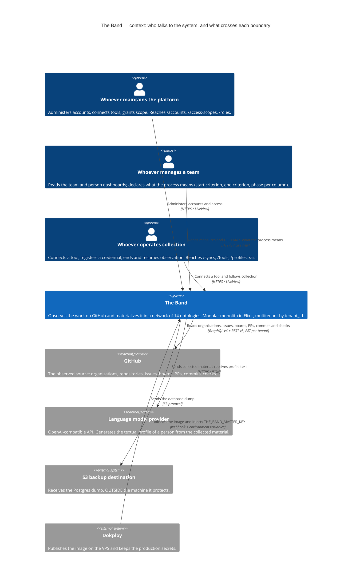
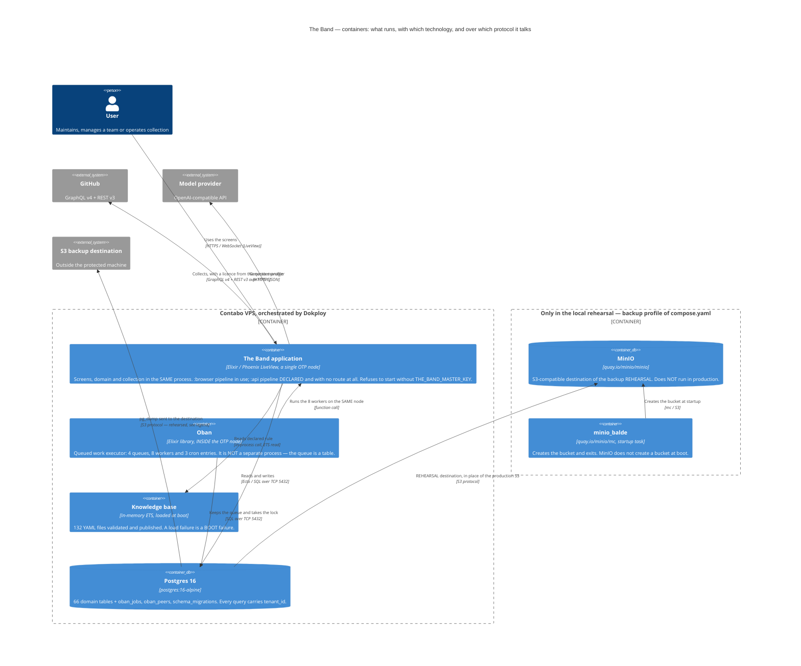
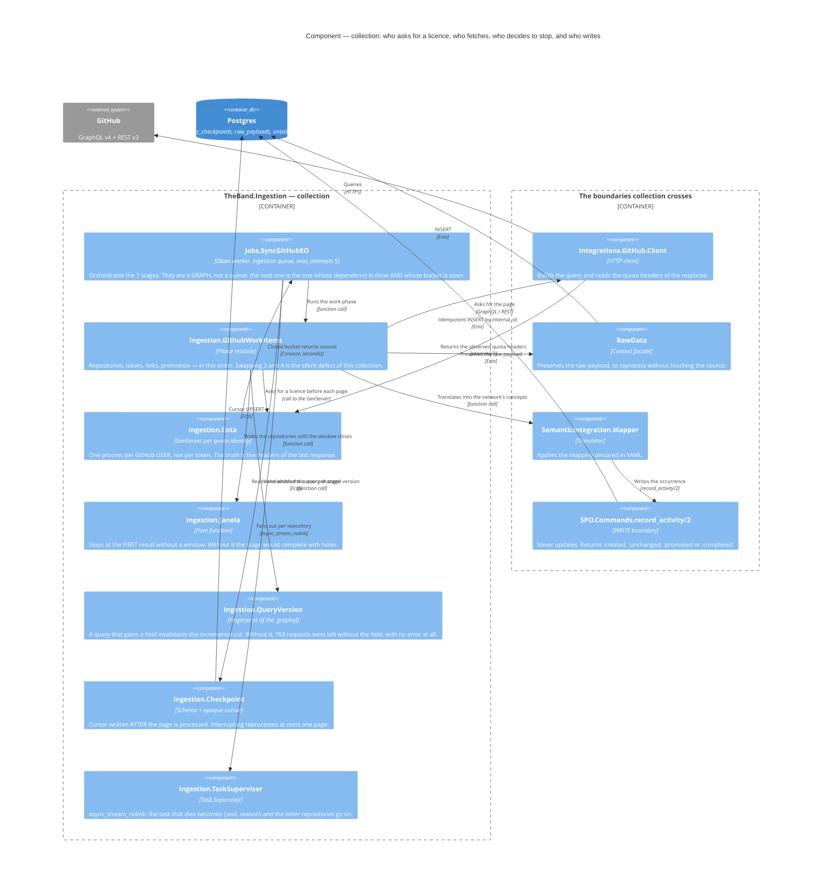
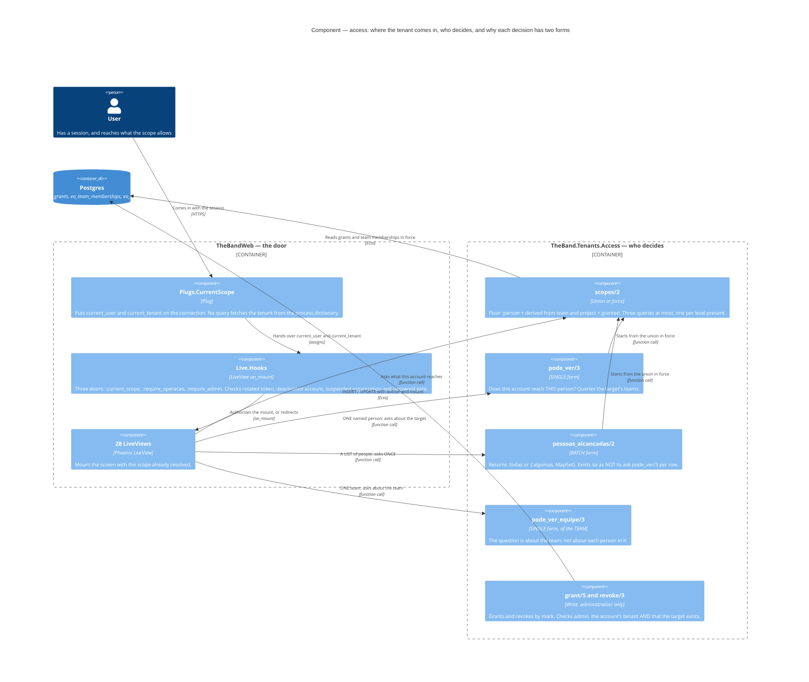
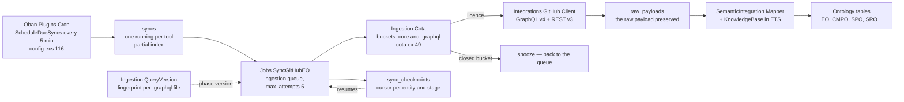
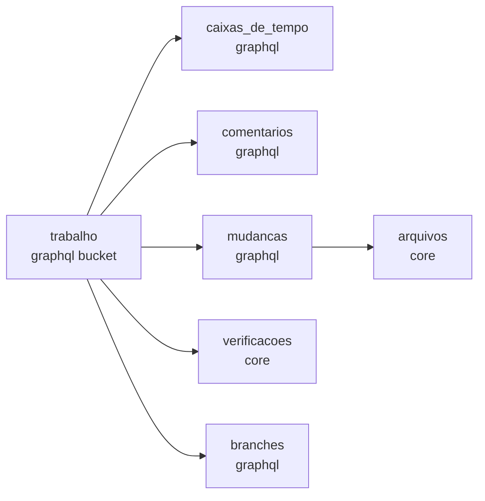
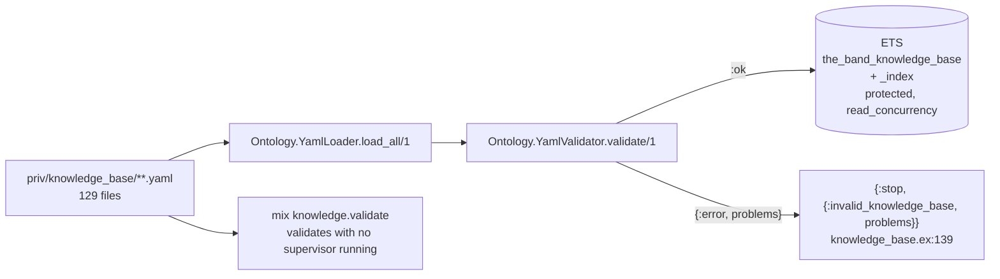
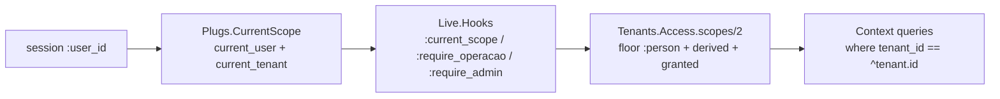
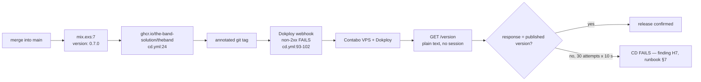

<!-- DERIVED from lib/the_band/application.ex:11-48 (the whole supervision tree),
     lib/the_band_web/router.ex:7-45 (the pipelines, including `:api` with no route) and :48-152,
     lib/the_band_web/live/hooks.ex:21-165, lib/the_band_web/plugs/current_scope.ex:1-40,
     lib/the_band/tenants/access.ex:70, :226, :281-317, :354-390, :523-583,
     lib/the_band/ingestion/{github_work_items.ex:1-63, cota.ex:1-20, janela.ex:1-24,
     query_version.ex:1-60, checkpoint.ex:1-26}, lib/the_band/ontology/seon/spo/commands.ex:14-75,
     lib/the_band/ontology/knowledge_base.ex:126-141, lib/the_band/vault.ex:18-34,
     lib/the_band/integrations/llm/http.ex:1-28, lib/the_band/jobs/sync_github_eo.ex:52-120 and
     296-325, config/config.exs:88-122, compose.yaml:1-169, .env.example:75-98,
     .github/workflows/cd.yml:93-144, mix.exs:7 — on 2026-09-18.

     Re-measured on this date, by counting in the repository: 28 LiveViews (`use TheBandWeb, :live_view`),
     8 Oban workers (`use Oban.Worker`), 132 YAML files in priv/knowledge_base/,
     66 domain tables, version 0.8.0. Where the previous text said 30, 5, 129 and 0.7.0,
     it is corrected — and the fact that they aged in six days is the reason provenance
     exists.
     Checked against the code on this date. Regenerate when the source changes. -->

# Architecture — what is live today

A modular monolith in Elixir (ADR 0001): one OTP process, one Postgres database, one knowledge
base in YAML loaded into memory at boot. The artifact version is `0.8.0`
(`mix.exs:7`).

This document describes **the shape of what runs**. The *why* of the shape is in
[`architecture/overview.md`](../../architecture/overview.md), which is older and still
valid; here the commitment is different — every box and every arrow comes from a file, with a line.

---

## 1. The structure, in C4

This section is **structural** and uses [C4](https://c4model.com): context, containers and
components. It replaced the layer diagram that was here, which mixed three levels in a
single box.

> ### If you are seeing code instead of a drawing
>
> **C4 support in Mermaid is experimental.** An old renderer — GitHub before the support,
> an editor's built-in viewer, a PDF exporter — shows the block as **text**, not
> as a figure. That is not an error in the document.
>
> That is why each diagram below was written to **be read as text**: one element per
> line, the label before the description, and no dependence on positioning for the meaning.
> `Person(...)` is a person, `System(...)` and `Container(...)` are things that run,
> `Rel(a, b, "what crosses", "protocol")` is an arrow from `a` to `b`.
>
> The four diagrams were **rendered and checked** with `@mermaid-js/mermaid-cli@11.17.0`
> on 2026-09-18; if your viewer does not draw them, it is the viewer.

### Why not everything became C4

**C4 describes structure.** Five diagrams in this document answer **dynamic** questions —
what happens, in which order, and what decides the detour — and remain `flowchart` on purpose:

| Diagram | Why it did not become C4 |
|---|---|
| [§3 How data comes in](#3-how-data-comes-in) | it is the **sequence** of a run, with the `snooze` detour when the bucket closes. C4 has no conditional branch. |
| [§3 The seven stages and their dependencies](#the-seven-stages-and-their-dependencies) | it is a **precedence graph between stages**, not between components. |
| [§4 The knowledge base](#4-the-knowledge-base) | it is the **boot sequence**, with the branch that refuses to start. The detour is the subject. |
| [§5 What crosses everything — the tenant](#5-what-crosses-everything--the-tenant) | it is the **request-time chain**. The corresponding structure is in the [access C4](#14-components--access); the two complement each other. |
| [§6 The deploy boundary](#6-the-deploy-boundary) | it is the **CD pipeline**, with the decision that makes CD fail. |

There was a sixth — the layer one — and it **was** structural. It is what the four C4 diagrams
below replace.

### 1.1 Context — who talks to the system

What crosses each boundary, with the source:

| Boundary | What crosses | Where |
|---|---|---|
| person → The Band | session, and the scope it reaches | `plugs/current_scope.ex:1-40`, `live/hooks.ex:21-165` |
| The Band → GitHub | GraphQL v4 and REST v3 query, with the **tenant's** PAT | `integrations/github/client.ex` |
| The Band → model provider | collected material; profile text comes back | `integrations/llm/http.ex:24-28` |
| The Band → backup destination | `pg_dump`, over the S3 protocol | `.env.example:75-84`, runbook §4 and §6 |
| Dokploy → The Band | the published image and `THE_BAND_MASTER_KEY` | `.github/workflows/cd.yml:93-102`, `application.ex:15-18` |

**The credential never comes back across the boundary.** Providers return the key inside the text
of some errors — measured on 2026-08-15, Google's suspended-key message carried the whole
key —, and that is why every message goes through `redigir/2` before leaving
(`integrations/llm/http.ex:16-19`).

### 1.2 Containers — what runs, and with what

#### Written absence — what is in `compose.yaml` and does **not** run in production

It is said in the diagram and repeated here, because omitting it would be worse:

| Declared | Where | Runs in production? |
|---|---|---|
| `minio` | `compose.yaml:116`, `profiles: ["backup"]` | **no.** It is the destination of the backup **rehearsal**. *"The production destination is configured in Dokploy (runbook §4) and stays OUTSIDE the machine it protects — a MinIO on the same host would not do, because the fire that takes the database takes the backup with it"* (`.env.example:81-84`). |
| `minio_balde` | `compose.yaml:151`, `profiles: ["backup"]` | **no.** Startup task that creates the bucket and exits — MinIO does not create a bucket at boot. |
| `postgres` (dev) | `compose.yaml:2` | **no.** The production one is `postgres_prod`, `profiles: ["producao"]` (`compose.yaml:37-38`). |
| `app` | `compose.yaml:56`, `profiles: ["producao"]` | **yes**, but not through this file: in production, Dokploy is what brings up the `ghcr.io/the-band-solution/theband` image. |
| `:api` pipeline | `router.ex:44-46` | **exists and no route uses it.** `grep "pipe_through :api"` on the router returns nothing. The JSON door is declared and closed. |

#### Three things the container diagram makes explicit on purpose

1. **Oban is not a separate container.** It is a library, inside the same OTP node
   (`application.ex:27`), and the queue is a table in Postgres. Whoever draws a "queue service"
   next to the application draws a system that does not exist here.
2. **The knowledge base is a container**, not a configuration file: it is 132 YAML files
   validated and published to ETS at boot, and **a load failure is a boot failure**
   (`knowledge_base.ex:136-140`).
3. **The node refuses to start without the master key** — the check happens *before* any
   supervisor comes up (`application.ex:15-18`). It is not a container, it is the condition for one
   to exist.

### 1.3 Components — collection

The subsystem that most confuses newcomers, because **four pieces exist only to prevent
silent success** and none of them appears in a layer diagram.

| Component | The defect it closes | Where |
|---|---|---|
| `QueryVersion` | a query gains a field, the incremental cut says *"already collected"*, and 763 requests across 10 repositories are left without the field — **with no error at all** | `ingestion/query_version.ex:10-17` |
| `Janela.ate_fechar/2` | the quota closes midway, every following repository is refused, and the stage **"completes" with holes** | `ingestion/janela.ex:7-11` |
| `TaskSupervisor` | an exception in one repository brings down the whole job — it was the `KeyError` of 2026-09-04 | `application.ex:30-39` |
| `Checkpoint` | the cursor is written **after** the page is processed; interrupting reprocesses at most one page | `ingestion/checkpoint.ex:4-7` |

**The write boundary is `SPO.Commands.record_activity/2`**, and it never updates: it returns
`:created`, `:unchanged`, `:promoted` or `:completed`. The full state machine of these four
outcomes is in
[`estados/atividade-executada.md`](../estados/atividade-executada.md).

**The quota is per GitHub user, not per token** (`ingestion/cota.ex:5-7`): two tenants with
PATs from the same person go through the same process and share the same balance. It is the
`cli → cota` link in the diagram, and explains why registering a second credential from the same
person does not double the collection capacity.

### 1.4 Components — access

The other subsystem that confuses, and for a specific reason: **every access decision exists
in two forms**, and choosing the wrong one produces a query per row.

#### The single / batch pair, and L38

`Tenants.Access` is, in the module's own words, *"the antipattern this module exists to
avoid"* (*"o antipadrão que este módulo existe para evitar"*, `access.ex:289-290`). **L38** is a
query inside a loop; the pair exists so that the screen never needs one:

| Question | **Single** form | **Batch** form |
|---|---|---|
| does this account reach **this person**? | `pode_ver/3` (`access.ex:226`) | `pessoas_alcancadas/2` (`access.ex:317`) — returns `:todas` or `{:algumas, MapSet}` |
| does this account reach **this team**? | `pode_ver_equipe/3` (`access.ex:390`) | — *(the question is already about the team, not about each person in it)* |

> *"asking `pode_ver/3` per row in a list of people is **L38**"* — `access.ex:288-290`
>
> *"Three queries, and not one per person"* — `access.ex:305-309`

**`pode_ver_equipe/3` is the batch form disguised as a single one**: the screen shows the breakdown
by named person of a whole section, and asking per row would produce L38. The question was
moved one level up, to the team (`access.ex:357-360`).

#### The empty set that is not zero

`pessoas_alcancadas/2` can return `{:algumas, MapSet.new()}` — an **empty** set — for an
account with no declared link and no grant:

> *"Empty is neither an error nor zero: it is *no person reached*, and whoever presents it MUST say so
> in words."* — `access.ex:299-301`

### The direction of dependency, and the only edge that goes against it

**web → domain → Repo → Postgres, and nothing comes back** — with **one measured exception**,
recorded here because a diagram that hid it would lie:

| Edge against the direction | Where | What it is |
|---|---|---|
| `TheBand.Ontology.SEON.EO.Commands` → `TheBandWeb.CoreComponents.translate_error/1` | `lib/the_band/ontology/seon/eo/commands.ex:266` | the domain calls the web layer's error translator to build the reason for a refusal |

The comment in place (lines 255-264) explains the choice: the alternative was to build the message
by hand and discard the `msgid`s that `errors.po` already has. **It is a declared concession, not
carelessness** — but it is the only domain → web edge in the codebase, and whoever draws the boundary
needs to know it exists. `lib/the_band/application.ex` references `TheBandWeb.Telemetry` and
`TheBandWeb.Endpoint` (lines 23, 43, 54), which does **not** count: the supervision tree belongs to
whoever assembles the application, and it assembles both.

The full DSM among the 37 contexts of `lib/the_band/`, with the named cycles, is in
[`dsm/modulos-de-lib.md`](../dsm/modulos-de-lib.md).

---

## 2. The domain contexts, and what each one answers

**21 files in `lib/the_band/*.ex`** (counted on 2026-09-18), plus the ontologies in
`lib/the_band/ontology/`. Not all of them are context facades: `application.ex`, `repo.ex`,
`release.ex`, `vault.ex`, `segredo.ex` and `periodos.ex` are infrastructure or types.

The *tables* column says how many tables the context owns — the total comes to **65**, which are
the tables with a declared Ecto schema (see
[`banco/mapa-das-tabelas.md`](../banco/mapa-das-tabelas.md) and
[`classes/mapa-dos-schemas.md`](../classes/mapa-dos-schemas.md)). The per-row numbers in this
table **were not re-measured on 2026-09-18**: they are the snapshot of 2026-09-12, and the three
tables of feature 066 go into `Ontology.SEON.SPO`, which goes from 9 to 12.

| Context | Answers | Module | Tables |
|---|---|---|---|
| `Tenants` | whose session it is, what it reaches, who is an administrator | `tenants.ex`, `tenants/access.ex` | 4 |
| `Ontology.SEON.EO` | people, teams, organizations, roles, team memberships | `ontology/seon/eo/` | 10 (+1 without schema) |
| `Ontology.SEON.CMPO` | source repository and the loaded copy | `ontology/seon/cmpo/schemas/` | 3 |
| `Ontology.SEON.SPO` | declared project, what it gathers, performed activity | `ontology/seon/spo/schemas/` | 9 |
| `Ontology.Continuum.SRO` | sprint and the issue inside it | `ontology/continuum/sro/schemas/` | 2 |
| `Ontology.Continuum.SMPO` | what the organization declares an iteration field means | `ontology/continuum/smpo/schemas/` | 1 |
| `Sources` | the connected tool, the credential, the end of observation | `sources.ex` | 3 |
| `Ingestion` | the collection run, the checkpoint, the quota | `ingestion.ex` | 2 |
| `RawData` | the preserved raw payload, to reprocess without touching the source | `raw_data.ex` | 1 |
| `SemanticIntegration` | reapply a corrected mapping to what was already collected | `semantic_integration.ex` | — |
| `WorkItems` | the collected issue, what the platform decided it is, the decomposition | `work_items.ex` | 6 |
| `Changes` | change request, commit, file, authorship | `changes.ex` | 5 |
| `Verification` | continuous verification run and its components | `verification.ex` | 2 |
| `Quality` | artifact evaluation (the *review*) | `quality.ex` | 1 |
| `Communication` | issue comment | `communication/schemas/` | 1 |
| `Configuration` | branch | `configuration.ex` | 1 |
| `Projects` | the observed board, item, field, value, iteration | `projects.ex` | 5 |
| `Mapping` | the tenant's rule that classifies an issue, and the decided pattern | `mapping.ex` | 2 |
| `Profiles` | profile round, round entry, automation | `profiles.ex` | 3 |
| `AI` | model provider credential | `ai.ex` | 1 |
| `Teams` | the facts the team dashboard counts before the measures | `teams/problems_now.ex` | — |
| `Forecast` | chance of finishing, by simulation over history | `forecast.ex` | — |
| `Vault` | encrypts and decrypts credentials, with the environment's master key | `vault.ex` | — |

`SemanticIntegration`, `Teams`, `Forecast` and `Vault` have no table of their own: **they read what
the others write**. `Forecast` is a pure function and does not even touch the database (`forecast.ex:4-7`).

---

## 3. How data comes in

Seven stages, and **they are a graph, not a queue** — `sync_github_eo.ex:199-325`. The next
stage is the one whose dependency is done **and** whose quota bucket is open.

### The seven stages and their dependencies

Derived from `sync_github_eo.ex:296-325`.

`arquivos` depends on `mudancas` because a file hangs off a commit, and commits are
written in the changes stage (`sync_github_eo.ex:317-318`). `verificacoes` and `arquivos` use
the `:core` (REST) bucket and that is why they move when the GraphQL quota is closed.

### The three pieces that prevent silent success in collection

| Piece | Where | The defect it closes |
|---|---|---|
| `QueryVersion` | `lib/the_band/ingestion/query_version.ex` | a query gains a field, the incremental cut says *"already collected"*, and 763 requests across 10 repositories are left without the field — with no error at all (moduledoc, lines 10-17) |
| `Janela.ate_fechar/2` | `lib/the_band/ingestion/janela.ex:19-24` | the quota closes midway, every following repository is refused, and the stage "completes" with holes |
| `Task.async_stream_nolink` | `lib/the_band/application.ex:30-39` | an exception in one repository brings down the whole job — it was the `KeyError` of 2026-09-04 |

### The queues and the cron

`config/config.exs:88-120`.

| Queue | Concurrency | Why |
|---|---|---|
| `ingestion` | 5 | collection |
| `transformation` | 5 | mapping reprocessing |
| `perfis` | 1 | each generation takes 25 to 60 s; parallelizing would spend credit in bursts |
| `rodadas` | 1 | its own queue, or the monthly round (15 to 35 min) would lock every generation requested by hand |

| Cron | When | What it does |
|---|---|---|
| `Jobs.ReconcileStuckSyncs` | `*/5 * * * *` | frees a tool whose collection died |
| `Jobs.ScheduleDueSyncs` | `*/5 * * * *` | enqueues the tools that are due — it looks at **state**, which is why one entry serves all tenants |
| `Profiles.MonthlyWorker` | `0 3 1 * *` | monthly profile round, in a single time zone |

`Oban.Plugins.Lifeline` is **not** included, and the reason is written in `config/config.exs:121`.

---

## 4. The knowledge base

132 YAML files in `priv/knowledge_base/`, validated and published to ETS at boot.

**A load failure is a boot failure** (`knowledge_base.ex:136-140`): `init/1` returns
`{:stop, ...}` instead of coming up with half the base, because "going on with half the base
would produce silently wrong semantic transformation".

The same rule holds one level up: **the application refuses to start without the master key**
(`application.ex:11-21` and `refuse_boot/1` at 58-74). Without it, tool credentials
would be written in the clear and nobody would notice — FR-005a.

Subdirectories, and what each one holds:

| Directory | Content |
|---|---|
| `ontology/` | the modules of the 14 ontologies — UFO, SEON (EO, SPO, CMPO, QAPO, ROoST, OSDeF, RSRO, SysSwO), Continuum (SRO, SMPO, CMO, CDRO, CIRO) |
| `mappings/github/` | what each GitHub field becomes in each ontology |
| `rules/`, `transformations/` | derivation rules |
| `measurements/`, `information_needs/` | the measures and the questions they answer |
| `glossary/`, `examples/`, `schemas/`, `sources/` | support and validation |

---

## 5. What crosses everything — the tenant

`lib/the_band_web/plugs/current_scope.ex:1-12` states the rule in one sentence: *every query on
collected data receives the tenant from here, and none fetches it from the process dictionary* —
FR-027, principle V of the constitution. A query without a tenant is a **security defect**, not a
style one.

In the database, the rule has a shape: **65 of the 66 domain tables have `tenant_id`** (re-measured on
2026-09-18 over the 93 migrations). The only one without it is `tenants`, which is the root itself.

**Two of them do not declare the foreign key**: `access_scope_grants` and `account_disablements`
have `tenant_id` as a raw `:binary_id`. They are access tables, and no migration explains the
choice — the finding is in
[`banco/declaracoes-da-organizacao.md`](../banco/declaracoes-da-organizacao.md#finding-1--two-tables-with-tenant_id-without-fk).

The four scope levels (`tenants/access.ex:60-104`):

| Level | Where it comes from |
|---|---|
| `:person` | floor — every account linked to a person has its own |
| `:team` | derived from the person's team memberships in force, **or** granted |
| `:project` | derived from the teams' projects, **or** granted |
| `:organization` | granted only — `access_scope_grants`, `level in ~w(team project organization)` |

The three router pipelines (`router.ex:74-152`):

| Pipeline | Door | Screens |
|---|---|---|
| `:require_user` | `live_session :autenticado` | people, teams, organizations, projects, boards, work, changes, checks |
| `:require_operacao` | `live_session :operacao` | `/syncs`, `/tools`, `/profiles`, `/ai` |
| `:require_admin` | `live_session :admin` | `/accounts`, `/access-scopes`, `/roles` |

Outside any authenticated pipeline: `/`, `/version`, `/sign-in`, `/session`,
`/set-password` (`router.ex:48-71`).

---

## 6. The deploy boundary

The confirmation step (`cd.yml:118-144`) is what closes finding **H7**: before it, the
webhook answered `deployed successfully` and **nothing proved** that the container brought up the
merged version, because production pulls the image by `latest` — which answers *"what was published
last"*, not *"what is running"*.

`GET /version` returns **only the version, in plain text, without authentication**, and the three
decisions are justified in the moduledoc of `lib/the_band_web/controllers/version_controller.ex`: the
version is already public in the tag and in the image name; the only consumer runs before there is a
session; and the constant is read at **compile time** (`@versao Mix.Project.config()[:version]`),
which makes the answer about *this artifact* and not about the loaded application.

---

## 7. What this document does not show

Said, not omitted:

- **The interface component tree.** 28 LiveViews and four component modules
  (`core_components.ex`, `data_table.ex`, `work_charts.ex`, `layouts.ex`); the screen design belongs
  to [`design-system.md`](../../design-system.md) and the prototypes, not to this document.
- **Telemetry.** `TheBandWeb.Telemetry` comes up first in the tree (`application.ex:23`) and
  ADR 0005 describes the instrumented journey; the metrics themselves are not covered here.
- **The LLM client.** `lib/the_band/integrations/llm/` exists and feeds `Profiles`; the
  provider's contract was not checked for this document.
- **`DNSCluster` and `Phoenix.PubSub`** (`application.ex:28-29`) appear in the layer diagram
  as infrastructure and got no arrow: PubSub is used to update collection screens
  (`@topic "syncs"` in `semantic_integration.ex:42`), and DNSCluster is configured as
  `:ignore` outside production.
- **The network of 14 ontologies** has its own document in [`../../ontology/`](../../ontology/README.md);
  here it appears as a single box.
