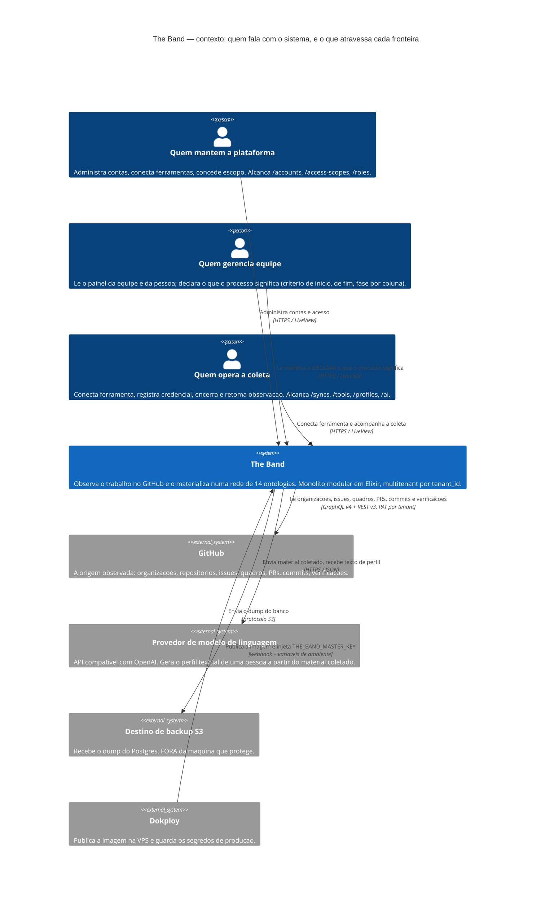
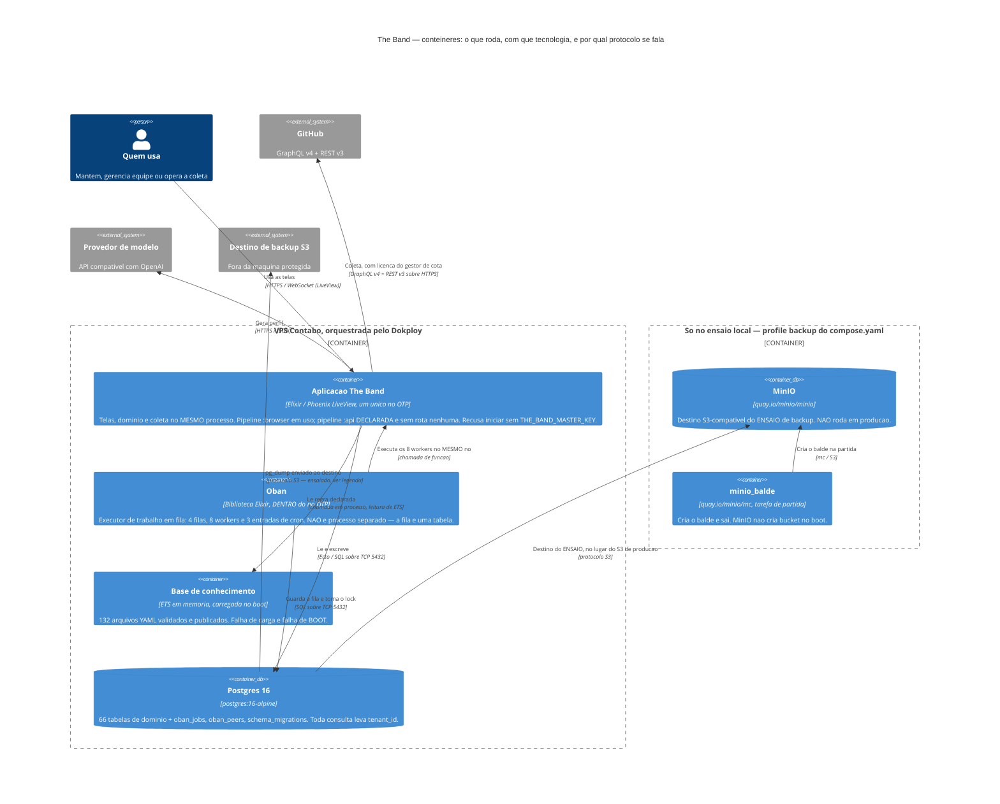
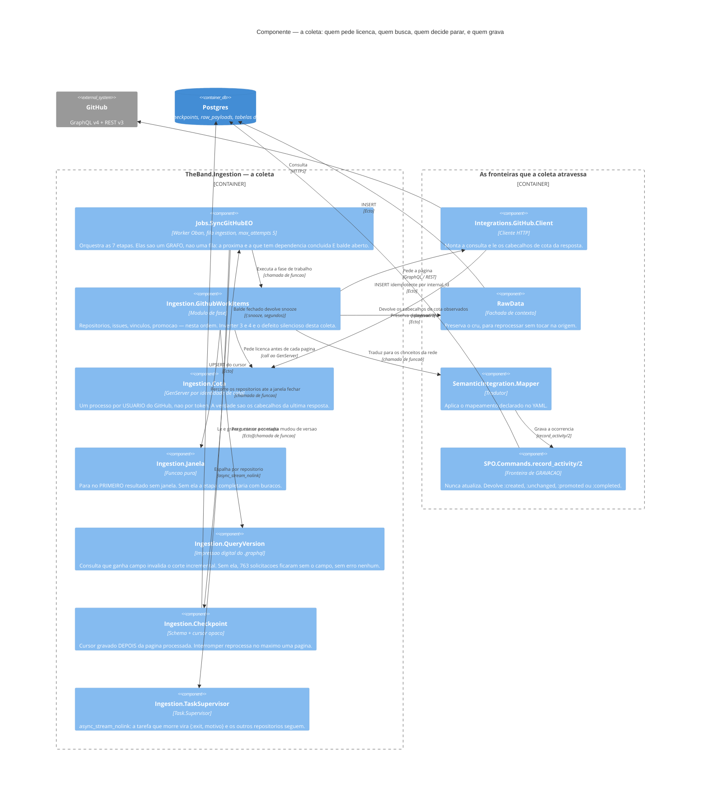
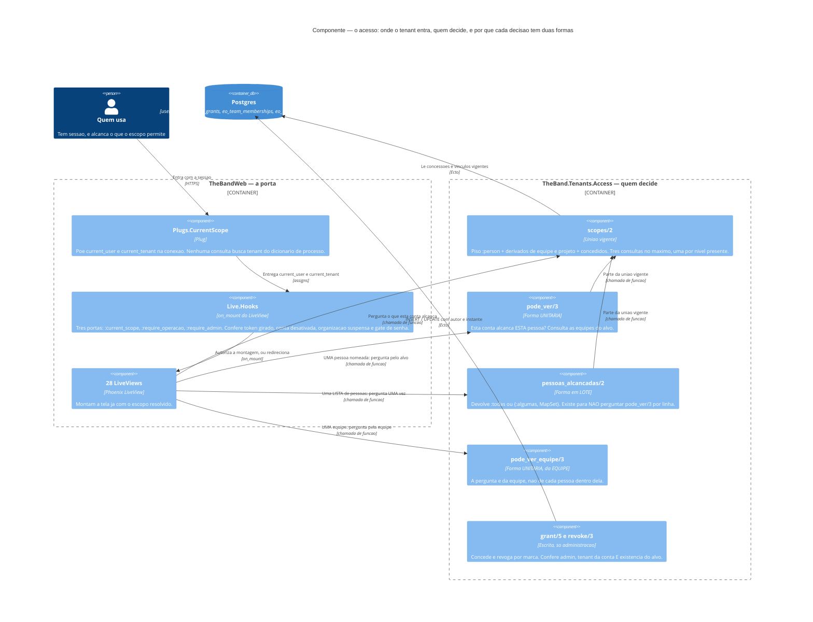
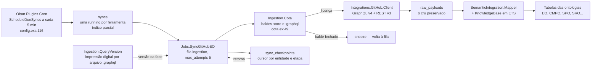
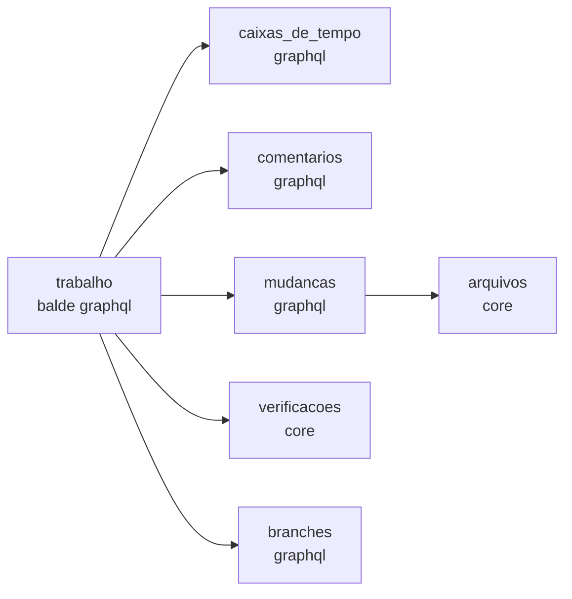
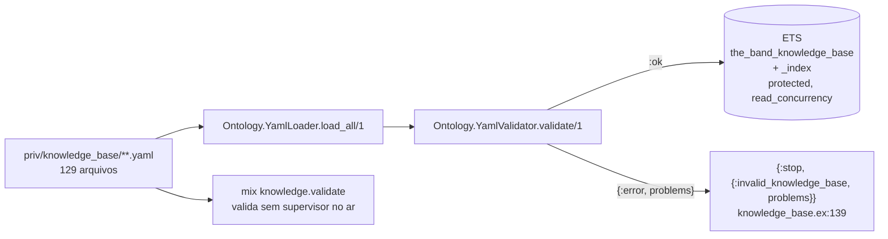
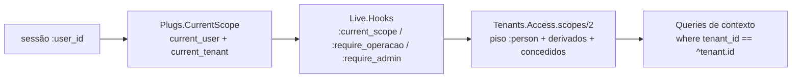
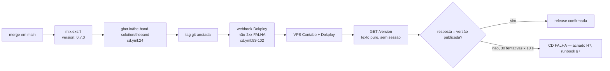

<!-- DERIVADO de lib/the_band/application.ex:11-48 (a árvore de supervisão inteira),
     lib/the_band_web/router.ex:7-45 (as pipelines, inclusive `:api` sem rota) e :48-152,
     lib/the_band_web/live/hooks.ex:21-165, lib/the_band_web/plugs/current_scope.ex:1-40,
     lib/the_band/tenants/access.ex:70, :226, :281-317, :354-390, :523-583,
     lib/the_band/ingestion/{github_work_items.ex:1-63, cota.ex:1-20, janela.ex:1-24,
     query_version.ex:1-60, checkpoint.ex:1-26}, lib/the_band/ontology/seon/spo/commands.ex:14-75,
     lib/the_band/ontology/knowledge_base.ex:126-141, lib/the_band/vault.ex:18-34,
     lib/the_band/integrations/llm/http.ex:1-28, lib/the_band/jobs/sync_github_eo.ex:52-120 e
     296-325, config/config.exs:88-122, compose.yaml:1-169, .env.example:75-98,
     .github/workflows/cd.yml:93-144, mix.exs:7 — em 2026-09-18.

     Remedido nesta data, por contagem no repositório: 28 LiveViews (`use TheBandWeb, :live_view`),
     8 workers Oban (`use Oban.Worker`), 132 arquivos YAML em priv/knowledge_base/,
     66 tabelas de domínio, versão 0.8.0. Onde o texto anterior dizia 30, 5, 129 e 0.7.0,
     está corrigido — e o fato de terem envelhecido em seis dias é o motivo de a
     proveniência existir.
     Conferido contra o código nesta data. Regenerar ao mudar a fonte. -->

# Arquitetura — o que está no ar hoje

Um monólito modular em Elixir (ADR 0001): um processo OTP, um banco Postgres, uma base de
conhecimento em YAML carregada em memória no boot. A versão do artefato é `0.8.0`
(`mix.exs:7`).

Este documento descreve **a forma do que roda**. O *porquê* da forma está em
[`architecture/overview.md`](../../architecture/overview.md), que é anterior e continua
válido; aqui o compromisso é outro — cada caixa e cada seta saem de um arquivo, com linha.

---

## 1. A estrutura, em C4

Esta seção é **estrutural** e usa [C4](https://c4model.com): contexto, contêineres e
componentes. Substituiu o diagrama de camadas que havia aqui, que misturava três níveis numa
caixa só.

> ### Se você está vendo código em vez de desenho
>
> **O suporte a C4 no Mermaid é experimental.** Renderizador antigo — GitHub antes do suporte,
> visualizador embutido de editor, exportador de PDF — mostra o bloco como **texto**, e não
> como figura. Isso não é erro do documento.
>
> Por isso cada diagrama abaixo foi escrito para **ser lido como texto**: um elemento por
> linha, o rótulo antes da descrição, e nenhuma dependência de posicionamento para o sentido.
> `Person(...)` é uma pessoa, `System(...)` e `Container(...)` são coisas que rodam,
> `Rel(a, b, "o que atravessa", "protocolo")` é uma seta de `a` para `b`.
>
> Os quatro diagramas foram **renderizados e conferidos** com `@mermaid-js/mermaid-cli@11.17.0`
> em 2026-09-18; se o seu visualizador não os desenhar, é o visualizador.

### Por que nem tudo virou C4

**C4 descreve estrutura.** Cinco diagramas deste documento respondem perguntas **dinâmicas** —
o que acontece, em que ordem, e o que decide o desvio — e continuam `flowchart` de propósito:

| Diagrama | Por que não virou C4 |
|---|---|
| [§3 Como o dado entra](#3-como-o-dado-entra) | é a **sequência** de uma execução, com o desvio `snooze` quando o balde fecha. C4 não tem ramo condicional. |
| [§3 As sete etapas e suas dependências](#as-sete-etapas-e-suas-dependências) | é um **grafo de precedência entre etapas**, não entre componentes. |
| [§4 A base de conhecimento](#4-a-base-de-conhecimento) | é a **sequência de boot**, com o ramo que recusa iniciar. O desvio é o assunto. |
| [§5 O que atravessa tudo — o tenant](#5-o-que-atravessa-tudo--o-tenant) | é a **cadeia em tempo de requisição**. A estrutura correspondente está no [C4 do acesso](#14-componentes--o-acesso); os dois se complementam. |
| [§6 A fronteira do deploy](#6-a-fronteira-do-deploy) | é o **pipeline de CD**, com a decisão que faz o CD falhar. |

Havia um sexto — o de camadas — e ele **era** estrutural. É o que os quatro C4 abaixo
substituem.

### 1.1 Contexto — quem fala com o sistema

O que atravessa cada fronteira, com a fonte:

| Fronteira | O que atravessa | Onde |
|---|---|---|
| pessoa → The Band | sessão, e o escopo que ela alcança | `plugs/current_scope.ex:1-40`, `live/hooks.ex:21-165` |
| The Band → GitHub | consulta GraphQL v4 e REST v3, com PAT **do tenant** | `integrations/github/client.ex` |
| The Band → provedor de modelo | material coletado; volta texto de perfil | `integrations/llm/http.ex:24-28` |
| The Band → destino de backup | `pg_dump`, por protocolo S3 | `.env.example:75-84`, runbook §4 e §6 |
| Dokploy → The Band | a imagem publicada e `THE_BAND_MASTER_KEY` | `.github/workflows/cd.yml:93-102`, `application.ex:15-18` |

**A credencial nunca volta pela fronteira.** Provedores devolvem a chave dentro do texto de
alguns erros — medido em 2026-08-15, a mensagem de chave suspensa do Google trazia a chave
inteira —, e por isso toda mensagem passa por `redigir/2` antes de sair
(`integrations/llm/http.ex:16-19`).

### 1.2 Contêineres — o que roda, e com o quê

#### Ausência escrita — o que está no `compose.yaml` e **não** roda em produção

Está dito no diagrama e repetido aqui, porque omitir seria pior:

| Declarado | Onde | Roda em produção? |
|---|---|---|
| `minio` | `compose.yaml:116`, `profiles: ["backup"]` | **não.** É o destino do **ensaio** de backup. *"O destino de produção é configurado no Dokploy (runbook §4) e fica FORA da máquina que ele protege — um MinIO no mesmo host não serviria, porque o incêndio que leva o banco leva o backup junto"* (`.env.example:81-84`). |
| `minio_balde` | `compose.yaml:151`, `profiles: ["backup"]` | **não.** Tarefa de partida que cria o balde e sai — MinIO não cria bucket no boot. |
| `postgres` (dev) | `compose.yaml:2` | **não.** O de produção é `postgres_prod`, `profiles: ["producao"]` (`compose.yaml:37-38`). |
| `app` | `compose.yaml:56`, `profiles: ["producao"]` | **sim**, mas não por este arquivo: em produção quem sobe a imagem `ghcr.io/the-band-solution/theband` é o Dokploy. |
| pipeline `:api` | `router.ex:44-46` | **existe e nenhuma rota a usa.** `grep "pipe_through :api"` no roteador não devolve nada. A porta JSON está declarada e fechada. |

#### Três coisas que o diagrama de contêineres deixa explícitas de propósito

1. **Oban não é um contêiner separado.** É biblioteca, dentro do mesmo nó OTP
   (`application.ex:27`), e a fila é uma tabela no Postgres. Quem desenha um "serviço de fila"
   ao lado da aplicação desenha um sistema que não existe aqui.
2. **A base de conhecimento é um contêiner**, e não um arquivo de configuração: são 132 YAML
   validados e publicados em ETS no boot, e **falha de carga é falha de boot**
   (`knowledge_base.ex:136-140`).
3. **O nó recusa iniciar sem a chave mestra** — a verificação acontece *antes* de qualquer
   supervisor subir (`application.ex:15-18`). Não é um contêiner, é a condição de existir um.

### 1.3 Componentes — a coleta

O subsistema que mais confunde quem chega, porque **quatro peças existem só para impedir
sucesso silencioso** e nenhuma delas aparece num diagrama de camadas.

| Componente | O defeito que ele fecha | Onde |
|---|---|---|
| `QueryVersion` | consulta ganha campo, o corte incremental diz *"já coletei"*, e 763 solicitações em 10 repositórios ficam sem o campo — **sem erro nenhum** | `ingestion/query_version.ex:10-17` |
| `Janela.ate_fechar/2` | a cota fecha no meio, cada repositório seguinte é recusado, e a etapa **"completa" com buracos** | `ingestion/janela.ex:7-11` |
| `TaskSupervisor` | uma exceção num repositório derruba o job inteiro — foi o `KeyError` de 2026-09-04 | `application.ex:30-39` |
| `Checkpoint` | o cursor é gravado **depois** de a página ser processada; interromper reprocessa no máximo uma página | `ingestion/checkpoint.ex:4-7` |

**A fronteira de gravação é `SPO.Commands.record_activity/2`**, e ela nunca atualiza: devolve
`:created`, `:unchanged`, `:promoted` ou `:completed`. A máquina completa desses quatro
desfechos está em
[`estados/atividade-executada.md`](../estados/atividade-executada.md).

**A cota é por usuário do GitHub, não por token** (`ingestion/cota.ex:5-7`): dois tenants com
PATs da mesma pessoa passam pelo mesmo processo e dividem o mesmo saldo. É a ligação
`cli → cota` do diagrama, e explica por que cadastrar uma segunda credencial da mesma pessoa
não dobra a capacidade de coleta.

### 1.4 Componentes — o acesso

O outro subsistema que confunde, e por um motivo específico: **cada decisão de acesso existe
em duas formas**, e escolher a errada produz consulta por linha.

#### O par unitário / em lote, e a L38

`Tenants.Access` é, nas palavras do próprio módulo, *"o antipadrão que este módulo existe para
evitar"* (`access.ex:289-290`). A **L38** é consulta dentro de laço; o par existe para que a
tela nunca precise dela:

| Pergunta | Forma **unitária** | Forma em **lote** |
|---|---|---|
| esta conta alcança **esta pessoa**? | `pode_ver/3` (`access.ex:226`) | `pessoas_alcancadas/2` (`access.ex:317`) — devolve `:todas` ou `{:algumas, MapSet}` |
| esta conta alcança **esta equipe**? | `pode_ver_equipe/3` (`access.ex:390`) | — *(a pergunta já é da equipe, não de cada pessoa dentro dela)* |

> *"perguntar `pode_ver/3` por linha numa lista de pessoas é a **L38**"* — `access.ex:288-290`
>
> *"Três consultas, e não uma por pessoa"* — `access.ex:305-309`

**`pode_ver_equipe/3` é a forma em lote disfarçada de unitária**: a tela mostra a quebra por
pessoa nomeada de uma seção inteira, e perguntar por linha produziria a L38. A pergunta foi
movida um nível acima, para a equipe (`access.ex:357-360`).

#### O vazio que não é zero

`pessoas_alcancadas/2` pode devolver `{:algumas, MapSet.new()}` — conjunto **vazio** — para
conta sem elo declarado e sem concessão:

> *"Vazio não é erro nem é zero: é *nenhuma pessoa alcançada*, e quem apresenta MUST dizer isso
> em palavras."* — `access.ex:299-301`

### A direção da dependência, e a única aresta que a contraria

**web → domínio → Repo → Postgres, e nada volta** — com **uma exceção medida**, registrada
aqui porque um diagrama que a escondesse mentiria:

| Aresta contra a direção | Onde | O que é |
|---|---|---|
| `TheBand.Ontology.SEON.EO.Commands` → `TheBandWeb.CoreComponents.translate_error/1` | `lib/the_band/ontology/seon/eo/commands.ex:266` | o domínio chama o tradutor de erro da camada web para montar o motivo de uma recusa |

O comentário no local (linhas 255-264) explica a escolha: a alternativa era montar a mensagem
à mão e descartar os `msgid` que o `errors.po` já tem. **É concessão declarada, não descuido**
— mas é a única aresta domínio → web da base, e quem desenhar a fronteira precisa saber que
ela existe. `lib/the_band/application.ex` referencia `TheBandWeb.Telemetry` e
`TheBandWeb.Endpoint` (linhas 23, 43, 54), o que **não** conta: a árvore de supervisão é de
quem monta a aplicação, e monta as duas.

A DSM completa entre os 37 contextos de `lib/the_band/`, com os ciclos nomeados, está em
[`dsm/modulos-de-lib.md`](../dsm/modulos-de-lib.md).

---

## 2. Os contextos do domínio, e o que cada um responde

**21 arquivos em `lib/the_band/*.ex`** (contados em 2026-09-18), mais as ontologias em
`lib/the_band/ontology/`. Nem todos são fachada de contexto: `application.ex`, `repo.ex`,
`release.ex`, `vault.ex`, `segredo.ex` e `periodos.ex` são infraestrutura ou tipo.

A coluna *tabelas* diz quantas tabelas o contexto possui — o total fecha em **65**, que são as
tabelas com schema Ecto declarado (ver
[`banco/mapa-das-tabelas.md`](../banco/mapa-das-tabelas.md) e
[`classes/mapa-dos-schemas.md`](../classes/mapa-dos-schemas.md)). Os números por linha desta
tabela **não foram remedidos em 2026-09-18**: são a foto de 2026-09-12, e as três tabelas da
feature 066 entram em `Ontology.SEON.SPO`, que passa de 9 para 12.

| Contexto | Responde | Módulo | Tabelas |
|---|---|---|---|
| `Tenants` | de quem é a sessão, o que ela alcança, quem é administrador | `tenants.ex`, `tenants/access.ex` | 4 |
| `Ontology.SEON.EO` | pessoas, equipes, organizações, papéis, vínculos | `ontology/seon/eo/` | 10 (+1 sem schema) |
| `Ontology.SEON.CMPO` | repositório de origem e a cópia carregada | `ontology/seon/cmpo/schemas/` | 3 |
| `Ontology.SEON.SPO` | projeto declarado, o que ele reúne, atividade realizada | `ontology/seon/spo/schemas/` | 9 |
| `Ontology.Continuum.SRO` | sprint e a issue dentro dela | `ontology/continuum/sro/schemas/` | 2 |
| `Ontology.Continuum.SMPO` | o que a organização declara que um campo de iteração significa | `ontology/continuum/smpo/schemas/` | 1 |
| `Sources` | a ferramenta conectada, a credencial, o encerramento da observação | `sources.ex` | 3 |
| `Ingestion` | a execução da coleta, o checkpoint, a cota | `ingestion.ex` | 2 |
| `RawData` | o payload cru preservado, para reprocessar sem tocar na origem | `raw_data.ex` | 1 |
| `SemanticIntegration` | reaplicar mapeamento corrigido ao que já foi coletado | `semantic_integration.ex` | — |
| `WorkItems` | a issue coletada, o que a plataforma decidiu que ela é, a decomposição | `work_items.ex` | 6 |
| `Changes` | solicitação de mudança, commit, arquivo, autoria | `changes.ex` | 5 |
| `Verification` | execução de verificação contínua e seus componentes | `verification.ex` | 2 |
| `Quality` | avaliação do artefato (a *review*) | `quality.ex` | 1 |
| `Communication` | comentário de issue | `communication/schemas/` | 1 |
| `Configuration` | branch | `configuration.ex` | 1 |
| `Projects` | o quadro observado, item, campo, valor, iteração | `projects.ex` | 5 |
| `Mapping` | a regra do tenant que classifica issue, e o padrão decidido | `mapping.ex` | 2 |
| `Profiles` | rodada de perfis, entrada da rodada, automação | `profiles.ex` | 3 |
| `AI` | credencial do provedor de modelo | `ai.ex` | 1 |
| `Teams` | os fatos que o painel da equipe conta antes das medidas | `teams/problems_now.ex` | — |
| `Forecast` | chance de terminar, por simulação sobre o histórico | `forecast.ex` | — |
| `Vault` | cifra e decifra credencial, com a chave mestra do ambiente | `vault.ex` | — |

`SemanticIntegration`, `Teams`, `Forecast` e `Vault` não têm tabela própria: **leem o que os
outros gravam**. `Forecast` é função pura e nem toca no banco (`forecast.ex:4-7`).

---

## 3. Como o dado entra

Sete etapas, e **elas são um grafo, não uma fila** — `sync_github_eo.ex:199-325`. A próxima
etapa é a que tem dependência concluída **e** balde de cota aberto.

### As sete etapas e suas dependências

Derivadas de `sync_github_eo.ex:296-325`.

`arquivos` depende de `mudancas` porque o arquivo pende de um commit, e os commits são
gravados na etapa de mudanças (`sync_github_eo.ex:317-318`). `verificacoes` e `arquivos` usam
o balde `:core` (REST) e por isso andam quando a cota GraphQL está fechada.

### As três peças que impedem sucesso silencioso na coleta

| Peça | Onde | O defeito que fecha |
|---|---|---|
| `QueryVersion` | `lib/the_band/ingestion/query_version.ex` | consulta ganha campo, o corte incremental diz *"já coletei"*, e 763 solicitações em 10 repositórios ficam sem o campo — sem erro nenhum (moduledoc, linhas 10-17) |
| `Janela.ate_fechar/2` | `lib/the_band/ingestion/janela.ex:19-24` | a cota fecha no meio, cada repositório seguinte é recusado, e a etapa "completa" com buracos |
| `Task.async_stream_nolink` | `lib/the_band/application.ex:30-39` | uma exceção num repositório derruba o job inteiro — foi o `KeyError` de 2026-09-04 |

### As filas e o cron

`config/config.exs:88-120`.

| Fila | Concorrência | Por quê |
|---|---|---|
| `ingestion` | 5 | a coleta |
| `transformation` | 5 | reprocessamento de mapeamento |
| `perfis` | 1 | cada geração leva de 25 a 60 s; paralelizar gastaria crédito em rajada |
| `rodadas` | 1 | fila própria, ou a rodada mensal (15 a 35 min) trancaria toda geração pedida a mão |

| Cron | Quando | O que faz |
|---|---|---|
| `Jobs.ReconcileStuckSyncs` | `*/5 * * * *` | libera ferramenta cuja coleta morreu |
| `Jobs.ScheduleDueSyncs` | `*/5 * * * *` | enfileira as ferramentas vencidas — olha **estado**, por isso uma entrada serve a todos os tenants |
| `Profiles.MonthlyWorker` | `0 3 1 * *` | rodada mensal de perfis, num fuso só |

`Oban.Plugins.Lifeline` **não** entra, e a razão está escrita em `config/config.exs:121`.

---

## 4. A base de conhecimento

132 arquivos YAML em `priv/knowledge_base/`, validados e publicados em ETS no boot.

**Falha de carregamento é falha de boot** (`knowledge_base.ex:136-140`): a `init/1` devolve
`{:stop, ...}` em vez de subir com a base pela metade, porque "seguir com a base pela metade
produziria transformação semântica silenciosamente errada".

A mesma regra vale um nível acima: **a aplicação recusa iniciar sem a chave mestra**
(`application.ex:11-21` e `refuse_boot/1` em 58-74). Sem ela, credenciais de ferramenta
seriam gravadas em claro e ninguém perceberia — FR-005a.

Subdiretórios, e o que cada um guarda:

| Diretório | Conteúdo |
|---|---|
| `ontology/` | os módulos das 14 ontologias — UFO, SEON (EO, SPO, CMPO, QAPO, ROoST, OSDeF, RSRO, SysSwO), Continuum (SRO, SMPO, CMO, CDRO, CIRO) |
| `mappings/github/` | o que cada campo do GitHub vira em cada ontologia |
| `rules/`, `transformations/` | regras de derivação |
| `measurements/`, `information_needs/` | as medidas e as perguntas que elas respondem |
| `glossary/`, `examples/`, `schemas/`, `sources/` | apoio e validação |

---

## 5. O que atravessa tudo — o tenant

`lib/the_band_web/plugs/current_scope.ex:1-12` diz a regra em uma frase: *toda consulta a dado
coletado recebe o tenant daqui, e nenhuma o busca do dicionário de processo* — FR-027,
princípio V da constituição. Consulta sem tenant é **defeito de segurança**, não de estilo.

No banco, a regra tem forma: **65 das 66 tabelas de domínio têm `tenant_id`** (remedido em
2026-09-18 sobre as 93 migrações). A única sem é `tenants`, que é a própria raiz.

**Duas delas não declaram a chave estrangeira**: `access_scope_grants` e `account_disablements`
têm `tenant_id` como `:binary_id` cru. São tabelas de acesso, e nenhuma migração explica a
escolha — o achado está em
[`banco/declaracoes-da-organizacao.md`](../banco/declaracoes-da-organizacao.md#achado-1--duas-tabelas-com-tenant_id-sem-fk).

Os quatro níveis de escopo (`tenants/access.ex:60-104`):

| Nível | De onde vem |
|---|---|
| `:person` | piso — toda conta com elo a pessoa tem o próprio |
| `:team` | derivado dos vínculos vigentes da pessoa, **ou** concedido |
| `:project` | derivado dos projetos das equipes, **ou** concedido |
| `:organization` | só concedido — `access_scope_grants`, `level in ~w(team project organization)` |

As três pipelines do roteador (`router.ex:74-152`):

| Pipeline | Porta | Telas |
|---|---|---|
| `:require_user` | `live_session :autenticado` | pessoas, equipes, organizações, projetos, quadros, trabalho, mudanças, verificações |
| `:require_operacao` | `live_session :operacao` | `/syncs`, `/tools`, `/profiles`, `/ai` |
| `:require_admin` | `live_session :admin` | `/accounts`, `/access-scopes`, `/roles` |

Fora de qualquer pipeline autenticada: `/`, `/version`, `/sign-in`, `/session`,
`/set-password` (`router.ex:48-71`).

---

## 6. A fronteira do deploy

O passo de confirmação (`cd.yml:118-144`) é o que fecha o achado **H7**: antes dele, o
webhook respondia `deployed successfully` e **nada provava** que o container subiu a versão do
merge, porque a produção puxa a imagem por `latest` — que responde *"o que foi publicado por
último"*, não *"o que está rodando"*.

`GET /version` devolve **só a versão, em texto puro, sem autenticação**, e as três decisões
estão justificadas no moduledoc de `lib/the_band_web/controllers/version_controller.ex`: a
versão já é pública na tag e no nome da imagem; o único consumidor roda antes de haver sessão;
e a constante é lida em **compilação** (`@versao Mix.Project.config()[:version]`), o que faz a
resposta ser sobre *este artefato* e não sobre a aplicação carregada.

---

## 7. O que este documento não mostra

Dito, e não omitido:

- **A árvore de componentes da interface.** 28 LiveViews e quatro módulos de componente
  (`core_components.ex`, `data_table.ex`, `work_charts.ex`, `layouts.ex`); o desenho de tela é
  de [`design-system.md`](../../design-system.md) e dos protótipos, não deste documento.
- **Telemetria.** `TheBandWeb.Telemetry` sobe primeiro na árvore (`application.ex:23`) e a
  ADR 0005 descreve a jornada instrumentada; as métricas em si não entram aqui.
- **O cliente LLM.** `lib/the_band/integrations/llm/` existe e alimenta `Profiles`; o
  contrato do provedor não foi conferido para este documento.
- **`DNSCluster` e `Phoenix.PubSub`** (`application.ex:28-29`) aparecem no diagrama de camadas
  como infraestrutura e não ganharam seta: o PubSub é usado para atualizar telas de coleta
  (`@topic "syncs"` em `semantic_integration.ex:42`), e o DNSCluster está configurado como
  `:ignore` fora de produção.
- **A rede de 14 ontologias** tem documento próprio em [`../../ontology/`](../../ontology/README.md);
  aqui ela aparece como uma caixa só.
