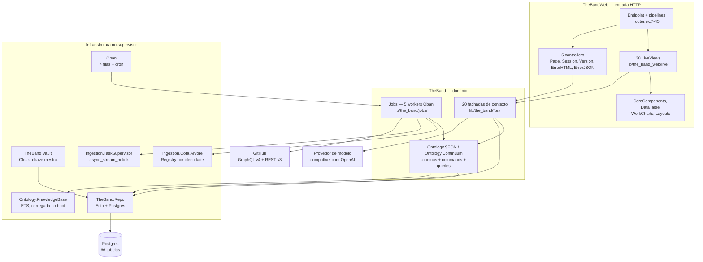
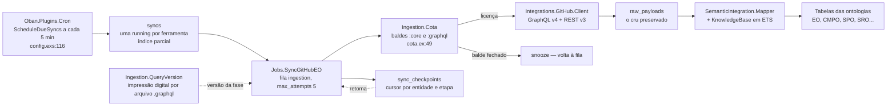
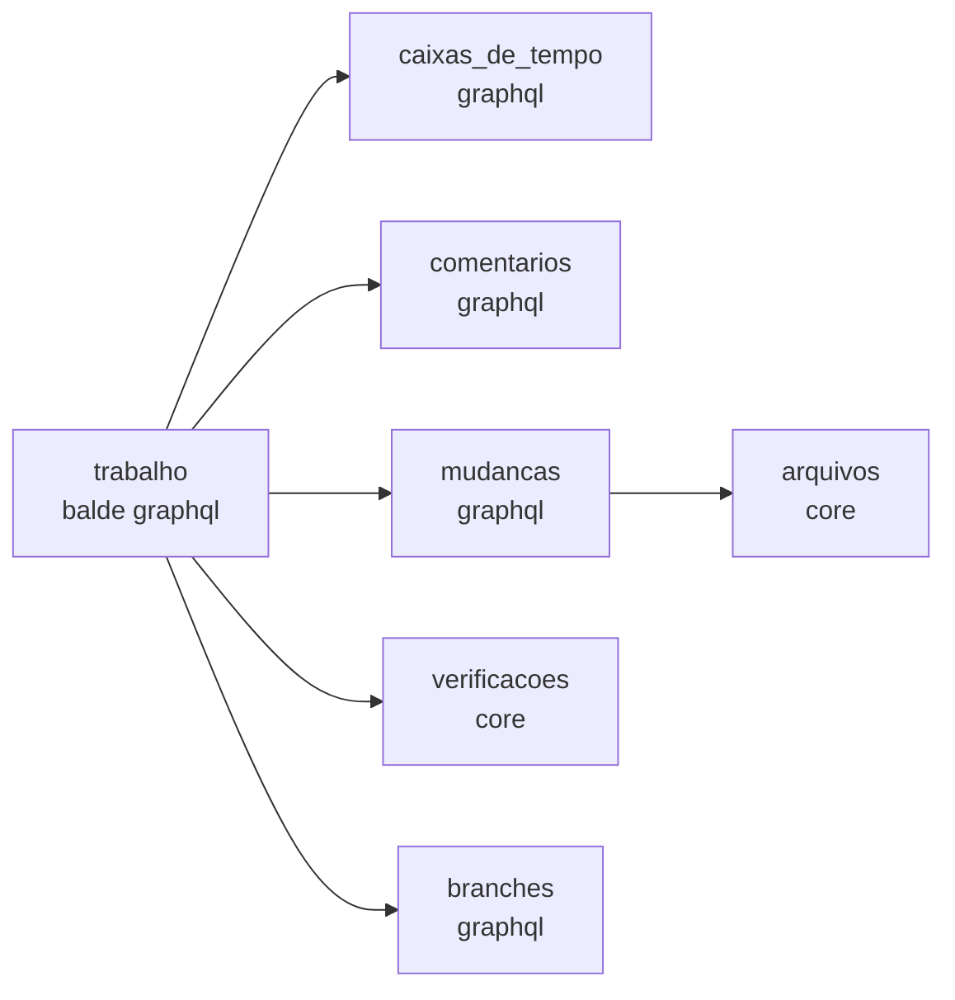
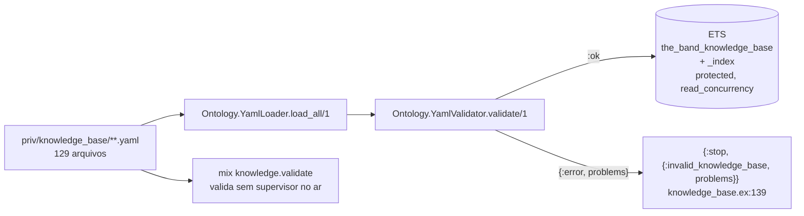
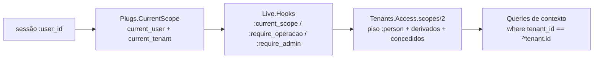
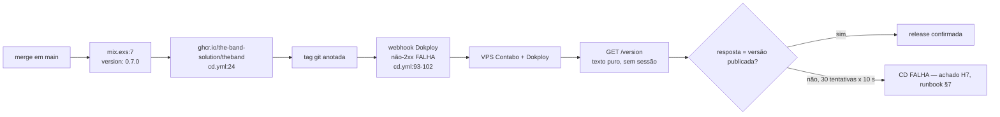

<!-- DERIVADO de lib/the_band/application.ex:11-44, lib/the_band_web/router.ex:7-152,
     lib/the_band/ontology/knowledge_base.ex:126-141, config/config.exs:88-120,
     lib/the_band/jobs/sync_github_eo.ex:52-120 e 296-325,
     lib/the_band/ingestion/query_version.ex:1-60, lib/the_band/ingestion/cota.ex:49,
     lib/the_band/vault.ex:18-34, lib/the_band_web/plugs/current_scope.ex:1-40,
     lib/the_band_web/controllers/version_controller.ex, .github/workflows/cd.yml:93-144,
     mix.exs:7 — em 2026-09-12.
     Conferido contra o código nesta data. Regenerar ao mudar a fonte. -->

# Arquitetura — o que está no ar hoje

Um monólito modular em Elixir (ADR 0001): um processo OTP, um banco Postgres, uma base de
conhecimento em YAML carregada em memória no boot. A versão do artefato é `0.7.0`
(`mix.exs:7`).

Este documento descreve **a forma do que roda**. O *porquê* da forma está em
[`architecture/overview.md`](../../architecture/overview.md), que é anterior e continua
válido; aqui o compromisso é outro — cada caixa e cada seta saem de um arquivo, com linha.

---

## 1. As camadas, e a direção da dependência

**A direção é web → domínio → Repo → Postgres, e nada volta** — com **uma exceção medida**,
registrada aqui porque um diagrama que a escondesse mentiria:

| Aresta contra a direção | Onde | O que é |
|---|---|---|
| `TheBand.Ontology.SEON.EO.Commands` → `TheBandWeb.CoreComponents.translate_error/1` | `lib/the_band/ontology/seon/eo/commands.ex:266` | o domínio chama o tradutor de erro da camada web para montar o motivo de uma recusa |

O comentário no local (linhas 255-264) explica a escolha: a alternativa era montar a mensagem
à mão e descartar os `msgid` que o `errors.po` já tem. **É concessão declarada, não descuido**
— mas é a única aresta domínio → web da base, e quem desenhar a fronteira precisa saber que
ela existe. `lib/the_band/application.ex` referencia `TheBandWeb.Telemetry` e
`TheBandWeb.Endpoint` (linhas 23, 43, 54), o que **não** conta: a árvore de supervisão é de
quem monta a aplicação, e monta as duas.

---

## 2. Os contextos do domínio, e o que cada um responde

Vinte fachadas em `lib/the_band/*.ex`, mais as ontologias em `lib/the_band/ontology/`.
A coluna *tabelas* diz quantas tabelas o contexto possui — o total fecha em 62 (ver
[`banco/mapa-das-tabelas.md`](../banco/mapa-das-tabelas.md)).

| Contexto | Responde | Módulo | Tabelas |
|---|---|---|---|
| `Tenants` | de quem é a sessão, o que ela alcança, quem é administrador | `tenants.ex`, `tenants/access.ex` | 4 |
| `Ontology.SEON.EO` | pessoas, equipes, organizações, papéis, vínculos | `ontology/seon/eo/` | 10 (+1 sem schema) |
| `Ontology.SEON.CMPO` | repositório de origem e a cópia carregada | `ontology/seon/cmpo/schemas/` | 3 |
| `Ontology.SEON.SPO` | projeto declarado, o que ele reúne, atividade realizada | `ontology/seon/spo/schemas/` | 9 |
| `Ontology.Continuum.SRO` | sprint e a issue dentro dela | `ontology/continuum/sro/schemas/` | 2 |
| `Ontology.Continuum.SMPO` | o que a organização declara que um campo de iteração significa | `ontology/continuum/smpo/schemas/` | 1 |
| `Sources` | a ferramenta conectada, a credencial, o encerramento da observação | `sources.ex` | 3 |
| `Ingestion` | a execução da coleta, o checkpoint, a cota | `ingestion.ex` | 2 |
| `RawData` | o payload cru preservado, para reprocessar sem tocar na origem | `raw_data.ex` | 1 |
| `SemanticIntegration` | reaplicar mapeamento corrigido ao que já foi coletado | `semantic_integration.ex` | — |
| `WorkItems` | a issue coletada, o que a plataforma decidiu que ela é, a decomposição | `work_items.ex` | 6 |
| `Changes` | solicitação de mudança, commit, arquivo, autoria | `changes.ex` | 5 |
| `Verification` | execução de verificação contínua e seus componentes | `verification.ex` | 2 |
| `Quality` | avaliação do artefato (a *review*) | `quality.ex` | 1 |
| `Communication` | comentário de issue | `communication/schemas/` | 1 |
| `Configuration` | branch | `configuration.ex` | 1 |
| `Projects` | o quadro observado, item, campo, valor, iteração | `projects.ex` | 5 |
| `Mapping` | a regra do tenant que classifica issue, e o padrão decidido | `mapping.ex` | 2 |
| `Profiles` | rodada de perfis, entrada da rodada, automação | `profiles.ex` | 3 |
| `AI` | credencial do provedor de modelo | `ai.ex` | 1 |
| `Teams` | os fatos que o painel da equipe conta antes das medidas | `teams/problems_now.ex` | — |
| `Forecast` | chance de terminar, por simulação sobre o histórico | `forecast.ex` | — |
| `Vault` | cifra e decifra credencial, com a chave mestra do ambiente | `vault.ex` | — |

`SemanticIntegration`, `Teams`, `Forecast` e `Vault` não têm tabela própria: **leem o que os
outros gravam**. `Forecast` é função pura e nem toca no banco (`forecast.ex:4-7`).

---

## 3. Como o dado entra

Sete etapas, e **elas são um grafo, não uma fila** — `sync_github_eo.ex:199-325`. A próxima
etapa é a que tem dependência concluída **e** balde de cota aberto.

### As sete etapas e suas dependências

Derivadas de `sync_github_eo.ex:296-325`.

`arquivos` depende de `mudancas` porque o arquivo pende de um commit, e os commits são
gravados na etapa de mudanças (`sync_github_eo.ex:317-318`). `verificacoes` e `arquivos` usam
o balde `:core` (REST) e por isso andam quando a cota GraphQL está fechada.

### As três peças que impedem sucesso silencioso na coleta

| Peça | Onde | O defeito que fecha |
|---|---|---|
| `QueryVersion` | `lib/the_band/ingestion/query_version.ex` | consulta ganha campo, o corte incremental diz *"já coletei"*, e 763 solicitações em 10 repositórios ficam sem o campo — sem erro nenhum (moduledoc, linhas 10-17) |
| `Janela.ate_fechar/2` | `lib/the_band/ingestion/janela.ex:19-24` | a cota fecha no meio, cada repositório seguinte é recusado, e a etapa "completa" com buracos |
| `Task.async_stream_nolink` | `lib/the_band/application.ex:30-39` | uma exceção num repositório derruba o job inteiro — foi o `KeyError` de 2026-09-04 |

### As filas e o cron

`config/config.exs:88-120`.

| Fila | Concorrência | Por quê |
|---|---|---|
| `ingestion` | 5 | a coleta |
| `transformation` | 5 | reprocessamento de mapeamento |
| `perfis` | 1 | cada geração leva de 25 a 60 s; paralelizar gastaria crédito em rajada |
| `rodadas` | 1 | fila própria, ou a rodada mensal (15 a 35 min) trancaria toda geração pedida a mão |

| Cron | Quando | O que faz |
|---|---|---|
| `Jobs.ReconcileStuckSyncs` | `*/5 * * * *` | libera ferramenta cuja coleta morreu |
| `Jobs.ScheduleDueSyncs` | `*/5 * * * *` | enfileira as ferramentas vencidas — olha **estado**, por isso uma entrada serve a todos os tenants |
| `Profiles.MonthlyWorker` | `0 3 1 * *` | rodada mensal de perfis, num fuso só |

`Oban.Plugins.Lifeline` **não** entra, e a razão está escrita em `config/config.exs:121`.

---

## 4. A base de conhecimento

129 arquivos YAML em `priv/knowledge_base/`, validados e publicados em ETS no boot.

**Falha de carregamento é falha de boot** (`knowledge_base.ex:136-140`): a `init/1` devolve
`{:stop, ...}` em vez de subir com a base pela metade, porque "seguir com a base pela metade
produziria transformação semântica silenciosamente errada".

A mesma regra vale um nível acima: **a aplicação recusa iniciar sem a chave mestra**
(`application.ex:11-21` e `refuse_boot/1` em 58-74). Sem ela, credenciais de ferramenta
seriam gravadas em claro e ninguém perceberia — FR-005a.

Subdiretórios, e o que cada um guarda:

| Diretório | Conteúdo |
|---|---|
| `ontology/` | os módulos das 14 ontologias — UFO, SEON (EO, SPO, CMPO, QAPO, ROoST, OSDeF, RSRO, SysSwO), Continuum (SRO, SMPO, CMO, CDRO, CIRO) |
| `mappings/github/` | o que cada campo do GitHub vira em cada ontologia |
| `rules/`, `transformations/` | regras de derivação |
| `measurements/`, `information_needs/` | as medidas e as perguntas que elas respondem |
| `glossary/`, `examples/`, `schemas/`, `sources/` | apoio e validação |

---

## 5. O que atravessa tudo — o tenant

`lib/the_band_web/plugs/current_scope.ex:1-12` diz a regra em uma frase: *toda consulta a dado
coletado recebe o tenant daqui, e nenhuma o busca do dicionário de processo* — FR-027,
princípio V da constituição. Consulta sem tenant é **defeito de segurança**, não de estilo.

No banco, a regra tem forma: **61 das 62 tabelas com schema Ecto têm `tenant_id`**. A única
sem é `tenants`, que é a própria raiz.

Os quatro níveis de escopo (`tenants/access.ex:60-104`):

| Nível | De onde vem |
|---|---|
| `:person` | piso — toda conta com elo a pessoa tem o próprio |
| `:team` | derivado dos vínculos vigentes da pessoa, **ou** concedido |
| `:project` | derivado dos projetos das equipes, **ou** concedido |
| `:organization` | só concedido — `access_scope_grants`, `level in ~w(team project organization)` |

As três pipelines do roteador (`router.ex:74-152`):

| Pipeline | Porta | Telas |
|---|---|---|
| `:require_user` | `live_session :autenticado` | pessoas, equipes, organizações, projetos, quadros, trabalho, mudanças, verificações |
| `:require_operacao` | `live_session :operacao` | `/syncs`, `/tools`, `/profiles`, `/ai` |
| `:require_admin` | `live_session :admin` | `/accounts`, `/access-scopes`, `/roles` |

Fora de qualquer pipeline autenticada: `/`, `/version`, `/sign-in`, `/session`,
`/set-password` (`router.ex:48-71`).

---

## 6. A fronteira do deploy

O passo de confirmação (`cd.yml:118-144`) é o que fecha o achado **H7**: antes dele, o
webhook respondia `deployed successfully` e **nada provava** que o container subiu a versão do
merge, porque a produção puxa a imagem por `latest` — que responde *"o que foi publicado por
último"*, não *"o que está rodando"*.

`GET /version` devolve **só a versão, em texto puro, sem autenticação**, e as três decisões
estão justificadas no moduledoc de `lib/the_band_web/controllers/version_controller.ex`: a
versão já é pública na tag e no nome da imagem; o único consumidor roda antes de haver sessão;
e a constante é lida em **compilação** (`@versao Mix.Project.config()[:version]`), o que faz a
resposta ser sobre *este artefato* e não sobre a aplicação carregada.

---

## 7. O que este documento não mostra

Dito, e não omitido:

- **A árvore de componentes da interface.** 30 LiveViews e quatro módulos de componente
  (`core_components.ex`, `data_table.ex`, `work_charts.ex`, `layouts.ex`); o desenho de tela é
  de [`design-system.md`](../../design-system.md) e dos protótipos, não deste documento.
- **Telemetria.** `TheBandWeb.Telemetry` sobe primeiro na árvore (`application.ex:23`) e a
  ADR 0005 descreve a jornada instrumentada; as métricas em si não entram aqui.
- **O cliente LLM.** `lib/the_band/integrations/llm/` existe e alimenta `Profiles`; o
  contrato do provedor não foi conferido para este documento.
- **`DNSCluster` e `Phoenix.PubSub`** (`application.ex:28-29`) aparecem no diagrama de camadas
  como infraestrutura e não ganharam seta: o PubSub é usado para atualizar telas de coleta
  (`@topic "syncs"` em `semantic_integration.ex:42`), e o DNSCluster está configurado como
  `:ignore` fora de produção.
- **A rede de 14 ontologias** tem documento próprio em [`../../ontology/`](../../ontology/README.md);
  aqui ela aparece como uma caixa só.
