<!-- DERIVED from the migrations priv/repo/migrations/20260825140000_create_activity_start_criteria.exs,
     20260827020000_papel_do_campo_de_iteracao.exs, 20260827040000_criterio_de_prazo.exs,
     20260827060000_concessao_de_visibilidade.exs, 20260828160856_access_scope_grants.exs,
     20260907190000_concessao_de_gestao_da_estrutura.exs,
     20260915120000_declaracao_de_fase_por_coluna.exs,
     20260915180000_declaracao_de_conceito_por_evento.exs,
     20260915200000_criterio_de_fim.exs — reconstructed in order to obtain
     table → column → (declared FK | raw :binary_id | plain column), on 2026-09-18.
     NOT compared with `information_schema`: there was no access to the database on this date.
     The source is the migration, which is the truth of the schema.
     Checked against the code on this date. Regenerate when the source changes. -->

# Database — the organization's declarations

**Nine tables out of 66**, and the ERD that was missing: three of them came in on 2026-09-15 with feature
066 and did not appear in any diagram. Slice declared in
[`mapa-das-tabelas.md`](mapa-das-tabelas.md#the-three-tables-of-066).

This document **crosses** the slices of the other ERDs on purpose: six of these nine already appear in
[`projetos-e-processo.md`](projetos-e-processo.md) and
[`eo-e-acesso.md`](eo-e-acesso.md), by write context. Here they appear together by **shape**, which is
what one wants to see when the question is *"how is something declared on this platform?"*.

## What these tables have in common

They all keep a **people's decision about their own process**, and they all have the same footer:

```text
declared_by_user_id  →  users      (who decided)
declared_at                        (when)
revoked_by_user_id   →  users      (who undid it)
revoked_at                         (when — NULL = in force)
```

And they all have a **partial unique index** on `revoked_at IS NULL`, which is the model's invariant:
*one declaration in force per key*. Their state machine is in
[`estados/declaracao-revogavel.md`](../estados/declaracao-revogavel.md).

## The diagram

Only the columns that decide behaviour. `id`, `inserted_at` and `updated_at` stay out and are named
[at the end](#what-the-diagram-does-not-show).

`FK` = foreign key **declared** in the migration. Columns without a mark are plain data. The **raw**
columns (`:binary_id` without `references`) are marked `CRU` (raw) and listed
[below](#what-is-a-declared-fk-and-what-is-raw).

```mermaid
erDiagram
    tenants ||--o{ spo_item_phase_declarations : bounds
    tenants ||--o{ spo_event_concept_declarations : bounds
    tenants ||--o{ spo_activity_end_criteria : bounds
    tenants ||--o{ spo_activity_start_criteria : bounds
    tenants ||--o{ spo_activity_deadline_criteria : bounds
    tenants ||--o{ smpo_iteration_field_roles : bounds
    tenants ||--o{ eo_role_visibility_grants : bounds
    tenants ||--o{ eo_role_structure_management_grants : bounds

    users ||--o{ spo_item_phase_declarations : declares
    users ||--o{ spo_event_concept_declarations : declares
    users ||--o{ spo_activity_end_criteria : declares
    users ||--o{ spo_activity_start_criteria : declares
    users ||--o{ spo_activity_deadline_criteria : declares
    users ||--o{ smpo_iteration_field_roles : declares
    users ||--o{ eo_role_visibility_grants : declares
    users ||--o{ eo_role_structure_management_grants : declares
    users ||--o{ access_scope_grants : receives

    observed_projects ||--o{ spo_item_phase_declarations : "has a column declared in"
    observed_projects ||--o{ spo_activity_end_criteria : "has an end declared in"
    observed_projects ||--o{ spo_activity_start_criteria : "has a start declared in"
    observed_projects ||--o{ spo_activity_deadline_criteria : "has a deadline declared in"
    observed_projects ||--o{ smpo_iteration_field_roles : "has a field declared in"

    spo_projects ||--o{ spo_activity_end_criteria : "has an end declared in"
    spo_projects ||--o{ spo_activity_start_criteria : "has a start declared in"
    spo_projects ||--o{ spo_activity_deadline_criteria : "has a deadline declared in"

    eo_organizational_roles ||--o{ eo_role_visibility_grants : confers
    eo_organizational_roles ||--o{ eo_role_structure_management_grants : confers

    spo_item_phase_declarations {
        uuid tenant_id FK
        uuid observed_project_id FK "the board"
        string field_external_id "the single-select field"
        string option_external_id "the IDENTITY of the option"
        string option_name_at_declaration "the name at the time"
        string target_concept "network concept, or nao_diz_fase"
        uuid declared_by_user_id FK
        datetime declared_at
        uuid revoked_by_user_id FK
        datetime revoked_at "null = in force"
    }

    spo_event_concept_declarations {
        uuid tenant_id FK
        string event_type "raw, as the source names it"
        string target_concept "network concept, or nao_nomeado"
        uuid declared_by_user_id FK
        datetime declared_at
        uuid revoked_by_user_id FK
        datetime revoked_at "null = in force"
    }

    spo_activity_end_criteria {
        uuid tenant_id FK
        uuid project_id FK "exactly ONE of the two"
        uuid observed_project_id FK "exactly ONE of the two"
        string event_type
        uuid declared_by_user_id FK
        datetime declared_at
        uuid revoked_by_user_id FK
        datetime revoked_at "null = in force"
    }

    spo_activity_start_criteria {
        uuid tenant_id FK
        uuid project_id FK "exactly ONE of the two"
        uuid observed_project_id FK "exactly ONE of the two"
        string event_type
        uuid declared_by_user_id FK
        datetime declared_at
        uuid revoked_by_user_id FK
        datetime revoked_at "null = in force"
    }

    spo_activity_deadline_criteria {
        uuid tenant_id FK
        uuid project_id FK "exactly ONE of the two"
        uuid observed_project_id FK "exactly ONE of the two"
        string source "where the date comes from"
        string field_name "which field"
        uuid declared_by_user_id FK
        datetime declared_at
        uuid revoked_by_user_id FK
        datetime revoked_at "null = in force"
    }

    smpo_iteration_field_roles {
        uuid tenant_id FK
        uuid observed_project_id FK
        string field_name
        string role
        uuid declared_by_user_id FK
        datetime declared_at
        uuid revoked_by_user_id FK
        datetime revoked_at "null = in force"
    }

    eo_role_visibility_grants {
        uuid tenant_id FK
        uuid organizational_role_id FK
        string scope
        uuid declared_by_user_id FK
        datetime declared_at
        uuid revoked_by_user_id FK
        datetime revoked_at "null = in force"
    }

    eo_role_structure_management_grants {
        uuid tenant_id FK
        uuid organizational_role_id FK
        string scope
        uuid declared_by_user_id FK
        datetime declared_at
        uuid revoked_by_user_id FK
        datetime revoked_at "null = in force"
    }

    access_scope_grants {
        uuid tenant_id "CRU (raw) — no FK"
        uuid user_id FK
        string level "team, project or organization"
        uuid target_id "CRU (raw) — polymorphic, depends on level"
        uuid granted_by_user_id "CRU (raw) — no FK"
        datetime granted_at
        uuid revoked_by_user_id "CRU (raw) — no FK"
        datetime revoked_at "null = in force"
    }
```



`access_scope_grants` appears **loose** in the diagram, linked only to `users`. It is not a drawing
error: it is what the migration wrote, and the reason is [below](#what-is-a-declared-fk-and-what-is-raw).

## The partial indexes, which carry the invariant

No diagram shows an index, and this is where the real rule lives. **All** of them are
`WHERE revoked_at IS NULL`, and the reason is always the same: *"a total index would prevent
redeclaring after revoking"* (`20260825140000:78-79`).

| Table | Columns | Name | Source |
|---|---|---|---|
| `spo_item_phase_declarations` | `tenant, board, field, option` | `spo_fase_vigente_da_opcao_index` | `20260915120000:70-76` |
| `spo_event_concept_declarations` | `tenant, event_type` | `spo_conceito_vigente_do_evento_index` | `20260915180000:49-52` |
| `spo_activity_end_criteria` | `tenant, board` | `spo_fim_vigente_do_quadro_index` | `20260915200000:66-70` |
| `spo_activity_end_criteria` | `tenant, project` | `spo_fim_vigente_do_projeto_index` | `20260915200000:71-75` |
| `spo_activity_start_criteria` | `tenant, project` | `spo_activity_start_criteria_projeto_vigente_index` | `20260825140000:80-84` |
| `spo_activity_start_criteria` | `tenant, board` | `spo_activity_start_criteria_quadro_vigente_index` | `20260825140000:85-89` |
| `spo_activity_deadline_criteria` | `tenant, board, source, field` | `spo_prazo_vigente_do_quadro_index` | `20260827040000:89-93` |
| `spo_activity_deadline_criteria` | `tenant, project, source, field` | `spo_prazo_vigente_do_projeto_index` | `20260827040000:97-101` |
| `smpo_iteration_field_roles` | `tenant, board, field` | `smpo_papel_vigente_do_campo_index` | `20260827020000:67-71` |
| `eo_role_visibility_grants` | `tenant, role, scope` | `eo_concessao_vigente_do_papel_index` | `20260827060000:69-73` |
| `eo_role_structure_management_grants` | `tenant, role, scope` | `eo_concessao_de_gestao_vigente_index` | `20260907190000:71-75` |
| `access_scope_grants` | `tenant, account, level, target` | `access_scope_grants_vigente_index` | `20260828160856:38-40` |

**Twelve indexes for nine tables**: three tables have two each, because the target can be the board
**or** the project, and the board prevails.

## The CHECK constraints

Two, and both state the same rule with different syntax:

| Table | CHECK | Source |
|---|---|---|
| `spo_activity_start_criteria` | `num_nonnulls(project_id, observed_project_id) = 1` | `20260825140000:75` |
| `spo_activity_end_criteria` | `(project_id IS NULL) <> (observed_project_id IS NULL)` | `20260915200000:63` |

> *"the board's criterion prevails over the project's, and a criterion without a target would hold for
> everything without anyone having said so."* — `20260915200000:44-45`

**`spo_activity_deadline_criteria` has no equivalent CHECK in its migration** — its two partial indexes
require the target `IS NOT NULL`, which prevents a row without a target from being *in force*, but does
not prevent a revoked row without a target. It is recorded as a difference among the three siblings, for
whoever maintains SPO to assess.

## What is a declared FK, and what is raw

**The measurement, done over the 93 reconstructed migrations:**

| | How many |
|---|---:|
| columns with `references(...)` — **declared FK** | **201** |
| `:binary_id` / `:uuid` columns **without** `references` (outside the PKs) | **12** |
| `:binary_id` / `:uuid` primary keys | 66 |

> **Correction of a common premise.** In the **database**, the overwhelming majority of references are
> **declared** FKs — 201 against 12. Whoever expects to find loose links is thinking of the **Ecto
> schemas**, where the story is the opposite: 214 `:binary_id` fields and **3** declared associations.
> The link exists in the schema and is **not** modelled in Ecto. This is measured in
> [`classes/mapa-dos-schemas.md`](../classes/mapa-dos-schemas.md).

### The 12 raw columns in the whole database

**Four** of them are in this family, all in `access_scope_grants`:

| Table | Column | Why it is raw |
|---|---|---|
| `access_scope_grants` | `target_id` | **polymorphic** — points to a team, project or organization depending on `level`; an FK is impossible |
| `access_scope_grants` | `tenant_id` | **no written reason** — see the finding below |
| `access_scope_grants` | `granted_by_user_id` | **no written reason** — `user_id`, in the same table, is an FK |
| `access_scope_grants` | `revoked_by_user_id` | likewise |

The other eight, outside this family, to complete the census:

| Table | Raw columns | Why |
|---|---|---|
| `account_disablements` | `tenant_id`, `disabled_by_user_id`, `enabled_by_user_id` | no written reason; `user_id` is an FK |
| `issue_promotions` | `target_id` | polymorphic, with `target_table` next to it |
| `spo_performed_project_activities` | `subject_id` | polymorphic, with `subject_type` next to it — *"a commit has no issue, and the dedicated column would be null in half the rows"* (`20260814160000:55-57`) |
| `spo_performed_project_activities` | `board_id` | the resolution to the observed board **may not exist yet** (`performed_project_activity.ex:53-55`) |
| `spo_performed_project_activities` | `project_id` | **no written reason** — see the finding below |
| `users` | `password_set_by_user_id` | no written reason |

### Finding 1 — two tables with `tenant_id` without FK · ✅ RESOLVED on 2026-09-18 {#finding-1--two-tables-with-tenant_id-without-fk}

> Fixed in `20260918120000_as_chaves_estrangeiras_que_faltavam`. Both now declare the key, with
> `ON DELETE RESTRICT` — which is what **61 of the 65** `tenant_id` keys already used, and the only one
> compatible with the column being `NOT NULL`. Zero orphans, checked before applying.
>
> **The "it is an oversight" reading won**, by the argument written below: `user_id`, in the same table
> and in the same migration, was declared.


**63 of the 66 domain tables declare an FK from `tenant_id` to `tenants`.** The exceptions:

- `tenants`, which is the root — correct;
- **`access_scope_grants`** and **`account_disablements`**, which have a **raw** `tenant_id`.

Both are **access** tables, and they are precisely where a wrong tenant has the most expensive effect.
No migration explains the choice. The two readings:

- **it is deliberate** — both were born in the same authentication batch (`20260828160856` and
  `20260910050000`), and perhaps the intent was to avoid a cascading `ON DELETE` on an access path;
- **it is an oversight** — `user_id`, in the same table and in the same migration, **is** a declared FK,
  which makes the internal inconsistency hard to explain as intent.

I do not choose between the two. **Take it to whoever maintains `Tenants.Access`.** The practical effect
is that the database does not prevent a grant pointing to a nonexistent tenant; the application does, in
`Access.grant/5` (`lib/the_band/tenants/access.ex:545, :548`).

### Finding 2 — `organization_id` is an FK and `project_id` is not · ✅ RESOLVED on 2026-09-18

> Fixed in the same migration, with `ON DELETE SET NULL` — the rule of `organization_id`, the sibling
> declared on the line above, because this column accepts null on purpose.
>
> **The migration-order reading won**, and it is below: `spo_projects` was born a day later. It was not
> a decision; it was what could be done that day.


In `spo_performed_project_activities`, the migration comment treats the two columns **together**:

> *"They are in the identity criterion and accept null: not every future source knows the organization
> or the project."* — `20260814160000:29-32`

And right below, one is declared and the other is not:

```elixir
add :organization_id, references(:eo_organizations, type: :uuid, on_delete: :nilify_all)
add :project_id, :uuid
```
`20260814160000:33-34`

The two readings: **`project_id` points to `spo_projects`, which did not exist yet** when this migration
ran (`spo_projects` is born in `20260815160000`, a day later) — which would explain the absence as
migration order, not as a decision; **or** it is intentional, because the project of the act can come
from a source we do not have. Take it to whoever maintains SPO.

## What the diagram does not show

- **`id`, `inserted_at`, `updated_at`** — present in all nine, and they do not decide behaviour.
- **The collection clock `_at` columns** — they do not exist here: none of these nine is collected.
  Every row was written by a person.
- **Resolution at read time.** None of these declarations rewrites anything: the item's phase, the
  event's concept and the end instant are resolved **in the query**, and the reason is in
  `lib/the_band/ontology/seon/spo/item_phase.ex:7-9` — *"Writing the phase on the item would make
  revoking a declaration leave behind thousands of rows stating what nobody declares anymore"*.
  An ERD does not show this, and whoever reads the model needs to know.
