<!-- DERIVADO das migrações priv/repo/migrations/20260825140000_create_activity_start_criteria.exs,
     20260827020000_papel_do_campo_de_iteracao.exs, 20260827040000_criterio_de_prazo.exs,
     20260827060000_concessao_de_visibilidade.exs, 20260828160856_access_scope_grants.exs,
     20260907190000_concessao_de_gestao_da_estrutura.exs,
     20260915120000_declaracao_de_fase_por_coluna.exs,
     20260915180000_declaracao_de_conceito_por_evento.exs,
     20260915200000_criterio_de_fim.exs — reconstruídas em ordem para obter
     tabela → coluna → (FK declarada | :binary_id cru | coluna comum), em 2026-09-18.
     NÃO confrontadas com `information_schema`: não havia acesso ao banco nesta data.
     A fonte é a migração, que é a verdade do esquema.
     Conferido contra o código nesta data. Regenerar ao mudar a fonte. -->

# Banco — as declarações da organização

**Nove tabelas de 66**, e o ERD que faltava: três delas entraram em 2026-09-15 com a feature
066 e não apareciam em diagrama nenhum. Recorte declarado em
[`mapa-das-tabelas.md`](mapa-das-tabelas.md#as-três-tabelas-da-066).

Este documento **atravessa** os recortes dos outros ERDs de propósito: seis destas nove já
aparecem em [`projetos-e-processo.md`](projetos-e-processo.md) e
[`eo-e-acesso.md`](eo-e-acesso.md), pelo contexto de escrita. Aqui elas aparecem juntas por
**forma**, que é o que se quer ver quando a pergunta é *"como se declara alguma coisa nesta
plataforma?"*.

## O que estas tabelas têm em comum

Todas guardam uma **decisão de gente sobre o próprio processo**, e todas têm o mesmo rodapé:

```text
declared_by_user_id  →  users      (quem decidiu)
declared_at                        (quando)
revoked_by_user_id   →  users      (quem desfez)
revoked_at                         (quando — NULO = vigente)
```

E todas têm um **índice único parcial** sobre `revoked_at IS NULL`, que é a invariante do
modelo: *uma declaração vigente por chave*. A máquina de estados delas está em
[`estados/declaracao-revogavel.md`](../estados/declaracao-revogavel.md).

## O diagrama

Só as colunas que decidem comportamento. `id`, `inserted_at` e `updated_at` ficam fora e estão
nomeados [no fim](#o-que-o-diagrama-não-mostra).

`FK` = chave estrangeira **declarada** na migração. Colunas sem marca são dado comum. As
colunas **cruas** (`:binary_id` sem `references`) estão marcadas `cru` e listadas
[abaixo](#o-que-é-fk-declarada-e-o-que-é-cru).

```mermaid
erDiagram
    tenants ||--o{ spo_item_phase_declarations : delimita
    tenants ||--o{ spo_event_concept_declarations : delimita
    tenants ||--o{ spo_activity_end_criteria : delimita
    tenants ||--o{ spo_activity_start_criteria : delimita
    tenants ||--o{ spo_activity_deadline_criteria : delimita
    tenants ||--o{ smpo_iteration_field_roles : delimita
    tenants ||--o{ eo_role_visibility_grants : delimita
    tenants ||--o{ eo_role_structure_management_grants : delimita

    users ||--o{ spo_item_phase_declarations : declara
    users ||--o{ spo_event_concept_declarations : declara
    users ||--o{ spo_activity_end_criteria : declara
    users ||--o{ spo_activity_start_criteria : declara
    users ||--o{ spo_activity_deadline_criteria : declara
    users ||--o{ smpo_iteration_field_roles : declara
    users ||--o{ eo_role_visibility_grants : declara
    users ||--o{ eo_role_structure_management_grants : declara
    users ||--o{ access_scope_grants : recebe

    observed_projects ||--o{ spo_item_phase_declarations : "tem coluna declarada em"
    observed_projects ||--o{ spo_activity_end_criteria : "tem fim declarado em"
    observed_projects ||--o{ spo_activity_start_criteria : "tem inicio declarado em"
    observed_projects ||--o{ spo_activity_deadline_criteria : "tem prazo declarado em"
    observed_projects ||--o{ smpo_iteration_field_roles : "tem campo declarado em"

    spo_projects ||--o{ spo_activity_end_criteria : "tem fim declarado em"
    spo_projects ||--o{ spo_activity_start_criteria : "tem inicio declarado em"
    spo_projects ||--o{ spo_activity_deadline_criteria : "tem prazo declarado em"

    eo_organizational_roles ||--o{ eo_role_visibility_grants : confere
    eo_organizational_roles ||--o{ eo_role_structure_management_grants : confere

    spo_item_phase_declarations {
        uuid tenant_id FK
        uuid observed_project_id FK "o quadro"
        string field_external_id "o campo de selecao unica"
        string option_external_id "a IDENTIDADE da opcao"
        string option_name_at_declaration "o nome de entao"
        string target_concept "conceito da rede, ou nao_diz_fase"
        uuid declared_by_user_id FK
        datetime declared_at
        uuid revoked_by_user_id FK
        datetime revoked_at "nulo = vigente"
    }

    spo_event_concept_declarations {
        uuid tenant_id FK
        string event_type "cru, como a origem nomeia"
        string target_concept "conceito da rede, ou nao_nomeado"
        uuid declared_by_user_id FK
        datetime declared_at
        uuid revoked_by_user_id FK
        datetime revoked_at "nulo = vigente"
    }

    spo_activity_end_criteria {
        uuid tenant_id FK
        uuid project_id FK "exatamente UM dos dois"
        uuid observed_project_id FK "exatamente UM dos dois"
        string event_type
        uuid declared_by_user_id FK
        datetime declared_at
        uuid revoked_by_user_id FK
        datetime revoked_at "nulo = vigente"
    }

    spo_activity_start_criteria {
        uuid tenant_id FK
        uuid project_id FK "exatamente UM dos dois"
        uuid observed_project_id FK "exatamente UM dos dois"
        string event_type
        uuid declared_by_user_id FK
        datetime declared_at
        uuid revoked_by_user_id FK
        datetime revoked_at "nulo = vigente"
    }

    spo_activity_deadline_criteria {
        uuid tenant_id FK
        uuid project_id FK "exatamente UM dos dois"
        uuid observed_project_id FK "exatamente UM dos dois"
        string source "de onde vem a data"
        string field_name "qual campo"
        uuid declared_by_user_id FK
        datetime declared_at
        uuid revoked_by_user_id FK
        datetime revoked_at "nulo = vigente"
    }

    smpo_iteration_field_roles {
        uuid tenant_id FK
        uuid observed_project_id FK
        string field_name
        string role
        uuid declared_by_user_id FK
        datetime declared_at
        uuid revoked_by_user_id FK
        datetime revoked_at "nulo = vigente"
    }

    eo_role_visibility_grants {
        uuid tenant_id FK
        uuid organizational_role_id FK
        string scope
        uuid declared_by_user_id FK
        datetime declared_at
        uuid revoked_by_user_id FK
        datetime revoked_at "nulo = vigente"
    }

    eo_role_structure_management_grants {
        uuid tenant_id FK
        uuid organizational_role_id FK
        string scope
        uuid declared_by_user_id FK
        datetime declared_at
        uuid revoked_by_user_id FK
        datetime revoked_at "nulo = vigente"
    }

    access_scope_grants {
        uuid tenant_id "CRU — sem FK"
        uuid user_id FK
        string level "team, project ou organization"
        uuid target_id "CRU — polimorfico, depende de level"
        uuid granted_by_user_id "CRU — sem FK"
        datetime granted_at
        uuid revoked_by_user_id "CRU — sem FK"
        datetime revoked_at "nulo = vigente"
    }
```



`access_scope_grants` aparece **solta** no diagrama, ligada só a `users`. Não é erro de desenho:
é o que a migração escreveu, e a razão está [abaixo](#o-que-é-fk-declarada-e-o-que-é-cru).

## Os índices parciais, que carregam a invariante

Nenhum diagrama mostra um índice, e é aqui que a regra de verdade mora. **Todos** são
`WHERE revoked_at IS NULL`, e a razão é sempre a mesma: *"um índice total impediria redeclarar
depois de revogar"* (`20260825140000:78-79`).

| Tabela | Colunas | Nome | Fonte |
|---|---|---|---|
| `spo_item_phase_declarations` | `tenant, quadro, campo, opção` | `spo_fase_vigente_da_opcao_index` | `20260915120000:70-76` |
| `spo_event_concept_declarations` | `tenant, event_type` | `spo_conceito_vigente_do_evento_index` | `20260915180000:49-52` |
| `spo_activity_end_criteria` | `tenant, quadro` | `spo_fim_vigente_do_quadro_index` | `20260915200000:66-70` |
| `spo_activity_end_criteria` | `tenant, projeto` | `spo_fim_vigente_do_projeto_index` | `20260915200000:71-75` |
| `spo_activity_start_criteria` | `tenant, projeto` | `spo_activity_start_criteria_projeto_vigente_index` | `20260825140000:80-84` |
| `spo_activity_start_criteria` | `tenant, quadro` | `spo_activity_start_criteria_quadro_vigente_index` | `20260825140000:85-89` |
| `spo_activity_deadline_criteria` | `tenant, quadro, origem, campo` | `spo_prazo_vigente_do_quadro_index` | `20260827040000:89-93` |
| `spo_activity_deadline_criteria` | `tenant, projeto, origem, campo` | `spo_prazo_vigente_do_projeto_index` | `20260827040000:97-101` |
| `smpo_iteration_field_roles` | `tenant, quadro, campo` | `smpo_papel_vigente_do_campo_index` | `20260827020000:67-71` |
| `eo_role_visibility_grants` | `tenant, papel, escopo` | `eo_concessao_vigente_do_papel_index` | `20260827060000:69-73` |
| `eo_role_structure_management_grants` | `tenant, papel, escopo` | `eo_concessao_de_gestao_vigente_index` | `20260907190000:71-75` |
| `access_scope_grants` | `tenant, conta, nível, alvo` | `access_scope_grants_vigente_index` | `20260828160856:38-40` |

**Doze índices para nove tabelas**: três tabelas têm dois cada, porque o alvo pode ser o quadro
**ou** o projeto, e o quadro prevalece.

## As restrições CHECK

Duas, e ambas dizem a mesma regra com sintaxe diferente:

| Tabela | CHECK | Fonte |
|---|---|---|
| `spo_activity_start_criteria` | `num_nonnulls(project_id, observed_project_id) = 1` | `20260825140000:75` |
| `spo_activity_end_criteria` | `(project_id IS NULL) <> (observed_project_id IS NULL)` | `20260915200000:63` |

> *"o critério do quadro prevalece sobre o do projeto, e um critério sem alvo valeria para tudo
> sem ninguém ter dito isso."* — `20260915200000:44-45`

**`spo_activity_deadline_criteria` não tem CHECK equivalente na sua migração** — os dois índices
parciais dela exigem `IS NOT NULL` do alvo, o que impede a linha sem alvo de ser *vigente*, mas
não impede a linha revogada sem alvo. Fica registrado como diferença entre as três irmãs, para
quem mantém a SPO avaliar.

## O que é FK declarada, e o que é cru

**A medida, feita sobre as 93 migrações reconstruídas:**

| | Quantas |
|---|---:|
| colunas com `references(...)` — **FK declarada** | **201** |
| colunas `:binary_id` / `:uuid` **sem** `references` (fora das PKs) | **12** |
| chaves primárias `:binary_id` / `:uuid` | 66 |

> **Correção de uma premissa comum.** No **banco**, a esmagadora maioria das referências é FK
> **declarada** — 201 contra 12. Quem espera encontrar ligação frouxa está pensando nos
> **schemas Ecto**, onde a história é o oposto: 214 campos `:binary_id` e **3** associações
> declaradas. A ligação existe no esquema e **não** é modelada no Ecto. Isso está medido em
> [`classes/mapa-dos-schemas.md`](../classes/mapa-dos-schemas.md).

### As 12 colunas cruas do banco inteiro

Nesta família estão **quatro** delas, todas em `access_scope_grants`:

| Tabela | Coluna | Por que é cru |
|---|---|---|
| `access_scope_grants` | `target_id` | **polimórfico** — aponta para equipe, projeto ou organização conforme `level`; FK é impossível |
| `access_scope_grants` | `tenant_id` | **sem razão escrita** — ver o achado abaixo |
| `access_scope_grants` | `granted_by_user_id` | **sem razão escrita** — `user_id`, na mesma tabela, é FK |
| `access_scope_grants` | `revoked_by_user_id` | idem |

As outras oito, fora desta família, para completar o censo:

| Tabela | Colunas cruas | Por quê |
|---|---|---|
| `account_disablements` | `tenant_id`, `disabled_by_user_id`, `enabled_by_user_id` | sem razão escrita; `user_id` é FK |
| `issue_promotions` | `target_id` | polimórfico, com `target_table` ao lado |
| `spo_performed_project_activities` | `subject_id` | polimórfico, com `subject_type` ao lado — *"um commit não tem issue, e a coluna dedicada ficaria nula em metade das linhas"* (`20260814160000:55-57`) |
| `spo_performed_project_activities` | `board_id` | a resolução para o quadro observado **pode não existir ainda** (`performed_project_activity.ex:53-55`) |
| `spo_performed_project_activities` | `project_id` | **sem razão escrita** — ver o achado abaixo |
| `users` | `password_set_by_user_id` | sem razão escrita |

### Achado 1 — duas tabelas com `tenant_id` sem FK · ✅ RESOLVIDO em 2026-09-18

> Corrigido em `20260918120000_as_chaves_estrangeiras_que_faltavam`. As duas passaram a declarar
> a chave, com `ON DELETE RESTRICT` — que é o que **61 das 65** chaves de `tenant_id` já usavam,
> e o único compatível com a coluna ser `NOT NULL`. Zero órfãos, conferido antes de aplicar.
>
> **A leitura de "é descuido" venceu**, pelo argumento que está escrito abaixo: `user_id`, na
> mesma tabela e na mesma migração, era declarada.


**63 das 66 tabelas de domínio declaram FK de `tenant_id` para `tenants`.** As exceções:

- `tenants`, que é a raiz — correto;
- **`access_scope_grants`** e **`account_disablements`**, que têm `tenant_id` **cru**.

As duas são tabelas de **acesso**, e são justamente onde um tenant errado tem o efeito mais
caro. Nenhuma migração explica a escolha. As duas leituras:

- **é deliberado** — as duas nasceram na mesma leva de autenticação (`20260828160856` e
  `20260910050000`), e talvez se quisesse evitar `ON DELETE` em cascata num caminho de acesso;
- **é descuido** — `user_id`, na mesma tabela e na mesma migração, **é** FK declarada, o que
  torna a inconsistência interna difícil de explicar como intenção.

Não escolho entre as duas. **Levar a quem mantém `Tenants.Access`.** O efeito prático é que o
banco não impede uma concessão apontando para tenant inexistente; a aplicação impede, em
`Access.grant/5` (`lib/the_band/tenants/access.ex:545, :548`).

### Achado 2 — `organization_id` é FK e `project_id` não · ✅ RESOLVIDO em 2026-09-18

> Corrigido na mesma migração, com `ON DELETE SET NULL` — a regra de `organization_id`, a irmã
> declarada na linha de cima, porque esta coluna aceita nulo de propósito.
>
> **A leitura da ordem de migração venceu**, e ela está abaixo: `spo_projects` nasceu um dia
> depois. Não era decisão; era o que dava para fazer naquele dia.


Em `spo_performed_project_activities`, o comentário da migração trata as duas colunas **juntas**:

> *"Estão no critério de identidade e aceitam nulo: nem toda origem futura conhece organização
> ou projeto."* — `20260814160000:29-32`

E logo abaixo, uma é declarada e a outra não:

```elixir
add :organization_id, references(:eo_organizations, type: :uuid, on_delete: :nilify_all)
add :project_id, :uuid
```
`20260814160000:33-34`

As duas leituras: **`project_id` aponta para `spo_projects`, que ainda não existia** quando esta
migração rodou (`spo_projects` nasce em `20260815160000`, um dia depois) — o que explicaria a
ausência como ordem de migração, não como decisão; **ou** é intencional, porque o projeto do ato
pode vir de origem que não temos. Levar a quem mantém a SPO.

## O que o diagrama não mostra

- **`id`, `inserted_at`, `updated_at`** — presentes nas nove, e não decidem comportamento.
- **As colunas `_at` de relógio da coleta** — não existem aqui: nenhuma destas nove é coletada.
  Toda linha foi escrita por uma pessoa.
- **A resolução na leitura.** Nenhuma destas declarações regrava nada: a fase do item, o
  conceito do evento e o instante de fim são resolvidos **na consulta**, e o motivo está em
  `lib/the_band/ontology/seon/spo/item_phase.ex:7-9` — *"Gravar a fase no item faria revogar
  uma declaração deixar para trás milhares de linhas afirmando o que ninguém mais declara"*.
  Um ERD não mostra isso, e quem lê o modelo precisa saber.
