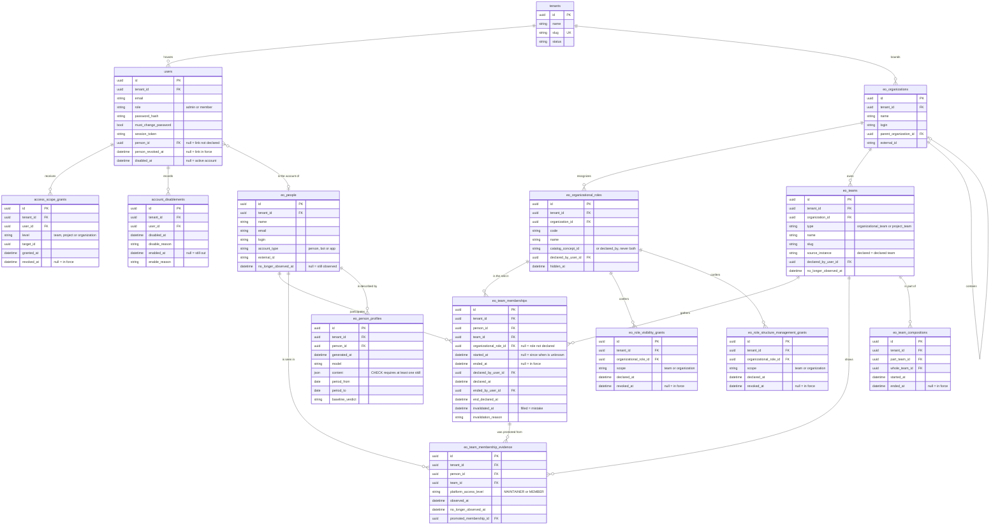

<!-- DERIVED from the migrations priv/repo/migrations/20260809120200_create_eo_information_model.exs,
     20260809120300_create_eo_team_membership_evidence.exs,
     20260810100000_rename_sectors_to_organizational_units.exs,
     20260810150000_require_organization_on_organizational_team.exs,
     20260814140000_papel_declarado_tem_autor.exs,
     20260824180000_papeis_por_organizacao.exs,
     20260827050000_qual_pessoa_observada_e_a_conta.exs,
     20260827060000_concessao_de_visibilidade.exs,
     20260901230000_composicao_de_equipes_e_o_equivoco.exs,
     20260902010000_nome_unico_da_equipe_declarada.exs,
     20260906230000_vinculo_observado.exs;
     compared with `information_schema.columns`, `pg_constraint` (FK and CHECK) and
     `pg_indexes` of the development database `the_band_dev` — on 2026-09-12.
     Checked against the code on this date. Regenerate when the source changes. -->

# Database — EO and access

**14 tables out of 63.** Who the organization is, who the person is, what the team is, who has an account
and what that account reaches. Slice declared in
[`mapa-das-tabelas.md`](mapa-das-tabelas.md#the-seven-erds-and-what-each-one-covers).

Tenants and EO come in the same diagram because **almost every EO table has an FK to `users`** —
who declared, who ended, who revoked. Separating them would leave half the edges loose.

## The diagram

Only the columns that decide behaviour. `inserted_at`, `updated_at`, `record_version`,
`internal_id` and the provenance trio stay out — and are named
[at the end](#what-the-diagram-does-not-show).

## The partial indexes — where the invariants live

An `erDiagram` does not show them, and **they are half the model**: each one is a statement about what
can exist at the same time.

| Index | Form | States |
|---|---|---|
| `eo_team_memberships_vigente_index` | `UNIQUE (tenant_id, person_id, team_id, organizational_role_id) WHERE ended_at IS NULL AND invalidated_at IS NULL` | a person does not have **two team memberships in force with the same role** on the same team |
| `eo_team_memberships_observado_vigente_index` | `UNIQUE (tenant_id, person_id, team_id) WHERE ended_at IS NULL AND invalidated_at IS NULL AND organizational_role_id IS NULL` | **one observed team membership in force** per person and team — without it, each collection would create another one without a role (ADR 0008) |
| `eo_composicao_vigente_de_equipe_index` | `UNIQUE (tenant_id, part_team_id, whole_team_id) WHERE ended_at IS NULL` | a subteam is not part of the same team twice |
| `eo_nome_unico_da_equipe_declarada_index` | `UNIQUE (tenant_id, organization_id, name) WHERE source_instance = 'declared'` | unique name **only among declared teams** — collected ones may repeat a name, because GitHub allows it |
| `eo_concessao_vigente_do_papel_index` | `UNIQUE (tenant_id, organizational_role_id, scope) WHERE revoked_at IS NULL` | one **visibility** grant in force per role and scope |
| `eo_concessao_de_gestao_vigente_index` | `UNIQUE (tenant_id, organizational_role_id, scope) WHERE revoked_at IS NULL` | likewise, for **structure management** |
| `users_pessoa_observada_vigente_index` | `UNIQUE (person_id) WHERE person_id IS NOT NULL AND person_revoked_at IS NULL` | an observed person is the account of **at most one** account — and the index is **not** per tenant, on purpose |
| `access_scope_grants_vigente_index` | `UNIQUE (tenant_id, user_id, level, target_id) WHERE revoked_at IS NULL` | one grant in force per account, level and target |
| `account_disablements_aberto_index` | `UNIQUE (tenant_id, user_id) WHERE enabled_at IS NULL` | one open deactivation per account |
| `users_desativadas_por_tenant` | `INDEX (tenant_id, disabled_at) WHERE disabled_at IS NOT NULL` | not an invariant — it is the question *"who is deactivated here"* served without a scan |

The first two **coexist** and are not redundant: the general one allows several roles in force on the
same team; the second prevents the team membership *without a role* — the observed one — from
multiplying.

## The `CHECK`s — domain rule in the database

| Constraint | Rule |
|---|---|
| `eo_declaracao_tem_autor` | `declared_by_user_id` and `declared_at` are **both** null, or **both** filled |
| `eo_saida_declarada_completa` | a declared exit requires author, declaration date **and** `ended_at` |
| `eo_equivoco_do_vinculo_completo` | a mistake requires `invalidated_at`, author **and reason** — all three, or none |
| `papel_tem_uma_origem_so` | `num_nonnulls(catalog_concept_id, declared_by_user_id) = 1` — the role comes from the catalog **or** from someone, never both |
| `eo_teams_type_check` | `organizational_team` or `project_team` |
| `eo_teams_organizational_team_has_organization` | an organizational team **has** an organization |
| `eo_people_account_type_check` | `person`, `bot` or `app` |
| `eo_evidence_access_level_check` | null, `MAINTAINER` or `MEMBER` |
| `eo_evidence_github_has_access_level` | GitHub evidence **always** brings an access level |
| `eo_person_profiles_conteudo_util` | `jsonb_array_length(content -> 'habilidades') > 0` |
| `elo_da_pessoa_tem_autor_e_data` | the account↔person link has `person_id`, author and date — all three, or none |

The pattern that repeats: **no declaration without an author, and no refusal without a reason.** The
first three `CHECK`s are the same rule applied to three different acts on the team membership.

## The FKs and what happens on delete

| From | To | On delete |
|---|---|---|
| `eo_team_memberships.person_id` / `.team_id` | `eo_people` / `eo_teams` | `CASCADE` |
| `eo_team_memberships.organizational_role_id` | `eo_organizational_roles` | **`RESTRICT`** — a role in use is not deleted |
| `eo_team_memberships.declared_by_user_id` | `users` | `SET NULL` — the declaration stays, the author goes |
| `eo_team_memberships.ended_by_user_id` / `.invalidated_by_user_id` | `users` | **`RESTRICT`** |
| `eo_team_compositions.part_team_id` / `.whole_team_id` | `eo_teams` | **`RESTRICT`** |
| `eo_team_membership_evidence.promoted_membership_id` | `eo_team_memberships` | `SET NULL` |
| `users.person_id` | `eo_people` | **`RESTRICT`** |
| `eo_teams.organization_id` | `eo_organizations` | **`RESTRICT`** |
| `eo_organizational_roles.organization_id` | `eo_organizations` | `CASCADE` |
| `eo_person_profiles.person_id` | `eo_people` | `CASCADE` |
| every `.tenant_id` | `tenants` | **`RESTRICT`** |

The asymmetry is deliberate and worth reading: **`declared_by` is `SET NULL`, `ended_by` and
`invalidated_by` are `RESTRICT`**. Deleting whoever declared a team membership leaves the team membership
standing without an author; deleting whoever **ended** it or whoever marked it as a **mistake** is
refused, because an ending without an author is not an ending — it is the `CHECK` contradicting itself.

## What the diagram does not show

- `inserted_at` / `updated_at` in all 14; `eo_person_profiles` uses
  `timestamps(updated_at: false)`.
- `record_version` and `internal_id` in `eo_organizations`, `eo_organizational_roles`,
  `eo_people`, `eo_teams`, `eo_team_memberships` — write control and internal identity.
- `source_system`, `source_instance`, `external_id`, `collected_at`, `last_observed_at` — the
  Application Reference (FR-012), present in every collected table. `eo_teams.source_instance`
  **is** in the diagram, because the value `declared` decides behaviour.
- `users`: `password_set_at`, `password_source`, `logged_in_at`, `failed_attempts`,
  `last_failed_at`, `person_declared_by_user_id`, `person_declared_at`,
  `person_revoked_by_user_id`, `disabled_by_user_id` — 23 columns in all, 10 in the diagram.
- The `*_by_user_id` of the grants and compositions, and the `*_note` of the deactivations.
- **`eo_organizational_units`** — the 11th EO table, empty and without an Ecto schema. It is out and
  [named in the map](mapa-das-tabelas.md#the-table-no-erd-draws).

## What the data says today

Development database, 2026-09-12 — and the numbers match the measurement of 2026-09-10/11:

| Fact | Value |
|---|---|
| teams | **10** — 9 observed (`source_instance = 'https://github.com'`), 1 declared |
| collected people | **80** |
| team memberships | **90**, all in force |
| team memberships **without a declared role** | **56** of 90 |
| team memberships with an **unknown start** | **87** of 90 |
| team membership evidence | 90 |
| accounts / tenants | 3 / 2 |
| organizational roles | 2 |
| visibility and management grants | 0 and 0 |

**56 without a role and 87 without a start are not collection failures** — they are what GitHub
answers. The model represents them as a null with meaning, not as zero: it is the difference between
*"has no role"* and *"the role was not declared"*, and between *"started today"* and *"since when is
unknown"*.

## Relation to the other documents

- [`classes/eo-estrutura-organizacional.md`](../classes/eo-estrutura-organizacional.md) — the
  class diagram of the 8 central EO tables (2026-09-07).
- [`classes/tenants-e-acesso.md`](../classes/tenants-e-acesso.md) — the 4 access tables.
- [`estados/vinculo-de-equipe.md`](../estados/vinculo-de-equipe.md) — which situations a team
  membership goes through, and what triggers each transition.
