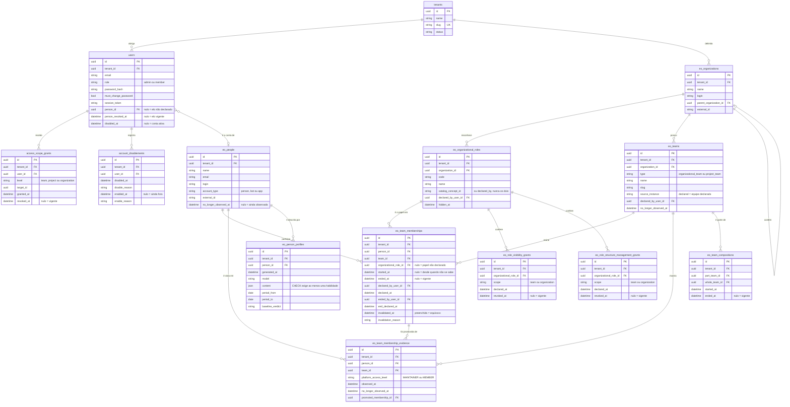

<!-- DERIVADO das migrações priv/repo/migrations/20260809120200_create_eo_information_model.exs,
     20260809120300_create_eo_team_membership_evidence.exs,
     20260810100000_rename_sectors_to_organizational_units.exs,
     20260810150000_require_organization_on_organizational_team.exs,
     20260814140000_papel_declarado_tem_autor.exs,
     20260824180000_papeis_por_organizacao.exs,
     20260827050000_qual_pessoa_observada_e_a_conta.exs,
     20260827060000_concessao_de_visibilidade.exs,
     20260901230000_composicao_de_equipes_e_o_equivoco.exs,
     20260902010000_nome_unico_da_equipe_declarada.exs,
     20260906230000_vinculo_observado.exs;
     confrontadas com `information_schema.columns`, `pg_constraint` (FK e CHECK) e
     `pg_indexes` do banco de desenvolvimento `the_band_dev` — em 2026-09-12.
     Conferido contra o código nesta data. Regenerar ao mudar a fonte. -->

# Banco — EO e acesso

**14 tabelas de 63.** Quem é a organização, quem é a pessoa, o que é a equipe, quem tem conta
e o que essa conta alcança. Recorte declarado em
[`mapa-das-tabelas.md`](mapa-das-tabelas.md#os-seis-erds-e-o-que-cada-um-cobre).

Tenants e EO vêm no mesmo diagrama porque **quase toda tabela da EO tem FK para `users`** —
quem declarou, quem encerrou, quem revogou. Separá-los deixaria metade das arestas soltas.

## O diagrama

Só as colunas que decidem comportamento. `inserted_at`, `updated_at`, `record_version`,
`internal_id` e o trio de proveniência ficam fora — e estão nomeados
[no fim](#o-que-o-diagrama-não-mostra).

## Os índices parciais — onde moram os invariantes

Um `erDiagram` não os mostra, e **eles são metade do modelo**: cada um é uma afirmação sobre o
que pode existir ao mesmo tempo.

| Índice | Forma | Afirma |
|---|---|---|
| `eo_team_memberships_vigente_index` | `UNIQUE (tenant_id, person_id, team_id, organizational_role_id) WHERE ended_at IS NULL AND invalidated_at IS NULL` | uma pessoa não tem **dois vínculos vigentes com o mesmo papel** na mesma equipe |
| `eo_team_memberships_observado_vigente_index` | `UNIQUE (tenant_id, person_id, team_id) WHERE ended_at IS NULL AND invalidated_at IS NULL AND organizational_role_id IS NULL` | **um vínculo observado vigente** por pessoa e equipe — sem ele, cada coleta criaria outro sem papel (ADR 0008) |
| `eo_composicao_vigente_de_equipe_index` | `UNIQUE (tenant_id, part_team_id, whole_team_id) WHERE ended_at IS NULL` | uma subequipe não é parte da mesma equipe duas vezes |
| `eo_nome_unico_da_equipe_declarada_index` | `UNIQUE (tenant_id, organization_id, name) WHERE source_instance = 'declared'` | nome único **só entre as declaradas** — as coletadas podem repetir nome, porque o GitHub permite |
| `eo_concessao_vigente_do_papel_index` | `UNIQUE (tenant_id, organizational_role_id, scope) WHERE revoked_at IS NULL` | uma concessão de **visibilidade** vigente por papel e escopo |
| `eo_concessao_de_gestao_vigente_index` | `UNIQUE (tenant_id, organizational_role_id, scope) WHERE revoked_at IS NULL` | idem, para **gestão da estrutura** |
| `users_pessoa_observada_vigente_index` | `UNIQUE (person_id) WHERE person_id IS NOT NULL AND person_revoked_at IS NULL` | uma pessoa observada é conta de **no máximo uma** conta — e o índice **não** é por tenant, de propósito |
| `access_scope_grants_vigente_index` | `UNIQUE (tenant_id, user_id, level, target_id) WHERE revoked_at IS NULL` | uma concessão vigente por conta, nível e alvo |
| `account_disablements_aberto_index` | `UNIQUE (tenant_id, user_id) WHERE enabled_at IS NULL` | uma desativação em aberto por conta |
| `users_desativadas_por_tenant` | `INDEX (tenant_id, disabled_at) WHERE disabled_at IS NOT NULL` | não é invariante — é a pergunta *"quem está desativado aqui"* servida sem varredura |

Os dois primeiros **convivem** e não são redundantes: o geral permite vários papéis vigentes
na mesma equipe; o segundo impede que o vínculo *sem papel* — o observado — se multiplique.

## Os `CHECK` — regra de domínio no banco

| Constraint | Regra |
|---|---|
| `eo_declaracao_tem_autor` | `declared_by_user_id` e `declared_at` são **os dois** nulos, ou **os dois** preenchidos |
| `eo_saida_declarada_completa` | saída declarada exige autor, data da declaração **e** `ended_at` |
| `eo_equivoco_do_vinculo_completo` | equívoco exige `invalidated_at`, autor **e razão** — os três, ou nenhum |
| `papel_tem_uma_origem_so` | `num_nonnulls(catalog_concept_id, declared_by_user_id) = 1` — o papel vem do catálogo **ou** de alguém, nunca dos dois |
| `eo_teams_type_check` | `organizational_team` ou `project_team` |
| `eo_teams_organizational_team_has_organization` | equipe organizacional **tem** organização |
| `eo_people_account_type_check` | `person`, `bot` ou `app` |
| `eo_evidence_access_level_check` | nulo, `MAINTAINER` ou `MEMBER` |
| `eo_evidence_github_has_access_level` | evidência do GitHub **sempre** traz nível de acesso |
| `eo_person_profiles_conteudo_util` | `jsonb_array_length(content -> 'habilidades') > 0` |
| `elo_da_pessoa_tem_autor_e_data` | o elo conta↔pessoa tem `person_id`, autor e data — os três, ou nenhum |

O padrão que se repete: **nenhuma declaração sem autor, e nenhuma recusa sem razão.** Os três
primeiros `CHECK` são a mesma regra aplicada a três atos diferentes do vínculo.

## As FKs e o que acontece ao apagar

| De | Para | Ao apagar |
|---|---|---|
| `eo_team_memberships.person_id` / `.team_id` | `eo_people` / `eo_teams` | `CASCADE` |
| `eo_team_memberships.organizational_role_id` | `eo_organizational_roles` | **`RESTRICT`** — não se apaga papel em uso |
| `eo_team_memberships.declared_by_user_id` | `users` | `SET NULL` — a declaração fica, o autor some |
| `eo_team_memberships.ended_by_user_id` / `.invalidated_by_user_id` | `users` | **`RESTRICT`** |
| `eo_team_compositions.part_team_id` / `.whole_team_id` | `eo_teams` | **`RESTRICT`** |
| `eo_team_membership_evidence.promoted_membership_id` | `eo_team_memberships` | `SET NULL` |
| `users.person_id` | `eo_people` | **`RESTRICT`** |
| `eo_teams.organization_id` | `eo_organizations` | **`RESTRICT`** |
| `eo_organizational_roles.organization_id` | `eo_organizations` | `CASCADE` |
| `eo_person_profiles.person_id` | `eo_people` | `CASCADE` |
| tudo `.tenant_id` | `tenants` | **`RESTRICT`** |

A assimetria é deliberada e vale a leitura: **`declared_by` é `SET NULL`, `ended_by` e
`invalidated_by` são `RESTRICT`**. Apagar quem declarou um vínculo deixa o vínculo de pé sem
autor; apagar quem o **encerrou** ou quem o marcou como **equívoco** é recusado, porque um
encerramento sem autor não é encerramento — é o `CHECK` que se contradiz.

## O que o diagrama não mostra

- `inserted_at` / `updated_at` em todas as 14; `eo_person_profiles` usa
  `timestamps(updated_at: false)`.
- `record_version` e `internal_id` em `eo_organizations`, `eo_organizational_roles`,
  `eo_people`, `eo_teams`, `eo_team_memberships` — controle de escrita e identidade interna.
- `source_system`, `source_instance`, `external_id`, `collected_at`, `last_observed_at` — a
  Application Reference (FR-012), presente em toda tabela coletada. `eo_teams.source_instance`
  **está** no diagrama, porque o valor `declared` decide comportamento.
- `users`: `password_set_at`, `password_source`, `logged_in_at`, `failed_attempts`,
  `last_failed_at`, `person_declared_by_user_id`, `person_declared_at`,
  `person_revoked_by_user_id`, `disabled_by_user_id` — 23 colunas ao todo, 10 no diagrama.
- Os `*_by_user_id` das concessões e composições, e `*_note` das desativações.
- **`eo_organizational_units`** — a 11ª tabela da EO, vazia e sem schema Ecto. Está fora e
  [nomeada no mapa](mapa-das-tabelas.md#a-tabela-que-nenhum-erd-desenha).

## O que o dado diz hoje

Banco de desenvolvimento, 2026-09-12 — e os números batem com a medição de 2026-09-10/11:

| Fato | Valor |
|---|---|
| equipes | **10** — 9 observadas (`source_instance = 'https://github.com'`), 1 declarada |
| pessoas coletadas | **80** |
| vínculos de equipe | **90**, todos vigentes |
| vínculos **sem papel declarado** | **56** de 90 |
| vínculos com **início desconhecido** | **87** de 90 |
| evidências de vínculo | 90 |
| contas / tenants | 3 / 2 |
| papéis organizacionais | 2 |
| concessões de visibilidade e de gestão | 0 e 0 |

**56 sem papel e 87 sem início não são falhas de coleta** — são o que o GitHub responde. O
modelo os representa como nulo com significado, e não como zero: é a diferença entre *"não tem
papel"* e *"o papel não foi declarado"*, e entre *"começou hoje"* e *"desde quando não se
sabe"*.

## Relação com os outros documentos

- [`classes/eo-estrutura-organizacional.md`](../classes/eo-estrutura-organizacional.md) — o
  diagrama de classes das 8 tabelas centrais da EO (2026-09-07).
- [`classes/tenants-e-acesso.md`](../classes/tenants-e-acesso.md) — as 4 de acesso.
- [`estados/vinculo-de-equipe.md`](../estados/vinculo-de-equipe.md) — por quais situações um
  vínculo passa, e o que provoca cada transição.
