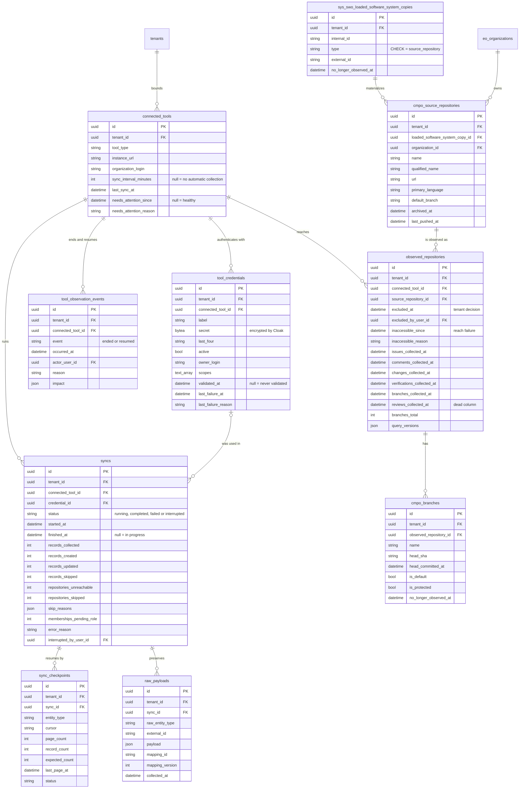

<!-- DERIVED from the migrations in priv/repo/migrations/ that create `connected_tools`,
     `tool_credentials`, `tool_observation_events`, `syncs`, `sync_checkpoints`,
     `raw_payloads`, `sys_swo_loaded_software_system_copies`, `cmpo_source_repositories`,
     `observed_repositories` and `cmpo_branches`, compared with
     `information_schema.columns`, `pg_constraint` and `pg_indexes` of the development
     database `the_band_dev`; and from the schemas
     lib/the_band/sources/*.ex, lib/the_band/ingestion/{sync,checkpoint}.ex,
     lib/the_band/raw_data.ex, lib/the_band/ontology/seon/cmpo/schemas/*.ex,
     lib/the_band/configuration/schemas/branch.ex — on 2026-09-12.
     Checked against the code on this date. Regenerate when the source changes. -->

# Database — ingestion and observation

**10 tables out of 63.** The connected tool, the credential, the collection run, the checkpoint, the
preserved raw payload, and the repository in its three layers. Slice declared in
[`mapa-das-tabelas.md`](mapa-das-tabelas.md#the-seven-erds-and-what-each-one-covers).

## The diagram



## The partial indexes

| Index | Form | States |
|---|---|---|
| `syncs_one_running_per_tool_index` | `UNIQUE (connected_tool_id) WHERE status = 'running'` | **one collection in progress per tool** — FR-018. The Oban worker's `unique` alone would not be enough: it expires in 300 s, and a long collection goes beyond that |
| `connected_tools_auto_sync_index` | `INDEX (sync_interval_minutes) WHERE sync_interval_minutes IS NOT NULL` | not an invariant — it is the question `Jobs.ScheduleDueSyncs` asks every 5 min, served without a scan |

## The `CHECK`s

| Constraint | Rule |
|---|---|
| `syncs_status_check` | `running`, `completed`, `failed` or `interrupted` — four, and nothing else |
| `observed_repositories_exclusion_has_author` | `excluded_at` null, **or** `excluded_by_user_id` present |
| `tool_observation_events_event_check` | `ended` or `resumed` |
| `sys_swo_copies_type_check` | `type = 'source_repository'` — the loaded copy is always a repository, today |

**There is no `CHECK` requiring an author for `inaccessible_since`**, and that is consistent: exclusion is
a **person's decision** and so it has an author; inaccessibility is a **fact observed** by the credential
and has no human author. Both prevent collection, and the model distinguishes them.

## The FKs and what happens on delete

| From | To | On delete |
|---|---|---|
| `tool_credentials.connected_tool_id` | `connected_tools` | `CASCADE` |
| `syncs.connected_tool_id` | `connected_tools` | `CASCADE` |
| `syncs.credential_id` | `tool_credentials` | **`SET NULL`** — the run stays in history without the credential |
| `syncs.interrupted_by_user_id` | `users` | `SET NULL` |
| `sync_checkpoints.sync_id` | `syncs` | `CASCADE` |
| `raw_payloads.sync_id` | `syncs` | `CASCADE` |
| `observed_repositories.connected_tool_id` | `connected_tools` | `CASCADE` |
| `observed_repositories.source_repository_id` | `cmpo_source_repositories` | `CASCADE` |
| `observed_repositories.excluded_by_user_id` | `users` | `SET NULL` |
| `cmpo_source_repositories.loaded_software_system_copy_id` | `sys_swo_...copies` | `CASCADE` |
| `cmpo_source_repositories.organization_id` | `eo_organizations` | **`RESTRICT`** |
| `cmpo_branches.observed_repository_id` | `observed_repositories` | `CASCADE` |
| `cmpo_branches.tenant_id` | `tenants` | **`CASCADE`** — exception, see below |
| other `.tenant_id` | `tenants` | `RESTRICT` |

**`cmpo_branches.tenant_id` is `CASCADE` while the other nine are `RESTRICT`.** I did not find the
written reason for the difference in the code. Two readings: either it was a decision (a branch is derived
from the repository and goes with it), or it is an inconsistency of a later migration. Take it to whoever
maintains ingestion — it is not this document's choice.

## The longest cascade in the database

```
tenants  ×  connected_tools  →  observed_repositories  →  cmpo_branches
                             →  syncs  →  sync_checkpoints
                                      →  raw_payloads
```

Deleting a `connected_tools` takes along credentials, events, runs, checkpoints, raw payloads, observed
repositories and branches. **Deleting a `tenants` takes nothing — it is refused** by the `RESTRICT` on the
first FK. The asymmetry is the rule: the tool is operational and disposable; the tenant is the root and
only leaves after everything it bounds.

## What the diagram does not show

- `inserted_at` / `updated_at`; `tool_observation_events` uses `timestamps(updated_at: false)`.
- `source_system`, `source_instance`, `external_id`, `collected_at`, `last_observed_at` in the
  collected tables — the Application Reference (FR-012). `cmpo_source_repositories` and
  `sys_swo_...copies` have them; `connected_tools`, `syncs` and `sync_checkpoints` do not, because they are
  platform and not observed data.
- `record_version` and `internal_id` in `sys_swo_...copies`.
- `cmpo_branches.raw_payload` and `cmpo_branches.external_created_at`.
- The **non-partial** indexes — there are dozens, and none carries an invariant.
- `Ingestion.Cota`, `Ingestion.Janela` and `Ingestion.QueryVersion` **have no table**: the quota lives in
  a process (ADR 0007), the window is a function, and the query version writes to
  `observed_repositories.query_versions`.

## What the data says today

Development database, 2026-09-12:

| Fact | Value |
|---|---|
| connected tools / credentials | 1 / 1 |
| collection runs | 9 |
| checkpoints | 103 |
| preserved raw payloads | **16 820** |
| repositories, in the three layers | **126 / 126 / 126** — no divergence |
| branches | 755 |
| observation events (`ended`/`resumed`) | 0 |

The three layers of the repository having exactly 126 rows each is what is expected when collection is
consistent; **the day they diverge, the difference is the finding**, and this number is the baseline for
noticing it.

## Divergence

**`observed_repositories.reviews_collected_at`** is in the ERD with the note *dead column*, and not in the
Ecto schema. Details and follow-up in
[`classes/ingestao-e-observacao.md`](../classes/ingestao-e-observacao.md#divergences-found).
