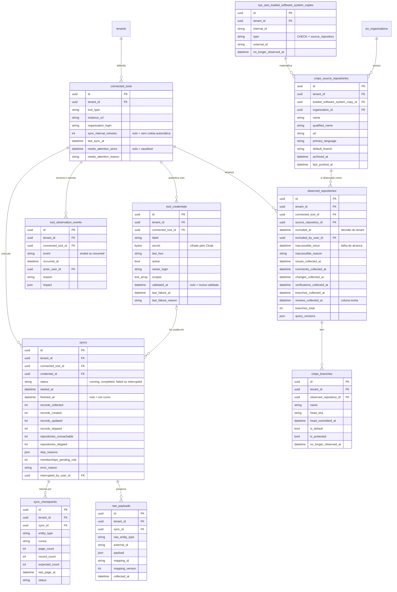

<!-- DERIVADO das migrações de priv/repo/migrations/ que criam `connected_tools`,
     `tool_credentials`, `tool_observation_events`, `syncs`, `sync_checkpoints`,
     `raw_payloads`, `sys_swo_loaded_software_system_copies`, `cmpo_source_repositories`,
     `observed_repositories` e `cmpo_branches`, confrontadas com
     `information_schema.columns`, `pg_constraint` e `pg_indexes` do banco de
     desenvolvimento `the_band_dev`; e dos schemas
     lib/the_band/sources/*.ex, lib/the_band/ingestion/{sync,checkpoint}.ex,
     lib/the_band/raw_data.ex, lib/the_band/ontology/seon/cmpo/schemas/*.ex,
     lib/the_band/configuration/schemas/branch.ex — em 2026-09-12.
     Conferido contra o código nesta data. Regenerar ao mudar a fonte. -->

# Banco — ingestão e observação

**10 tabelas de 63.** A ferramenta conectada, a credencial, a execução da coleta, o checkpoint,
o cru preservado, e o repositório nas suas três camadas. Recorte declarado em
[`mapa-das-tabelas.md`](mapa-das-tabelas.md#os-seis-erds-e-o-que-cada-um-cobre).

## O diagrama



## Os índices parciais

| Índice | Forma | Afirma |
|---|---|---|
| `syncs_one_running_per_tool_index` | `UNIQUE (connected_tool_id) WHERE status = 'running'` | **uma coleta em curso por ferramenta** — FR-018. O `unique` do worker Oban sozinho não bastaria: ele expira em 300 s, e uma coleta longa passa disso |
| `connected_tools_auto_sync_index` | `INDEX (sync_interval_minutes) WHERE sync_interval_minutes IS NOT NULL` | não é invariante — é a pergunta que `Jobs.ScheduleDueSyncs` faz a cada 5 min, servida sem varredura |

## Os `CHECK`

| Constraint | Regra |
|---|---|
| `syncs_status_check` | `running`, `completed`, `failed` ou `interrupted` — quatro, e nada mais |
| `observed_repositories_exclusion_has_author` | `excluded_at` nulo, **ou** `excluded_by_user_id` presente |
| `tool_observation_events_event_check` | `ended` ou `resumed` |
| `sys_swo_copies_type_check` | `type = 'source_repository'` — a cópia carregada é sempre repositório, hoje |

**Não há `CHECK` que exija autor para `inaccessible_since`**, e é coerente: exclusão é
**decisão de pessoa** e por isso tem autor; inacessibilidade é **fato observado** pela
credencial e não tem autor humano. As duas impedem a coleta, e o modelo as distingue.

## As FKs e o que acontece ao apagar

| De | Para | Ao apagar |
|---|---|---|
| `tool_credentials.connected_tool_id` | `connected_tools` | `CASCADE` |
| `syncs.connected_tool_id` | `connected_tools` | `CASCADE` |
| `syncs.credential_id` | `tool_credentials` | **`SET NULL`** — a execução fica no histórico sem a credencial |
| `syncs.interrupted_by_user_id` | `users` | `SET NULL` |
| `sync_checkpoints.sync_id` | `syncs` | `CASCADE` |
| `raw_payloads.sync_id` | `syncs` | `CASCADE` |
| `observed_repositories.connected_tool_id` | `connected_tools` | `CASCADE` |
| `observed_repositories.source_repository_id` | `cmpo_source_repositories` | `CASCADE` |
| `observed_repositories.excluded_by_user_id` | `users` | `SET NULL` |
| `cmpo_source_repositories.loaded_software_system_copy_id` | `sys_swo_...copies` | `CASCADE` |
| `cmpo_source_repositories.organization_id` | `eo_organizations` | **`RESTRICT`** |
| `cmpo_branches.observed_repository_id` | `observed_repositories` | `CASCADE` |
| `cmpo_branches.tenant_id` | `tenants` | **`CASCADE`** — exceção, ver abaixo |
| demais `.tenant_id` | `tenants` | `RESTRICT` |

**`cmpo_branches.tenant_id` é `CASCADE` enquanto as outras nove são `RESTRICT`.** Não encontrei
no código a razão escrita da diferença. Duas leituras: ou foi decisão (branch é derivado do
repositório e some junto), ou é inconsistência de uma migração posterior. Levar a quem mantém
a ingestão — não é escolha deste documento.

## A cascata mais longa do banco

```
tenants  ×  connected_tools  →  observed_repositories  →  cmpo_branches
                             →  syncs  →  sync_checkpoints
                                      →  raw_payloads
```

Apagar um `connected_tools` leva junto credenciais, eventos, execuções, checkpoints, payloads
crus, repositórios observados e branches. **Apagar um `tenants` não leva nada — é recusado**
pelo `RESTRICT` na primeira FK. A assimetria é a regra: a ferramenta é operacional e
descartável; o tenant é raiz e só sai depois de tudo o que ele delimita.

## O que o diagrama não mostra

- `inserted_at` / `updated_at`; `tool_observation_events` usa `timestamps(updated_at: false)`.
- `source_system`, `source_instance`, `external_id`, `collected_at`, `last_observed_at` nas
  tabelas coletadas — a Application Reference (FR-012). `cmpo_source_repositories` e
  `sys_swo_...copies` os têm; `connected_tools`, `syncs` e `sync_checkpoints` não, porque são
  plataforma e não dado observado.
- `record_version` e `internal_id` em `sys_swo_...copies`.
- `cmpo_branches.raw_payload` e `cmpo_branches.external_created_at`.
- Os índices **não parciais** — há dezenas, e nenhum carrega invariante.
- `Ingestion.Cota`, `Ingestion.Janela` e `Ingestion.QueryVersion` **não têm tabela**: a cota
  vive em processo (ADR 0007), a janela é função, e a versão de consulta grava em
  `observed_repositories.query_versions`.

## O que o dado diz hoje

Banco de desenvolvimento, 2026-09-12:

| Fato | Valor |
|---|---|
| ferramentas conectadas / credenciais | 1 / 1 |
| execuções de coleta | 9 |
| checkpoints | 103 |
| payloads crus preservados | **16 820** |
| repositórios, nas três camadas | **126 / 126 / 126** — sem divergência |
| branches | 755 |
| eventos de observação (`ended`/`resumed`) | 0 |

As três camadas do repositório terem exatamente 126 linhas cada é o que se espera quando a
coleta está consistente; **um dia em que divergirem, a diferença é o achado**, e este número é
a linha de base para percebê-lo.

## Divergência

**`observed_repositories.reviews_collected_at`** está no ERD com a nota *coluna morta*, e não
no schema Ecto. Detalhe e encaminhamento em
[`classes/ingestao-e-observacao.md`](../classes/ingestao-e-observacao.md#divergências-encontradas).
