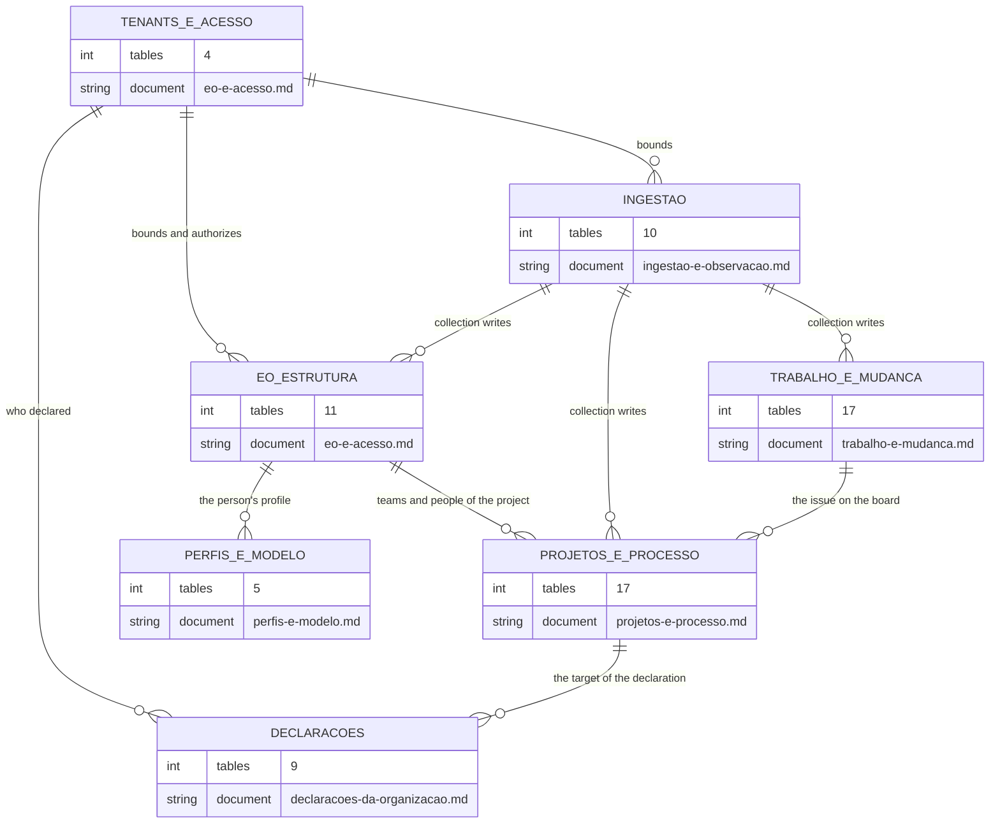

<!-- UPDATED on 2026-09-18: the 5 migrations of 2026-09-15/16 added 3 tables and
     3 columns; see "The three tables of 066" and "What changed after 2026-09-12". The
     update came from the reconstruction of the 93 migrations, WITHOUT access to the database — that is
     why no row count was re-measured.

     DERIVED from priv/repo/migrations/*.exs (88 applied migrations) compared with
     `information_schema.tables` and `information_schema.columns` of the development database
     `the_band_dev`, and with every `schema "..." do` in lib/**/*.ex (62 declarations),
     by automatic field-by-field comparison — on 2026-09-12.
     Row counts come from `pg_stat_user_tables.n_live_tup`, measured on the same date.
     Checked against the code on this date. Regenerate when the source changes. -->

# Database — the map of the tables

**Before any diagram, the census.** An `erDiagram` with 66 boxes is not a model; it is a poster. This
page exists so that each slice is **declared**, and so that no table disappears for not having fit.

## The total, and the slicing

| | On 2026-09-12 | **On 2026-09-18** |
|---|---:|---:|
| tables in the database | 66 | **69** |
| infrastructure — `oban_jobs`, `oban_peers`, `schema_migrations` | 3 | 3 |
| **domain** | **63** | **66** |
| with an Ecto schema declared in `lib/` | 62 | **65** |
| **without** an Ecto schema | 1 — `eo_organizational_units` | 1 — the same |
| applied migrations | 88 | **93** |

> The 2026-09-12 column was measured in the development database. The 2026-09-18 one was
> **reconstructed from the migrations**, without access to the database: it is a count of structure, not
> of rows.

**Criterion for slicing the ERDs**: one diagram per **write context** — the set of tables that the same
command or the same collection stage writes together. Not by ontology (EO and CMPO appear in the same
ingestion diagram), nor by size.

The reason: whoever reads an ERD wants to know *what changes together in a transaction*. Grouping by
ontology would separate `cmpo_source_repositories` from `observed_repositories`, which collection writes
in the same pass — and the diagram would lose exactly the information it was consulted for.

## The seven ERDs, and what each one covers

| Document | Tables | Rows in dev (2026-09-12) |
|---|---:|---:|
| [`eo-e-acesso.md`](eo-e-acesso.md) | 14 | 282 |
| [`ingestao-e-observacao.md`](ingestao-e-observacao.md) | 10 | 18 067 |
| [`trabalho-e-mudanca.md`](trabalho-e-mudanca.md) | 17 | 145 903 |
| [`projetos-e-processo.md`](projetos-e-processo.md) | 17 | 56 769 |
| [`perfis-e-modelo.md`](perfis-e-modelo.md) | 5 | 0 |
| [`declaracoes-da-organizacao.md`](declaracoes-da-organizacao.md) | 9 | not re-measured |
| **sum of the column** | **72** | — |

The sum comes to **72** and covers **65 distinct tables**. The **seven** of difference are a **declared
overlap**:

- `eo_person_profiles`, in `eo-e-acesso` **and** `perfis-e-modelo` — 1;
- the **six** declaration tables older than 066, in `declaracoes-da-organizacao` **and** in the ERD of
  the context that writes them (`spo_activity_start_criteria`,
  `spo_activity_deadline_criteria` and `smpo_iteration_field_roles` in `projetos-e-processo`;
  `eo_role_visibility_grants`, `eo_role_structure_management_grants` and `access_scope_grants`
  in `eo-e-acesso`) — 6.

The count closes: **65 covered + 1 without an ERD = 66 domain tables.**

The first six ERDs group by **write context**; the seventh groups by **shape**, and exists because the
three tables of 066 did not fit in any of the others without breaking the criterion.

The 66th domain table, `eo_organizational_units`, **is not in any ERD**, and the reason is
[below](#the-table-no-erd-draws).

## The high-level map

Before the seven ERDs, the drawing that links the groups. Each box is a document; the arrow is *"the
source group references the target group"*.

**The `DECLARACOES` group crosses the others**: of its 9 tables, 6 also appear in
`projetos-e-processo` or `eo-e-acesso`, by write context. It is said on both sides.

## The three tables of 066

They came in on **2026-09-15**, after the previous check, and were not in any ERD until
2026-09-18. Columns counted in the migration that creates them.

| Table | col | ERD | Migration |
|---|---:|---|---|
| `spo_item_phase_declarations` | 13 | declaracoes-da-organizacao | `20260915120000` |
| `spo_event_concept_declarations` | 10 | declaracoes-da-organizacao | `20260915180000` |
| `spo_activity_end_criteria` | 11 | declaracoes-da-organizacao | `20260915200000` |

## What changed after 2026-09-12

The five migrations after the previous check, and the effect of each on the schema:

| Migration | Effect |
|---|---|
| `20260915120000_declaracao_de_fase_por_coluna` | **+1 table** (`spo_item_phase_declarations`) |
| `20260915180000_declaracao_de_conceito_por_evento` | **+1 table** (`spo_event_concept_declarations`) |
| `20260915200000_criterio_de_fim` | **+1 table** (`spo_activity_end_criteria`) |
| `20260915220000_identidade_da_atividade_v2` | **no schema change** — recomputes the `internal_id` of every row of `spo_performed_project_activities` |
| `20260916140000_o_quadro_e_a_coluna_na_atividade` | **+3 columns** in `spo_performed_project_activities`: `board_id`, `board_external_id`, `status_name` |

**`spo_performed_project_activities` went from 18 to 21 columns**, and the census row below still says
18 — it is corrected here, and not there, because the census is the snapshot of 2026-09-12 and
rewriting it without re-measuring the database would mix two measurements. The distinction matters:
**a measurement in progress is not a final measurement.**

## The full census

`col` = columns. `rows` = `n_live_tup` on 2026-09-12, in the development database — it is an estimate
from the statistics collector, not `COUNT(*)`.

### Tenants and access — 4 tables

| Table | col | rows | ERD |
|---|---:|---:|---|
| `tenants` | 6 | 2 | eo-e-acesso |
| `users` | 23 | 3 | eo-e-acesso |
| `access_scope_grants` | 11 | 0 | eo-e-acesso |
| `account_disablements` | 13 | 0 | eo-e-acesso |

### EO — organizational structure — 11 tables

| Table | col | rows | ERD |
|---|---:|---:|---|
| `eo_organizations` | 13 | 1 | eo-e-acesso |
| `eo_organizational_roles` | 13 | 2 | eo-e-acesso |
| `eo_people` | 16 | 80 | eo-e-acesso |
| `eo_teams` | 18 | 10 | eo-e-acesso |
| `eo_team_memberships` | 18 | 90 | eo-e-acesso |
| `eo_team_membership_evidence` | 15 | 90 | eo-e-acesso |
| `eo_team_compositions` | 10 | 4 | eo-e-acesso |
| `eo_role_visibility_grants` | 10 | 0 | eo-e-acesso |
| `eo_role_structure_management_grants` | 10 | 0 | eo-e-acesso |
| `eo_person_profiles` | 17 | 0 | eo-e-acesso **and** perfis-e-modelo |
| `eo_organizational_units` | 8 | 0 | **none — see below** |

### Ingestion and observation — 10 tables

| Table | col | rows | ERD |
|---|---:|---:|---|
| `connected_tools` | 11 | 1 | ingestao-e-observacao |
| `tool_credentials` | 14 | 1 | ingestao-e-observacao |
| `tool_observation_events` | 9 | 0 | ingestao-e-observacao |
| `syncs` | 19 | 9 | ingestao-e-observacao |
| `sync_checkpoints` | 12 | 103 | ingestao-e-observacao |
| `raw_payloads` | 13 | 16 820 | ingestao-e-observacao |
| `sys_swo_loaded_software_system_copies` | 13 | 126 | ingestao-e-observacao |
| `cmpo_source_repositories` | 15 | 126 | ingestao-e-observacao |
| `observed_repositories` | 18 | 126 | ingestao-e-observacao |
| `cmpo_branches` | 17 | 755 | ingestao-e-observacao |

### Work and change — 17 tables

| Table | col | rows | ERD |
|---|---:|---:|---|
| `collected_issues` | 31 | 5 052 | trabalho-e-mudanca |
| `issue_promotions` | 18 | 5 039 | trabalho-e-mudanca |
| `issue_assignees` | 8 | 4 517 | trabalho-e-mudanca |
| `issue_labels` | 8 | 1 733 | trabalho-e-mudanca |
| `decomposition_links` | 9 | 1 953 | trabalho-e-mudanca |
| `refused_links` | 10 | 1 | trabalho-e-mudanca |
| `collected_issue_comments` | 17 | 415 | trabalho-e-mudanca |
| `collected_change_requests` | 34 | 5 534 | trabalho-e-mudanca |
| `change_request_issues` | 10 | 549 | trabalho-e-mudanca |
| `collected_commits` | 21 | 21 320 | trabalho-e-mudanca |
| `commit_files` | 13 | 30 120 | trabalho-e-mudanca |
| `commit_authors` | 13 | 22 725 | trabalho-e-mudanca |
| `collected_artifact_evaluations` | 18 | 4 429 | trabalho-e-mudanca |
| `collected_verifications` | 26 | 12 841 | trabalho-e-mudanca |
| `verification_components` | 16 | 29 675 | trabalho-e-mudanca |
| `issue_mapping_rules` | 17 | 0 | trabalho-e-mudanca |
| `unmapped_pattern_decisions` | 11 | 0 | trabalho-e-mudanca |

### Projects and process — 17 tables

| Table | col | rows | ERD |
|---|---:|---:|---|
| `spo_projects` | 12 | 1 | projetos-e-processo |
| `spo_project_organizations` | 10 | 0 | projetos-e-processo |
| `spo_project_teams` | 10 | 2 | projetos-e-processo |
| `spo_project_repositories` | 10 | 16 | projetos-e-processo |
| `spo_project_boards` | 10 | 0 | projetos-e-processo |
| `spo_activity_start_criteria` | 11 | 0 | projetos-e-processo |
| `spo_activity_deadline_criteria` | 12 | 0 | projetos-e-processo |
| `spo_intended_project_processes` | 15 | 34 | projetos-e-processo |
| `spo_performed_project_activities` | 18 | 30 560 | projetos-e-processo |
| `observed_projects` | 14 | 15 | projetos-e-processo |
| `project_items` | 13 | 4 148 | projetos-e-processo |
| `project_field_definitions` | 12 | 276 | projetos-e-processo |
| `item_field_values` | 10 | 18 716 | projetos-e-processo |
| `project_iterations` | 15 | 237 | projetos-e-processo |
| `smpo_iteration_field_roles` | 11 | 0 | projetos-e-processo |
| `sro_sprints` | 17 | 205 | projetos-e-processo |
| `sro_sprint_issues` | 9 | 2 559 | projetos-e-processo |

### Profiles and model — 5 tables

| Table | col | rows | ERD |
|---|---:|---:|---|
| `ai_provider_credentials` | 13 | 0 | perfis-e-modelo |
| `profile_runs` | 12 | 0 | perfis-e-modelo |
| `profile_run_entries` | 12 | 0 | perfis-e-modelo |
| `profile_automation_events` | 7 | 0 | perfis-e-modelo |
| `eo_person_profiles` | 17 | 0 | perfis-e-modelo **and** eo-e-acesso |

### Infrastructure — 3 tables, in no ERD

| Table | col | rows | Created by |
|---|---:|---:|---|
| `oban_jobs` | 18 | 1 010 | Oban migrations |
| `oban_peers` | 4 | 1 | Oban migrations |
| `schema_migrations` | 2 | 88 | Ecto |

**They stay out of the ERDs on purpose**: they are not a domain model, and drawing them alongside would
give the impression that the work queue is a business entity. What matters to know about them is in
the [architecture diagram](../arquitetura/visao-geral.md#3-how-data-comes-in).

## The table no ERD draws

**`eo_organizational_units`** — 8 columns, 0 rows, FKs to `tenants` and `eo_organizations`,
and **no Ecto schema**.

It is not an oversight. It was born from `scripts/derive_information_model.py --ontology eo`: the
concept `eo.organizational_unit` is declared in
`priv/knowledge_base/ontology/seon/eo/modules/organizational_structure.yaml:23`, and that is why it
became a table. It was called `eo_sectors` until 2026-08-10, and the migration that renamed it says the
rest:

> *"The table is empty — GitHub does not provide an organizational unit."*
> (*"A tabela está vazia — o GitHub não fornece unidade organizacional."*)
> `priv/repo/migrations/20260810100000_rename_sectors_to_organizational_units.exs:10-11`

It is the derived model working as it should: the structure exists because the ontology declares it, and
it is empty because no source feeds it. Drawing it in an ERD would suggest participation in a flow that
does not exist; **omitting it without saying so** would make the map lie. It stays here, named.

The two FKs still carry the old name — `eo_sectors_organization_id_fkey` and
`eo_sectors_tenant_id_fkey` —, because `rename table` does not rename constraints. Cosmetic, and
recorded for whoever finds it odd.

## The columns that exist and the Ecto schema does not know

Four, all found by automatic schema × columns comparison on 2026-09-12:

| Table | Column | Situation |
|---|---|---|
| `collected_change_requests` | `reviews_total` | **used**, by a schemaless query |
| `collected_change_requests` | `attended_issues_total` | **used**, by a schemaless query |
| `collected_change_requests` | `attended_issues_unresolved` | **used**, by a schemaless query |
| `observed_repositories` | `reviews_collected_at` | **nobody writes it** — dead column declared in `lib/the_band/ingestion/query_version.ex:47` |

Details and follow-up in
[`classes/trabalho-e-mudanca.md`](../classes/trabalho-e-mudanca.md#divergences-found) and
[`classes/ingestao-e-observacao.md`](../classes/ingestao-e-observacao.md#divergences-found).

**No other divergence** between the 62 `schema "..."` declarations and the database columns. The three
apparent ones — `eo_person_profiles`, `issue_promotions`, `tool_observation_events` without
`updated_at` — are not: all three use `timestamps(updated_at: false)` on purpose, because they record an
**occurrence**, and an occurrence is not updated.

## The tenant, in the database

**65 of the 66 domain tables have `tenant_id`.** The only one without it is `tenants`, which is the root.
*(Re-measured on 2026-09-18 over the 93 migrations; it was 62 of 63 on 2026-09-12, and the three new
tables of 066 bring the column.)*

This is not a naming convention: it is principle V of the constitution with a shape in the schema.
A new domain table without `tenant_id` is a security defect, and the map would expose it here.

**But two of them do not declare the FK.** `access_scope_grants` and `account_disablements` have
`tenant_id` as a **raw** `:binary_id`, without `references(:tenants, ...)` — the other 63 declare it.
Both are access tables, and no migration explains the choice. The finding, with the two readings and
whom to take it to, is in
[`declaracoes-da-organizacao.md`](declaracoes-da-organizacao.md#finding-1--two-tables-with-tenant_id-without-fk).

The FKs to `tenants` are almost all `ON DELETE RESTRICT`. The three exceptions —
`cmpo_branches`, `collected_artifact_evaluations` and the children that cascade through the parent —
use `CASCADE`, and are in the ERDs of each context.

## Suggested reading order

1. this map — to know the size of what you are looking at;
2. the [ERD of the context](.) of interest;
3. the [class diagram](../classes/mapa-dos-schemas.md) of the same context, for the *null that means something*;
4. the [state machine](../estados/mapa-dos-ciclos-de-vida.md), when one exists for the entity.
