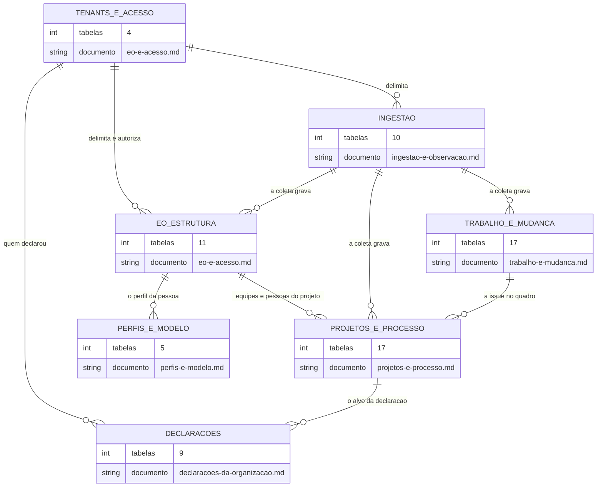

<!-- ATUALIZADO em 2026-09-18: as 5 migrações de 2026-09-15/16 acrescentaram 3 tabelas e
     3 colunas; ver "As três tabelas da 066" e "O que mudou depois de 2026-09-12". A
     atualização saiu da reconstrução das 93 migrações, SEM acesso ao banco — por isso
     nenhuma contagem de linhas foi remedida.

     DERIVADO de priv/repo/migrations/*.exs (88 migrações aplicadas) confrontadas com
     `information_schema.tables` e `information_schema.columns` do banco de desenvolvimento
     `the_band_dev`, e com todo `schema "..." do` de lib/**/*.ex (62 declarações),
     por comparação automática campo a campo — em 2026-09-12.
     As contagens de linha vêm de `pg_stat_user_tables.n_live_tup`, medidas na mesma data.
     Conferido contra o código nesta data. Regenerar ao mudar a fonte. -->

# Banco — o mapa das tabelas

**Antes de qualquer diagrama, o censo.** Um `erDiagram` com 66 caixas não é um modelo; é um
pôster. Esta página existe para que cada recorte seja **declarado**, e para que nenhuma tabela
desapareça por não ter cabido.

## O total, e o recorte

| | Em 2026-09-12 | **Em 2026-09-18** |
|---|---:|---:|
| tabelas no banco | 66 | **69** |
| de infraestrutura — `oban_jobs`, `oban_peers`, `schema_migrations` | 3 | 3 |
| **de domínio** | **63** | **66** |
| com schema Ecto declarado em `lib/` | 62 | **65** |
| **sem** schema Ecto | 1 — `eo_organizational_units` | 1 — a mesma |
| migrações aplicadas | 88 | **93** |

> A coluna de 2026-09-12 foi medida no banco de desenvolvimento. A de 2026-09-18 foi
> **reconstruída das migrações**, sem acesso ao banco: é contagem de estrutura, e não de linhas.

**Critério do recorte dos ERDs**: um diagrama por **contexto de escrita** — o conjunto de
tabelas que um mesmo comando ou uma mesma etapa da coleta escreve junto. Não por ontologia
(a EO e a CMPO aparecem no mesmo diagrama de ingestão), nem por tamanho.

A razão: quem lê um ERD quer saber *o que muda junto numa transação*. Agrupar por ontologia
separaria `cmpo_source_repositories` de `observed_repositories`, que a coleta escreve na mesma
passada — e o diagrama perderia exatamente a informação pela qual foi consultado.

## Os sete ERDs, e o que cada um cobre

| Documento | Tabelas | Linhas no dev (2026-09-12) |
|---|---:|---:|
| [`eo-e-acesso.md`](eo-e-acesso.md) | 14 | 282 |
| [`ingestao-e-observacao.md`](ingestao-e-observacao.md) | 10 | 18 067 |
| [`trabalho-e-mudanca.md`](trabalho-e-mudanca.md) | 17 | 145 903 |
| [`projetos-e-processo.md`](projetos-e-processo.md) | 17 | 56 769 |
| [`perfis-e-modelo.md`](perfis-e-modelo.md) | 5 | 0 |
| [`declaracoes-da-organizacao.md`](declaracoes-da-organizacao.md) | 9 | não remedido |
| **soma das colunas** | **72** | — |

A soma dá **72** e cobre **65 tabelas distintas**. Os **sete** de diferença são **overlap
declarado**:

- `eo_person_profiles`, em `eo-e-acesso` **e** `perfis-e-modelo` — 1;
- as **seis** tabelas de declaração anteriores à 066, em `declaracoes-da-organizacao` **e** no
  ERD do contexto que as escreve (`spo_activity_start_criteria`,
  `spo_activity_deadline_criteria` e `smpo_iteration_field_roles` em `projetos-e-processo`;
  `eo_role_visibility_grants`, `eo_role_structure_management_grants` e `access_scope_grants`
  em `eo-e-acesso`) — 6.

A conta fecha: **65 cobertas + 1 sem ERD = 66 tabelas de domínio.**

Os seis primeiros ERDs agrupam por **contexto de escrita**; o sétimo agrupa por **forma**, e
existe porque as três tabelas da 066 não cabiam em nenhum dos outros sem quebrar o critério.

A 66ª tabela de domínio, `eo_organizational_units`, **não está em ERD nenhum**, e a razão está
[abaixo](#a-tabela-que-nenhum-erd-desenha).

## O mapa de alto nível

Antes dos sete ERDs, o desenho que liga os grupos. Cada caixa é um documento; a seta é *"o
grupo de origem referencia o de destino"*.

**O grupo `DECLARACOES` atravessa os outros**: das suas 9 tabelas, 6 também aparecem em
`projetos-e-processo` ou `eo-e-acesso`, pelo contexto de escrita. Está dito nos dois lados.

## As três tabelas da 066

Entraram em **2026-09-15**, depois da conferência anterior, e não estavam em ERD nenhum até
2026-09-18. Colunas contadas na migração que as cria.

| Tabela | col | ERD | Migração |
|---|---:|---|---|
| `spo_item_phase_declarations` | 13 | declaracoes-da-organizacao | `20260915120000` |
| `spo_event_concept_declarations` | 10 | declaracoes-da-organizacao | `20260915180000` |
| `spo_activity_end_criteria` | 11 | declaracoes-da-organizacao | `20260915200000` |

## O que mudou depois de 2026-09-12

As cinco migrações posteriores à conferência anterior, e o efeito de cada uma no esquema:

| Migração | Efeito |
|---|---|
| `20260915120000_declaracao_de_fase_por_coluna` | **+1 tabela** (`spo_item_phase_declarations`) |
| `20260915180000_declaracao_de_conceito_por_evento` | **+1 tabela** (`spo_event_concept_declarations`) |
| `20260915200000_criterio_de_fim` | **+1 tabela** (`spo_activity_end_criteria`) |
| `20260915220000_identidade_da_atividade_v2` | **nenhuma mudança de esquema** — recalcula `internal_id` de toda linha de `spo_performed_project_activities` |
| `20260916140000_o_quadro_e_a_coluna_na_atividade` | **+3 colunas** em `spo_performed_project_activities`: `board_id`, `board_external_id`, `status_name` |

**`spo_performed_project_activities` passou de 18 para 21 colunas**, e a linha do censo abaixo
ainda diz 18 — está corrigida aqui, e não lá, porque o censo é a foto de 2026-09-12 e
reescrevê-lo sem remedir o banco misturaria duas medidas. A distinção importa: **medida em
curso não é medida final.**

## O censo completo

`col` = colunas. `linhas` = `n_live_tup` em 2026-09-12, no banco de desenvolvimento — é
estimativa do coletor de estatísticas, não `COUNT(*)`.

### Tenants e acesso — 4 tabelas

| Tabela | col | linhas | ERD |
|---|---:|---:|---|
| `tenants` | 6 | 2 | eo-e-acesso |
| `users` | 23 | 3 | eo-e-acesso |
| `access_scope_grants` | 11 | 0 | eo-e-acesso |
| `account_disablements` | 13 | 0 | eo-e-acesso |

### EO — estrutura organizacional — 11 tabelas

| Tabela | col | linhas | ERD |
|---|---:|---:|---|
| `eo_organizations` | 13 | 1 | eo-e-acesso |
| `eo_organizational_roles` | 13 | 2 | eo-e-acesso |
| `eo_people` | 16 | 80 | eo-e-acesso |
| `eo_teams` | 18 | 10 | eo-e-acesso |
| `eo_team_memberships` | 18 | 90 | eo-e-acesso |
| `eo_team_membership_evidence` | 15 | 90 | eo-e-acesso |
| `eo_team_compositions` | 10 | 4 | eo-e-acesso |
| `eo_role_visibility_grants` | 10 | 0 | eo-e-acesso |
| `eo_role_structure_management_grants` | 10 | 0 | eo-e-acesso |
| `eo_person_profiles` | 17 | 0 | eo-e-acesso **e** perfis-e-modelo |
| `eo_organizational_units` | 8 | 0 | **nenhum — ver abaixo** |

### Ingestão e observação — 10 tabelas

| Tabela | col | linhas | ERD |
|---|---:|---:|---|
| `connected_tools` | 11 | 1 | ingestao-e-observacao |
| `tool_credentials` | 14 | 1 | ingestao-e-observacao |
| `tool_observation_events` | 9 | 0 | ingestao-e-observacao |
| `syncs` | 19 | 9 | ingestao-e-observacao |
| `sync_checkpoints` | 12 | 103 | ingestao-e-observacao |
| `raw_payloads` | 13 | 16 820 | ingestao-e-observacao |
| `sys_swo_loaded_software_system_copies` | 13 | 126 | ingestao-e-observacao |
| `cmpo_source_repositories` | 15 | 126 | ingestao-e-observacao |
| `observed_repositories` | 18 | 126 | ingestao-e-observacao |
| `cmpo_branches` | 17 | 755 | ingestao-e-observacao |

### Trabalho e mudança — 17 tabelas

| Tabela | col | linhas | ERD |
|---|---:|---:|---|
| `collected_issues` | 31 | 5 052 | trabalho-e-mudanca |
| `issue_promotions` | 18 | 5 039 | trabalho-e-mudanca |
| `issue_assignees` | 8 | 4 517 | trabalho-e-mudanca |
| `issue_labels` | 8 | 1 733 | trabalho-e-mudanca |
| `decomposition_links` | 9 | 1 953 | trabalho-e-mudanca |
| `refused_links` | 10 | 1 | trabalho-e-mudanca |
| `collected_issue_comments` | 17 | 415 | trabalho-e-mudanca |
| `collected_change_requests` | 34 | 5 534 | trabalho-e-mudanca |
| `change_request_issues` | 10 | 549 | trabalho-e-mudanca |
| `collected_commits` | 21 | 21 320 | trabalho-e-mudanca |
| `commit_files` | 13 | 30 120 | trabalho-e-mudanca |
| `commit_authors` | 13 | 22 725 | trabalho-e-mudanca |
| `collected_artifact_evaluations` | 18 | 4 429 | trabalho-e-mudanca |
| `collected_verifications` | 26 | 12 841 | trabalho-e-mudanca |
| `verification_components` | 16 | 29 675 | trabalho-e-mudanca |
| `issue_mapping_rules` | 17 | 0 | trabalho-e-mudanca |
| `unmapped_pattern_decisions` | 11 | 0 | trabalho-e-mudanca |

### Projetos e processo — 17 tabelas

| Tabela | col | linhas | ERD |
|---|---:|---:|---|
| `spo_projects` | 12 | 1 | projetos-e-processo |
| `spo_project_organizations` | 10 | 0 | projetos-e-processo |
| `spo_project_teams` | 10 | 2 | projetos-e-processo |
| `spo_project_repositories` | 10 | 16 | projetos-e-processo |
| `spo_project_boards` | 10 | 0 | projetos-e-processo |
| `spo_activity_start_criteria` | 11 | 0 | projetos-e-processo |
| `spo_activity_deadline_criteria` | 12 | 0 | projetos-e-processo |
| `spo_intended_project_processes` | 15 | 34 | projetos-e-processo |
| `spo_performed_project_activities` | 18 | 30 560 | projetos-e-processo |
| `observed_projects` | 14 | 15 | projetos-e-processo |
| `project_items` | 13 | 4 148 | projetos-e-processo |
| `project_field_definitions` | 12 | 276 | projetos-e-processo |
| `item_field_values` | 10 | 18 716 | projetos-e-processo |
| `project_iterations` | 15 | 237 | projetos-e-processo |
| `smpo_iteration_field_roles` | 11 | 0 | projetos-e-processo |
| `sro_sprints` | 17 | 205 | projetos-e-processo |
| `sro_sprint_issues` | 9 | 2 559 | projetos-e-processo |

### Perfis e modelo — 5 tabelas

| Tabela | col | linhas | ERD |
|---|---:|---:|---|
| `ai_provider_credentials` | 13 | 0 | perfis-e-modelo |
| `profile_runs` | 12 | 0 | perfis-e-modelo |
| `profile_run_entries` | 12 | 0 | perfis-e-modelo |
| `profile_automation_events` | 7 | 0 | perfis-e-modelo |
| `eo_person_profiles` | 17 | 0 | perfis-e-modelo **e** eo-e-acesso |

### Infraestrutura — 3 tabelas, em nenhum ERD

| Tabela | col | linhas | Quem cria |
|---|---:|---:|---|
| `oban_jobs` | 18 | 1 010 | migrações do Oban |
| `oban_peers` | 4 | 1 | migrações do Oban |
| `schema_migrations` | 2 | 88 | Ecto |

**Ficam de fora dos ERDs de propósito**: não são modelo de domínio, e desenhá-las junto daria a
impressão de que a fila de trabalho é uma entidade do negócio. O que importa saber delas está
no [diagrama de arquitetura](../arquitetura/visao-geral.md#3-como-o-dado-entra).

## A tabela que nenhum ERD desenha

**`eo_organizational_units`** — 8 colunas, 0 linhas, FKs para `tenants` e `eo_organizations`,
e **nenhum schema Ecto**.

Não é esquecimento. Ela nasceu de `scripts/derive_information_model.py --ontology eo`: o
conceito `eo.organizational_unit` está declarado em
`priv/knowledge_base/ontology/seon/eo/modules/organizational_structure.yaml:23`, e por isso
virou tabela. Chamou-se `eo_sectors` até 2026-08-10, e a migração que a renomeou diz o resto:

> *"A tabela está vazia — o GitHub não fornece unidade organizacional."*
> `priv/repo/migrations/20260810100000_rename_sectors_to_organizational_units.exs:10-11`

É o modelo derivado funcionando como deve: a estrutura existe porque a ontologia a declara, e
está vazia porque nenhuma origem a alimenta. Desenhá-la num ERD sugeriria participação num
fluxo que não existe; **omiti-la sem dizer** faria o mapa mentir. Fica aqui, nomeada.

As duas FKs ainda carregam o nome antigo — `eo_sectors_organization_id_fkey` e
`eo_sectors_tenant_id_fkey` —, porque `rename table` não renomeia constraint. Cosmético, e
registrado para quem estranhar.

## As colunas que existem e o schema Ecto não conhece

Quatro, todas achadas por comparação automática schema × colunas em 2026-09-12:

| Tabela | Coluna | Situação |
|---|---|---|
| `collected_change_requests` | `reviews_total` | **usada**, por consulta sem schema |
| `collected_change_requests` | `attended_issues_total` | **usada**, por consulta sem schema |
| `collected_change_requests` | `attended_issues_unresolved` | **usada**, por consulta sem schema |
| `observed_repositories` | `reviews_collected_at` | **ninguém escreve** — coluna morta declarada em `lib/the_band/ingestion/query_version.ex:47` |

Detalhe e encaminhamento em
[`classes/trabalho-e-mudanca.md`](../classes/trabalho-e-mudanca.md#divergências-encontradas) e
[`classes/ingestao-e-observacao.md`](../classes/ingestao-e-observacao.md#divergências-encontradas).

**Nenhuma outra divergência** entre as 62 declarações `schema "..."` e as colunas do banco. As
três aparentes — `eo_person_profiles`, `issue_promotions`, `tool_observation_events` sem
`updated_at` — não são: as três usam `timestamps(updated_at: false)` de propósito, porque
registram **ocorrência**, e uma ocorrência não é atualizada.

## O tenant, no banco

**65 das 66 tabelas de domínio têm `tenant_id`.** A única sem é `tenants`, que é a raiz.
*(Remedido em 2026-09-18 sobre as 93 migrações; era 62 de 63 em 2026-09-12, e as três tabelas
novas da 066 trazem a coluna.)*

Isto não é convenção de nomenclatura: é o princípio V da constituição com forma no esquema.
Uma tabela de domínio nova sem `tenant_id` é defeito de segurança, e o mapa a denunciaria aqui.

**Mas duas delas não declaram a FK.** `access_scope_grants` e `account_disablements` têm
`tenant_id` como `:binary_id` **cru**, sem `references(:tenants, ...)` — as outras 63 declaram.
As duas são tabelas de acesso, e nenhuma migração explica a escolha. O achado, com as duas
leituras e a quem levar, está em
[`declaracoes-da-organizacao.md`](declaracoes-da-organizacao.md#achado-1--duas-tabelas-com-tenant_id-sem-fk).

As FKs para `tenants` são quase todas `ON DELETE RESTRICT`. As três exceções —
`cmpo_branches`, `collected_artifact_evaluations` e as filhas que cascateiam pelo pai —
usam `CASCADE`, e estão nos ERDs de cada contexto.

## Ordem de leitura sugerida

1. este mapa — para saber o tamanho do que se está olhando;
2. o [ERD do contexto](.) que interessa;
3. o [diagrama de classes](../classes/) do mesmo contexto, para o *nulo que significa*;
4. a [máquina de estados](../estados/), quando existir para a entidade.
