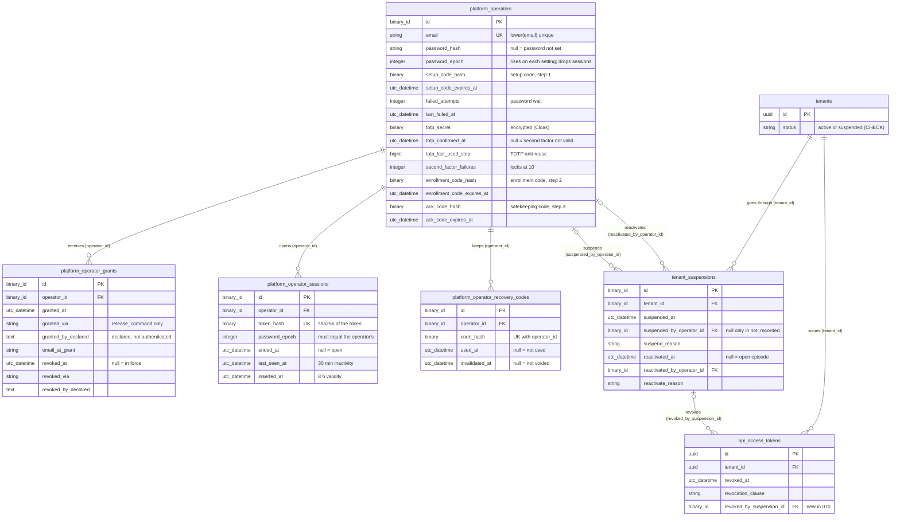

<!-- DERIVED from the migrations of spec 070 in priv/repo/migrations/:
     20261002120000_estado_da_organizacao_valido.exs:15-17,
     20261002130000_operador_da_plataforma.exs:22-165,
     20261002130100_segundo_fator_do_operador.exs:15-79,
     20261002140000_episodio_de_suspensao.exs:24-117,
     20261002140100_estado_tem_episodio.exs:32-71,
     20261002140200_revogacao_por_suspensao.exs:17-31;
     and, for the pre-feature columns that the new FKs touch,
     20260809120000_create_tenants_and_users.exs:14-23,
     20260918140000_tokens_de_api.exs:42-79,
     20260923120000_motivo_da_revogacao_do_token.exs:39-42.
     Schemas compared: lib/the_band/platform/{operator,grant,operator_session,recovery_code,suspension}.ex,
     lib/the_band/tenants/tenant.ex:22, lib/the_band/tenants/schemas/api_access_token.ex:64.
     NOT compared with the development database's pg_catalog: the reading is from the migrations only.
     Checked against the code on 2026-10-02, at commit 8cf0fcf of branch feature/1057-070-us1
     (the references to lib/the_band/platform/suspensions.ex are those of that commit).
     Regenerate when the source changes. -->

# Database — the platform operator and organization suspension (spec 070)

**Five new tables and one new column.** The operator, the grant of the role, the session, the recovery
codes and the suspension episode; and `api_access_tokens.revoked_by_suspension_id`, which links the token
to the episode that revoked it.

**The four operator tables have no `tenant_id`** — the operator stays outside any organization
(`20261002130000_operador_da_plataforma.exs:6-8`). It is a declared exception to AGENTS
§7.3, and it is the reason no domain path reaches it. `tenant_suspensions` has `tenant_id`, but it is a
`Platform` table, not a `Tenants` one.

## The diagram

Left out, because they do not decide behaviour: `inserted_at`/`updated_at` (except where the rule reads
them — `platform_operator_sessions.inserted_at` is the start of the 8 h validity,
`lib/the_band/platform/sessions.ex:85`), `name`, `label`, `last_four`, `public_id`, the free-text notes.
Of the `tenants` and `api_access_tokens` tables, which already existed, only the columns the new FKs and
`CHECK`s touch.

All the new FKs are `on_delete: :restrict`: `operador_da_plataforma.exs:48`, `:86`;
`segundo_fator_do_operador.exs:59`; `episodio_de_suspensao.exs:26`, `:30`, `:37`;
`revogacao_por_suspensao.exs:19`.

## Table → schema → origin

| Table | Schema | Created / altered in | Note |
|---|---|---|---|
| `platform_operators` | `TheBand.Platform.Operator` (`lib/the_band/platform/operator.ex:22-41`) | `operador_da_plataforma.exs:22-35`; second-factor columns in `segundo_fator_do_operador.exs:15-24` | no `tenant_id` |
| `platform_operator_grants` | `TheBand.Platform.Grant` (`grant.ex:19-31`) | `operador_da_plataforma.exs:45-61` | no `updated_at` (`:60`): append-only |
| `platform_operator_sessions` | `TheBand.Platform.OperatorSession` (`operator_session.ex:17-25`) | `operador_da_plataforma.exs:83-95` | the only `DELETE` is the 90-day retention (`lib/the_band/platform/sessions.ex:203-215`), called by the daily job since T058 (`lib/the_band/jobs/apaga_sessoes_antigas.ex`, commit 13e8834) — see [the credential](../estados/credencial-do-operador.md#what-did-not-fit-and-gaps) |
| `platform_operator_recovery_codes` | `TheBand.Platform.RecoveryCode` (`recovery_code.ex:19-26`) | `segundo_fator_do_operador.exs:56-67` | at 8cf0fcf nothing deletes; T058, not committed on this date, adds the 90-day retention of the used or voided ones |
| `tenant_suspensions` | `TheBand.Platform.Suspension` (`suspension.ex:22-33`) | `episodio_de_suspensao.exs:24-43` | `tenant_id` is a raw field, without `belongs_to :tenant` (`suspension.ex:12`, `:23`) |
| `api_access_tokens.revoked_by_suspension_id` | `TheBand.Tenants.Schemas.ApiAccessToken` (`lib/the_band/tenants/schemas/api_access_token.ex:64`) | `revogacao_por_suspensao.exs:17-20` | a `Tenants` migration, not a `Platform` one (`:6-7`) |
| `tenants.status` (the `CHECK` only) | `TheBand.Tenants.Tenant` (`tenant.ex:22`, `:41`, `:43`) | column in `create_tenants_and_users.exs:18`; `CHECK` in `estado_da_organizacao_valido.exs:15-17` | `:status` outside the `cast` (`tenant.ex:31-38`) |

## Unique and partial indexes — the ones that carry an invariant

| Index | Table | Definition | Invariant | Source |
|---|---|---|---|---|
| `platform_operators_email_index` | `platform_operators` | `UNIQUE (lower(email))` | one operator per e-mail, case-insensitive | `operador_da_plataforma.exs:37-39` |
| `platform_operator_grants_vigente_index` | `platform_operator_grants` | `UNIQUE (operator_id) WHERE revoked_at IS NULL` | **one grant in force per operator**; revoked ones accumulate | `operador_da_plataforma.exs:64-67` |
| (unnamed) | `platform_operator_sessions` | `UNIQUE (token_hash)` | one digest, one session | `operador_da_plataforma.exs:97` |
| (unnamed) | `platform_operator_recovery_codes` | `UNIQUE (operator_id, code_hash)` | the same code does not repeat for the same operator | `segundo_fator_do_operador.exs:69` |
| `platform_operator_recovery_codes_vigentes_index` | `platform_operator_recovery_codes` | `(operator_id) WHERE used_at IS NULL AND invalidated_at IS NULL` | **not unique**: it is a lookup index for the ones in force, not an invariant | `segundo_fator_do_operador.exs:71-74` |
| `tenant_suspensions_aberto_index` | `tenant_suspensions` | `UNIQUE (tenant_id) WHERE reactivated_at IS NULL` | **one open episode per organization**; it is what refuses the second concurrent suspension (`lib/the_band/platform/suspensions.ex:280-281`) | `episodio_de_suspensao.exs:46-49` |

Plain indexes, with no invariant: `platform_operator_sessions (operator_id)`, `(ended_at)`,
`(inserted_at)` (`operador_da_plataforma.exs:98-100`); `tenant_suspensions (tenant_id,
suspended_at)` (`episodio_de_suspensao.exs:51`).

## `CHECK`s — domain rule in the database

| Constraint | Table | Expression (summarized) | What it says | Source |
|---|---|---|---|---|
| `tenants_status_valido` | `tenants` | `status IN ('active','suspended')` | the state is no longer a free string | `estado_da_organizacao_valido.exs:15-17` |
| `platform_operators_codigo_de_definicao_em_par` | `platform_operators` | `(setup_code_hash IS NULL) = (setup_code_expires_at IS NULL)` | code and validity go together | `operador_da_plataforma.exs:41-43` |
| `platform_operators_codigo_de_cadastro_em_par` | `platform_operators` | likewise for `enrollment_code_*` | | `segundo_fator_do_operador.exs:26-28` |
| `platform_operators_codigo_de_guarda_em_par` | `platform_operators` | likewise for `ack_code_*` | | `segundo_fator_do_operador.exs:43-45` |
| `platform_operators_confirmado_tem_segredo` | `platform_operators` | `totp_confirmed_at IS NULL OR totp_secret IS NOT NULL` | there is no confirmed second factor without a secret | `segundo_fator_do_operador.exs:31-33` |
| `platform_operators_confirmado_tem_senha` | `platform_operators` | `totp_confirmed_at IS NULL OR password_hash IS NOT NULL` | nor without a password | `segundo_fator_do_operador.exs:35-37` |
| `platform_operators_falhas_nao_negativas` | `platform_operators` | `second_factor_failures >= 0` | | `segundo_fator_do_operador.exs:39-41` |
| `platform_operators_codigo_de_guarda_entre_os_passos` | `platform_operators` | `ack_code_hash IS NULL OR (totp_confirmed_at IS NULL AND totp_secret IS NOT NULL AND totp_last_used_step IS NOT NULL AND enrollment_code_hash IS NULL)` | **the safekeeping code only exists between steps 2 and 3** — it is the "pending safekeeping" state of the [credential machine](../estados/credencial-do-operador.md) written in the database | `segundo_fator_do_operador.exs:50-54` |
| `platform_operator_grants_via_comando` | `platform_operator_grants` | `granted_via = 'release_command'` | no screen grants | `operador_da_plataforma.exs:69-71` |
| `platform_operator_grants_revogacao_via_comando` | `platform_operator_grants` | `revoked_via IS NULL OR revoked_via = 'release_command'` | no screen revokes | `operador_da_plataforma.exs:73-75` |
| `platform_operator_grants_revogacao_inteira` | `platform_operator_grants` | `revoked_at`, `revoked_via`, `revoked_by_declared` null together | a half revocation does not get in | `operador_da_plataforma.exs:77-81` |
| `platform_operator_recovery_codes_um_fim` | `platform_operator_recovery_codes` | `used_at IS NULL OR invalidated_at IS NULL` | the code ends **used or voided**, never both | `segundo_fator_do_operador.exs:77-79` |
| `tenant_suspensions_autor_so_falta_no_nao_registrado` | `tenant_suspensions` | `(suspend_reason = 'not_recorded') = (suspended_by_operator_id IS NULL)` | no author **if and only if** the reason is `not_recorded` (the episode the migration writes) | `episodio_de_suspensao.exs:54-56` |
| `tenant_suspensions_reativacao_inteira` | `tenant_suspensions` | `reactivated_at`, `reactivated_by_operator_id`, `reactivate_reason` null together | the closing comes whole | `episodio_de_suspensao.exs:58-62` |
| `tenant_suspensions_nota_so_com_reativacao` | `tenant_suspensions` | `reactivate_note IS NULL OR reactivated_at IS NOT NULL` | | `episodio_de_suspensao.exs:64-66` |
| `api_access_tokens_suspensao_tem_clausula` | `api_access_tokens` | `revoked_by_suspension_id IS NULL OR revocation_clause = 'organizacao_suspensa'` | the two `CHECK`s together: the `organizacao_suspensa` clause exists **if and only if** there is an episode pointed to | `revogacao_por_suspensao.exs:22-25` |
| `api_access_tokens_clausula_tem_suspensao` | `api_access_tokens` | `revocation_clause IS DISTINCT FROM 'organizacao_suspensa' OR revoked_by_suspension_id IS NOT NULL` | | `revogacao_por_suspensao.exs:27-31` |

## Triggers — what no diagram shows

| Trigger | Table | When | What it refuses | Source |
|---|---|---|---|---|
| `platform_operator_grants_nao_apaga` / `_nao_trunca` | `platform_operator_grants` | `BEFORE DELETE` per row; `BEFORE TRUNCATE` per statement | deleting a grant | `operador_da_plataforma.exs:103-132` |
| `platform_operator_grants_so_revoga` | `platform_operator_grants` | `BEFORE UPDATE` | every `UPDATE` that is not revoking a grant in force; revoking again | `operador_da_plataforma.exs:136-165` |
| `tenant_suspensions_nao_apaga` / `_nao_trunca` | `tenant_suspensions` | likewise | deleting an episode | `episodio_de_suspensao.exs:68-88` |
| `tenant_suspensions_so_fecha` | `tenant_suspensions` | `BEFORE UPDATE` | rewriting the opening; reopening or reclosing a closed episode | `episodio_de_suspensao.exs:93-117` |
| `tenants_estado_tem_episodio` | `tenants` | `CONSTRAINT TRIGGER AFTER INSERT OR UPDATE OF status`, **`DEFERRABLE INITIALLY DEFERRED`** | at `COMMIT`: `suspended` without an open episode, or `active` with an open episode | `estado_tem_episodio.exs:61-65`, function at `:32-59` |
| `tenant_suspensions_estado_tem_episodio` | `tenant_suspensions` | `CONSTRAINT TRIGGER AFTER INSERT OR UPDATE OF reactivated_at`, deferred | the same check, fired from the episode side | `estado_tem_episodio.exs:67-71` |

**The deferred trigger is the first in the repository** (`estado_tem_episodio.exs:11-13`). It is deferred
because, in the legitimate transaction, `tenants.status` changes **before** the episode is written
(`lib/the_band/platform/suspensions.ex:136-137`), and only at `COMMIT` do the two need to agree.

**The triggers protect against code, not against whoever owns the database**: the owner of the tables can
disable them (`operador_da_plataforma.exs:16-17`; `estado_tem_episodio.exs:7-9`). Separating the database
roles is #1131.

## What did not fit, and findings

1. **Not compared with the database.** Unlike the other ERDs in this folder, this one was not checked
   against `pg_constraint`/`pg_indexes` of `the_band_dev`: a `mix gates` was in progress, and the reading
   is from the migrations only. Recheck when the database is free.
2. **`suspend_reason` and `reactivate_reason` have no vocabulary `CHECK`.**
   `episodio_de_suspensao.exs:32` and `:39` are free `:string`; the list comes from the rule
   `platform.tenant_suspension` (`priv/knowledge_base/rules/platform_tenant_suspension.yaml:47-103`)
   and only the changeset checks it (`lib/the_band/platform/suspensions.ex:202`, `:232`). It is
   deliberate — the vocabulary lives in the base, not in the database —, but it is the "state as a free
   string" antipattern of AGENTS §7.7 in the form of a reason. Take it to the Software Architect, who
   decides whether the list goes into the database. The only value the database knows is
   `not_recorded`, through the author `CHECK`.
3. **`api_access_tokens.revoked_by_suspension_id` has no index.** The FK is created without
   `create index` (`revogacao_por_suspensao.exs:17-20`). With `on_delete: :restrict` and the trigger that
   refuses `DELETE` on `tenant_suspensions`, the FK is not exercised by deletion; but the question "which
   tokens did this episode revoke" is a scan. Minor finding, for the Software Architect.
4. **Types: schema × migration.** `totp_last_used_step` is `bigint` in the migration
   (`segundo_fator_do_operador.exs:18`) and `:integer` in the schema (`operator.ex:34`); Ecto reads both as
   an Elixir integer, and nothing is lost. `granted_by_declared`, `revoked_by_declared`,
   `revoke_note`, `suspend_note`, `reactivate_note` are `text` in the migration and `:string` in the
   schema — the same case. `tenants.id` and `api_access_tokens.id` are `:uuid`, the new tables use
   `:binary_id`: in PostgreSQL both are `uuid`. No effective divergence.
5. **The census was not updated.** [`mapa-das-tabelas.md`](mapa-das-tabelas.md) does not yet count these
   five tables; it is left for the census regeneration.
