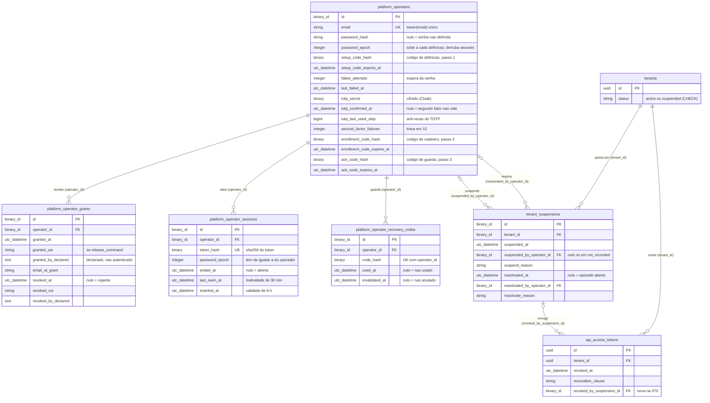

<!-- DERIVADO das migrações da spec 070 em priv/repo/migrations/:
     20261002120000_estado_da_organizacao_valido.exs:15-17,
     20261002130000_operador_da_plataforma.exs:22-165,
     20261002130100_segundo_fator_do_operador.exs:15-79,
     20261002140000_episodio_de_suspensao.exs:24-117,
     20261002140100_estado_tem_episodio.exs:32-71,
     20261002140200_revogacao_por_suspensao.exs:17-31;
     e, para as colunas de antes da feature que as FKs novas tocam,
     20260809120000_create_tenants_and_users.exs:14-23,
     20260918140000_tokens_de_api.exs:42-79,
     20260923120000_motivo_da_revogacao_do_token.exs:39-42.
     Schemas confrontados: lib/the_band/platform/{operator,grant,operator_session,recovery_code,suspension}.ex,
     lib/the_band/tenants/tenant.ex:22, lib/the_band/tenants/schemas/api_access_token.ex:64.
     NÃO confrontado com pg_catalog do banco de desenvolvimento: a leitura é só das migrações.
     Conferido contra o código em 2026-10-02, no commit 8cf0fcf da branch feature/1057-070-us1
     (as referências a lib/the_band/platform/suspensions.ex são as desse commit).
     Regenerar ao mudar a fonte. -->

# Banco — o operador da plataforma e a suspensão de organização (spec 070)

**Cinco tabelas novas e uma coluna nova.** O operador, a concessão do papel, a sessão, os
códigos de recuperação e o episódio de suspensão; e `api_access_tokens.revoked_by_suspension_id`,
que liga o token ao episódio que o revogou.

**As quatro tabelas do operador não têm `tenant_id`** — o operador fica fora de qualquer
organização (`20261002130000_operador_da_plataforma.exs:6-8`). É exceção declarada ao AGENTS
§7.3, e é a razão de nenhum caminho de domínio alcançá-lo. `tenant_suspensions` tem `tenant_id`,
mas é tabela da `Platform`, e não de `Tenants`.

## O diagrama

Ficaram fora, por não decidirem comportamento: `inserted_at`/`updated_at` (exceto onde a
regra os lê — `platform_operator_sessions.inserted_at` é o início da validade de 8 h,
`lib/the_band/platform/sessions.ex:85`), `name`, `label`, `last_four`, `public_id`, as notas
livres. Das tabelas `tenants` e `api_access_tokens`, que já existiam, só as colunas que as
FKs e os `CHECK`s novos tocam.

Todas as FKs novas são `on_delete: :restrict`: `operador_da_plataforma.exs:48`, `:86`;
`segundo_fator_do_operador.exs:59`; `episodio_de_suspensao.exs:26`, `:30`, `:37`;
`revogacao_por_suspensao.exs:19`.

## Tabela → schema → origem

| Tabela | Schema | Criada / alterada em | Nota |
|---|---|---|---|
| `platform_operators` | `TheBand.Platform.Operator` (`lib/the_band/platform/operator.ex:22-41`) | `operador_da_plataforma.exs:22-35`; colunas do segundo fator em `segundo_fator_do_operador.exs:15-24` | sem `tenant_id` |
| `platform_operator_grants` | `TheBand.Platform.Grant` (`grant.ex:19-31`) | `operador_da_plataforma.exs:45-61` | sem `updated_at` (`:60`): somente-acréscimo |
| `platform_operator_sessions` | `TheBand.Platform.OperatorSession` (`operator_session.ex:17-25`) | `operador_da_plataforma.exs:83-95` | o único `DELETE` é a retenção de 90 dias (`lib/the_band/platform/sessions.ex:203-215`), chamada pelo job diário desde a T058 (`lib/the_band/jobs/apaga_sessoes_antigas.ex`, commit 13e8834) — ver [a credencial](../estados/credencial-do-operador.md#o-que-não-coube-e-lacunas) |
| `platform_operator_recovery_codes` | `TheBand.Platform.RecoveryCode` (`recovery_code.ex:19-26`) | `segundo_fator_do_operador.exs:56-67` | em 8cf0fcf nada apaga; a T058, não commitada nesta data, acrescenta a retenção de 90 dias do usado ou anulado |
| `tenant_suspensions` | `TheBand.Platform.Suspension` (`suspension.ex:22-33`) | `episodio_de_suspensao.exs:24-43` | `tenant_id` é campo cru, sem `belongs_to :tenant` (`suspension.ex:12`, `:23`) |
| `api_access_tokens.revoked_by_suspension_id` | `TheBand.Tenants.Schemas.ApiAccessToken` (`lib/the_band/tenants/schemas/api_access_token.ex:64`) | `revogacao_por_suspensao.exs:17-20` | migração de `Tenants`, e não da `Platform` (`:6-7`) |
| `tenants.status` (só o `CHECK`) | `TheBand.Tenants.Tenant` (`tenant.ex:22`, `:41`, `:43`) | coluna em `create_tenants_and_users.exs:18`; `CHECK` em `estado_da_organizacao_valido.exs:15-17` | `:status` fora do `cast` (`tenant.ex:31-38`) |

## Índices únicos e parciais — os que carregam invariante

| Índice | Tabela | Definição | Invariante | Fonte |
|---|---|---|---|---|
| `platform_operators_email_index` | `platform_operators` | `UNIQUE (lower(email))` | um operador por e-mail, sem distinguir caixa | `operador_da_plataforma.exs:37-39` |
| `platform_operator_grants_vigente_index` | `platform_operator_grants` | `UNIQUE (operator_id) WHERE revoked_at IS NULL` | **uma concessão vigente por operador**; as revogadas acumulam | `operador_da_plataforma.exs:64-67` |
| (sem nome) | `platform_operator_sessions` | `UNIQUE (token_hash)` | um resumo, uma sessão | `operador_da_plataforma.exs:97` |
| (sem nome) | `platform_operator_recovery_codes` | `UNIQUE (operator_id, code_hash)` | o mesmo código não se repete para o mesmo operador | `segundo_fator_do_operador.exs:69` |
| `platform_operator_recovery_codes_vigentes_index` | `platform_operator_recovery_codes` | `(operator_id) WHERE used_at IS NULL AND invalidated_at IS NULL` | **não é único**: é índice de busca dos vigentes, não invariante | `segundo_fator_do_operador.exs:71-74` |
| `tenant_suspensions_aberto_index` | `tenant_suspensions` | `UNIQUE (tenant_id) WHERE reactivated_at IS NULL` | **um episódio aberto por organização**; é ele que recusa a segunda suspensão concorrente (`lib/the_band/platform/suspensions.ex:280-281`) | `episodio_de_suspensao.exs:46-49` |

Índices comuns, sem invariante: `platform_operator_sessions (operator_id)`, `(ended_at)`,
`(inserted_at)` (`operador_da_plataforma.exs:98-100`); `tenant_suspensions (tenant_id,
suspended_at)` (`episodio_de_suspensao.exs:51`).

## `CHECK`s — regra de domínio no banco

| Constraint | Tabela | Expressão (resumida) | O que diz | Fonte |
|---|---|---|---|---|
| `tenants_status_valido` | `tenants` | `status IN ('active','suspended')` | o estado não é mais string livre | `estado_da_organizacao_valido.exs:15-17` |
| `platform_operators_codigo_de_definicao_em_par` | `platform_operators` | `(setup_code_hash IS NULL) = (setup_code_expires_at IS NULL)` | código e validade andam juntos | `operador_da_plataforma.exs:41-43` |
| `platform_operators_codigo_de_cadastro_em_par` | `platform_operators` | idem para `enrollment_code_*` | | `segundo_fator_do_operador.exs:26-28` |
| `platform_operators_codigo_de_guarda_em_par` | `platform_operators` | idem para `ack_code_*` | | `segundo_fator_do_operador.exs:43-45` |
| `platform_operators_confirmado_tem_segredo` | `platform_operators` | `totp_confirmed_at IS NULL OR totp_secret IS NOT NULL` | não há segundo fator confirmado sem segredo | `segundo_fator_do_operador.exs:31-33` |
| `platform_operators_confirmado_tem_senha` | `platform_operators` | `totp_confirmed_at IS NULL OR password_hash IS NOT NULL` | nem sem senha | `segundo_fator_do_operador.exs:35-37` |
| `platform_operators_falhas_nao_negativas` | `platform_operators` | `second_factor_failures >= 0` | | `segundo_fator_do_operador.exs:39-41` |
| `platform_operators_codigo_de_guarda_entre_os_passos` | `platform_operators` | `ack_code_hash IS NULL OR (totp_confirmed_at IS NULL AND totp_secret IS NOT NULL AND totp_last_used_step IS NOT NULL AND enrollment_code_hash IS NULL)` | **o código de guarda só existe entre os passos 2 e 3** — é o estado "pendente de guarda" da [máquina da credencial](../estados/credencial-do-operador.md) escrito no banco | `segundo_fator_do_operador.exs:50-54` |
| `platform_operator_grants_via_comando` | `platform_operator_grants` | `granted_via = 'release_command'` | nenhuma tela concede | `operador_da_plataforma.exs:69-71` |
| `platform_operator_grants_revogacao_via_comando` | `platform_operator_grants` | `revoked_via IS NULL OR revoked_via = 'release_command'` | nenhuma tela revoga | `operador_da_plataforma.exs:73-75` |
| `platform_operator_grants_revogacao_inteira` | `platform_operator_grants` | `revoked_at`, `revoked_via`, `revoked_by_declared` nulos juntos | revogação pela metade não entra | `operador_da_plataforma.exs:77-81` |
| `platform_operator_recovery_codes_um_fim` | `platform_operator_recovery_codes` | `used_at IS NULL OR invalidated_at IS NULL` | o código termina **usado ou anulado**, nunca os dois | `segundo_fator_do_operador.exs:77-79` |
| `tenant_suspensions_autor_so_falta_no_nao_registrado` | `tenant_suspensions` | `(suspend_reason = 'not_recorded') = (suspended_by_operator_id IS NULL)` | sem autor **se e só se** a razão é `not_recorded` (o episódio que a migração escreve) | `episodio_de_suspensao.exs:54-56` |
| `tenant_suspensions_reativacao_inteira` | `tenant_suspensions` | `reactivated_at`, `reactivated_by_operator_id`, `reactivate_reason` nulos juntos | o fechamento vem inteiro | `episodio_de_suspensao.exs:58-62` |
| `tenant_suspensions_nota_so_com_reativacao` | `tenant_suspensions` | `reactivate_note IS NULL OR reactivated_at IS NOT NULL` | | `episodio_de_suspensao.exs:64-66` |
| `api_access_tokens_suspensao_tem_clausula` | `api_access_tokens` | `revoked_by_suspension_id IS NULL OR revocation_clause = 'organizacao_suspensa'` | os dois `CHECK`s juntos: a cláusula `organizacao_suspensa` existe **se e só se** há episódio apontado | `revogacao_por_suspensao.exs:22-25` |
| `api_access_tokens_clausula_tem_suspensao` | `api_access_tokens` | `revocation_clause IS DISTINCT FROM 'organizacao_suspensa' OR revoked_by_suspension_id IS NOT NULL` | | `revogacao_por_suspensao.exs:27-31` |

## Triggers — o que nenhum diagrama mostra

| Trigger | Tabela | Quando | O que recusa | Fonte |
|---|---|---|---|---|
| `platform_operator_grants_nao_apaga` / `_nao_trunca` | `platform_operator_grants` | `BEFORE DELETE` por linha; `BEFORE TRUNCATE` por comando | apagar concessão | `operador_da_plataforma.exs:103-132` |
| `platform_operator_grants_so_revoga` | `platform_operator_grants` | `BEFORE UPDATE` | todo `UPDATE` que não seja revogar uma concessão vigente; revogar de novo | `operador_da_plataforma.exs:136-165` |
| `tenant_suspensions_nao_apaga` / `_nao_trunca` | `tenant_suspensions` | idem | apagar episódio | `episodio_de_suspensao.exs:68-88` |
| `tenant_suspensions_so_fecha` | `tenant_suspensions` | `BEFORE UPDATE` | reescrever a abertura; reabrir ou refechar episódio fechado | `episodio_de_suspensao.exs:93-117` |
| `tenants_estado_tem_episodio` | `tenants` | `CONSTRAINT TRIGGER AFTER INSERT OR UPDATE OF status`, **`DEFERRABLE INITIALLY DEFERRED`** | no `COMMIT`: `suspended` sem episódio aberto, ou `active` com episódio aberto | `estado_tem_episodio.exs:61-65`, função em `:32-59` |
| `tenant_suspensions_estado_tem_episodio` | `tenant_suspensions` | `CONSTRAINT TRIGGER AFTER INSERT OR UPDATE OF reactivated_at`, adiado | a mesma conferência, disparada pelo lado do episódio | `estado_tem_episodio.exs:67-71` |

**O trigger adiado é o primeiro do repositório** (`estado_tem_episodio.exs:11-13`). Ele é
adiado porque, na transação legítima, `tenants.status` muda **antes** de o episódio ser gravado
(`lib/the_band/platform/suspensions.ex:136-137`), e só no `COMMIT` os dois precisam concordar.

**Os triggers protegem de código, e não de quem tem o banco**: o dono das tabelas pode
desligá-los (`operador_da_plataforma.exs:16-17`; `estado_tem_episodio.exs:7-9`). A separação
dos papéis do banco é a #1131.

## O que não coube, e achados

1. **Não confrontado com o banco.** Ao contrário dos outros ERDs desta pasta, este não foi
   conferido contra `pg_constraint`/`pg_indexes` do `the_band_dev`: um `mix gates` estava em
   curso, e a leitura é só das migrações. Reconferir quando o banco estiver livre.
2. **`suspend_reason` e `reactivate_reason` não têm `CHECK` de vocabulário.**
   `episodio_de_suspensao.exs:32` e `:39` são `:string` livre; a lista vem da regra
   `platform.tenant_suspension` (`priv/knowledge_base/rules/platform_tenant_suspension.yaml:47-103`)
   e só o changeset a confere (`lib/the_band/platform/suspensions.ex:202`, `:232`). É deliberado — o vocabulário mora
   na base, e não no banco —, mas é o antipadrão "estado como string livre" do AGENTS §7.7 na
   forma de razão. Levar ao Software Architect, que decide se a lista entra no banco. O único
   valor que o banco conhece é `not_recorded`, pelo `CHECK` do autor.
3. **`api_access_tokens.revoked_by_suspension_id` não tem índice.** A FK é criada sem
   `create index` (`revogacao_por_suspensao.exs:17-20`). Com `on_delete: :restrict` e o trigger
   que recusa `DELETE` em `tenant_suspensions`, a FK não é exercida por apagamento; mas a
   pergunta "que tokens este episódio revogou" é varredura. Achado menor, para o Software
   Architect.
4. **Tipos: schema × migração.** `totp_last_used_step` é `bigint` na migração
   (`segundo_fator_do_operador.exs:18`) e `:integer` no schema (`operator.ex:34`); o Ecto lê os
   dois como inteiro do Elixir, e não há perda. `granted_by_declared`, `revoked_by_declared`,
   `revoke_note`, `suspend_note`, `reactivate_note` são `text` na migração e `:string` no schema —
   o mesmo caso. `tenants.id` e `api_access_tokens.id` são `:uuid`, as tabelas novas usam
   `:binary_id`: no PostgreSQL os dois são `uuid`. Nenhuma divergência efetiva.
5. **O censo não foi atualizado.** [`mapa-das-tabelas.md`](mapa-das-tabelas.md) não conta
   ainda estas cinco tabelas; fica para a regeneração do censo.
