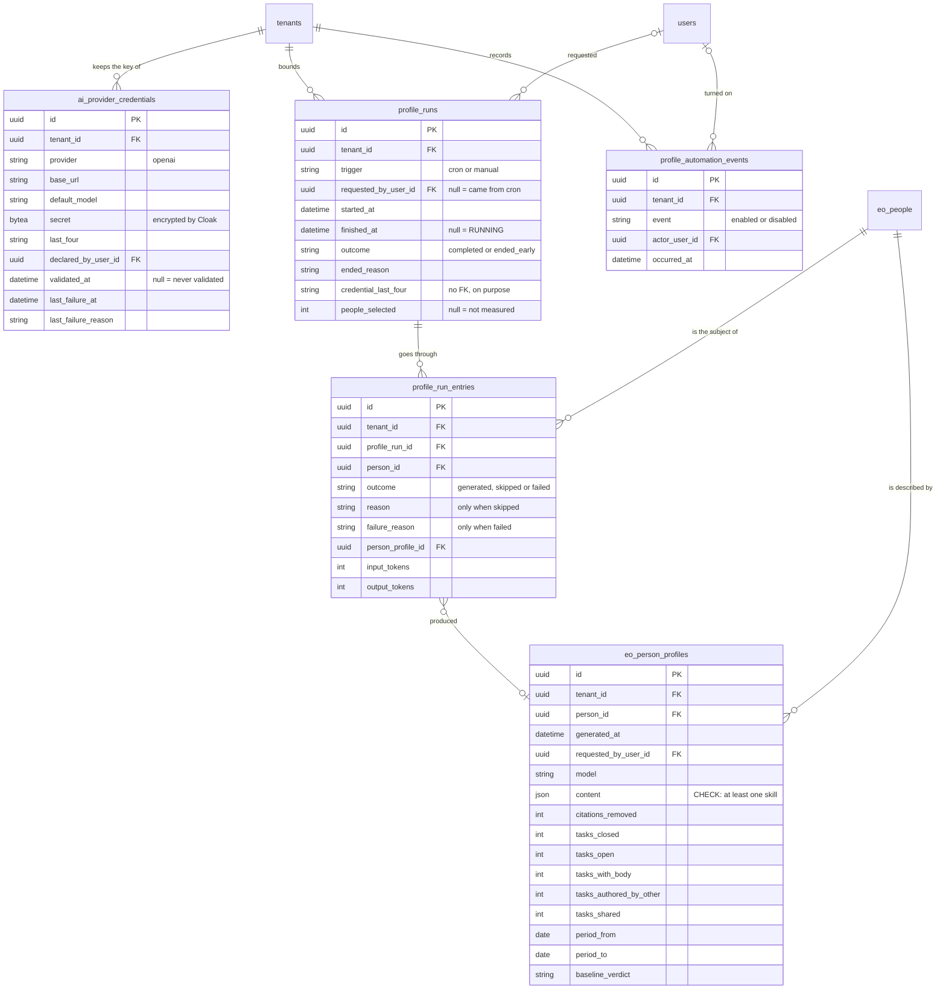

<!-- DERIVED from the migrations in priv/repo/migrations/ that create `ai_provider_credentials`,
     `profile_runs`, `profile_run_entries`, `profile_automation_events` and
     `eo_person_profiles`, compared with `information_schema.columns`, `pg_constraint`
     and `pg_indexes` of the development database `the_band_dev`; and from the schemas
     lib/the_band/ai/provider_credential.ex, lib/the_band/profiles/{run,run_entry,
     automation_event}.ex, lib/the_band/ontology/seon/eo/schemas/person_profile.ex
     — on 2026-09-12. Checked against the code on this date. Regenerate when the source changes. -->

# Database — profiles and language model

**5 tables out of 63, and zero rows** in the development database. Slice declared in
[`mapa-das-tabelas.md`](mapa-das-tabelas.md#the-seven-erds-and-what-each-one-covers).

`eo_person_profiles` also appears in the [EO ERD](eo-e-acesso.md) — it is the same table, and it is said
in both.

## The diagram

**`profile_runs.credential_last_four` is not an FK, and it is a choice.** The round records *with which
credential it was made* in a way that survives the key being replaced. An FK would say the wrong thing as
soon as the credential was substituted — or, with `SET NULL`, would erase the answer.

## The `CHECK`s — seven, and six of them prevent an empty statement

| Constraint | Rule |
|---|---|
| `profile_run_trigger_valido` | `cron` or `manual` |
| `profile_run_outcome_valido` | null (in progress), `completed` or `ended_early` |
| `profile_runs_people_selected_nao_negativo` | null, or `>= 0` |
| `profile_run_entry_outcome_valido` | `generated`, `skipped` or `failed` |
| `profile_run_entry_reason_valido` | a reason **only** when `skipped`, and from `no_material`, `no_new_work`, `observation_ended` |
| **`profile_run_entry_falha_tem_motivo`** | `failed` **requires** `failure_reason`; any other outcome **forbids** it |
| **`eo_person_profiles_conteudo_util`** | `jsonb_array_length(content -> 'habilidades') > 0` |

The two in bold are the design of the subsystem, not a detail:

- without `profile_run_entry_falha_tem_motivo`, a `failed` entry with a null reason would pass, and the
  round would say *"failed"* without saying at what;
- without `eo_person_profiles_conteudo_util`, a profile with `habilidades: []` would be written, and the
  screen would show a person "without skills" when the correct statement is *the profile should not have
  been written*. They are opposite statements with the same appearance.

`profile_run_entry_reason_valido` is a **biconditional**, not an implication: it forbids a reason on
`generated` as much as a missing reason on `skipped`.

## The partial index

| Index | Form | States |
|---|---|---|
| `profile_runs_uma_aberta_por_tenant` | `UNIQUE (tenant_id) WHERE finished_at IS NULL` | **one running round per tenant** — FR-003 |

It is the index that makes the `rodadas` queue with concurrency 1 also hold across cluster nodes: the
queue alone protects within a node; the index protects in the database, which is where the truth is.

Besides it, `profile_run_entries` has uniqueness on `[profile_run_id, person_id]` — and it is what makes
the Oban retry **resume** instead of generating a second text about the same material
(`lib/the_band/profiles/run_entry.ex:5-7`).

## The FKs and what happens on delete

| From | To | On delete |
|---|---|---|
| `profile_run_entries.profile_run_id` | `profile_runs` | `CASCADE` |
| `profile_run_entries.person_id` | `eo_people` | **`RESTRICT`** |
| `profile_run_entries.person_profile_id` | `eo_person_profiles` | `SET NULL` |
| `eo_person_profiles.person_id` | `eo_people` | `CASCADE` |
| `profile_runs.requested_by_user_id` | `users` | `SET NULL` |
| `eo_person_profiles.requested_by_user_id` | `users` | `SET NULL` |
| `ai_provider_credentials.declared_by_user_id` | `users` | `SET NULL` |
| `profile_automation_events.actor_user_id` | `users` | **`RESTRICT`** |
| `.tenant_id` in all five | `tenants` | `RESTRICT` |

**The asymmetry on `eo_people` is worth reading**: deleting a person **deletes their profiles**
(`CASCADE`) and is **refused** if they appear in a round entry (`RESTRICT`). The profile is a statement
about the person and goes with them; the round entry is a record that the platform processed them, and
that record cannot disappear without leaving the round incoherent.

## What the diagram does not show

- `inserted_at` / `updated_at`. `eo_person_profiles` and `profile_automation_events` use
  `timestamps(updated_at: false)` — they record an **occurrence**, and an occurrence is not updated.
- The internal shape of `eo_person_profiles.content`: it is `jsonb`, and only the `habilidades` key is
  touched by the `CHECK`. **The rest of the JSON cannot be derived from the schema or the migration** —
  whoever needs the shape reads `lib/the_band/profiles/prompt.ex` and the sanitizer.
- The non-partial indexes.

## What the data says today

Development database, 2026-09-12: **the five tables are empty.**

| Table | Rows |
|---|---:|
| `ai_provider_credentials` | 0 |
| `profile_runs` | 0 |
| `profile_run_entries` | 0 |
| `eo_person_profiles` | 0 |
| `profile_automation_events` | 0 |

The model is complete and **was never exercised with real data in this database**. Whoever measures
anything about profiles needs to know this before looking at a number — and whoever changes the schema
does not have, here, production data to serve as a regression test.

## Divergence

None between schema, migration and database (automatic schema × columns comparison, 2026-09-12).
