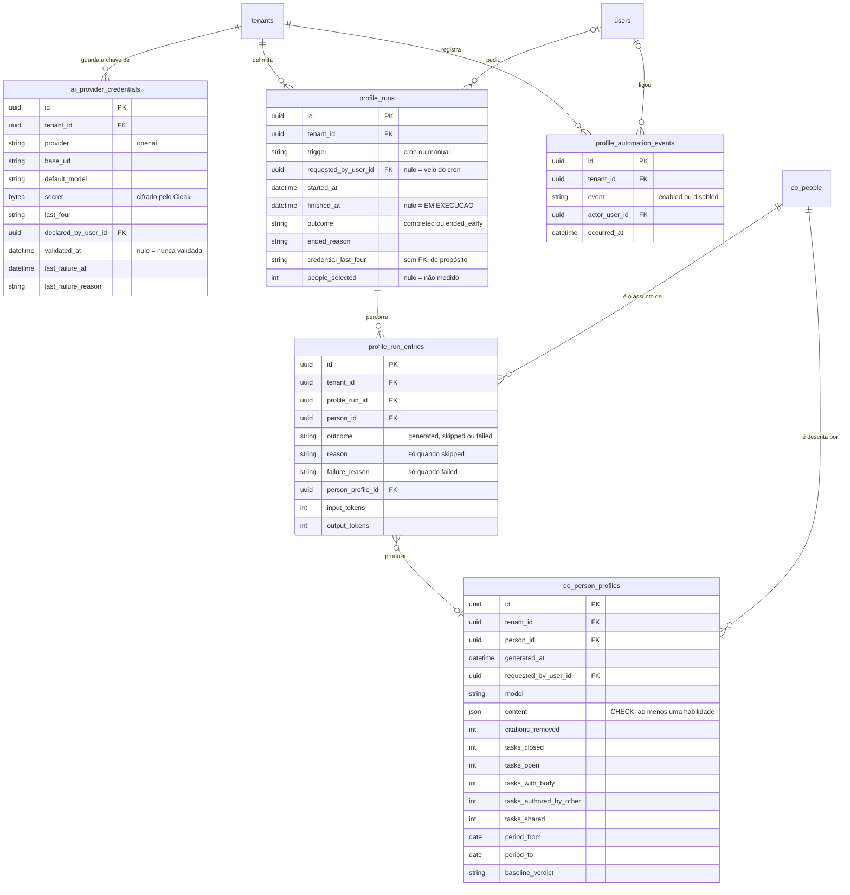

<!-- DERIVADO das migrações de priv/repo/migrations/ que criam `ai_provider_credentials`,
     `profile_runs`, `profile_run_entries`, `profile_automation_events` e
     `eo_person_profiles`, confrontadas com `information_schema.columns`, `pg_constraint`
     e `pg_indexes` do banco de desenvolvimento `the_band_dev`; e dos schemas
     lib/the_band/ai/provider_credential.ex, lib/the_band/profiles/{run,run_entry,
     automation_event}.ex, lib/the_band/ontology/seon/eo/schemas/person_profile.ex
     — em 2026-09-12. Conferido contra o código nesta data. Regenerar ao mudar a fonte. -->

# Banco — perfis e modelo de linguagem

**5 tabelas de 63, e zero linhas** no banco de desenvolvimento. Recorte declarado em
[`mapa-das-tabelas.md`](mapa-das-tabelas.md#os-seis-erds-e-o-que-cada-um-cobre).

`eo_person_profiles` aparece também no [ERD da EO](eo-e-acesso.md) — é a mesma tabela, e está
dito nos dois.

## O diagrama

**`profile_runs.credential_last_four` não é FK, e é escolha.** A rodada registra *com qual
credencial foi feita* de um jeito que sobrevive à troca da chave. Uma FK diria a coisa errada
assim que a credencial fosse substituída — ou, com `SET NULL`, apagaria a resposta.

## Os `CHECK` — sete, e seis deles impedem afirmação vazia

| Constraint | Regra |
|---|---|
| `profile_run_trigger_valido` | `cron` ou `manual` |
| `profile_run_outcome_valido` | nulo (em curso), `completed` ou `ended_early` |
| `profile_runs_people_selected_nao_negativo` | nulo, ou `>= 0` |
| `profile_run_entry_outcome_valido` | `generated`, `skipped` ou `failed` |
| `profile_run_entry_reason_valido` | razão **só** quando `skipped`, e de `no_material`, `no_new_work`, `observation_ended` |
| **`profile_run_entry_falha_tem_motivo`** | `failed` **exige** `failure_reason`; qualquer outro desfecho **proíbe** |
| **`eo_person_profiles_conteudo_util`** | `jsonb_array_length(content -> 'habilidades') > 0` |

Os dois em negrito são o desenho do subsistema, e não detalhe:

- sem `profile_run_entry_falha_tem_motivo`, uma entrada `failed` com motivo nulo passaria, e a
  rodada diria *"falhou"* sem dizer no quê;
- sem `eo_person_profiles_conteudo_util`, um perfil com `habilidades: []` seria gravado, e a
  tela mostraria uma pessoa "sem habilidades" quando o correto é *o perfil não devia ter sido
  gravado*. São afirmações opostas com a mesma aparência.

`profile_run_entry_reason_valido` é uma **bicondicional**, não uma implicação: proíbe razão em
`generated` tanto quanto razão ausente em `skipped`.

## O índice parcial

| Índice | Forma | Afirma |
|---|---|---|
| `profile_runs_uma_aberta_por_tenant` | `UNIQUE (tenant_id) WHERE finished_at IS NULL` | **uma rodada em execução por tenant** — FR-003 |

É o índice que faz a fila `rodadas` de concorrência 1 valer também entre nós do cluster: a fila
sozinha protege dentro de um nó; o índice protege no banco, que é onde a verdade está.

Além dele, `profile_run_entries` tem unicidade por `[profile_run_id, person_id]` — e é ela que
faz a retentativa do Oban **retomar** em vez de gerar um segundo texto sobre o mesmo material
(`lib/the_band/profiles/run_entry.ex:5-7`).

## As FKs e o que acontece ao apagar

| De | Para | Ao apagar |
|---|---|---|
| `profile_run_entries.profile_run_id` | `profile_runs` | `CASCADE` |
| `profile_run_entries.person_id` | `eo_people` | **`RESTRICT`** |
| `profile_run_entries.person_profile_id` | `eo_person_profiles` | `SET NULL` |
| `eo_person_profiles.person_id` | `eo_people` | `CASCADE` |
| `profile_runs.requested_by_user_id` | `users` | `SET NULL` |
| `eo_person_profiles.requested_by_user_id` | `users` | `SET NULL` |
| `ai_provider_credentials.declared_by_user_id` | `users` | `SET NULL` |
| `profile_automation_events.actor_user_id` | `users` | **`RESTRICT`** |
| `.tenant_id` em todas as cinco | `tenants` | `RESTRICT` |

**A assimetria em `eo_people` vale a leitura**: apagar uma pessoa **apaga os perfis dela**
(`CASCADE`) e é **recusado** se ela aparece numa entrada de rodada (`RESTRICT`). O perfil é
afirmação sobre a pessoa e some com ela; a entrada de rodada é registro de que a plataforma a
processou, e esse registro não pode desaparecer sem deixar a rodada incoerente.

## O que o diagrama não mostra

- `inserted_at` / `updated_at`. `eo_person_profiles` e `profile_automation_events` usam
  `timestamps(updated_at: false)` — registram **ocorrência**, e ocorrência não é atualizada.
- A forma interna de `eo_person_profiles.content`: é `jsonb`, e só a chave `habilidades` é
  tocada pelo `CHECK`. **O resto do JSON não é derivável do schema nem da migração** — quem
  precisar da forma lê `lib/the_band/profiles/prompt.ex` e o sanitizador.
- Os índices não parciais.

## O que o dado diz hoje

Banco de desenvolvimento, 2026-09-12: **as cinco tabelas estão vazias.**

| Tabela | Linhas |
|---|---:|
| `ai_provider_credentials` | 0 |
| `profile_runs` | 0 |
| `profile_run_entries` | 0 |
| `eo_person_profiles` | 0 |
| `profile_automation_events` | 0 |

O modelo está inteiro e **nunca foi exercitado com dado real neste banco**. Quem for medir
qualquer coisa sobre perfis precisa saber disso antes de olhar um número — e quem for mexer no
esquema não tem, aqui, dado de produção que sirva de teste de regressão.

## Divergência

Nenhuma entre schema, migração e banco (comparação automática schema × colunas, 2026-09-12).
