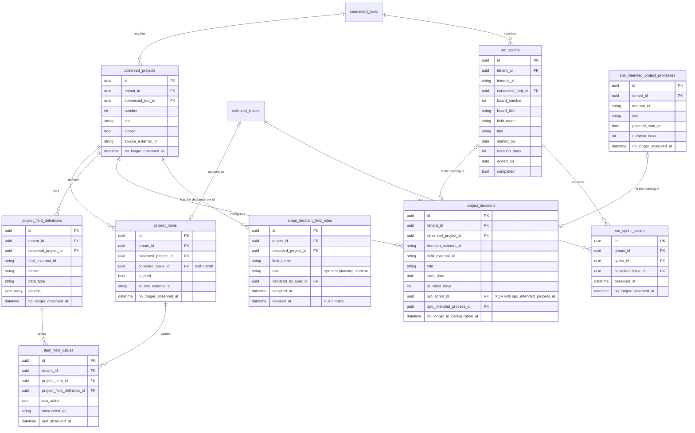

<!-- DERIVED from the migrations in priv/repo/migrations/ that create and alter `spo_projects`,
     `spo_project_organizations`, `spo_project_teams`, `spo_project_repositories`,
     `spo_project_boards`, `spo_activity_start_criteria`, `spo_activity_deadline_criteria`,
     `spo_intended_project_processes`, `spo_performed_project_activities`,
     `observed_projects`, `project_items`, `project_field_definitions`,
     `item_field_values`, `project_iterations`, `smpo_iteration_field_roles`,
     `sro_sprints` and `sro_sprint_issues`, compared with `information_schema.columns`,
     `pg_constraint` and `pg_indexes` of the development database `the_band_dev`;
     and from the schemas lib/the_band/ontology/seon/spo/schemas/*.ex,
     lib/the_band/ontology/continuum/{sro,smpo}/schemas/*.ex,
     lib/the_band/projects/schemas/*.ex — on 2026-09-12.
     Checked against the code on this date. Regenerate when the source changes. -->

# Database — projects and process

**17 tables out of 63.** Slice declared in
[`mapa-das-tabelas.md`](mapa-das-tabelas.md#the-seven-erds-and-what-each-one-covers).

**The name collision comes before the diagram**: `spo_projects` is the **project** — the undertaking a
person declares. `observed_projects` is the **board** — the *Projects v2* that collection brings in.
GitHub calls the second one "project", and that is where the confusion comes from
(`lib/the_band/ontology/seon/spo/schemas/activity_start_criterion.ex:15-21`). They are different tables,
and the single-target `CHECK`s exist to prevent them from mixing.

## 1. The declared project

```mermaid
erDiagram
    spo_projects |o--o{ spo_projects : contains
    spo_projects ||--o{ spo_project_organizations : "belongs to"
    spo_projects ||--o{ spo_project_teams : "is done by"
    spo_projects ||--o{ spo_project_repositories : "produces in"
    spo_projects ||--o{ spo_project_boards : "is followed on"
    spo_projects ||--o{ spo_activity_start_criteria : "declares start by"
    spo_projects ||--o{ spo_activity_deadline_criteria : "declares deadline by"
    eo_organizations ||--o{ spo_project_organizations : gathers
    eo_teams ||--o{ spo_project_teams : "works on"
    observed_repositories ||--o{ spo_project_repositories : receives
    observed_projects ||--o{ spo_project_boards : follows
    observed_projects ||--o{ spo_activity_start_criteria : "declares start by"
    observed_projects ||--o{ spo_activity_deadline_criteria : "declares deadline by"
    eo_people |o--o{ spo_performed_project_activities : performed
    spo_projects |o--o{ spo_performed_project_activities : "is the context of"

    spo_projects {
        uuid id PK
        uuid tenant_id FK
        string name
        date started_on
        date ended_on "null = ongoing"
        uuid parent_id FK "null = top-level project"
        uuid declared_by_user_id FK
        uuid updated_by_user_id FK
        datetime removed_at "null = exists"
        uuid removed_by_user_id FK
    }

    spo_project_organizations {
        uuid id PK
        uuid tenant_id FK
        uuid project_id FK
        uuid organization_id FK
        uuid linked_by_user_id FK
        datetime linked_at
        uuid unlinked_by_user_id FK
        datetime unlinked_at "null = holds"
    }

    spo_project_teams {
        uuid id PK
        uuid tenant_id FK
        uuid project_id FK
        uuid team_id FK
        uuid linked_by_user_id FK
        datetime linked_at
        datetime unlinked_at "null = holds"
    }

    spo_project_repositories {
        uuid id PK
        uuid tenant_id FK
        uuid project_id FK
        uuid observed_repository_id FK
        uuid linked_by_user_id FK
        datetime linked_at
        datetime unlinked_at "null = holds"
    }

    spo_project_boards {
        uuid id PK
        uuid tenant_id FK
        uuid project_id FK
        uuid observed_project_id FK
        uuid linked_by_user_id FK
        datetime linked_at
        datetime unlinked_at "null = holds"
    }

    spo_activity_start_criteria {
        uuid id PK
        uuid tenant_id FK
        uuid project_id FK "XOR with observed_project_id"
        uuid observed_project_id FK
        string event_type "raw, no enum"
        uuid declared_by_user_id FK
        datetime declared_at
        datetime revoked_at "null = holds"
    }

    spo_activity_deadline_criteria {
        uuid id PK
        uuid tenant_id FK
        uuid project_id FK "XOR with observed_project_id"
        uuid observed_project_id FK
        string source "board_field, sprint or milestone"
        string field_name "only when source = board_field"
        uuid declared_by_user_id FK
        datetime declared_at
        datetime revoked_at "null = holds"
    }

    spo_performed_project_activities {
        uuid id PK
        uuid tenant_id FK
        string internal_id
        uuid organization_id FK
        uuid project_id FK
        string activity_type
        string concept_id "null = the network does not name it"
        uuid performer_id FK
        string performer_login
        datetime occurred_at
        string subject_type
        uuid subject_id
        json payload
    }
```

## 2. The observed board, the iteration, the sprint

## The `CHECK`s — four of them say "exactly one"

| Constraint | Rule |
|---|---|
| `project_iterations_exatamente_um_destino` | `sro_sprint_id` **or** `spo_intended_process_id` — exactly one |
| `criterio_tem_um_alvo_so` | `num_nonnulls(project_id, observed_project_id) = 1` |
| `prazo_tem_um_alvo_so` | `(project_id IS NULL) <> (observed_project_id IS NULL)` |
| `campo_so_quando_a_origem_e_campo` | `(source = 'board_field') = (field_name IS NOT NULL)` |
| `project_items_rascunho_sem_issue` | `NOT (is_draft AND collected_issue_id IS NOT NULL)` |

The two in the middle are the same rule written in two forms — `num_nonnulls(...) = 1` and
`(a IS NULL) <> (b IS NULL)` —, in sibling tables created at different times. Equivalent, and it is worth
recording the style inconsistency for whoever writes the third.

**`campo_so_quando_a_origem_e_campo` is an equivalence, not an implication**: it forbids `board_field`
without a field **and** a field with a source other than `board_field`. A simple implication would let the
second one through.

## The partial indexes

| Index | Form |
|---|---|
| `spo_projects_name_index` | `UNIQUE (tenant_id, name) WHERE removed_at IS NULL` |
| `spo_project_organizations_vigente_index` | `UNIQUE (tenant_id, project_id, organization_id) WHERE unlinked_at IS NULL` |
| `spo_project_teams_vigente_index` | `UNIQUE (tenant_id, project_id, team_id) WHERE unlinked_at IS NULL` |
| `spo_project_repositories_vigente_index` | `UNIQUE (tenant_id, project_id, observed_repository_id) WHERE unlinked_at IS NULL` |
| `spo_project_boards_vigente_index` | `UNIQUE (tenant_id, project_id, observed_project_id) WHERE unlinked_at IS NULL` |
| `spo_activity_start_criteria_projeto_vigente_index` | `UNIQUE (tenant_id, project_id) WHERE revoked_at IS NULL AND project_id IS NOT NULL` |
| `spo_activity_start_criteria_quadro_vigente_index` | `UNIQUE (tenant_id, observed_project_id) WHERE revoked_at IS NULL AND observed_project_id IS NOT NULL` |
| `spo_prazo_vigente_do_projeto_index` | `UNIQUE (tenant_id, project_id, source, field_name) NULLS NOT DISTINCT WHERE revoked_at IS NULL AND project_id IS NOT NULL` |
| `spo_prazo_vigente_do_quadro_index` | `UNIQUE (tenant_id, observed_project_id, source, field_name) NULLS NOT DISTINCT WHERE revoked_at IS NULL AND observed_project_id IS NOT NULL` |
| `smpo_papel_vigente_do_campo_index` | `UNIQUE (tenant_id, observed_project_id, field_name) WHERE revoked_at IS NULL` |

**Ten partial indexes — the subsystem with the most invariants in the database**, and they all say the
same thing: *one per target, while in force*.

The two deadline ones use **`NULLS NOT DISTINCT`**, and it is the detail that decides whether the rule
works: without it, two rows with a null `field_name` **would not collide** (in Postgres,
`NULL <> NULL`), and "one deadline criterion in force" would stop meaning anything exactly where it
matters most — in the `sprint` and `milestone` sources, which have no field.

The criteria have **two** indexes each, one per target, instead of a single one on the pair. A unique
index on `(tenant_id, project_id, observed_project_id)` would let two criteria for the same board through,
because a null `project_id` would make them distinct.

## The FKs and what happens on delete

| From | To | On delete |
|---|---|---|
| every `spo_project_*.project_id` | `spo_projects` | `CASCADE` |
| `spo_project_teams.team_id` | `eo_teams` | `CASCADE` |
| `spo_project_organizations.organization_id` | `eo_organizations` | `CASCADE` |
| `spo_project_repositories.observed_repository_id` | `observed_repositories` | `CASCADE` |
| `spo_project_boards.observed_project_id` | `observed_projects` | `CASCADE` |
| `spo_projects.parent_id` | `spo_projects` | `SET NULL` — the child becomes a top-level project |
| `spo_performed_project_activities.performer_id` | `eo_people` | **`SET NULL`** |
| `spo_performed_project_activities.organization_id` | `eo_organizations` | **`SET NULL`** |
| `project_items.collected_issue_id` | `collected_issues` | **`SET NULL`** — the board item stays |
| `project_iterations.sro_sprint_id` / `.spo_intended_process_id` | — | **`SET NULL`** |
| `item_field_values.*` | item and definition | `CASCADE` |
| every `*_by_user_id` | `users` | `SET NULL` |
| every `.tenant_id` | `tenants` | `RESTRICT` |

`project_iterations` with the two `SET NULL`s **can violate its own `CHECK`**: deleting the sprint pointed
to would leave both columns null, and `project_iterations_exatamente_um_destino` would fail on the next
write of the row. It is not an observed bug — `sro_sprints` is deleted along with the connected tool, and
in that case the board and the iteration are already gone. Recorded as a **corner of the model**, for
whoever deletes a sprint in isolation.

## What the diagram does not show

- `inserted_at` / `updated_at`, `record_version`, `internal_id`.
- `source_system`, `source_instance`, `source_external_id`, `collected_at`,
  `last_observed_at` — Application Reference in the collected tables.
- **`spo_projects.phase`** is not here because **it is not a column**: it is a virtual `Ecto.Enum`
  (`project.ex:45`).
- `spo_project_*.unlinked_by_user_id` and `spo_activity_*.revoked_by_user_id` — only the dates are in the
  diagram; authorship is in the FK table.
- The non-partial indexes.

## What the data says today

Development database, 2026-09-12:

| Fact | Value |
|---|---|
| declared projects | **1** |
| observed boards | 15 |
| board items / field values | 4 148 / 18 716 |
| iterations | 237 |
| sprints / issues in a sprint | 205 / 2 559 |
| performed activities | **30 560** |
| intended processes | 34 |
| project↔team / ↔repository links | 2 / 16 |
| project↔organization, ↔board links | **0 / 0** |
| start and deadline criteria | **0 / 0** |
| declared iteration field roles | **0** |

**Five SPO tables and the SMPO one are empty.** The model exists in full; the use, almost none.

And the detail that only reading the code explains: the 237 iterations **have a target** — 205 point to a
sprint and 32 point to an intended process, and the single-target `CHECK` is satisfied in all 237. But none
of them went through `smpo_iteration_field_roles`, which is empty.

The reason is that **the two declarations act at different moments**:

| Declaration | When it acts | Source |
|---|---|---|
| the sprint × intended process route | **at write time**, and by a single criterion: `startDate` has already passed | `lib/the_band/projects/commands.ex:122-128` and `:151-154` |
| `smpo_iteration_field_roles` | **at read time** — filters and interprets what is already written | `smpo/field_roles.ex`, `spo/deadline_criterion.ex`, `work_items/person_work.ex:222` |

Whoever looks only at the ERD concludes that the empty table prevents the routing, and it does not.
Whoever measures *"the team's sprints"* without declaring the field's role, on the other hand, **counts a
planning quarter as a sprint** — which is exactly the defect issue #514 closed
(`smpo/field_roles.ex:4-7`: the six boards with `Quarter` also have `Sprint`).
