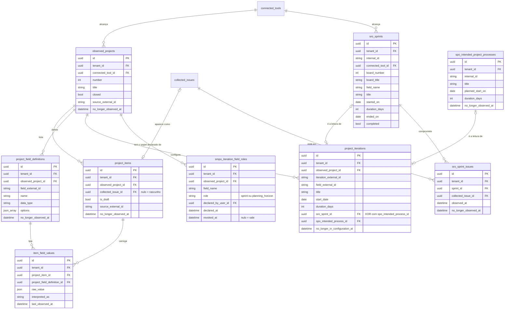

<!-- DERIVADO das migrações de priv/repo/migrations/ que criam e alteram `spo_projects`,
     `spo_project_organizations`, `spo_project_teams`, `spo_project_repositories`,
     `spo_project_boards`, `spo_activity_start_criteria`, `spo_activity_deadline_criteria`,
     `spo_intended_project_processes`, `spo_performed_project_activities`,
     `observed_projects`, `project_items`, `project_field_definitions`,
     `item_field_values`, `project_iterations`, `smpo_iteration_field_roles`,
     `sro_sprints` e `sro_sprint_issues`, confrontadas com `information_schema.columns`,
     `pg_constraint` e `pg_indexes` do banco de desenvolvimento `the_band_dev`;
     e dos schemas lib/the_band/ontology/seon/spo/schemas/*.ex,
     lib/the_band/ontology/continuum/{sro,smpo}/schemas/*.ex,
     lib/the_band/projects/schemas/*.ex — em 2026-09-12.
     Conferido contra o código nesta data. Regenerar ao mudar a fonte. -->

# Banco — projetos e processo

**17 tabelas de 63.** Recorte declarado em
[`mapa-das-tabelas.md`](mapa-das-tabelas.md#os-seis-erds-e-o-que-cada-um-cobre).

**A colisão de nome vem antes do diagrama**: `spo_projects` é o **projeto** — o empreendimento
que uma pessoa declara. `observed_projects` é o **quadro** — o *Projects v2* que a coleta traz.
O GitHub chama o segundo de "project", e é daí que vem a confusão
(`lib/the_band/ontology/seon/spo/schemas/activity_start_criterion.ex:15-21`). São tabelas
diferentes, e os `CHECK` de alvo único existem para impedir que se misturem.

## 1. O projeto declarado

```mermaid
erDiagram
    spo_projects |o--o{ spo_projects : contém
    spo_projects ||--o{ spo_project_organizations : "pertence a"
    spo_projects ||--o{ spo_project_teams : "é feito por"
    spo_projects ||--o{ spo_project_repositories : "produz em"
    spo_projects ||--o{ spo_project_boards : "é acompanhado em"
    spo_projects ||--o{ spo_activity_start_criteria : "declara início por"
    spo_projects ||--o{ spo_activity_deadline_criteria : "declara prazo por"
    eo_organizations ||--o{ spo_project_organizations : reúne
    eo_teams ||--o{ spo_project_teams : "trabalha em"
    observed_repositories ||--o{ spo_project_repositories : recebe
    observed_projects ||--o{ spo_project_boards : acompanha
    observed_projects ||--o{ spo_activity_start_criteria : "declara início por"
    observed_projects ||--o{ spo_activity_deadline_criteria : "declara prazo por"
    eo_people |o--o{ spo_performed_project_activities : realizou
    spo_projects |o--o{ spo_performed_project_activities : "é contexto de"

    spo_projects {
        uuid id PK
        uuid tenant_id FK
        string name
        date started_on
        date ended_on "nulo = em curso"
        uuid parent_id FK "nulo = projeto de topo"
        uuid declared_by_user_id FK
        uuid updated_by_user_id FK
        datetime removed_at "nulo = existe"
        uuid removed_by_user_id FK
    }

    spo_project_organizations {
        uuid id PK
        uuid tenant_id FK
        uuid project_id FK
        uuid organization_id FK
        uuid linked_by_user_id FK
        datetime linked_at
        uuid unlinked_by_user_id FK
        datetime unlinked_at "nulo = vale"
    }

    spo_project_teams {
        uuid id PK
        uuid tenant_id FK
        uuid project_id FK
        uuid team_id FK
        uuid linked_by_user_id FK
        datetime linked_at
        datetime unlinked_at "nulo = vale"
    }

    spo_project_repositories {
        uuid id PK
        uuid tenant_id FK
        uuid project_id FK
        uuid observed_repository_id FK
        uuid linked_by_user_id FK
        datetime linked_at
        datetime unlinked_at "nulo = vale"
    }

    spo_project_boards {
        uuid id PK
        uuid tenant_id FK
        uuid project_id FK
        uuid observed_project_id FK
        uuid linked_by_user_id FK
        datetime linked_at
        datetime unlinked_at "nulo = vale"
    }

    spo_activity_start_criteria {
        uuid id PK
        uuid tenant_id FK
        uuid project_id FK "XOR com observed_project_id"
        uuid observed_project_id FK
        string event_type "cru, sem enum"
        uuid declared_by_user_id FK
        datetime declared_at
        datetime revoked_at "nulo = vale"
    }

    spo_activity_deadline_criteria {
        uuid id PK
        uuid tenant_id FK
        uuid project_id FK "XOR com observed_project_id"
        uuid observed_project_id FK
        string source "board_field, sprint ou milestone"
        string field_name "só quando source = board_field"
        uuid declared_by_user_id FK
        datetime declared_at
        datetime revoked_at "nulo = vale"
    }

    spo_performed_project_activities {
        uuid id PK
        uuid tenant_id FK
        string internal_id
        uuid organization_id FK
        uuid project_id FK
        string activity_type
        string concept_id "nulo = a rede não nomeia"
        uuid performer_id FK
        string performer_login
        datetime occurred_at
        string subject_type
        uuid subject_id
        json payload
    }
```

## 2. O quadro observado, a iteração, o sprint

## Os `CHECK` — quatro deles dizem "exatamente um"

| Constraint | Regra |
|---|---|
| `project_iterations_exatamente_um_destino` | `sro_sprint_id` **ou** `spo_intended_process_id` — exatamente um |
| `criterio_tem_um_alvo_so` | `num_nonnulls(project_id, observed_project_id) = 1` |
| `prazo_tem_um_alvo_so` | `(project_id IS NULL) <> (observed_project_id IS NULL)` |
| `campo_so_quando_a_origem_e_campo` | `(source = 'board_field') = (field_name IS NOT NULL)` |
| `project_items_rascunho_sem_issue` | `NOT (is_draft AND collected_issue_id IS NOT NULL)` |

Os dois do meio são a mesma regra escrita de duas formas — `num_nonnulls(...) = 1` e
`(a IS NULL) <> (b IS NULL)` —, em tabelas irmãs criadas em momentos diferentes. Equivalentes,
e vale registrar a inconsistência de estilo para quem for escrever a terceira.

**`campo_so_quando_a_origem_e_campo` é uma equivalência, não uma implicação**: proíbe
`board_field` sem campo **e** campo com origem diferente de `board_field`. Uma implicação
simples deixaria a segunda passar.

## Os índices parciais

| Índice | Forma |
|---|---|
| `spo_projects_name_index` | `UNIQUE (tenant_id, name) WHERE removed_at IS NULL` |
| `spo_project_organizations_vigente_index` | `UNIQUE (tenant_id, project_id, organization_id) WHERE unlinked_at IS NULL` |
| `spo_project_teams_vigente_index` | `UNIQUE (tenant_id, project_id, team_id) WHERE unlinked_at IS NULL` |
| `spo_project_repositories_vigente_index` | `UNIQUE (tenant_id, project_id, observed_repository_id) WHERE unlinked_at IS NULL` |
| `spo_project_boards_vigente_index` | `UNIQUE (tenant_id, project_id, observed_project_id) WHERE unlinked_at IS NULL` |
| `spo_activity_start_criteria_projeto_vigente_index` | `UNIQUE (tenant_id, project_id) WHERE revoked_at IS NULL AND project_id IS NOT NULL` |
| `spo_activity_start_criteria_quadro_vigente_index` | `UNIQUE (tenant_id, observed_project_id) WHERE revoked_at IS NULL AND observed_project_id IS NOT NULL` |
| `spo_prazo_vigente_do_projeto_index` | `UNIQUE (tenant_id, project_id, source, field_name) NULLS NOT DISTINCT WHERE revoked_at IS NULL AND project_id IS NOT NULL` |
| `spo_prazo_vigente_do_quadro_index` | `UNIQUE (tenant_id, observed_project_id, source, field_name) NULLS NOT DISTINCT WHERE revoked_at IS NULL AND observed_project_id IS NOT NULL` |
| `smpo_papel_vigente_do_campo_index` | `UNIQUE (tenant_id, observed_project_id, field_name) WHERE revoked_at IS NULL` |

**Dez índices parciais — o subsistema com mais invariantes do banco**, e todos dizem a mesma
coisa: *um por alvo, enquanto vigente*.

Os dois de prazo usam **`NULLS NOT DISTINCT`**, e é o detalhe que decide se a regra funciona:
sem ele, duas linhas com `field_name` nulo **não colidiriam** (no Postgres, `NULL <> NULL`), e
"um critério de prazo vigente" deixaria de significar exatamente onde mais importa — nas
origens `sprint` e `milestone`, que não têm campo.

Os critérios têm **dois** índices cada, um por alvo, em vez de um só sobre o par. Um índice
único sobre `(tenant_id, project_id, observed_project_id)` deixaria passar dois critérios para
o mesmo quadro, porque `project_id` nulo os tornaria distintos.

## As FKs e o que acontece ao apagar

| De | Para | Ao apagar |
|---|---|---|
| todos os `spo_project_*.project_id` | `spo_projects` | `CASCADE` |
| `spo_project_teams.team_id` | `eo_teams` | `CASCADE` |
| `spo_project_organizations.organization_id` | `eo_organizations` | `CASCADE` |
| `spo_project_repositories.observed_repository_id` | `observed_repositories` | `CASCADE` |
| `spo_project_boards.observed_project_id` | `observed_projects` | `CASCADE` |
| `spo_projects.parent_id` | `spo_projects` | `SET NULL` — o filho vira projeto de topo |
| `spo_performed_project_activities.performer_id` | `eo_people` | **`SET NULL`** |
| `spo_performed_project_activities.organization_id` | `eo_organizations` | **`SET NULL`** |
| `project_items.collected_issue_id` | `collected_issues` | **`SET NULL`** — o item do quadro fica |
| `project_iterations.sro_sprint_id` / `.spo_intended_process_id` | — | **`SET NULL`** |
| `item_field_values.*` | item e definição | `CASCADE` |
| todos os `*_by_user_id` | `users` | `SET NULL` |
| todos os `.tenant_id` | `tenants` | `RESTRICT` |

`project_iterations` com os dois `SET NULL` **pode violar o próprio `CHECK`**: apagar o sprint
apontado deixaria as duas colunas nulas, e `project_iterations_exatamente_um_destino` falharia
na próxima escrita da linha. Não é bug observado — `sro_sprints` é apagado junto com a
ferramenta conectada, e nesse caso o quadro e a iteração já foram embora. Registrado como
**canto do modelo**, para quem for apagar um sprint isoladamente.

## O que o diagrama não mostra

- `inserted_at` / `updated_at`, `record_version`, `internal_id`.
- `source_system`, `source_instance`, `source_external_id`, `collected_at`,
  `last_observed_at` — Application Reference nas tabelas coletadas.
- **`spo_projects.phase`** não está aqui porque **não é coluna**: é `Ecto.Enum` virtual
  (`project.ex:45`).
- `spo_project_*.unlinked_by_user_id` e `spo_activity_*.revoked_by_user_id` — só as datas
  estão no diagrama; a autoria está na tabela de FKs.
- Os índices não parciais.

## O que o dado diz hoje

Banco de desenvolvimento, 2026-09-12:

| Fato | Valor |
|---|---|
| projetos declarados | **1** |
| quadros observados | 15 |
| itens de quadro / valores de campo | 4 148 / 18 716 |
| iterações | 237 |
| sprints / issues em sprint | 205 / 2 559 |
| atividades realizadas | **30 560** |
| processos pretendidos | 34 |
| elos projeto↔equipe / ↔repositório | 2 / 16 |
| elos projeto↔organização, ↔quadro | **0 / 0** |
| critérios de início e de prazo | **0 / 0** |
| papéis de campo de iteração declarados | **0** |

**Cinco tabelas do SPO e a do SMPO estão vazias.** O modelo existe inteiro; o uso, quase nada.

E o detalhe que só a leitura do código explica: as 237 iterações **têm destino** — 205 apontam
sprint e 32 apontam processo pretendido, e o `CHECK` de destino único está satisfeito nas 237.
Mas nenhuma delas passou por `smpo_iteration_field_roles`, que está vazia.

A razão é que **as duas declarações agem em momentos diferentes**:

| Declaração | Quando age | Fonte |
|---|---|---|
| a rota sprint × processo pretendido | **na escrita**, e por um critério só: `startDate` já passou | `lib/the_band/projects/commands.ex:122-128` e `:151-154` |
| `smpo_iteration_field_roles` | **na leitura** — filtra e interpreta o que já está gravado | `smpo/field_roles.ex`, `spo/deadline_criterion.ex`, `work_items/person_work.ex:222` |

Quem olhar só o ERD conclui que a tabela vazia impede o roteamento, e não impede. Quem medir
*"sprints da equipe"* sem declarar o papel do campo, por outro lado, **conta trimestre de
planejamento como sprint** — que é exatamente o defeito que a issue #514 fechou
(`smpo/field_roles.ex:4-7`: os seis quadros com `Quarter` também têm `Sprint`).
