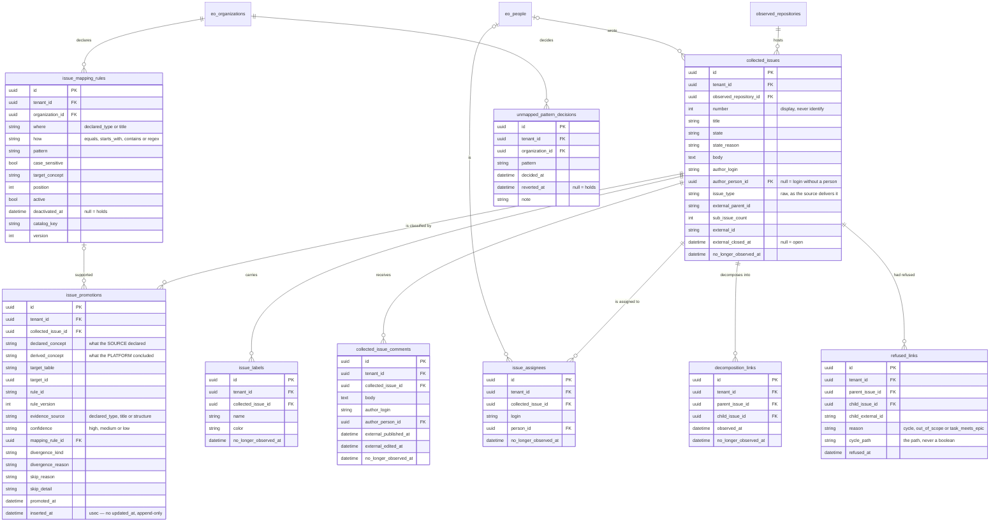
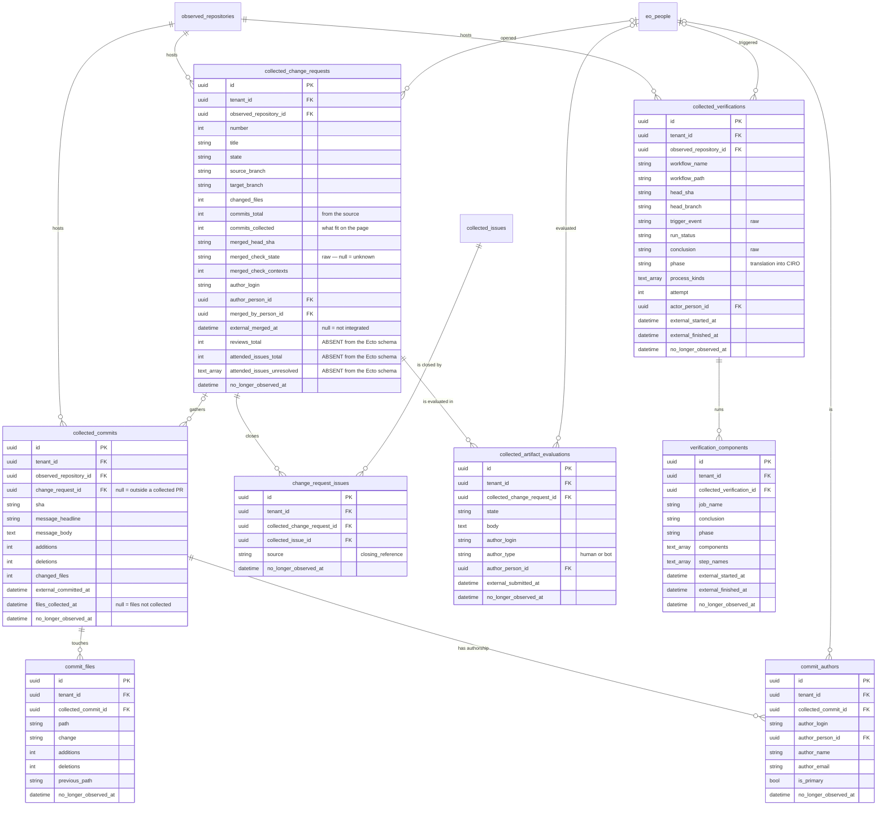

<!-- DERIVED from the migrations in priv/repo/migrations/ that create and alter `collected_issues`,
     `issue_promotions`, `issue_assignees`, `issue_labels`, `decomposition_links`,
     `refused_links`, `collected_issue_comments`, `collected_change_requests`,
     `change_request_issues`, `collected_commits`, `commit_files`, `commit_authors`,
     `collected_artifact_evaluations`, `collected_verifications`, `verification_components`,
     `issue_mapping_rules` and `unmapped_pattern_decisions` — in particular
     20260819030000_add_attended_issues_provenance.exs:37-38 and
     20260819040000_create_artifact_evaluations.exs:82 —, compared with
     `information_schema.columns`, `pg_constraint` and `pg_indexes` of the development
     database `the_band_dev`, and with the schemas of
     lib/the_band/{work_items,changes,verification,quality,communication,mapping}/
     — on 2026-09-12. Checked against the code on this date. Regenerate when the source changes. -->

# Database — work and change

**17 tables out of 63, and 145 903 rows** in the development database — two thirds of everything that
exists there. Slice declared in
[`mapa-das-tabelas.md`](mapa-das-tabelas.md#the-seven-erds-and-what-each-one-covers).

Two diagrams, because in a single one the 17 boxes cannot be read.

## 1. The issue and its classification

## 2. The change, the commit, the verification

## The `CHECK`s — and one of them is the heart of the subsystem

| Constraint | Rule |
|---|---|
| **`issue_promotions_promoted_xor_skipped`** | **either** `derived_concept` present and `skip_reason` null, **or** the opposite. Never both, never neither |
| `issue_promotions_divergence_kind_needs_reason` | a divergence **always** with a written reason |
| `issue_promotions_divergence_kind_known` | `epic_without_parts`, `composition_makes_epic`, `task_with_parts`, `user_story_without_parts`, `label_vs_structure` |
| `issue_promotions_evidence_source_known` | `declared_type`, `title` or `structure` |
| `issue_promotions_confidence_known` | `high`, `medium` or `low` |
| `decomposition_links_no_self_parent` | `parent_issue_id <> child_issue_id` |
| `refused_links_reason_check` | `cycle`, `out_of_scope` or `task_meets_epic` |
| `issue_mapping_rules_where_known` | `declared_type` or `title` |
| `issue_mapping_rules_how_known` | `equals`, `starts_with`, `contains` or `regex` |

The first is the most important invariant in the whole database: **a promotion with no conclusion and no
reason would be silent success in the shape of a row** — the platform would have "classified" the issue
without saying as what nor why not. The `CHECK` makes it impossible.

## The partial indexes

| Index | Form | Serves |
|---|---|---|
| `collected_change_requests_merged_red_index` | `INDEX (merged_check_state) WHERE merged_check_state IN ('FAILURE','ERROR')` | the question *"which PR went in with a red verification"* — and the index is small because it only indexes the ones of interest |

It is the only partial index of the subsystem, and **it is not an invariant**: it is a domain question
written into the schema.

## The FKs and what happens on delete

The pattern is uniform and worth stating at once:

- **to the parent issue, PR, commit or verification**: `CASCADE`. Deleting the issue takes labels,
  assignments, comments, decomposition links, refusals and promotions;
- **to `eo_people`**: always `SET NULL`. Deleting the person **does not delete their work** — the
  `author_login` stays, and the platform comes to know who wrote it without knowing who it is;
- **to `issue_mapping_rules`**: `SET NULL` on `issue_promotions.mapping_rule_id`. The classification
  survives the rule that produced it, and that is what allows auditing a promotion after the rule has
  been deleted;
- **to `tenants`**: `RESTRICT`, with **two exceptions in `CASCADE`** —
  `collected_artifact_evaluations` and (in the [other context](ingestao-e-observacao.md))
  `cmpo_branches`. I did not find the written reason; it is recorded in the map.
- `collected_commits.change_request_id` → `collected_change_requests`: **`SET NULL`**. Deleting the PR
  does not delete the commits — they existed in the repository independently of it.

## What the diagram does not show

- `inserted_at` / `updated_at`; `issue_promotions` has only `inserted_at`, in microseconds.
- `raw_payload` (`jsonb`) in `collected_change_requests`, `collected_commits`,
  `collected_verifications`, `collected_artifact_evaluations`, `collected_issue_comments`.
- `source_system`, `source_instance`, `collected_at`, `last_observed_at` — in all collected tables.
- `collected_issues`: `milestone_title`, `milestone_external_id`, `milestone_due_on`,
  `project_titles`, `comment_count`, `reaction_count`, `issue_type_external_id`,
  `external_created_at`, `external_updated_at` — 31 columns in all, 16 in the diagram.
- `issue_mapping_rules`: `created_by_id`, `deactivated_by_id`;
  `unmapped_pattern_decisions`: `decided_by_id`, `reverted_by_id`.
- The non-partial indexes.

## Divergence — three columns the Ecto schema does not have

`collected_change_requests.reviews_total`, `.attended_issues_total` and
`.attended_issues_unresolved` are **in the ERD with the mark `ABSENT from the Ecto schema`**, because the
truth here is the migration. They exist, are written and read — by a **schemaless query**,
13 occurrences of `from c in "collected_change_requests"` in `lib/`.

Whoever reads `lib/the_band/changes/schemas/collected_change_request.ex` concludes they do not exist, and
`%CollectedChangeRequest{}` indeed does not have them. Details, sources and follow-up in
[`classes/trabalho-e-mudanca.md`](../classes/trabalho-e-mudanca.md#divergences-found).
