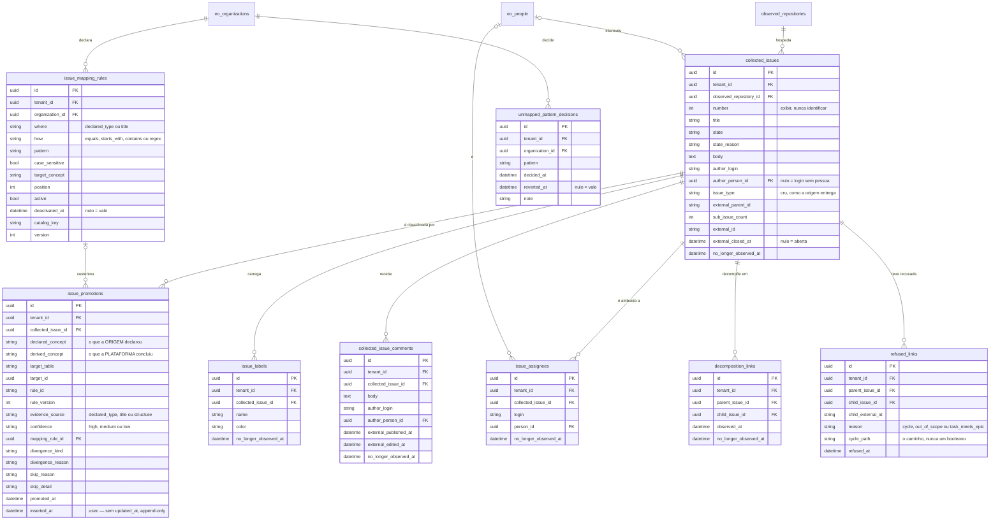
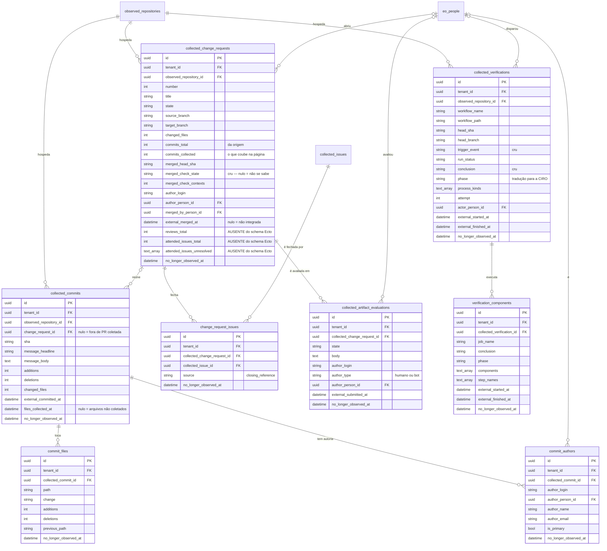

<!-- DERIVADO das migrações de priv/repo/migrations/ que criam e alteram `collected_issues`,
     `issue_promotions`, `issue_assignees`, `issue_labels`, `decomposition_links`,
     `refused_links`, `collected_issue_comments`, `collected_change_requests`,
     `change_request_issues`, `collected_commits`, `commit_files`, `commit_authors`,
     `collected_artifact_evaluations`, `collected_verifications`, `verification_components`,
     `issue_mapping_rules` e `unmapped_pattern_decisions` — em especial
     20260819030000_add_attended_issues_provenance.exs:37-38 e
     20260819040000_create_artifact_evaluations.exs:82 —, confrontadas com
     `information_schema.columns`, `pg_constraint` e `pg_indexes` do banco de
     desenvolvimento `the_band_dev`, e com os schemas de
     lib/the_band/{work_items,changes,verification,quality,communication,mapping}/
     — em 2026-09-12. Conferido contra o código nesta data. Regenerar ao mudar a fonte. -->

# Banco — trabalho e mudança

**17 tabelas de 63, e 145 903 linhas** no banco de desenvolvimento — dois terços de tudo o que
existe ali. Recorte declarado em
[`mapa-das-tabelas.md`](mapa-das-tabelas.md#os-seis-erds-e-o-que-cada-um-cobre).

Dois diagramas, porque num só as 17 caixas não se leem.

## 1. A issue e a sua classificação

## 2. A mudança, o commit, a verificação

## Os `CHECK` — e um deles é o coração do subsistema

| Constraint | Regra |
|---|---|
| **`issue_promotions_promoted_xor_skipped`** | **ou** `derived_concept` presente e `skip_reason` nulo, **ou** o contrário. Nunca os dois, nunca nenhum |
| `issue_promotions_divergence_kind_needs_reason` | divergência **sempre** com razão escrita |
| `issue_promotions_divergence_kind_known` | `epic_without_parts`, `composition_makes_epic`, `task_with_parts`, `user_story_without_parts`, `label_vs_structure` |
| `issue_promotions_evidence_source_known` | `declared_type`, `title` ou `structure` |
| `issue_promotions_confidence_known` | `high`, `medium` ou `low` |
| `decomposition_links_no_self_parent` | `parent_issue_id <> child_issue_id` |
| `refused_links_reason_check` | `cycle`, `out_of_scope` ou `task_meets_epic` |
| `issue_mapping_rules_where_known` | `declared_type` ou `title` |
| `issue_mapping_rules_how_known` | `equals`, `starts_with`, `contains` ou `regex` |

O primeiro é o invariante mais importante do banco inteiro: **uma promoção sem conclusão e sem
motivo seria o sucesso silencioso com forma de linha** — a plataforma teria "classificado" a
issue sem dizer no quê nem por que não. O `CHECK` o torna impossível.

## Os índices parciais

| Índice | Forma | Serve |
|---|---|---|
| `collected_change_requests_merged_red_index` | `INDEX (merged_check_state) WHERE merged_check_state IN ('FAILURE','ERROR')` | a pergunta *"que PR entrou com a verificação vermelha"* — e o índice é pequeno porque só indexa as que interessam |

É o único índice parcial do subsistema, e **não é invariante**: é uma pergunta de domínio
gravada no esquema.

## As FKs e o que acontece ao apagar

O padrão é uniforme e vale enunciá-lo de uma vez:

- **para a issue, a PR, o commit ou a verificação pai**: `CASCADE`. Apagar a issue leva
  rótulos, atribuições, comentários, elos de decomposição, recusas e promoções;
- **para `eo_people`**: sempre `SET NULL`. Apagar a pessoa **não apaga o trabalho dela** — o
  `author_login` fica, e a plataforma passa a saber quem escreveu sem saber quem é;
- **para `issue_mapping_rules`**: `SET NULL` em `issue_promotions.mapping_rule_id`. A
  classificação sobrevive à regra que a produziu, e é o que permite auditar uma promoção
  depois de a regra ter sido apagada;
- **para `tenants`**: `RESTRICT`, com **duas exceções em `CASCADE`** —
  `collected_artifact_evaluations` e (no [outro contexto](ingestao-e-observacao.md))
  `cmpo_branches`. Não encontrei a razão escrita; está registrado no mapa.
- `collected_commits.change_request_id` → `collected_change_requests`: **`SET NULL`**. Apagar a
  PR não apaga os commits — eles existiram no repositório independentemente dela.

## O que o diagrama não mostra

- `inserted_at` / `updated_at`; `issue_promotions` tem só `inserted_at`, em microssegundo.
- `raw_payload` (`jsonb`) em `collected_change_requests`, `collected_commits`,
  `collected_verifications`, `collected_artifact_evaluations`, `collected_issue_comments`.
- `source_system`, `source_instance`, `collected_at`, `last_observed_at` — em todas as
  coletadas.
- `collected_issues`: `milestone_title`, `milestone_external_id`, `milestone_due_on`,
  `project_titles`, `comment_count`, `reaction_count`, `issue_type_external_id`,
  `external_created_at`, `external_updated_at` — 31 colunas ao todo, 16 no diagrama.
- `issue_mapping_rules`: `created_by_id`, `deactivated_by_id`;
  `unmapped_pattern_decisions`: `decided_by_id`, `reverted_by_id`.
- Os índices não parciais.

## Divergência — três colunas que o schema Ecto não tem

`collected_change_requests.reviews_total`, `.attended_issues_total` e
`.attended_issues_unresolved` estão **no ERD com a marca `AUSENTE do schema Ecto`**, porque a
verdade aqui é a migração. Elas existem, são escritas e lidas — por **consulta sem schema**,
13 ocorrências de `from c in "collected_change_requests"` em `lib/`.

Quem ler `lib/the_band/changes/schemas/collected_change_request.ex` conclui que não existem, e
`%CollectedChangeRequest{}` de fato não as tem. Detalhe, fontes e encaminhamento em
[`classes/trabalho-e-mudanca.md`](../classes/trabalho-e-mudanca.md#divergências-encontradas).
