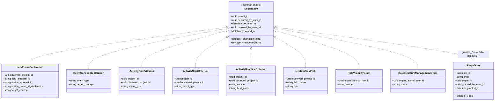

<!-- DERIVED from lib/the_band/ontology/seon/spo/schemas/item_phase_declaration.ex:42-53,
     event_concept_declaration.ex:30-40, activity_end_criterion.ex:37-50,
     activity_start_criterion.ex:43-57, activity_deadline_criterion.ex:31-45;
     lib/the_band/ontology/continuum/smpo/schemas/iteration_field_role.ex:20-31;
     lib/the_band/ontology/seon/eo/schemas/role_visibility_grant.ex:32-43,
     role_structure_management_grant.ex:44-54;
     lib/the_band/tenants/access/scope_grant.ex:22-33;
     the knowledge base rules cited in the schemas — `github.project_item_status` in
     item_phase_declaration.ex:40, `github.timeline_event_vocabulary` in
     event_concept_declaration.ex:28;
     and the migrations 20260915120000, 20260915180000, 20260915200000, 20260825140000,
     20260827020000, 20260827040000, 20260827060000, 20260828160856, 20260907190000
     — on 2026-09-18. Checked against the code on this date. Regenerate when the source changes. -->

# Classes — the organization's declarations

**Nine schemas out of 65**, and the subsystem that answers *what this organization states about its
own process*. Three of them were born on 2026-09-15 with feature 066 and were not in any
diagram; the other six already appeared in
[`projetos-e-processo.md`](projetos-e-processo.md) and
[`eo-estrutura-organizacional.md`](eo-estrutura-organizacional.md), by context.

Here they appear together by **shape**, and the shape is what is learned once: whoever understands one
understands all nine.

The corresponding ERD is [`banco/declaracoes-da-organizacao.md`](../banco/declaracoes-da-organizacao.md);
the state machine is [`estados/declaracao-revogavel.md`](../estados/declaracao-revogavel.md).

## The diagram

> **The `Declaracao` box does not exist in the code.** There is no `behaviour`, `use`, macro or common
> module: the nine repeat the four fields by hand. It is in the diagram because **it is what is
> learned**, and the dashed arrow says "has this shape", not "implements this interface".
>
> This is a fact of the model, not a criticism: nine repetitions of four fields is less coupling
> than a macro nobody can read. But whoever adds the tenth needs to know that
> **nothing in the compiler will remind them of the four fields.**

## Class → schema → table → ontology concept

| Class | Schema | Table | Concept / rule |
|---|---|---|---|
| `ItemPhaseDeclaration` | `SPO.Schemas.ItemPhaseDeclaration` (`item_phase_declaration.ex:42`) | `spo_item_phase_declarations` | targets of `github.project_item_status` |
| `EventConceptDeclaration` | `SPO.Schemas.EventConceptDeclaration` (`event_concept_declaration.ex:30`) | `spo_event_concept_declarations` | targets of `github.timeline_event_vocabulary` |
| `ActivityEndCriterion` | `SPO.Schemas.ActivityEndCriterion` (`activity_end_criterion.ex:37`) | `spo_activity_end_criteria` | `spo.activity_end_criterion` |
| `ActivityStartCriterion` | `SPO.Schemas.ActivityStartCriterion` (`activity_start_criterion.ex:43`) | `spo_activity_start_criteria` | `spo.criterion_determines_start` |
| `ActivityDeadlineCriterion` | `SPO.Schemas.ActivityDeadlineCriterion` (`activity_deadline_criterion.ex:31`) | `spo_activity_deadline_criteria` | activity deadline (#368) |
| `IterationFieldRole` | `SMPO.Schemas.IterationFieldRole` (`iteration_field_role.ex:20`) | `smpo_iteration_field_roles` | role of the iteration field |
| `RoleVisibilityGrant` | `EO.Schemas.RoleVisibilityGrant` (`role_visibility_grant.ex:32`) | `eo_role_visibility_grants` | visibility by organizational role |
| `RoleStructureManagementGrant` | `EO.Schemas.RoleStructureManagementGrant` (`role_structure_management_grant.ex:44`) | `eo_role_structure_management_grants` | structure management by role |
| `ScopeGrant` | `Tenants.Access.ScopeGrant` (`scope_grant.ex:22`) | `access_scope_grants` | — *(not ontology; it is platform access)* |

`RoleStructureManagementGrant` **was not in any class diagram** before this document, although the
table was already in the ERD of [`banco/eo-e-acesso.md`](../banco/eo-e-acesso.md). It is the gap this
document closes on the class side.

## The nulls that mean something

| Field | Null means |
|---|---|
| `revoked_at` | **in force** — the declaration holds now |
| `revoked_by_user_id` | in force (always goes with the previous one) |
| `project_id` **or** `observed_project_id` | *the target is the other one* — never both null: there is a `CHECK` |
| `declared_by_user_id` | **should not happen**: the changesets require it, and the FK's `on_delete: :nilify_all` nulls it if the account is deleted |

The last one deserves attention from whoever reads a screen: a declaration with a null author is a
declaration whose **authoring account was removed**, not a declaration without an author. The two look
the same on screen and are different in the world.

## What `target_concept` is, and why it is a `string`

In the two declarations of 066, the target is free text validated against the **knowledge base**, not
an `Ecto.Enum`. The reason is written down:

> *"Freezing the list in the database would make the platform refuse a new target of the network as if
> it were a typo."* (*"Congelar a lista no banco faria a plataforma recusar um destino novo da rede
> como se fosse erro de escrita."*) — `20260915120000:30-31`

Validation happens in the changeset, against the targets the rule admits at that moment
(`item_phase_declaration.ex` and `event_concept_declaration.ex`, via `KnowledgeBase`). Whoever adds a
concept to the network **does not need a migration**.

And there are two values that look "empty" and are not:

| Value | What it states |
|---|---|
| `nao_diz_fase` | *"this column says nothing about the phase"* — a **recorded** refusal, not the absence of a decision |
| `nao_nomeado` | *"the network does not name this event"* — likewise |

> *"Recording that the network does not name an event is different from never having decided. The
> first is a decision that can be consulted; the second is a gap."* — `event_concept_declaration.ex:14-15`

## `option_external_id` × `option_name_at_declaration`

The pair exists because identity and label change at different paces:

> *"Renaming *Done* to *Concluído* on the board cannot undo the decision silently.
> `option_name_at_declaration` keeps the name at the time, so the screen shows both when they
> diverge — information, not error."* — `item_phase_declaration.ex:13-16`

It is the same pattern as `performer_id` × `performer_login` in the performed activity: **one
identifies, the other is what was seen written**.

## Ecto associations: zero

None of these nine schemas declares `belongs_to`, `has_many`, `has_one` or `many_to_many`. All links
are raw `:binary_id` fields, resolved by an explicit `join` in the queries — even when the FK
**exists in the database** (and it does: see the
[ERD](../banco/declaracoes-da-organizacao.md#what-is-a-declared-fk-and-what-is-raw)).

This is not a peculiarity of this family: it is the rule of the whole platform, measured in
[`mapa-dos-schemas.md`](mapa-dos-schemas.md#the-three-associations).

## What the diagram does not show

- `id`, `inserted_at`, `updated_at` — present in all nine.
- **The changesets and validations.** Each schema has `declarar_changeset/2` and
  `revogar_changeset/2`; the target and single-target validations are in the code and named in the
  [ERD](../banco/declaracoes-da-organizacao.md#the-check-constraints).
- **The command modules** — `SPO.ItemPhase`, `SPO.EventConcept`, `SPO.EndCriterion`,
  `SPO.StartCriterion`, `SPO.DeadlineCriterion`, `SMPO.FieldRoles`, `EO.Visibility`,
  `EO.StructureGrants`, `Tenants.Access`. One per schema, and it is where the transition happens;
  they are listed in
  [`estados/declaracao-revogavel.md`](../estados/declaracao-revogavel.md#where-each-transition-happens-and-what-proves-it).
- **Resolution at read time.** None of these declarations rewrites observed data; the item's phase
  and the event's concept are applied **in the query**. It is the most important design decision of
  066, and a class diagram has no way to show it.
