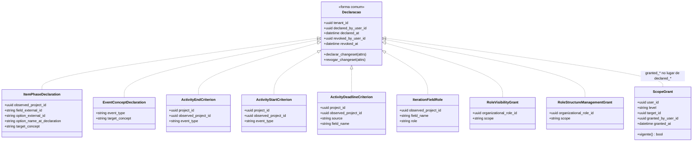

<!-- DERIVADO de lib/the_band/ontology/seon/spo/schemas/item_phase_declaration.ex:42-53,
     event_concept_declaration.ex:30-40, activity_end_criterion.ex:37-50,
     activity_start_criterion.ex:43-57, activity_deadline_criterion.ex:31-45;
     lib/the_band/ontology/continuum/smpo/schemas/iteration_field_role.ex:20-31;
     lib/the_band/ontology/seon/eo/schemas/role_visibility_grant.ex:32-43,
     role_structure_management_grant.ex:44-54;
     lib/the_band/tenants/access/scope_grant.ex:22-33;
     as regras da base citadas nos schemas — `github.project_item_status` em
     item_phase_declaration.ex:40, `github.timeline_event_vocabulary` em
     event_concept_declaration.ex:28;
     e as migrações 20260915120000, 20260915180000, 20260915200000, 20260825140000,
     20260827020000, 20260827040000, 20260827060000, 20260828160856, 20260907190000
     — em 2026-09-18. Conferido contra o código nesta data. Regenerar ao mudar a fonte. -->

# Classes — as declarações da organização

**Nove schemas de 65**, e o subsistema que responde *o que esta organização afirma sobre o
próprio processo*. Três deles nasceram em 2026-09-15 com a feature 066 e não estavam em
diagrama nenhum; os outros seis já apareciam em
[`projetos-e-processo.md`](projetos-e-processo.md) e
[`eo-estrutura-organizacional.md`](eo-estrutura-organizacional.md), pelo contexto.

Aqui aparecem juntos por **forma**, e a forma é o que se aprende uma vez: quem entende uma
entende as nove.

O ERD correspondente é [`banco/declaracoes-da-organizacao.md`](../banco/declaracoes-da-organizacao.md);
a máquina de estados é [`estados/declaracao-revogavel.md`](../estados/declaracao-revogavel.md).

## O diagrama

> **A caixa `Declaracao` não existe no código.** Não há `behaviour`, `use`, macro nem módulo
> comum: as nove repetem os quatro campos à mão. Ela está no diagrama porque **é o que se
> aprende**, e a seta tracejada diz "tem esta forma", não "implementa esta interface".
>
> Isso é fato do modelo, e não crítica: nove repetições de quatro campos é menos acoplamento
> que uma macro que ninguém consegue ler. Mas quem for acrescentar a décima precisa saber que
> **nada no compilador vai lembrá-la dos quatro campos.**

## Classe → schema → tabela → conceito da ontologia

| Classe | Schema | Tabela | Conceito / regra |
|---|---|---|---|
| `ItemPhaseDeclaration` | `SPO.Schemas.ItemPhaseDeclaration` (`item_phase_declaration.ex:42`) | `spo_item_phase_declarations` | destinos de `github.project_item_status` |
| `EventConceptDeclaration` | `SPO.Schemas.EventConceptDeclaration` (`event_concept_declaration.ex:30`) | `spo_event_concept_declarations` | destinos de `github.timeline_event_vocabulary` |
| `ActivityEndCriterion` | `SPO.Schemas.ActivityEndCriterion` (`activity_end_criterion.ex:37`) | `spo_activity_end_criteria` | `spo.activity_end_criterion` |
| `ActivityStartCriterion` | `SPO.Schemas.ActivityStartCriterion` (`activity_start_criterion.ex:43`) | `spo_activity_start_criteria` | `spo.criterion_determines_start` |
| `ActivityDeadlineCriterion` | `SPO.Schemas.ActivityDeadlineCriterion` (`activity_deadline_criterion.ex:31`) | `spo_activity_deadline_criteria` | prazo da atividade (#368) |
| `IterationFieldRole` | `SMPO.Schemas.IterationFieldRole` (`iteration_field_role.ex:20`) | `smpo_iteration_field_roles` | papel do campo de iteração |
| `RoleVisibilityGrant` | `EO.Schemas.RoleVisibilityGrant` (`role_visibility_grant.ex:32`) | `eo_role_visibility_grants` | visibilidade por papel organizacional |
| `RoleStructureManagementGrant` | `EO.Schemas.RoleStructureManagementGrant` (`role_structure_management_grant.ex:44`) | `eo_role_structure_management_grants` | gestão da estrutura por papel |
| `ScopeGrant` | `Tenants.Access.ScopeGrant` (`scope_grant.ex:22`) | `access_scope_grants` | — *(não é ontologia; é acesso da plataforma)* |

`RoleStructureManagementGrant` **não estava em nenhum diagrama de classes** antes deste
documento, embora a tabela já estivesse no ERD de
[`banco/eo-e-acesso.md`](../banco/eo-e-acesso.md). É a lacuna que este documento fecha no lado
das classes.

## Os nulos que significam

| Campo | Nulo significa |
|---|---|
| `revoked_at` | **vigente** — a declaração vale agora |
| `revoked_by_user_id` | vigente (anda sempre com o anterior) |
| `project_id` **ou** `observed_project_id` | *o alvo é o outro* — nunca os dois nulos: há `CHECK` |
| `declared_by_user_id` | **não deveria acontecer**: os changesets o exigem, e o `on_delete: :nilify_all` da FK o anula se a conta for apagada |

O último merece atenção de quem lê uma tela: uma declaração com autor nulo é uma declaração
cuja **conta autora foi removida**, e não uma declaração sem autor. As duas coisas parecem
iguais na tela e são diferentes no mundo.

## O que o `target_concept` é, e por que é `string`

Nas duas declarações da 066, o destino é texto livre validado contra a **base de conhecimento**,
e não um `Ecto.Enum`. A razão está escrita:

> *"Congelar a lista no banco faria a plataforma recusar um destino novo da rede como se fosse
> erro de escrita."* — `20260915120000:30-31`

A validação acontece no changeset, contra os destinos que a regra admite naquele momento
(`item_phase_declaration.ex` e `event_concept_declaration.ex`, via `KnowledgeBase`). Quem
acrescentar um conceito na rede **não precisa de migração**.

E há dois valores que parecem "vazio" e não são:

| Valor | O que afirma |
|---|---|
| `nao_diz_fase` | *"esta coluna não diz nada sobre a fase"* — recusa **registrada**, e não ausência de decisão |
| `nao_nomeado` | *"a rede não nomeia este evento"* — idem |

> *"Registrar que a rede não nomeia um evento é diferente de nunca ter decidido. A primeira é
> decisão consultável; a segunda é lacuna."* — `event_concept_declaration.ex:14-15`

## `option_external_id` × `option_name_at_declaration`

O par existe porque a identidade e o rótulo mudam em ritmos diferentes:

> *"Renomear *Done* para *Concluído* no quadro não pode desfazer a decisão em silêncio.
> `option_name_at_declaration` guarda o nome de então, para a tela mostrar os dois quando
> divergirem — informação, não erro."* — `item_phase_declaration.ex:13-16`

É o mesmo padrão de `performer_id` × `performer_login` na atividade executada: **um identifica,
o outro é o que se viu escrito**.

## Associações Ecto: zero

Nenhum destes nove schemas declara `belongs_to`, `has_many`, `has_one` ou `many_to_many`. Todas
as ligações são campos `:binary_id` crus, resolvidos por `join` explícito nas consultas — mesmo
quando a FK **existe no banco** (e existe: ver o
[ERD](../banco/declaracoes-da-organizacao.md#o-que-é-fk-declarada-e-o-que-é-cru)).

Isso não é peculiaridade desta família: é a regra da plataforma inteira, medida em
[`mapa-dos-schemas.md`](mapa-dos-schemas.md#as-três-associações).

## O que o diagrama não mostra

- `id`, `inserted_at`, `updated_at` — presentes nos nove.
- **Os changesets e as validações.** Cada schema tem `declarar_changeset/2` e
  `revogar_changeset/2`; as validações de destino e de alvo único estão no código e nomeadas no
  [ERD](../banco/declaracoes-da-organizacao.md#as-restrições-check).
- **Os módulos de comando** — `SPO.ItemPhase`, `SPO.EventConcept`, `SPO.EndCriterion`,
  `SPO.StartCriterion`, `SPO.DeadlineCriterion`, `SMPO.FieldRoles`, `EO.Visibility`,
  `EO.StructureGrants`, `Tenants.Access`. Um por schema, e é onde a transição acontece;
  estão listados em
  [`estados/declaracao-revogavel.md`](../estados/declaracao-revogavel.md#onde-cada-transição-acontece-e-o-que-a-prova).
- **A resolução na leitura.** Nenhuma destas declarações regrava dado observado; a fase do item
  e o conceito do evento são aplicados **na consulta**. É a decisão de desenho mais importante
  da 066, e um diagrama de classes não tem como mostrá-la.
