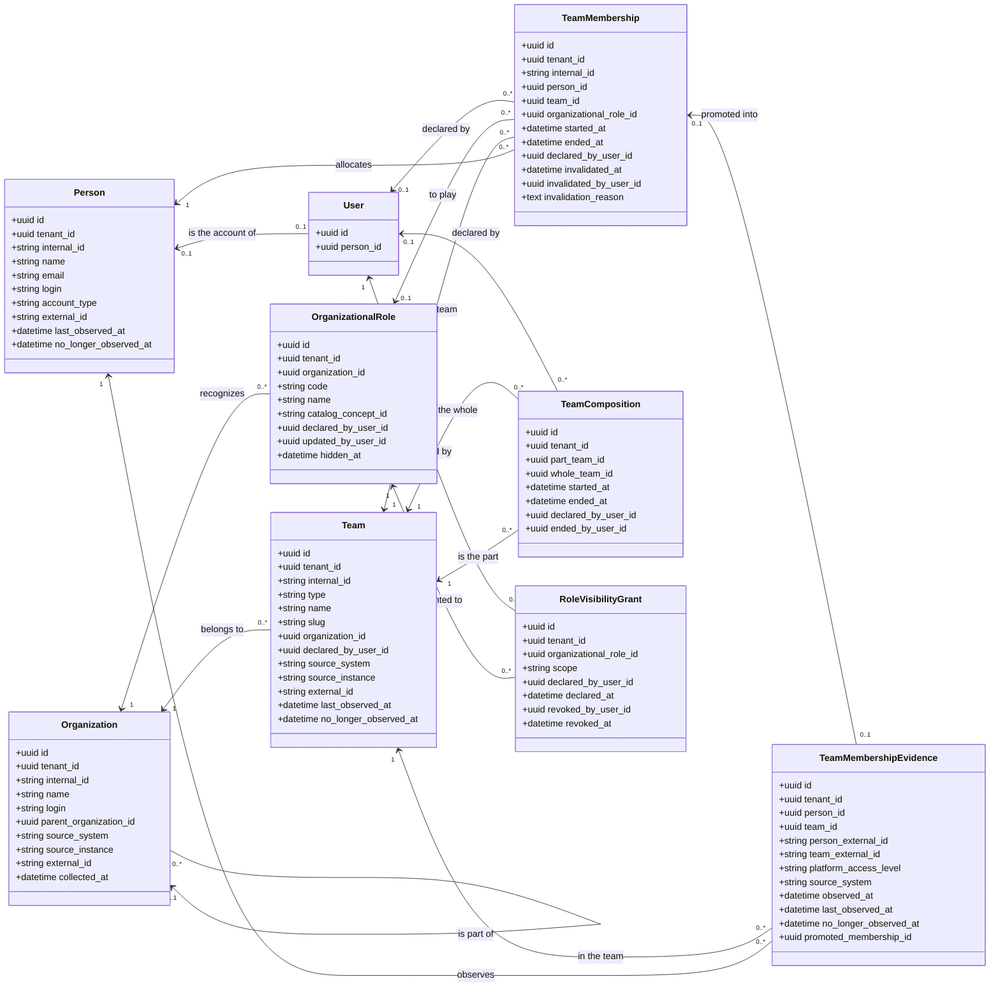

# Classes — EO, the organizational structure

<!-- DERIVED from lib/the_band/ontology/seon/eo/schemas/*.ex (organization.ex:20-39,
     person.ex:28-59, team.ex:29-55, organizational_role.ex:44-63,
     team_membership.ex:52-79, team_membership_evidence.ex:28-50,
     team_composition.ex:32-45, role_visibility_grant.ex:32-43);
     priv/repo/migrations/20260809120200_create_eo_information_model.exs:25-179,
     20260809120300_create_eo_team_membership_evidence.exs:17-65,
     20260810100000_rename_sectors_to_organizational_units.exs:21,
     20260810140200_allow_evidence_without_access_level.exs:44-58,
     20260810150000_require_organization_on_organizational_team.exs:39-43,
     20260814140000_papel_declarado_tem_autor.exs:33-42,
     20260816210000_project_lifecycle_and_links.exs:24-25,
     20260824180000_papeis_por_organizacao.exs:53-77,
     20260827050000_qual_pessoa_observada_e_a_conta.exs:69-71,
     20260827060000_concessao_de_visibilidade.exs:45-74,
     20260901230000_composicao_de_equipes_e_o_equivoco.exs:43-112,
     20260902010000_nome_unico_da_equipe_declarada.exs:27-30,
     20260906230000_vinculo_observado.exs:37-46;
     priv/knowledge_base/ontology/seon/eo/modules/organizational_structure.yaml:15-282;
     priv/knowledge_base/rules/github_team_membership_evidence.yaml:77-94
     on 2026-09-07. Checked against the code on this date. Regenerate when the source changes. -->

A single subsystem: **who the organization is, who the person is, what the team is, and what links one
to the other**. What measures work (SPO, WorkItems, Quality), what describes a profile
(`eo_person_profiles`) and what keeps credentials stay out — each one calls for its own diagram.

## The diagram

`TeamMembership` and `TeamComposition` are **relators**: they reify a relation and carry its period
and author (`organizational_structure.yaml:142`; migration `20260901230000:12-18`).
`TeamMembershipEvidence` is **observation**, not domain: it keeps what the source showed.
`RoleVisibilityGrant` is a **declaration** about what a role allows. `User` comes in only as a
boundary — it belongs to feature 045, and five foreign keys of this EO point to it.

## The null that means something

Half of this model is in the empty columns. Each row below is a statement the platform makes
**by absence**, and that the screen needs to say in text.

| Null field | Class | What it means | Source |
|---|---|---|---|
| `organizational_role_id` | TeamMembership | **role not declared** — it is the *observed* team membership, created by collection | `team_membership.ex:59,99-102`; migration `20260906230000:15-20,37` |
| `declared_by_user_id` | TeamMembership | **nobody stated it** — it came from collection, not from someone typing; a false author lies more than an absent author | `team_membership.ex:36-41,64`; migration `20260814140000:11-13` |
| `started_at` | TeamMembership | **since when is unknown** — never "started today" nor `observed_at` | `team_membership.ex:30-31`; `commands.ex:723-725,1362-1369` |
| `ended_at` | TeamMembership | **in force** — the person is on the team | `team_membership.ex:33-34`; `queries.ex:445-453` |
| `invalidated_at` | TeamMembership | **there was no mistake** — the team membership really held | migration `20260901230000:20-32,104-112` |
| `promoted_membership_id` | TeamMembershipEvidence | the source shows the person and **there is no team membership**: the organization already declared an exit or a mistake, and collection does not create one over it | `commands.ex:648-654`; `team_membership_evidence.ex:113-116` |
| `no_longer_observed_at` | TeamMembershipEvidence, Person, Team | the source **still lists it** — observation is continuous | `commands.ex:793-826`; `team_membership_evidence.ex:41` |
| `platform_access_level` | TeamMembershipEvidence | the source **does not know** this team membership (derived team); writing `MEMBER` to fill it would make "observed as a regular member" and "the source ignores it" indistinguishable | `team_membership_evidence.ex:94-111`; migration `20260810140200:44-58` |
| `ended_at` | TeamComposition | **composition in force** | `team_composition.ex:8`; migration `20260901230000:63-68` |
| `ended_by_user_id` | TeamComposition | in force, **or** ended by a path that did not record an author | `team_composition.ex:11` |
| `revoked_at` | RoleVisibilityGrant | **grant in force** — revoking is marking, never deleting | migration `20260827060000:36-40,69-74` |
| `hidden_at` | OrganizationalRole | role **visible** in the list; hiding is not deleting, and team memberships already using it remain valid | `organizational_role.ex:16-17` |
| `catalog_concept_id` | OrganizationalRole | role **declared by the organization**, not coming from the SRO catalog | `organizational_role.ex:11-12`; `role_catalog.ex:7,46` |
| `parent_organization_id` | Organization | **root** organization — not part of another | `organization.ex:27` |
| `person_id` (in `users`) | User | **account without a declared person** — its own block, distinct from "no grant" | `visibility.ex:18-19`; `specs/060-tela-da-equipe/data-model.md` §2 |

**The null that does not exist, and should**: `eo_team_compositions.started_at` is `null: false`
(migration `20260901230000:52`) and `compose_teams/4` writes `agora` (`commands.ex:233`). *"Part of it
since an unknown time"* **cannot be expressed today** — it is the gap that FR-037 of spec 060 closes in
PR 2 (`specs/060-tela-da-equipe/spec.md` FR-037; `data-model.md` §5).

## Class → schema → table → concept

| Class | Schema | Table (migration) | Ontology concept |
|---|---|---|---|
| Organization | `schemas/organization.ex:20-39` | `eo_organizations` (`20260809120200:25`) | `eo.organization` (`organizational_structure.yaml:16-21`) |
| Person | `schemas/person.ex:28-59` | `eo_people` (`20260809120200:53`) | `eo.person` (`:72-82`) |
| Team | `schemas/team.ex:29-55` | `eo_teams` (`20260809120200:119`; `20260816210000:24-25`) | `eo.team` (`:94-99`); `type` decides between `eo.organizational_team` (`:101-107`) and `eo.project_team` (`:109-115`) |
| OrganizationalRole | `schemas/organizational_role.ex:44-63` | `eo_organizational_roles` (`20260809120200:102`, rewritten in `20260824180000:53-77`) | `eo.organizational_role` (`:84-92`) |
| TeamMembership | `schemas/team_membership.ex:52-79` | `eo_team_memberships` (`20260809120200:157`; `20260814140000:33`; `20260901230000:76-112`; `20260906230000:37-46`) | `eo.team_membership` (`:134-147`) |
| TeamMembershipEvidence | `schemas/team_membership_evidence.ex:28-50` | `eo_team_membership_evidence` (`20260809120300:17`) | **no ontology concept** — declared as `observed_link` in the rule `github_team_membership_evidence.yaml:77-94` |
| TeamComposition | `schemas/team_composition.ex:32-45` | `eo_team_compositions` (`20260901230000:43`) | **no concept** — the ontology declares the **relation** `eo.team_part_of_team` (`:165`), which this table reifies with author and period |
| RoleVisibilityGrant | `schemas/role_visibility_grant.ex:32-43` | `eo_role_visibility_grants` (`20260827060000:45`) | **not declared in the base** — gap from #369 |
| — | — | `eo_organizational_units` (`20260809120200:87` as `eo_sectors`, renamed in `20260810100000:21`) | `eo.organizational_unit` (`:23-43`) |
| — | — | — | `eo.team_member` (`:117-132`) — a role, deliberately without a table: identity stays in `eo.person` |
| — | — | — | `eo.organizational_part` (`:45-70`) — `role_mixin`, without a table |

## Invariants the diagram does not show

The class model draws neither partial indexes nor `CHECK`s, and that is where the rules live.

| Invariant | Where | What it prevents |
|---|---|---|
| `eo_team_memberships_vigente_index` on `(tenant_id, person_id, team_id, organizational_role_id) WHERE ended_at IS NULL AND invalidated_at IS NULL` | `20260901230000:95-100` | the same person allocated twice to the **same** role in force. Allows two different roles, and allows the same role in distinct periods |
| `eo_team_memberships_observado_vigente_index` on `(tenant_id, person_id, team_id) WHERE ended_at IS NULL AND invalidated_at IS NULL AND organizational_role_id IS NULL` | `20260906230000:40-46` | the duplicated **observed** team membership. Nulls do not collide in a unique index — without this one, collection would duplicate |
| `eo_equivoco_do_vinculo_completo` (CHECK) | `20260901230000:104-112` | a half-recorded mistake: either all three null, or all three filled |
| `eo_composicao_vigente_de_equipe_index` on `(tenant_id, part_team_id, whole_team_id) WHERE ended_at IS NULL` | `20260901230000:63-68` | the same composition in force twice. **The cycle is not prevented here** — an index does not see paths; the refusal is the application's (`commands.ex:285-328`) |
| `eo_concessao_vigente_do_papel_index` on `(tenant_id, organizational_role_id, scope) WHERE revoked_at IS NULL` | `20260827060000:69-74` | the second grant in force for the same role and reach |
| `eo_nome_unico_da_equipe_declarada_index` on `(tenant_id, organization_id, name) WHERE source_instance = 'declared'` | `20260902010000:27-30` | two **declared** teams with the same name. Observed ones stay out: refusing what the source states would be the opposite of what the platform should do |
| unique on `eo_organizational_roles (tenant_id, organization_id, code)` | `20260824180000:69` | a repeated code **in the same organization**; the same code in another organization is not a conflict |
| `papel_tem_uma_origem_so` (CHECK) | `20260824180000:77` | a role that is from the catalog **and** declared at the same time |
| `eo_teams_organizational_team_has_organization` (CHECK) | `20260810150000:39-43` | an organizational team without an organization |
| `eo_teams_type_check`, `eo_people_account_type_check` (CHECK) | `20260809120200:149`, `:82` | `type` outside `organizational_team`/`project_team`; `account_type` outside `person`/`bot`/`app` |
| `eo_evidence_github_has_access_level` (CHECK) | `20260810140200:47-58` | GitHub evidence without an access level — and allows the null where the source does not know the team membership |
| unique on `users (person_id) WHERE person_id IS NOT NULL AND person_revoked_at IS NULL` | `20260827050000:69-71` | two accounts in force pointing to the same person — it is the link `pode_ver_equipe/3` reads |

## What was left out of the diagram, and why

- **`inserted_at`, `updated_at`, `record_version`** — in every class. They neither decide behaviour
  nor delimit validity.
- **`outcome`** (`:created | :updated | :unchanged`) in Organization, Person, Team and
  TeamMembershipEvidence — a **virtual** field: it describes what happened in the call, not the record
  (`organization.ex:36`, `person.ex:29`, `team.ex:24`, `team_membership_evidence.ex:47`). It is not a
  column, on purpose.
- **`eo_person_profiles`** (`schemas/person_profile.ex`) — demonstrated profile; the profiles
  subsystem, not the structure one.
- **`internal_id`** appears only where it carries a rule: in TeamMembership the prefix
  `observed_<evidence id>` is **deterministic**, and it is what makes reprocessing recognize instead
  of duplicate (`commands.ex:727-728`; migration `20260906230000:29-31`).
- **`access_scope_grants`** — scopes per **account**, feature 045. EO decides by **role**; the
  account is another conversation, and mixing them was refused (`plan.md` of 060, D5).
- **`spo_project_teams`** (team ↔ project link) — belongs to SPO; it goes into the projects diagram.
- **`eo_sync_*`, `eo_organizations.collected_at` of the derived entities** and the rest of the
  collection provenance — they fit in the ingestion diagram.

## Divergences found

Each one has two readings, and none is chosen here.

1. **`eo_role_visibility_grants` exists in the code and is not declared in the base.** The table is born
   in `20260827060000:45`, `visibility.ex` reads it, and `priv/knowledge_base/ontology/seon/eo/` has no
   concept for it. *Reading A*: it is a gap inherited from #369 — the decision was made and the YAML
   never written. *Reading B*: visibility grant is not a concept of the reference EO and therefore
   would have no place in the module. PR 1 of feature 060 resolves it by reading A and declares **both**
   grants together in `role_grants.yaml` (`specs/060-tela-da-equipe/data-model.md` §3.1;
   `plan.md`, principle IV table). **Whom to take it to**: whoever maintains the base — the proposed UFO
   category (`normative_description`/`kind`) is open question 4 of `plan.md`.

2. **`eo.membership_to_play_role` has cardinality `one` and the column admits null.**
   `organizational_structure.yaml:268` declares that every team membership has a role;
   `20260906230000:37` made `organizational_role_id` nullable. *Reading A*: it is a conscious deviation
   from the reference ontology, recorded in ADR 0008 (`docs/adr/0008-vinculo-observado.md:92-99`)
   — the relator is materialized with the role **declared as absent**. *Reading B*: the YAML cardinality
   lies about what the database accepts, and should become `zero_or_one` with a note. **Whom to take it
   to**: whoever maintains the base. The ADR records the deviation; the YAML does not.

3. **`eo_team_compositions` has no concept, only a relation.** The table reifies
   `eo.team_part_of_team` (`:165`) with `started_at`, `ended_at`, `declared_by_user_id` and
   `ended_by_user_id` — four attributes the relation does not have. *Reading A*: the relation is enough,
   and provenance belongs to the platform. *Reading B*: where there is period and author there is a
   relator, and a relator calls for a concept — that was the argument that created `eo.team_membership`.
   **Whom to take it to**: whoever maintains the base.

4. **`eo_team_membership_evidence` is declared in a rule, not in a module.**
   `github_team_membership_evidence.yaml:77-94` declares it as `observed_link` with
   `persisted_as: team_membership_evidence`. It is consistent with "external source is not domain"
   (principle II), and it is recorded that looking for `eo.team_membership_evidence` in the ontology
   finds nothing — on purpose.

5. **`eo_organizational_units` is a table with no schema and no reader.** Created as `eo_sectors`
   (`20260809120200:87`), renamed in `20260810100000:21`, and `grep -rn eo_organizational_units lib/`
   returns **zero**. The concept `eo.organizational_unit` exists in the base (`:23-43`). *Reading A*: it
   is planned structure not yet used. *Reading B*: it is a dead table that confuses whoever reads the
   database. **Whom to take it to**: Software Architect.

6. **`eo.team_membership` in the YAML declares two attributes; the table has twelve.**
   `organizational_structure.yaml:143-145` lists `started_at` and `ended_at`. Left out are
   `declared_by_user_id` and the mistake trio. The declared position is that they are **provenance of
   the declaration, not semantics of the relator** (`specs/060-tela-da-equipe/data-model.md` §5). It is
   recorded as a position, not as a finding — but whoever reads the YAML to know what the team
   membership carries does not find the mistake.

## `[NEEDS CLARIFICATION]`

- **The fourth combination of (role, author) has no name.** The changeset refuses *author without
  role* (`team_membership.ex:115-122`) and does **not** refuse *role without author* — which is what
  `EO.allocate/2` writes when the caller does not pass `declared_by_user_id`, as in
  `test/the_band_web/live/equipe_composta_test.exs:70-78`. The roster's origin reading is
  `declared_by_user_id` null or filled (`data-model.md` §4.1), so this team membership would appear as
  **observed carrying a declared role** — and the screen has no word for it.
  Question: is it a legitimate state, and the screen gains a fourth label, or is it an incomplete call
  to be closed in the changeset? **To whom**: Software Architect and Product Owner.
