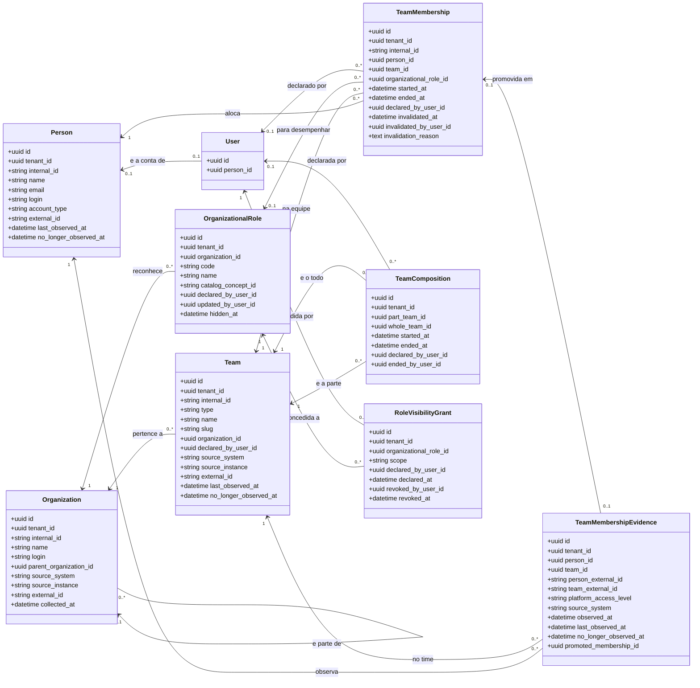

# Classes — EO, a estrutura organizacional

<!-- DERIVADO de lib/the_band/ontology/seon/eo/schemas/*.ex (organization.ex:20-39,
     person.ex:28-59, team.ex:29-55, organizational_role.ex:44-63,
     team_membership.ex:52-79, team_membership_evidence.ex:28-50,
     team_composition.ex:32-45, role_visibility_grant.ex:32-43);
     priv/repo/migrations/20260809120200_create_eo_information_model.exs:25-179,
     20260809120300_create_eo_team_membership_evidence.exs:17-65,
     20260810100000_rename_sectors_to_organizational_units.exs:21,
     20260810140200_allow_evidence_without_access_level.exs:44-58,
     20260810150000_require_organization_on_organizational_team.exs:39-43,
     20260814140000_papel_declarado_tem_autor.exs:33-42,
     20260816210000_project_lifecycle_and_links.exs:24-25,
     20260824180000_papeis_por_organizacao.exs:53-77,
     20260827050000_qual_pessoa_observada_e_a_conta.exs:69-71,
     20260827060000_concessao_de_visibilidade.exs:45-74,
     20260901230000_composicao_de_equipes_e_o_equivoco.exs:43-112,
     20260902010000_nome_unico_da_equipe_declarada.exs:27-30,
     20260906230000_vinculo_observado.exs:37-46;
     priv/knowledge_base/ontology/seon/eo/modules/organizational_structure.yaml:15-282;
     priv/knowledge_base/rules/github_team_membership_evidence.yaml:77-94
     em 2026-09-07. Conferido contra o código nesta data. Regenerar ao mudar a fonte. -->

Um subsistema só: **quem é a organização, quem é a pessoa, o que é a equipe, e o que liga uma à
outra**. O que mede trabalho (SPO, WorkItems, Quality), o que descreve perfil
(`eo_person_profiles`) e o que guarda credencial ficam de fora — cada um pede o seu diagrama.

## O diagrama

`TeamMembership` e `TeamComposition` são **relatores**: reificam uma relação e carregam o período
e o autor dela (`organizational_structure.yaml:142`; migração `20260901230000:12-18`).
`TeamMembershipEvidence` é **observação**, não domínio: guarda o que a origem mostrou.
`RoleVisibilityGrant` é **declaração** sobre o que um papel permite. `User` entra só como
fronteira — é da feature 045, e cinco chaves estrangeiras desta EO apontam para ela.

## O nulo que significa

Metade deste modelo está nas colunas vazias. Cada linha abaixo é uma afirmação que a plataforma
faz **por ausência**, e que a tela precisa dizer em texto.

| Campo nulo | Classe | O que significa | Fonte |
|---|---|---|---|
| `organizational_role_id` | TeamMembership | **papel não declarado** — é o vínculo *observado*, criado pela coleta | `team_membership.ex:59,99-102`; migração `20260906230000:15-20,37` |
| `declared_by_user_id` | TeamMembership | **ninguém afirmou** — veio da coleta, não de alguém digitando; autor falso mente mais que autor ausente | `team_membership.ex:36-41,64`; migração `20260814140000:11-13` |
| `started_at` | TeamMembership | **desde quando não se sabe** — nunca "começou hoje" nem `observed_at` | `team_membership.ex:30-31`; `commands.ex:723-725,1362-1369` |
| `ended_at` | TeamMembership | **vigente** — a pessoa está na equipe | `team_membership.ex:33-34`; `queries.ex:445-453` |
| `invalidated_at` | TeamMembership | **não houve equívoco** — o vínculo vigeu de verdade | migração `20260901230000:20-32,104-112` |
| `promoted_membership_id` | TeamMembershipEvidence | a origem mostra a pessoa e **não há vínculo**: a organização já declarou saída ou equívoco, e a coleta não cria por cima | `commands.ex:648-654`; `team_membership_evidence.ex:113-116` |
| `no_longer_observed_at` | TeamMembershipEvidence, Person, Team | a origem **ainda lista** — a observação é contínua | `commands.ex:793-826`; `team_membership_evidence.ex:41` |
| `platform_access_level` | TeamMembershipEvidence | a origem **não conhece** este vínculo (equipe derivada); gravar `MEMBER` para preencher tornaria "observado como membro comum" e "a origem ignora" indistinguíveis | `team_membership_evidence.ex:94-111`; migração `20260810140200:44-58` |
| `ended_at` | TeamComposition | **composição vigente** | `team_composition.ex:8`; migração `20260901230000:63-68` |
| `ended_by_user_id` | TeamComposition | vigente, **ou** encerrada por caminho que não gravou autor | `team_composition.ex:11` |
| `revoked_at` | RoleVisibilityGrant | **concessão vigente** — revogar é marcar, nunca apagar | migração `20260827060000:36-40,69-74` |
| `hidden_at` | OrganizationalRole | papel **visível** na lista; ocultar não é apagar, e vínculos que já o usam continuam válidos | `organizational_role.ex:16-17` |
| `catalog_concept_id` | OrganizationalRole | papel **declarado pela organização**, não vindo do catálogo SRO | `organizational_role.ex:11-12`; `role_catalog.ex:7,46` |
| `parent_organization_id` | Organization | organização **raiz** — não é parte de outra | `organization.ex:27` |
| `person_id` (em `users`) | User | **conta sem pessoa declarada** — bloqueio próprio, distinto de "sem concessão" | `visibility.ex:18-19`; `specs/060-tela-da-equipe/data-model.md` §2 |

**O nulo que não existe, e devia**: `eo_team_compositions.started_at` é `null: false`
(migração `20260901230000:52`) e `compose_teams/4` grava `agora` (`commands.ex:233`). *"Faz parte desde quando não se
sabe"* **não é expressável hoje** — é a lacuna que a FR-037 da spec 060 fecha na PR 2
(`specs/060-tela-da-equipe/spec.md` FR-037; `data-model.md` §5).

## Classe → schema → tabela → conceito

| Classe | Schema | Tabela (migração) | Conceito da ontologia |
|---|---|---|---|
| Organization | `schemas/organization.ex:20-39` | `eo_organizations` (`20260809120200:25`) | `eo.organization` (`organizational_structure.yaml:16-21`) |
| Person | `schemas/person.ex:28-59` | `eo_people` (`20260809120200:53`) | `eo.person` (`:72-82`) |
| Team | `schemas/team.ex:29-55` | `eo_teams` (`20260809120200:119`; `20260816210000:24-25`) | `eo.team` (`:94-99`); `type` decide entre `eo.organizational_team` (`:101-107`) e `eo.project_team` (`:109-115`) |
| OrganizationalRole | `schemas/organizational_role.ex:44-63` | `eo_organizational_roles` (`20260809120200:102`, reescrita em `20260824180000:53-77`) | `eo.organizational_role` (`:84-92`) |
| TeamMembership | `schemas/team_membership.ex:52-79` | `eo_team_memberships` (`20260809120200:157`; `20260814140000:33`; `20260901230000:76-112`; `20260906230000:37-46`) | `eo.team_membership` (`:134-147`) |
| TeamMembershipEvidence | `schemas/team_membership_evidence.ex:28-50` | `eo_team_membership_evidence` (`20260809120300:17`) | **sem conceito de ontologia** — declarada como `observed_link` na regra `github_team_membership_evidence.yaml:77-94` |
| TeamComposition | `schemas/team_composition.ex:32-45` | `eo_team_compositions` (`20260901230000:43`) | **sem conceito** — a ontologia declara a **relação** `eo.team_part_of_team` (`:165`), que esta tabela reifica com autor e período |
| RoleVisibilityGrant | `schemas/role_visibility_grant.ex:32-43` | `eo_role_visibility_grants` (`20260827060000:45`) | **não declarado na base** — lacuna da #369 |
| — | — | `eo_organizational_units` (`20260809120200:87` como `eo_sectors`, renomeada em `20260810100000:21`) | `eo.organizational_unit` (`:23-43`) |
| — | — | — | `eo.team_member` (`:117-132`) — papel, sem tabela de propósito: a identidade fica em `eo.person` |
| — | — | — | `eo.organizational_part` (`:45-70`) — `role_mixin`, sem tabela |

## Invariantes que o diagrama não mostra

O modelo de classes não desenha índice parcial nem `CHECK`, e é neles que moram as regras.

| Invariante | Onde | O que impede |
|---|---|---|
| `eo_team_memberships_vigente_index` em `(tenant_id, person_id, team_id, organizational_role_id) WHERE ended_at IS NULL AND invalidated_at IS NULL` | `20260901230000:95-100` | a mesma pessoa alocada duas vezes ao **mesmo** papel vigente. Permite dois papéis diferentes, e permite o mesmo papel em períodos distintos |
| `eo_team_memberships_observado_vigente_index` em `(tenant_id, person_id, team_id) WHERE ended_at IS NULL AND invalidated_at IS NULL AND organizational_role_id IS NULL` | `20260906230000:40-46` | o vínculo **observado** duplicado. Nulos não colidem em índice único — sem este, a coleta duplicaria |
| `eo_equivoco_do_vinculo_completo` (CHECK) | `20260901230000:104-112` | equívoco pela metade: ou os três nulos, ou os três preenchidos |
| `eo_composicao_vigente_de_equipe_index` em `(tenant_id, part_team_id, whole_team_id) WHERE ended_at IS NULL` | `20260901230000:63-68` | a mesma composição vigorando duas vezes. **O ciclo não é impedido aqui** — índice não vê caminho; a recusa é da aplicação (`commands.ex:285-328`) |
| `eo_concessao_vigente_do_papel_index` em `(tenant_id, organizational_role_id, scope) WHERE revoked_at IS NULL` | `20260827060000:69-74` | a segunda concessão vigente para o mesmo papel e alcance |
| `eo_nome_unico_da_equipe_declarada_index` em `(tenant_id, organization_id, name) WHERE source_instance = 'declared'` | `20260902010000:27-30` | duas equipes **declaradas** de mesmo nome. As observadas ficam de fora: recusar o que a origem afirma seria o oposto do que a plataforma deve fazer |
| únicos em `eo_organizational_roles (tenant_id, organization_id, code)` | `20260824180000:69` | código repetido **na mesma organização**; o mesmo código em outra organização não é conflito |
| `papel_tem_uma_origem_so` (CHECK) | `20260824180000:77` | papel que é do catálogo **e** declarado ao mesmo tempo |
| `eo_teams_organizational_team_has_organization` (CHECK) | `20260810150000:39-43` | equipe organizacional sem organização |
| `eo_teams_type_check`, `eo_people_account_type_check` (CHECK) | `20260809120200:149`, `:82` | `type` fora de `organizational_team`/`project_team`; `account_type` fora de `person`/`bot`/`app` |
| `eo_evidence_github_has_access_level` (CHECK) | `20260810140200:47-58` | evidência do GitHub sem nível de acesso — e permite o nulo onde a origem não conhece o vínculo |
| únicos em `users (person_id) WHERE person_id IS NOT NULL AND person_revoked_at IS NULL` | `20260827050000:69-71` | duas contas vigentes apontando para a mesma pessoa — é o elo que `pode_ver_equipe/3` lê |

## O que ficou de fora do diagrama, e por quê

- **`inserted_at`, `updated_at`, `record_version`** — em todas as classes. Não decidem
  comportamento nem delimitam vigência.
- **`outcome`** (`:created | :updated | :unchanged`) em Organization, Person, Team e
  TeamMembershipEvidence — campo **virtual**: descreve o que aconteceu na chamada, não o registro
  (`organization.ex:36`, `person.ex:29`, `team.ex:24`, `team_membership_evidence.ex:47`). Não é
  coluna, e é de propósito.
- **`eo_person_profiles`** (`schemas/person_profile.ex`) — perfil demonstrado; subsistema de
  perfis, não de estrutura.
- **`internal_id`** aparece só onde carrega regra: em TeamMembership o prefixo
  `observed_<id da evidência>` é **determinístico**, e é o que faz o reprocessamento reconhecer em
  vez de duplicar (`commands.ex:727-728`; migração `20260906230000:29-31`).
- **`access_scope_grants`** — escopos por **conta**, feature 045. A EO decide por **papel**; a
  conta é outra conversa, e misturá-las foi recusado (`plan.md` da 060, D5).
- **`spo_project_teams`** (vínculo equipe ↔ projeto) — é da SPO; entra no diagrama de projetos.
- **`eo_sync_*`, `eo_organizations.collected_at` das entidades derivadas** e o resto da
  proveniência de coleta — cabem no diagrama de ingestão.

## Divergências encontradas

Cada uma tem duas leituras, e nenhuma é escolhida aqui.

1. **`eo_role_visibility_grants` existe no código e não está declarada na base.** A tabela nasce
   em `20260827060000:45`, `visibility.ex` a lê, e `priv/knowledge_base/ontology/seon/eo/` não tem
   conceito para ela. *Leitura A*: é lacuna herdada da #369 — a decisão foi tomada e o YAML nunca
   escrito. *Leitura B*: concessão de visibilidade não é conceito da EO de referência e por isso
   não teria lugar no módulo. A PR 1 da feature 060 resolve pela leitura A e declara as **duas**
   concessões juntas em `role_grants.yaml` (`specs/060-tela-da-equipe/data-model.md` §3.1;
   `plan.md`, tabela do princípio IV). **A quem levar**: quem mantém a base — a categoria UFO
   proposta (`normative_description`/`kind`) é a pergunta aberta 4 do `plan.md`.

2. **`eo.membership_to_play_role` tem cardinalidade `one` e a coluna admite nulo.**
   `organizational_structure.yaml:268` declara que todo vínculo tem papel;
   `20260906230000:37` tornou `organizational_role_id` anulável. *Leitura A*: é desvio consciente
   da ontologia de referência, registrado na ADR 0008 (`docs/adr/0008-vinculo-observado.md:92-99`)
   — o relator é materializado com o papel **declaradamente ausente**. *Leitura B*: a cardinalidade
   do YAML mente sobre o que o banco aceita, e deveria virar `zero_or_one` com nota. **A quem
   levar**: quem mantém a base. A ADR registra o desvio; o YAML não.

3. **`eo_team_compositions` não tem conceito, só relação.** A tabela reifica
   `eo.team_part_of_team` (`:165`) com `started_at`, `ended_at`, `declared_by_user_id` e
   `ended_by_user_id` — quatro atributos que a relação não tem. *Leitura A*: a relação basta, e a
   proveniência é da plataforma. *Leitura B*: onde há período e autor há relator, e relator pede
   conceito — foi o argumento que criou `eo.team_membership`. **A quem levar**: quem mantém a base.

4. **`eo_team_membership_evidence` está declarada em regra, não em módulo.**
   `github_team_membership_evidence.yaml:77-94` a declara como `observed_link` com
   `persisted_as: team_membership_evidence`. É coerente com "fonte externa não é domínio"
   (princípio II), e fica registrado que procurar `eo.team_membership_evidence` na ontologia não
   acha nada — de propósito.

5. **`eo_organizational_units` é tabela sem schema e sem leitor.** Criada como `eo_sectors`
   (`20260809120200:87`), renomeada em `20260810100000:21`, e `grep -rn eo_organizational_units lib/`
   devolve **zero**. O conceito `eo.organizational_unit` existe na base (`:23-43`). *Leitura A*: é
   estrutura prevista e ainda não usada. *Leitura B*: é tabela morta que confunde quem lê o banco.
   **A quem levar**: Software Architect.

6. **`eo.team_membership` no YAML declara dois atributos; a tabela tem doze.**
   `organizational_structure.yaml:143-145` lista `started_at` e `ended_at`. Ficam de fora
   `declared_by_user_id` e o trio do equívoco. A posição declarada é que são **proveniência da
   declaração, não semântica do relator** (`specs/060-tela-da-equipe/data-model.md` §5). Fica
   registrada como posição, não como achado — mas quem lê o YAML para saber o que o vínculo
   carrega não encontra o equívoco.

## `[NEEDS CLARIFICATION]`

- **A quarta combinação de (papel, autor) não tem nome.** O changeset recusa *autor sem papel*
  (`team_membership.ex:115-122`) e **não** recusa *papel sem autor* — que é o que `EO.allocate/2`
  grava quando o chamador não passa `declared_by_user_id`, como em
  `test/the_band_web/live/equipe_composta_test.exs:70-78`. A leitura de origem do roster é
  `declared_by_user_id` nulo ou preenchido (`data-model.md` §4.1), então esse vínculo apareceria
  como **observado carregando um papel declarado** — e a tela não tem palavra para isso.
  Pergunta: é estado legítimo, e a tela ganha um quarto rótulo, ou é chamada incompleta a fechar
  no changeset? **A quem**: Software Architect e Product Owner.
