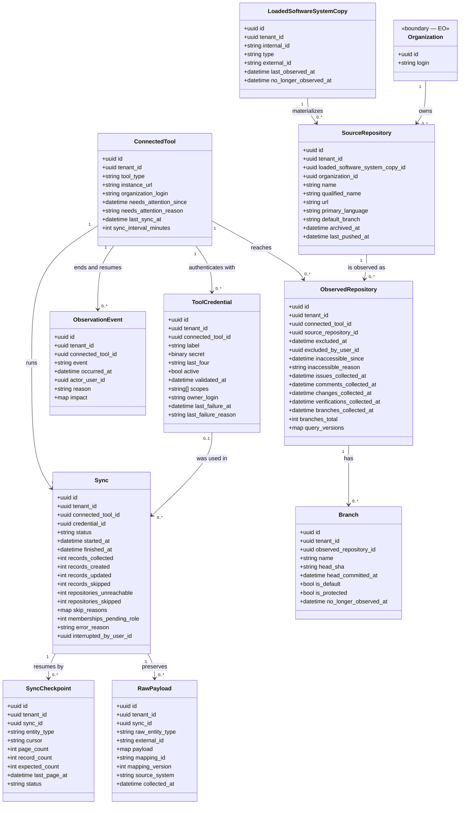

<!-- DERIVED from lib/the_band/sources/connected_tool.ex:23-38, tool_credential.ex:26-42,
     observation_event.ex:32-44; lib/the_band/ingestion/sync.ex:15-42,
     checkpoint.ex:19-35, query_version.ex:1-60, cota.ex:49-56, janela.ex:1-13;
     lib/the_band/raw_data.ex:26-39;
     lib/the_band/ontology/seon/cmpo/schemas/observed_repository.ex:18-54,
     source_repository.ex:28-41, loaded_software_system_copy.ex:20-32;
     lib/the_band/configuration/schemas/branch.ex:24-44;
     lib/the_band/provenance/changeset.ex:1-18; lib/the_band/jobs/sync_github_eo.ex:296-325;
     the FKs, CHECK and partial indexes read from the development database
     (`syncs_status_check`, `syncs_one_running_per_tool_index`,
     `observed_repositories_exclusion_has_author`, `tool_observation_events_event_check`,
     `sys_swo_copies_type_check`, `connected_tools_auto_sync_index`);
     priv/connectors/github/queries/*.graphql (15 files) — on 2026-09-12.
     Checked against the code on this date. Regenerate when the source changes. -->

# Classes — ingestion and observation

**How data comes in, and what the platform knows about its own collection.** Ten tables: the
connected tool and its credential, the collection run and its checkpoint, the preserved raw
payload, and the repository — which exists in three layers, and that is the part that confuses.

## The diagram

## The three layers of the repository, and why there are three

It is the point that most confuses newcomers:

| Layer | Table | Answers |
|---|---|---|
| **system** | `sys_swo_loaded_software_system_copies` | *there is a loaded copy of a software system* — `sys_swo.loaded_software_system_copy`, with `CHECK type = 'source_repository'` |
| **artifact** | `cmpo_source_repositories` | *it is a code repository, with name, URL, language and default branch* — `cmpo.source_repository` |
| **platform** | `observed_repositories` | *and The Band decided to observe it through this tool, and how far it has collected* |

The three have **126 rows** in the development database (measured on 2026-09-12): one to one, with no
divergence. The separation is not redundancy — it is ADR 0004 applied: the ontology concept does not
carry collection state, and collection state does not invent a concept.

## The null that means something

| Null field | Means |
|---|---|
| `observed_repositories.excluded_at` | the repository **is observed**. Filled: the tenant decided not to observe it — and `CHECK observed_repositories_exclusion_has_author` requires the author along with it |
| `observed_repositories.inaccessible_since` | the credential **reaches** the repository. Filled: it does not reach it, and that does **not** mean the repository disappeared |
| `observed_repositories.*_collected_at` | that phase **never collected** in this repository — which is different from "collected and found nothing" |
| `connected_tools.needs_attention_since` | the tool is healthy |
| `connected_tools.sync_interval_minutes` | **no automatic collection**; the partial index `connected_tools_auto_sync_index` only covers the ones with an interval |
| `syncs.finished_at` | the collection **is in progress** (status `running`) |
| `syncs.credential_id` | the credential used was deleted later (`ON DELETE SET NULL`) — the run stays in history |
| `tool_credentials.validated_at` | the credential **was never validated against the source** |
| `*.no_longer_observed_at` | the record **is still seen** at the source |

`excluded` and `inaccessible` are **different situations and both prevent collection** — it is written in
the moduledoc (`observed_repository.ex:3-6`), and it is the difference a screen needs to show.

## Class → schema → table → concept

| Class | Schema | Table | Concept |
|---|---|---|---|
| `ConnectedTool` | `TheBand.Sources.ConnectedTool` (`connected_tool.ex:23`) | `connected_tools` | — platform |
| `ToolCredential` | `TheBand.Sources.ToolCredential` (`tool_credential.ex:26`) | `tool_credentials` | — platform |
| `ObservationEvent` | `TheBand.Sources.ObservationEvent` (`observation_event.ex:32`) | `tool_observation_events` | — platform |
| `Sync` | `TheBand.Ingestion.Sync` (`sync.ex:15`) | `syncs` | — platform |
| `SyncCheckpoint` | `TheBand.Ingestion.Checkpoint` (`checkpoint.ex:19`) | `sync_checkpoints` | — platform |
| `RawPayload` | `TheBand.RawData` — the **context is the schema itself** (`raw_data.ex:1` and `:26`) | `raw_payloads` | — provenance |
| `LoadedSoftwareSystemCopy` | `...CMPO.Schemas.LoadedSoftwareSystemCopy` (`loaded_software_system_copy.ex:20`) | `sys_swo_loaded_software_system_copies` | `sys_swo.loaded_software_system_copy` |
| `SourceRepository` | `...CMPO.Schemas.SourceRepository` (`source_repository.ex:28`) | `cmpo_source_repositories` | `cmpo.source_repository` |
| `ObservedRepository` | `...CMPO.Schemas.ObservedRepository` (`observed_repository.ex:18`) | `observed_repositories` | — platform |
| `Branch` | `TheBand.Configuration.Schemas.Branch` (`branch.ex:24`) | `cmpo_branches` | `cmpo.branch` |

## Invariants the diagram does not show

| Invariant | Form | Where |
|---|---|---|
| **one collection in progress per tool** | `UNIQUE syncs(connected_tool_id) WHERE status = 'running'` | FR-018 — Oban's `unique` alone would not be enough |
| `syncs.status` is closed | `CHECK status IN ('running','completed','failed','interrupted')` | database |
| exclusion has an author | `CHECK (excluded_at IS NULL) OR (excluded_by_user_id IS NOT NULL)` | database |
| the observation event is `ended` or `resumed` | `CHECK event IN ('ended','resumed')` | database |
| the loaded copy is always a repository | `CHECK type = 'source_repository'` | database |
| **complete Application Reference or invalid record** | `source_system` + `source_instance` + `external_id` + `collected_at`; if one is missing, the changeset refuses under the `:provenance` key | `provenance/changeset.ex:19-35` — FR-012 |

## The secret, and where it is not

`tool_credentials.secret` is `TheBand.Encrypted.Binary` with `redact: true`
(`tool_credential.ex:31`): encrypted in the database by Cloak, and erased from any `inspect`.
`last_four` exists **so that the screen can name the credential without reading it**.

And the application **refuses to start without the master key** (`application.ex:11-21`) — without it,
this field would be written in the clear, and nobody would notice.

## What was left out of the diagram, and why

- **`Ingestion.Cota` and `Ingestion.Janela` have no table.** The quota lives in a process, one per
  identity, under `Ingestion.Cota.Arvore` (ADR 0007). A class diagram with a box that has no row in the
  database would confuse; they are in the [architecture diagram](../arquitetura/visao-geral.md#3-how-data-comes-in).
- **`QueryVersion` has no table of its own** — it writes to `observed_repositories.query_versions`,
  a `map`. That is the remedy; the fingerprint of the 15 `.graphql` files is the prevention, and lives
  in a module attribute with `@external_resource`.
- **`syncs.skip_reasons`** is a `map` and keeps a count per reason; the keys are not derived from the
  schema and that is why they did not become an enumeration here.
- `inserted_at` / `updated_at` in all ten tables.
- `cmpo_branches.raw_payload`, `collected_*.raw_payload` — raw payload per row, in addition to
  `raw_payloads` per run.

## Divergences found

**1. `observed_repositories.reviews_collected_at` exists in the database and does not exist in the schema.**

| Reading | Source |
|---|---|
| the column exists | `priv/repo/migrations/20260819040000_create_artifact_evaluations.exs:86` |
| the Ecto schema does not declare it, and **nobody writes to it** | `observed_repository.ex:18-54`; `query_version.ex:47` calls it a "dead column" |

It is a **declared** dead column — the moduledoc of `QueryVersion` records it for whoever touches it to
find. Take it to whoever maintains ingestion: either a *reviews* phase starts writing it, or the
migration that removes it closes the matter. It is not a decision for this document.
