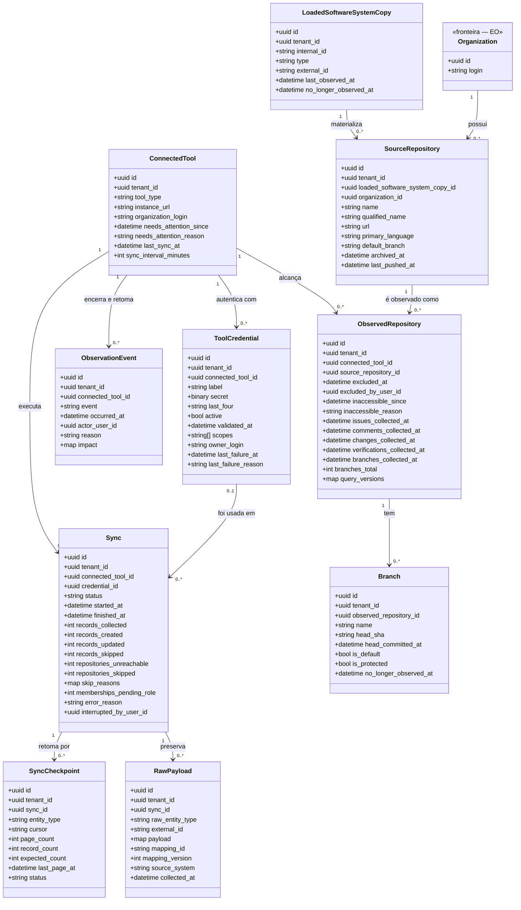

<!-- DERIVADO de lib/the_band/sources/connected_tool.ex:23-38, tool_credential.ex:26-42,
     observation_event.ex:32-44; lib/the_band/ingestion/sync.ex:15-42,
     checkpoint.ex:19-35, query_version.ex:1-60, cota.ex:49-56, janela.ex:1-13;
     lib/the_band/raw_data.ex:26-39;
     lib/the_band/ontology/seon/cmpo/schemas/observed_repository.ex:18-54,
     source_repository.ex:28-41, loaded_software_system_copy.ex:20-32;
     lib/the_band/configuration/schemas/branch.ex:24-44;
     lib/the_band/provenance/changeset.ex:1-18; lib/the_band/jobs/sync_github_eo.ex:296-325;
     as FKs, CHECK e índices parciais lidos do banco de desenvolvimento
     (`syncs_status_check`, `syncs_one_running_per_tool_index`,
     `observed_repositories_exclusion_has_author`, `tool_observation_events_event_check`,
     `sys_swo_copies_type_check`, `connected_tools_auto_sync_index`);
     priv/connectors/github/queries/*.graphql (15 arquivos) — em 2026-09-12.
     Conferido contra o código nesta data. Regenerar ao mudar a fonte. -->

# Classes — ingestão e observação

**Como o dado entra, e o que a plataforma sabe sobre a própria coleta.** Dez tabelas: a
ferramenta conectada e sua credencial, a execução da coleta e seu checkpoint, o payload cru
preservado, e o repositório — que existe em três camadas, e essa é a parte que confunde.

## O diagrama

## As três camadas do repositório, e por que são três

É o ponto que mais confunde quem chega:

| Camada | Tabela | Responde |
|---|---|---|
| **sistema** | `sys_swo_loaded_software_system_copies` | *existe uma cópia carregada de sistema de software* — `sys_swo.loaded_software_system_copy`, com `CHECK type = 'source_repository'` |
| **artefato** | `cmpo_source_repositories` | *ela é um repositório de código, com nome, URL, linguagem e branch padrão* — `cmpo.source_repository` |
| **plataforma** | `observed_repositories` | *e o The Band decidiu observá-lo por esta ferramenta, e até onde já coletou* |

As três têm **126 linhas** no banco de desenvolvimento (medido em 2026-09-12): uma a uma, sem
divergência. A separação não é redundância — é a ADR 0004 aplicada: o conceito da ontologia
não carrega estado de coleta, e o estado de coleta não inventa conceito.

## O nulo que significa

| Campo nulo | Significa |
|---|---|
| `observed_repositories.excluded_at` | o repositório **é observado**. Preenchido: o tenant decidiu não observar — e `CHECK observed_repositories_exclusion_has_author` obriga o autor junto |
| `observed_repositories.inaccessible_since` | a credencial **alcança** o repositório. Preenchido: não alcança, e isso **não** significa que o repositório sumiu |
| `observed_repositories.*_collected_at` | aquela fase **nunca coletou** neste repositório — é diferente de "coletou e não achou nada" |
| `connected_tools.needs_attention_since` | a ferramenta está saudável |
| `connected_tools.sync_interval_minutes` | **sem coleta automática**; o índice parcial `connected_tools_auto_sync_index` só cobre as que têm intervalo |
| `syncs.finished_at` | a coleta **está em curso** (status `running`) |
| `syncs.credential_id` | a credencial usada foi apagada depois (`ON DELETE SET NULL`) — a execução continua no histórico |
| `tool_credentials.validated_at` | a credencial **nunca foi validada contra a origem** |
| `*.no_longer_observed_at` | o registro **continua sendo visto** na origem |

`excluído` e `inacessível` são **situações diferentes e ambas impedem a coleta** — está escrito
no moduledoc (`observed_repository.ex:3-6`), e é a diferença que uma tela precisa mostrar.

## Classe → schema → tabela → conceito

| Classe | Schema | Tabela | Conceito |
|---|---|---|---|
| `ConnectedTool` | `TheBand.Sources.ConnectedTool` (`connected_tool.ex:23`) | `connected_tools` | — plataforma |
| `ToolCredential` | `TheBand.Sources.ToolCredential` (`tool_credential.ex:26`) | `tool_credentials` | — plataforma |
| `ObservationEvent` | `TheBand.Sources.ObservationEvent` (`observation_event.ex:32`) | `tool_observation_events` | — plataforma |
| `Sync` | `TheBand.Ingestion.Sync` (`sync.ex:15`) | `syncs` | — plataforma |
| `SyncCheckpoint` | `TheBand.Ingestion.Checkpoint` (`checkpoint.ex:19`) | `sync_checkpoints` | — plataforma |
| `RawPayload` | `TheBand.RawData` — o **contexto é o próprio schema** (`raw_data.ex:1` e `:26`) | `raw_payloads` | — proveniência |
| `LoadedSoftwareSystemCopy` | `...CMPO.Schemas.LoadedSoftwareSystemCopy` (`loaded_software_system_copy.ex:20`) | `sys_swo_loaded_software_system_copies` | `sys_swo.loaded_software_system_copy` |
| `SourceRepository` | `...CMPO.Schemas.SourceRepository` (`source_repository.ex:28`) | `cmpo_source_repositories` | `cmpo.source_repository` |
| `ObservedRepository` | `...CMPO.Schemas.ObservedRepository` (`observed_repository.ex:18`) | `observed_repositories` | — plataforma |
| `Branch` | `TheBand.Configuration.Schemas.Branch` (`branch.ex:24`) | `cmpo_branches` | `cmpo.branch` |

## Invariantes que o diagrama não mostra

| Invariante | Forma | Onde |
|---|---|---|
| **uma coleta em curso por ferramenta** | `UNIQUE syncs(connected_tool_id) WHERE status = 'running'` | FR-018 — o `unique` do Oban sozinho não bastaria |
| `syncs.status` é fechado | `CHECK status IN ('running','completed','failed','interrupted')` | banco |
| exclusão tem autor | `CHECK (excluded_at IS NULL) OR (excluded_by_user_id IS NOT NULL)` | banco |
| o evento de observação é `ended` ou `resumed` | `CHECK event IN ('ended','resumed')` | banco |
| a cópia carregada é sempre repositório | `CHECK type = 'source_repository'` | banco |
| **Application Reference completa ou registro inválido** | `source_system` + `source_instance` + `external_id` + `collected_at`; faltando um, o changeset recusa sob a chave `:provenance` | `provenance/changeset.ex:19-35` — FR-012 |

## O segredo, e onde ele não está

`tool_credentials.secret` é `TheBand.Encrypted.Binary` com `redact: true`
(`tool_credential.ex:31`): cifrado no banco pelo Cloak, e apagado de qualquer `inspect`.
`last_four` existe **para que a tela possa nomear a credencial sem lê-la**.

E a aplicação **recusa iniciar sem a chave mestra** (`application.ex:11-21`) — sem ela, este
campo seria gravado em claro, e ninguém perceberia.

## O que ficou de fora do diagrama, e por quê

- **`Ingestion.Cota` e `Ingestion.Janela` não têm tabela.** A cota vive em processo, um por
  identidade, sob `Ingestion.Cota.Arvore` (ADR 0007). Um diagrama de classes com caixa sem
  linha no banco confundiria; elas estão no [diagrama de arquitetura](../arquitetura/visao-geral.md#3-como-o-dado-entra).
- **`QueryVersion` não tem tabela própria** — grava em `observed_repositories.query_versions`,
  um `map`. É o remédio; a impressão digital dos 15 arquivos `.graphql` é a prevenção, e vive
  em atributo de módulo com `@external_resource`.
- **`syncs.skip_reasons`** é `map` e guarda contagem por motivo; as chaves não são derivadas
  do schema e por isso não viraram enumeração aqui.
- `inserted_at` / `updated_at` em todas as dez tabelas.
- `cmpo_branches.raw_payload`, `collected_*.raw_payload` — payload cru por linha, além do
  `raw_payloads` por execução.

## Divergências encontradas

**1. `observed_repositories.reviews_collected_at` existe no banco e não existe no schema.**

| Leitura | Fonte |
|---|---|
| a coluna existe | `priv/repo/migrations/20260819040000_create_artifact_evaluations.exs:86` |
| o schema Ecto não a declara, e **ninguém escreve nela** | `observed_repository.ex:18-54`; `query_version.ex:47` a chama de "coluna morta" |

É coluna morta **declarada** — o moduledoc do `QueryVersion` a registra para quem for mexer
encontrar. Levar a quem mantém a ingestão: ou uma fase de *reviews* passa a escrevê-la, ou a
migração que a remove fecha o assunto. Não é decisão deste documento.
