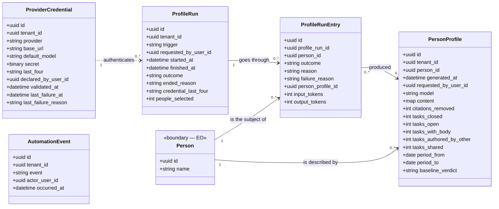

<!-- DERIVED from lib/the_band/ai/provider_credential.ex:1-34,
     lib/the_band/profiles/run.ex:1-38, run_entry.ex:1-39, automation_event.ex:19-25;
     lib/the_band/ontology/seon/eo/schemas/person_profile.ex:34-54;
     config/config.exs:96 and :105-118 (`perfis` and `rodadas` queues, monthly cron);
     the CHECKs and partial indexes read from the development database
     (`profile_runs_uma_aberta_por_tenant`, `profile_run_outcome_valido`,
     `profile_run_trigger_valido`, `profile_run_entry_outcome_valido`,
     `profile_run_entry_reason_valido`, `profile_run_entry_falha_tem_motivo`,
     `profile_automation_event_valido`, `eo_person_profiles_conteudo_util`)
     — on 2026-09-12. Checked against the code on this date. Regenerate when the source changes. -->

# Classes — profiles and language model

**Who asked for the generation, what was generated about each person, and with which credential.** Five
tables, and it is the only subsystem in which the platform **writes interpreted text** instead of
recording what it observed.

`eo_person_profiles` lives in EO because it is about the person, and appears here because it is the
product of this round — the same table in two diagrams, and said so that it does not look like a
duplicate.

## The diagram

The arrow from `ProviderCredential` to `ProfileRun` is **dotted on purpose**: there is no FK. The
round keeps `credential_last_four`, not `credential_id` — what it records is *with which credential it
was made*, in a way that survives the credential being replaced. An FK would say the wrong thing when
the key was substituted.

## Skipping and failing are not the same thing

It is the central design of the subsystem, and it is written in `run_entry.ex:9-13`:

| `outcome` | States |
|---|---|
| `generated` | wrote — and `person_profile_id` points to what it wrote |
| `skipped` | **decided not to write**, and `reason` says which of the three: `no_material`, `no_new_work`, `observation_ended` |
| `failed` | **tried and could not**, and `failure_reason` is mandatory |

The three `CHECK`s that make this an invariant, not a convention:

| Invariant | Form |
|---|---|
| closed `outcome` | `CHECK profile_run_entry_outcome_valido` |
| reason **only** when skipped, and from a closed list | `CHECK profile_run_entry_reason_valido` |
| failure **always** with a reason, and a reason **only** on failure | `CHECK profile_run_entry_falha_tem_motivo` |

Without the third, a `failed` entry with a null `failure_reason` would be accepted — and the round
would say *"failed"* without saying at what. It is silent success inside out.

## The null that means something

| Null field | Means |
|---|---|
| `profile_runs.finished_at` | the round **is running** — it is what FR-003 queries to refuse the second one, and what the partial index enforces |
| `profile_runs.outcome` | likewise: there is an outcome only when it finished. `completed` or `ended_early` |
| `profile_runs.requested_by_user_id` | a **cron** round, with no person who asked for it (`trigger = "cron"`) |
| `profile_runs.people_selected` | **not measured** — and the comment in the schema says so instead of letting zero pass for an answer (`run.ex:33-35`) |
| `profile_run_entries.person_profile_id` | did not generate a profile in this entry — because it skipped or failed |
| `profile_run_entries.reason` | did not skip |
| `profile_run_entries.failure_reason` | did not fail |
| `eo_person_profiles.baseline_verdict` | the baseline **was not computed** for the period |
| `ai_provider_credentials.validated_at` | the credential **was never validated** against the provider |
| `ai_provider_credentials.last_failure_at` | it never failed since the last write |

**There is no `cancelada` (cancelled) state** for the round, and the moduledoc explains why: *"no line of
the code would produce it, and a state that does not happen is a state the reader needs to consider
for nothing"* (`run.ex:5-7`).

## Class → schema → table → concept

| Class | Schema | Table | Concept |
|---|---|---|---|
| `ProviderCredential` | `TheBand.AI.ProviderCredential` (`provider_credential.ex:19`) | `ai_provider_credentials` | — platform; `provider ∈ {openai}` |
| `ProfileRun` | `TheBand.Profiles.Run` (`run.ex:21`) | `profile_runs` | — platform |
| `ProfileRunEntry` | `TheBand.Profiles.RunEntry` (`run_entry.ex:27`) | `profile_run_entries` | — platform |
| `PersonProfile` | `...EO.Schemas.PersonProfile` (`person_profile.ex:34`) | `eo_person_profiles` | `eo.competence` |
| `AutomationEvent` | `TheBand.Profiles.AutomationEvent` (`automation_event.ex:19`) | `profile_automation_events` | — platform; `event ∈ {enabled, disabled}` |

**`eo_person_profiles` is `eo.competence`** — and it is the semantic choice that holds up the
subsystem: the generated text is a statement about the *person's competence*, not about the person.
That is why `CHECK eo_person_profiles_conteudo_util` requires
`jsonb_array_length(content -> 'habilidades') > 0`: **a profile without any skill is not an empty
profile, it is a profile that should not have been written.**

## Invariants the diagram does not show

| Invariant | Form |
|---|---|
| **one open round per tenant** | `UNIQUE profile_runs(tenant_id) WHERE finished_at IS NULL` — FR-003 |
| `trigger ∈ {cron, manual}` | `CHECK profile_run_trigger_valido` |
| `outcome ∈ {completed, ended_early}` when there is an outcome | `CHECK profile_run_outcome_valido` |
| `people_selected` is not negative | `CHECK profile_runs_people_selected_nao_negativo` |
| a profile has at least one skill | `CHECK eo_person_profiles_conteudo_util` |
| an automation event is `enabled` or `disabled` | `CHECK profile_automation_event_valido` |
| the entry is unique per `[round, person]` | database constraint — it is what makes the Oban retry **resume** instead of generating a second text about the same material (`run_entry.ex:5-7`) |

`eo_person_profiles` and `profile_automation_events` use `timestamps(updated_at: false)`: they are
**occurrence** records, and an occurrence is not updated.

## Where this runs

`config/config.exs:96` — two Oban queues, and the separation is measured:

| Queue | Concurrency | Reason written in the config |
|---|---|---|
| `perfis` | 1 | each generation takes 25 to 60 s; parallelizing would spend credit in bursts without anyone waiting any less |
| `rodadas` | 1 | the monthly round goes through up to 34 people in sequence — 15 to 35 min measured. In the `perfis` queue it would lock every generation requested by hand |

The monthly cron is `{"0 3 1 * *", TheBand.Profiles.MonthlyWorker}` (`config.exs:117`), **in a single
time zone**: one moment per time zone would make the same round exist several times, and the FR-003
prohibition of simultaneity would stop meaning anything.

## What was left out of the diagram, and why

- `inserted_at` / `updated_at`.
- `eo_person_profiles.content` is a `map` and appears as one line; the internal shape of the JSON
  (`habilidades` and the rest) **cannot be derived from the schema** — only the `CHECK` touches it.
- The **prompt** and the **sanitizer** (`profiles/prompt.ex`, `profiles/sanitizer.ex`) have no
  table; `citations_removed` is what is left of them in the model.
- The provider's HTTP client (`lib/the_band/integrations/llm/`) was not checked for this
  document — it is edge, not model.

## Divergences found

None between schema, migration and database (automatic schema × columns comparison, 2026-09-12).

**An absence of data, stated:** the five tables are **empty** in the development database —
`ai_provider_credentials` 0, `profile_runs` 0, `profile_run_entries` 0,
`profile_automation_events` 0, `eo_person_profiles` 0. The model is complete and was never exercised
with real data in this database. Whoever measures anything about profiles needs to know this before
looking at a number.
