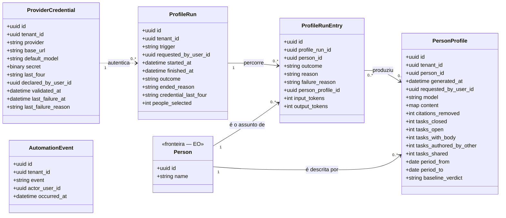

<!-- DERIVADO de lib/the_band/ai/provider_credential.ex:1-34,
     lib/the_band/profiles/run.ex:1-38, run_entry.ex:1-39, automation_event.ex:19-25;
     lib/the_band/ontology/seon/eo/schemas/person_profile.ex:34-54;
     config/config.exs:96 e :105-118 (filas `perfis` e `rodadas`, cron mensal);
     os CHECK e índices parciais lidos do banco de desenvolvimento
     (`profile_runs_uma_aberta_por_tenant`, `profile_run_outcome_valido`,
     `profile_run_trigger_valido`, `profile_run_entry_outcome_valido`,
     `profile_run_entry_reason_valido`, `profile_run_entry_falha_tem_motivo`,
     `profile_automation_event_valido`, `eo_person_profiles_conteudo_util`)
     — em 2026-09-12. Conferido contra o código nesta data. Regenerar ao mudar a fonte. -->

# Classes — perfis e modelo de linguagem

**Quem pediu a geração, o que foi gerado sobre cada pessoa, e com que credencial.** Cinco
tabelas, e é o único subsistema em que a plataforma **escreve texto interpretado** em vez de
registrar o que observou.

`eo_person_profiles` mora na EO por ser sobre a pessoa, e aparece aqui porque é o produto desta
rodada — a mesma tabela em dois diagramas, e dito para que não pareça duplicata.

## O diagrama

A seta de `ProviderCredential` para `ProfileRun` é **pontilhada de propósito**: não há FK. A
rodada guarda `credential_last_four`, e não `credential_id` — o que ela registra é *com qual
credencial foi feita*, de um jeito que sobrevive à credencial ser trocada. Uma FK diria a coisa
errada quando a chave fosse substituída.

## Pular e falhar não são a mesma coisa

É o desenho central do subsistema, e está escrito em `run_entry.ex:9-13`:

| `outcome` | Afirma |
|---|---|
| `generated` | escreveu — e `person_profile_id` aponta o que escreveu |
| `skipped` | **decidiu não escrever**, e `reason` diz qual das três: `no_material`, `no_new_work`, `observation_ended` |
| `failed` | **tentou e não conseguiu**, e `failure_reason` é obrigatório |

Os três `CHECK` que tornam isso invariante, e não convenção:

| Invariante | Forma |
|---|---|
| `outcome` fechado | `CHECK profile_run_entry_outcome_valido` |
| razão **só** quando pulou, e de uma lista fechada | `CHECK profile_run_entry_reason_valido` |
| falha **sempre** com motivo, e motivo **só** em falha | `CHECK profile_run_entry_falha_tem_motivo` |

Sem o terceiro, uma entrada `failed` com `failure_reason` nulo seria aceita — e a rodada
diria *"falhou"* sem dizer no quê. É o sucesso silencioso pelo avesso.

## O nulo que significa

| Campo nulo | Significa |
|---|---|
| `profile_runs.finished_at` | a rodada **está em execução** — é o que a FR-003 consulta para recusar a segunda, e o que o índice parcial impõe |
| `profile_runs.outcome` | idem: só há desfecho quando terminou. `completed` ou `ended_early` |
| `profile_runs.requested_by_user_id` | rodada **do cron**, sem pessoa que a tenha pedido (`trigger = "cron"`) |
| `profile_runs.people_selected` | **não medido** — e o comentário no schema diz isso em vez de deixar zero passar por resposta (`run.ex:33-35`) |
| `profile_run_entries.person_profile_id` | não gerou perfil nesta entrada — porque pulou ou falhou |
| `profile_run_entries.reason` | não pulou |
| `profile_run_entries.failure_reason` | não falhou |
| `eo_person_profiles.baseline_verdict` | a linha de base **não foi apurada** para o período |
| `ai_provider_credentials.validated_at` | a credencial **nunca foi validada** contra o provedor |
| `ai_provider_credentials.last_failure_at` | nunca falhou desde a última gravação |

**Não existe estado `cancelada`** para a rodada, e o moduledoc explica por quê: *"nenhuma linha
do código a produziria, e um estado que não acontece é um estado que quem lê precisa considerar
à toa"* (`run.ex:5-7`).

## Classe → schema → tabela → conceito

| Classe | Schema | Tabela | Conceito |
|---|---|---|---|
| `ProviderCredential` | `TheBand.AI.ProviderCredential` (`provider_credential.ex:19`) | `ai_provider_credentials` | — plataforma; `provider ∈ {openai}` |
| `ProfileRun` | `TheBand.Profiles.Run` (`run.ex:21`) | `profile_runs` | — plataforma |
| `ProfileRunEntry` | `TheBand.Profiles.RunEntry` (`run_entry.ex:27`) | `profile_run_entries` | — plataforma |
| `PersonProfile` | `...EO.Schemas.PersonProfile` (`person_profile.ex:34`) | `eo_person_profiles` | `eo.competence` |
| `AutomationEvent` | `TheBand.Profiles.AutomationEvent` (`automation_event.ex:19`) | `profile_automation_events` | — plataforma; `event ∈ {enabled, disabled}` |

**`eo_person_profiles` é `eo.competence`** — e é a escolha semântica que sustenta o subsistema:
o texto gerado é afirmação sobre *competência da pessoa*, não sobre a pessoa. Por isso o
`CHECK eo_person_profiles_conteudo_util` exige
`jsonb_array_length(content -> 'habilidades') > 0`: **um perfil sem nenhuma habilidade não é um
perfil vazio, é um perfil que não devia ter sido gravado.**

## Invariantes que o diagrama não mostra

| Invariante | Forma |
|---|---|
| **uma rodada aberta por tenant** | `UNIQUE profile_runs(tenant_id) WHERE finished_at IS NULL` — FR-003 |
| `trigger ∈ {cron, manual}` | `CHECK profile_run_trigger_valido` |
| `outcome ∈ {completed, ended_early}` quando há desfecho | `CHECK profile_run_outcome_valido` |
| `people_selected` não é negativo | `CHECK profile_runs_people_selected_nao_negativo` |
| perfil tem ao menos uma habilidade | `CHECK eo_person_profiles_conteudo_util` |
| evento de automação é `enabled` ou `disabled` | `CHECK profile_automation_event_valido` |
| a entrada é única por `[rodada, pessoa]` | constraint de banco — é ela que faz a retentativa do Oban **retomar** em vez de gerar um segundo texto sobre o mesmo material (`run_entry.ex:5-7`) |

`eo_person_profiles` e `profile_automation_events` usam `timestamps(updated_at: false)`: são
registros de **ocorrência**, e uma ocorrência não é atualizada.

## Onde isto roda

`config/config.exs:96` — duas filas Oban, e a separação é medida:

| Fila | Concorrência | Razão escrita no config |
|---|---|---|
| `perfis` | 1 | cada geração leva de 25 a 60 s; paralelizar gastaria crédito em rajada sem ninguém esperando mais rápido |
| `rodadas` | 1 | a rodada mensal percorre até 34 pessoas em sequência — de 15 a 35 min medidos. Na fila `perfis` ela trancaria toda geração pedida a mão |

O cron mensal é `{"0 3 1 * *", TheBand.Profiles.MonthlyWorker}` (`config.exs:117`), **num fuso
só**: um momento por fuso faria a mesma rodada existir várias vezes, e a proibição de
simultaneidade da FR-003 deixaria de significar.

## O que ficou de fora do diagrama, e por quê

- `inserted_at` / `updated_at`.
- `eo_person_profiles.content` é `map` e aparece como uma linha; a forma interna do JSON
  (`habilidades` e o resto) **não é derivável do schema** — só o `CHECK` a toca.
- O **prompt** e o **sanitizador** (`profiles/prompt.ex`, `profiles/sanitizer.ex`) não têm
  tabela; `citations_removed` é o que sobra deles no modelo.
- O cliente HTTP do provedor (`lib/the_band/integrations/llm/`) não foi conferido para este
  documento — é borda, não modelo.

## Divergências encontradas

Nenhuma entre schema, migração e banco (comparação automática schema × colunas, 2026-09-12).

**Uma ausência de dado, dita:** as cinco tabelas estão **vazias** no banco de desenvolvimento —
`ai_provider_credentials` 0, `profile_runs` 0, `profile_run_entries` 0,
`profile_automation_events` 0, `eo_person_profiles` 0. O modelo está inteiro e nunca foi
exercitado com dado real neste banco. Quem for medir qualquer coisa sobre perfis precisa saber
disso antes de olhar um número.
