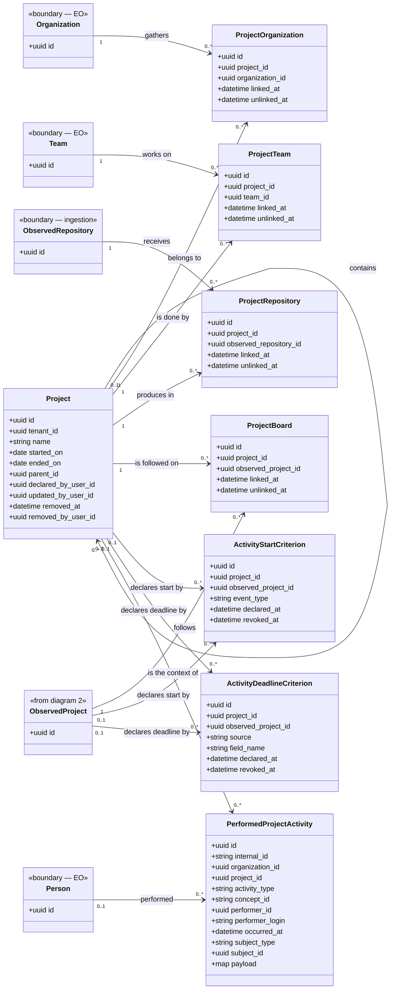
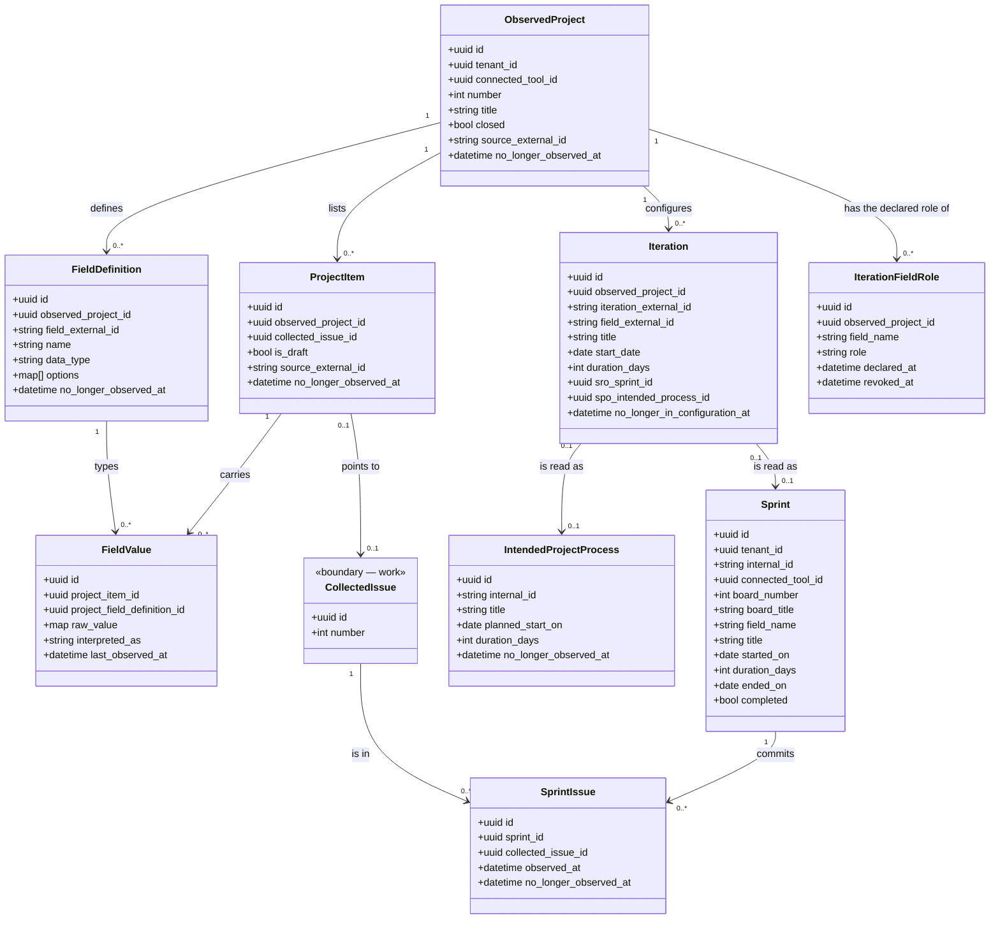

<!-- DERIVED from lib/the_band/ontology/seon/spo/schemas/project.ex:29-45,
     project_organization.ex:17-25, project_team.ex:17-25, project_repository.ex:21-29,
     project_board.ex:38-46, activity_start_criterion.ex:1-56,
     activity_deadline_criterion.ex:27-45, intended_project_process.ex:20-36,
     performed_project_activity.ex:1-57;
     lib/the_band/projects/schemas/observed_project.ex:19-35, item.ex:20-33,
     field_definition.ex:19-30, field_value.ex:19-28, iteration.ex:22-37;
     lib/the_band/ontology/continuum/sro/schemas/sprint.ex:39-58, sprint_issue.ex:28-35;
     lib/the_band/ontology/continuum/smpo/schemas/iteration_field_role.ex:16 and :20-29;
     the FKs, CHECKs and partial indexes read from the development database
     (`project_iterations_exatamente_um_destino`, `criterio_tem_um_alvo_so`,
     `prazo_tem_um_alvo_so`, `campo_so_quando_a_origem_e_campo`,
     `project_items_rascunho_sem_issue`, `spo_projects_name_index`,
     `spo_project_*_vigente_index`, `smpo_papel_vigente_do_campo_index`)
     — on 2026-09-12. Checked against the code on this date. Regenerate when the source changes. -->

# Classes — projects and process

**The undertaking someone declares, the board the platform observes, and the iteration that can be one
thing or the other.** Seventeen tables, in two diagrams.

The knot of this subsystem is a name collision: **GitHub calls "project" what here is a board**, and SPO
calls project the undertaking declared by a person. They are different tables, with different owners,
and confusing them is the error the database `CHECK`s exist to prevent
(`activity_start_criterion.ex:15-21`).

| Name | Table | What it is | Who creates it |
|---|---|---|---|
| **project** | `spo_projects` | the undertaking — `spo.project` | a person, on the screen |
| **board** | `observed_projects` | GitHub's *Projects v2* | collection |

## 1. The declared project, and what it gathers

### The four links are the same design, four times

`spo_project_organizations`, `spo_project_teams`, `spo_project_repositories` and
`spo_project_boards` have **exactly the same shape**: `project_id`, the target, `linked_by_user_id`
+ `linked_at`, `unlinked_by_user_id` + `unlinked_at`, and a partial index
`... WHERE unlinked_at IS NULL`.

This is not repetition to fix: it is the **declaration with authorship and validity** applied four
times, and it is what allows asking *"since when has this team worked on this project, and who said
so"*. An `ativo` (active) boolean would answer the first half and lose the second.

### `PerformedProjectActivity` has no `:updated`

`performed_project_activity.ex:10-15`: the other schemas have three outcomes because they describe
entities that change. **An occurrence does not change — it happened.** Reprocessing the same source
returns `:unchanged`, and the virtual `outcome` only admits `[:created, :unchanged]`
(`performed_project_activity.ex:61`).

It is the most populated table in the database: **30 560 rows** on 2026-09-12.

And the null that means most here: **a null `concept_id` is not missing data** — it means the
network of ontologies **does not name** this type of activity. It is the honest state of `labeled` and
`cross-referenced` (`performed_project_activity.ex:16-18`).

## 2. The observed board, the iteration, the sprint

### The iteration becomes **one** of two things, and the organization decides

`project_iterations` has `sro_sprint_id` **and** `spo_intended_process_id`, and
`CHECK project_iterations_exatamente_um_destino` requires exactly one to be filled.

The choice is not the platform's: it comes from `smpo_iteration_field_roles`, where the organization
declares that the field of that board means `sprint` or `planning_horizon`
(`iteration_field_role.ex:16`). Without the declaration, the iteration is read as neither —
and **that is the correct behaviour**, not a gap: the same "Iteration" column is a sprint in one
organization and a planning quarter in another (`iteration_field_role.ex:2-6`).

## The null that means something

| Null field | Means |
|---|---|
| `spo_projects.ended_on` | the project **is ongoing** |
| `spo_projects.removed_at` | the project **exists**; removing marks, never deletes — and the unique name index only holds `WHERE removed_at IS NULL` |
| `spo_projects.parent_id` | **top-level** project, with no project containing it |
| `spo_project_*.unlinked_at` | the link **holds** |
| `spo_activity_*_criteria.revoked_at` | the criterion **holds**. Revoking marks and never deletes, or *"since when has this criterion held"* goes unanswered (`activity_start_criterion.ex:29-31`) |
| `spo_performed_project_activities.concept_id` | **the network does not name** this type of activity — information, not absence |
| `spo_performed_project_activities.project_id` | the activity was not linked to a declared project |
| `project_items.collected_issue_id` | the item is a board **draft**, and `CHECK project_items_rascunho_sem_issue` ensures draft and issue do not coexist |
| `project_iterations.no_longer_in_configuration_at` | the iteration **is still in the field's configuration** — a different name from `no_longer_observed_at`, on purpose: an iteration leaves the configuration, not the observation |
| `sro_sprints.ended_on` | not yet derived from `started_on` + `duration_days` |
| `smpo_iteration_field_roles.revoked_at` | the field's role **holds** |

## Class → schema → table → concept

| Class | Schema | Table | Concept |
|---|---|---|---|
| `Project` | `...SPO.Schemas.Project` | `spo_projects` | `spo.project` |
| `ProjectOrganization` | `...SPO.Schemas.ProjectOrganization` | `spo_project_organizations` | — declared link |
| `ProjectTeam` | `...SPO.Schemas.ProjectTeam` | `spo_project_teams` | — declared link |
| `ProjectRepository` | `...SPO.Schemas.ProjectRepository` | `spo_project_repositories` | — declared link |
| `ProjectBoard` | `...SPO.Schemas.ProjectBoard` | `spo_project_boards` | — declared link |
| `ActivityStartCriterion` | `...SPO.Schemas.ActivityStartCriterion` | `spo_activity_start_criteria` | `spo.activity_start_criterion` — `social_object` in UFO |
| `ActivityDeadlineCriterion` | `...SPO.Schemas.ActivityDeadlineCriterion` | `spo_activity_deadline_criteria` | sibling declaration; `source ∈ {board_field, sprint, milestone}` |
| `IntendedProjectProcess` | `...SPO.Schemas.IntendedProjectProcess` | `spo_intended_project_processes` | `spo.specific_intended_project_process` |
| `PerformedProjectActivity` | `...SPO.Schemas.PerformedProjectActivity` | `spo_performed_project_activities` | `spo.performed_project_activity` |
| `ObservedProject` | `TheBand.Projects.Schemas.ObservedProject` | `observed_projects` | — platform |
| `ProjectItem` | `TheBand.Projects.Schemas.Item` | `project_items` | — platform |
| `FieldDefinition` | `TheBand.Projects.Schemas.FieldDefinition` | `project_field_definitions` | — platform |
| `FieldValue` | `TheBand.Projects.Schemas.FieldValue` | `item_field_values` | — platform |
| `Iteration` | `TheBand.Projects.Schemas.Iteration` | `project_iterations` | — platform; the concept comes from the declared role |
| `IterationFieldRole` | `...SMPO.Schemas.IterationFieldRole` | `smpo_iteration_field_roles` | — declaration; `role ∈ {sprint, planning_horizon}` |
| `Sprint` | `...SRO.Schemas.Sprint` | `sro_sprints` | `sro.sprint` |
| `SprintIssue` | `...SRO.Schemas.SprintIssue` | `sro_sprint_issues` | — observed commitment |

## Invariants the diagram does not show

| Invariant | Form |
|---|---|
| the iteration becomes exactly one thing | `CHECK project_iterations_exatamente_um_destino` |
| a start criterion has **a single** target | `CHECK criterio_tem_um_alvo_so`: `num_nonnulls(project_id, observed_project_id) = 1` |
| likewise for the deadline criterion | `CHECK prazo_tem_um_alvo_so` |
| field only when the deadline source is a field | `CHECK campo_so_quando_a_origem_e_campo`: `(source = 'board_field') = (field_name IS NOT NULL)` |
| a draft does not point to an issue | `CHECK project_items_rascunho_sem_issue` |
| unique project name while it exists | `UNIQUE spo_projects(tenant_id, name) WHERE removed_at IS NULL` |
| one link in force per pair, in the four links | `UNIQUE (tenant_id, project_id, <target>) WHERE unlinked_at IS NULL` |
| one criterion in force per target | two partial indexes per table, one for project and another for board |
| one role in force per board field | `UNIQUE smpo_iteration_field_roles(tenant_id, observed_project_id, field_name) WHERE revoked_at IS NULL` |

The deadline indexes use `NULLS NOT DISTINCT` — without it, two rows with a null `field_name` would not
collide, and "one criterion in force" would stop meaning anything.

## What was left out of the diagram, and why

- `inserted_at` / `updated_at`, `record_version`, and the provenance trios
  (`source_system`, `source_instance`, `source_external_id`, `collected_at`,
  `last_observed_at`) — present in almost all of them, and repeated they would be noise.
- `spo_projects.phase` is **virtual** (`project.ex:45`, `Ecto.Enum` with `:simple`/`:complex`):
  it is not a column, and that is why it is not in the ERD. It is here as a class field because it
  decides screen behaviour.
- `*_by_user_id` in all links and criteria: `linked_by`, `unlinked_by`, `declared_by`,
  `revoked_by`, `removed_by`, `updated_by`. The diagram shows the dates; authorship is in the ERD.
- `project_field_definitions.options` (`{:array, :map}`) and `item_field_values.raw_value`
  (`map`): the raw value of the board field, whose shape varies by `data_type` and cannot be derived
  from the schema.
- `sro_sprints.internal_id` and the denormalized `board_number`/`board_title`.

## Divergences found

None between schema, migration and database in this subsystem — all seventeen tables match field by
field (automatic schema × columns comparison, 2026-09-12).

A **declared absence**, and it belongs to the data, not the model: `spo_project_boards`,
`spo_project_organizations`, `spo_activity_start_criteria`, `spo_activity_deadline_criteria` and
`smpo_iteration_field_roles` are **empty** in the development database. `spo_projects` has 1
row and `spo_project_teams` has 2. The model exists in full; the use, almost none — and a diagram that
did not say so would make the subsystem look more exercised than it is.
