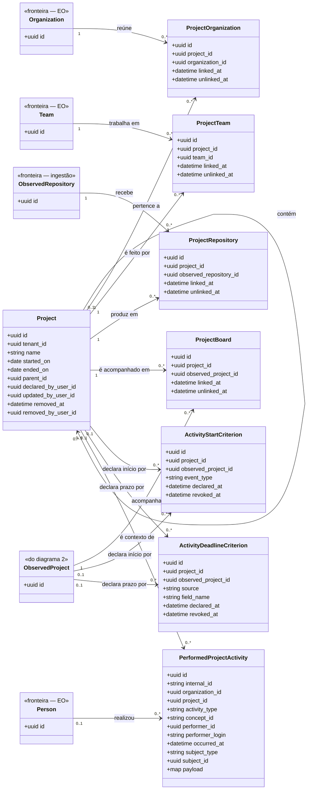
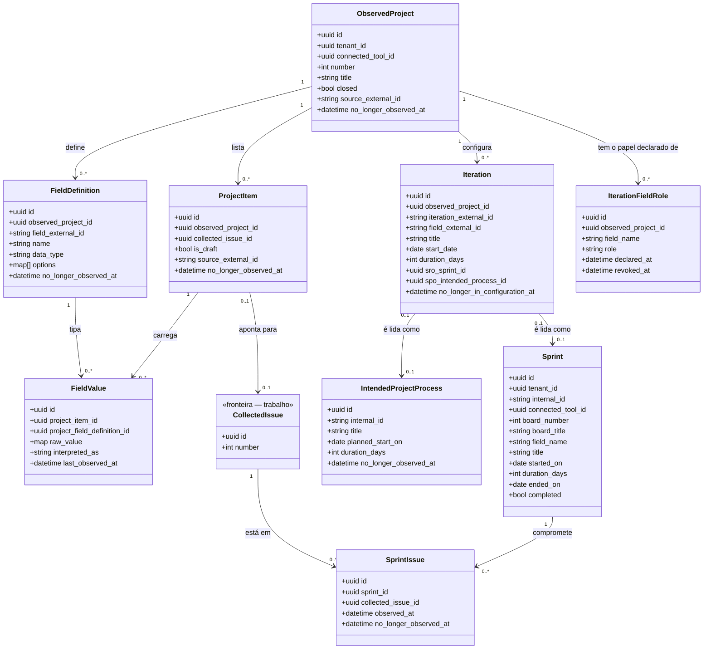

<!-- DERIVADO de lib/the_band/ontology/seon/spo/schemas/project.ex:29-45,
     project_organization.ex:17-25, project_team.ex:17-25, project_repository.ex:21-29,
     project_board.ex:38-46, activity_start_criterion.ex:1-56,
     activity_deadline_criterion.ex:27-45, intended_project_process.ex:20-36,
     performed_project_activity.ex:1-57;
     lib/the_band/projects/schemas/observed_project.ex:19-35, item.ex:20-33,
     field_definition.ex:19-30, field_value.ex:19-28, iteration.ex:22-37;
     lib/the_band/ontology/continuum/sro/schemas/sprint.ex:39-58, sprint_issue.ex:28-35;
     lib/the_band/ontology/continuum/smpo/schemas/iteration_field_role.ex:16 e :20-29;
     as FKs, CHECK e índices parciais lidos do banco de desenvolvimento
     (`project_iterations_exatamente_um_destino`, `criterio_tem_um_alvo_so`,
     `prazo_tem_um_alvo_so`, `campo_so_quando_a_origem_e_campo`,
     `project_items_rascunho_sem_issue`, `spo_projects_name_index`,
     `spo_project_*_vigente_index`, `smpo_papel_vigente_do_campo_index`)
     — em 2026-09-12. Conferido contra o código nesta data. Regenerar ao mudar a fonte. -->

# Classes — projetos e processo

**O empreendimento que alguém declara, o quadro que a plataforma observa, e a iteração que
pode ser uma coisa ou outra.** Dezessete tabelas, em dois diagramas.

O nó deste subsistema é uma colisão de nome: **o GitHub chama de "project" o que aqui é
quadro**, e a SPO chama de projeto o empreendimento declarado por uma pessoa. São tabelas
diferentes, com donos diferentes, e confundi-las é o erro que os `CHECK` do banco existem para
impedir (`activity_start_criterion.ex:15-21`).

| Nome | Tabela | O que é | Quem cria |
|---|---|---|---|
| **projeto** | `spo_projects` | o empreendimento — `spo.project` | pessoa, na tela |
| **quadro** | `observed_projects` | o *Projects v2* do GitHub | a coleta |

## 1. O projeto declarado, e o que ele reúne

### Os quatro elos são o mesmo desenho, quatro vezes

`spo_project_organizations`, `spo_project_teams`, `spo_project_repositories` e
`spo_project_boards` têm **exatamente a mesma forma**: `project_id`, o alvo, `linked_by_user_id`
+ `linked_at`, `unlinked_by_user_id` + `unlinked_at`, e um índice parcial
`... WHERE unlinked_at IS NULL`.

Isto não é repetição a corrigir: é a **declaração com autoria e vigência** aplicada quatro
vezes, e é o que permite perguntar *"desde quando esta equipe trabalha neste projeto, e quem
disse"*. Um booleano `ativo` responderia à primeira metade e perderia a segunda.

### `PerformedProjectActivity` não tem `:updated`

`performed_project_activity.ex:10-15`: os outros schemas têm três resultados porque descrevem
entidades que mudam. **Uma ocorrência não muda — ela aconteceu.** Reprocessar a mesma origem
devolve `:unchanged`, e o `outcome` virtual só admite `[:created, :unchanged]`
(`performed_project_activity.ex:61`).

É a tabela mais populosa do banco: **30 560 linhas** em 2026-09-12.

E o nulo que significa mais aqui: **`concept_id` nulo não é dado faltando** — significa que a
rede de ontologias **não nomeia** este tipo de atividade. É o estado honesto de `labeled` e
`cross-referenced` (`performed_project_activity.ex:16-18`).

## 2. O quadro observado, a iteração, o sprint

### A iteração vira **uma** de duas coisas, e quem decide é a organização

`project_iterations` tem `sro_sprint_id` **e** `spo_intended_process_id`, e o
`CHECK project_iterations_exatamente_um_destino` obriga exatamente um preenchido.

A escolha não é da plataforma: vem de `smpo_iteration_field_roles`, onde a organização declara
que o campo daquele quadro significa `sprint` ou `planning_horizon`
(`iteration_field_role.ex:16`). Sem a declaração, a iteração não é lida como nenhum dos dois —
e **isso é o comportamento correto**, não uma lacuna: a mesma coluna "Iteration" é sprint numa
organização e trimestre de planejamento noutra (`iteration_field_role.ex:2-6`).

## O nulo que significa

| Campo nulo | Significa |
|---|---|
| `spo_projects.ended_on` | o projeto **está em curso** |
| `spo_projects.removed_at` | o projeto **existe**; remover marca, nunca apaga — e o índice de nome único só vale `WHERE removed_at IS NULL` |
| `spo_projects.parent_id` | projeto **de topo**, sem projeto que o contenha |
| `spo_project_*.unlinked_at` | o elo **vale** |
| `spo_activity_*_criteria.revoked_at` | o critério **vale**. Revogar marca e nunca apaga, ou *"desde quando este critério vale"* fica sem resposta (`activity_start_criterion.ex:29-31`) |
| `spo_performed_project_activities.concept_id` | **a rede não nomeia** este tipo de atividade — informação, não ausência |
| `spo_performed_project_activities.project_id` | a atividade não foi ligada a projeto declarado |
| `project_items.collected_issue_id` | o item é **rascunho** do quadro, e `CHECK project_items_rascunho_sem_issue` garante que rascunho e issue não coexistem |
| `project_iterations.no_longer_in_configuration_at` | a iteração **continua na configuração** do campo — nome diferente de `no_longer_observed_at`, e de propósito: uma iteração sai da configuração, não da observação |
| `sro_sprints.ended_on` | não derivado ainda de `started_on` + `duration_days` |
| `smpo_iteration_field_roles.revoked_at` | o papel do campo **vale** |

## Classe → schema → tabela → conceito

| Classe | Schema | Tabela | Conceito |
|---|---|---|---|
| `Project` | `...SPO.Schemas.Project` | `spo_projects` | `spo.project` |
| `ProjectOrganization` | `...SPO.Schemas.ProjectOrganization` | `spo_project_organizations` | — elo declarado |
| `ProjectTeam` | `...SPO.Schemas.ProjectTeam` | `spo_project_teams` | — elo declarado |
| `ProjectRepository` | `...SPO.Schemas.ProjectRepository` | `spo_project_repositories` | — elo declarado |
| `ProjectBoard` | `...SPO.Schemas.ProjectBoard` | `spo_project_boards` | — elo declarado |
| `ActivityStartCriterion` | `...SPO.Schemas.ActivityStartCriterion` | `spo_activity_start_criteria` | `spo.activity_start_criterion` — `social_object` na UFO |
| `ActivityDeadlineCriterion` | `...SPO.Schemas.ActivityDeadlineCriterion` | `spo_activity_deadline_criteria` | declaração irmã; `source ∈ {board_field, sprint, milestone}` |
| `IntendedProjectProcess` | `...SPO.Schemas.IntendedProjectProcess` | `spo_intended_project_processes` | `spo.specific_intended_project_process` |
| `PerformedProjectActivity` | `...SPO.Schemas.PerformedProjectActivity` | `spo_performed_project_activities` | `spo.performed_project_activity` |
| `ObservedProject` | `TheBand.Projects.Schemas.ObservedProject` | `observed_projects` | — plataforma |
| `ProjectItem` | `TheBand.Projects.Schemas.Item` | `project_items` | — plataforma |
| `FieldDefinition` | `TheBand.Projects.Schemas.FieldDefinition` | `project_field_definitions` | — plataforma |
| `FieldValue` | `TheBand.Projects.Schemas.FieldValue` | `item_field_values` | — plataforma |
| `Iteration` | `TheBand.Projects.Schemas.Iteration` | `project_iterations` | — plataforma; o conceito sai do papel declarado |
| `IterationFieldRole` | `...SMPO.Schemas.IterationFieldRole` | `smpo_iteration_field_roles` | — declaração; `role ∈ {sprint, planning_horizon}` |
| `Sprint` | `...SRO.Schemas.Sprint` | `sro_sprints` | `sro.sprint` |
| `SprintIssue` | `...SRO.Schemas.SprintIssue` | `sro_sprint_issues` | — compromisso observado |

## Invariantes que o diagrama não mostra

| Invariante | Forma |
|---|---|
| a iteração vira exatamente uma coisa | `CHECK project_iterations_exatamente_um_destino` |
| critério de início tem **um** alvo só | `CHECK criterio_tem_um_alvo_so`: `num_nonnulls(project_id, observed_project_id) = 1` |
| critério de prazo idem | `CHECK prazo_tem_um_alvo_so` |
| campo só quando a origem do prazo é campo | `CHECK campo_so_quando_a_origem_e_campo`: `(source = 'board_field') = (field_name IS NOT NULL)` |
| rascunho não aponta issue | `CHECK project_items_rascunho_sem_issue` |
| nome de projeto único enquanto existir | `UNIQUE spo_projects(tenant_id, name) WHERE removed_at IS NULL` |
| um elo vigente por par, nos quatro elos | `UNIQUE (tenant_id, project_id, <alvo>) WHERE unlinked_at IS NULL` |
| um critério vigente por alvo | dois índices parciais por tabela, um para projeto e outro para quadro |
| um papel vigente por campo do quadro | `UNIQUE smpo_iteration_field_roles(tenant_id, observed_project_id, field_name) WHERE revoked_at IS NULL` |

Os índices de prazo usam `NULLS NOT DISTINCT` — sem isso, duas linhas com `field_name` nulo
não colidiriam, e "um critério vigente" deixaria de significar.

## O que ficou de fora do diagrama, e por quê

- `inserted_at` / `updated_at`, `record_version`, e os trios de proveniência
  (`source_system`, `source_instance`, `source_external_id`, `collected_at`,
  `last_observed_at`) — presentes em quase todas, e repetidos seriam ruído.
- `spo_projects.phase` é **virtual** (`project.ex:45`, `Ecto.Enum` com `:simple`/`:complex`):
  não é coluna, e por isso não está no ERD. Está aqui como campo da classe porque decide
  comportamento de tela.
- `*_by_user_id` em todos os elos e critérios: `linked_by`, `unlinked_by`, `declared_by`,
  `revoked_by`, `removed_by`, `updated_by`. O diagrama mostra as datas; a autoria está no ERD.
- `project_field_definitions.options` (`{:array, :map}`) e `item_field_values.raw_value`
  (`map`): o valor cru do campo do quadro, cuja forma varia por `data_type` e não é derivável
  do schema.
- `sro_sprints.internal_id` e o `board_number`/`board_title` denormalizados.

## Divergências encontradas

Nenhuma entre schema, migração e banco neste subsistema — todas as dezessete tabelas casam
campo a campo (comparação automática schema × colunas, 2026-09-12).

Uma **ausência declarada**, e ela é do dado, não do modelo: `spo_project_boards`,
`spo_project_organizations`, `spo_activity_start_criteria`, `spo_activity_deadline_criteria` e
`smpo_iteration_field_roles` estão **vazias** no banco de desenvolvimento. `spo_projects` tem 1
linha e `spo_project_teams` tem 2. O modelo existe inteiro; o uso, quase nada — e um diagrama
que não dissesse isso faria o subsistema parecer mais exercitado do que está.
