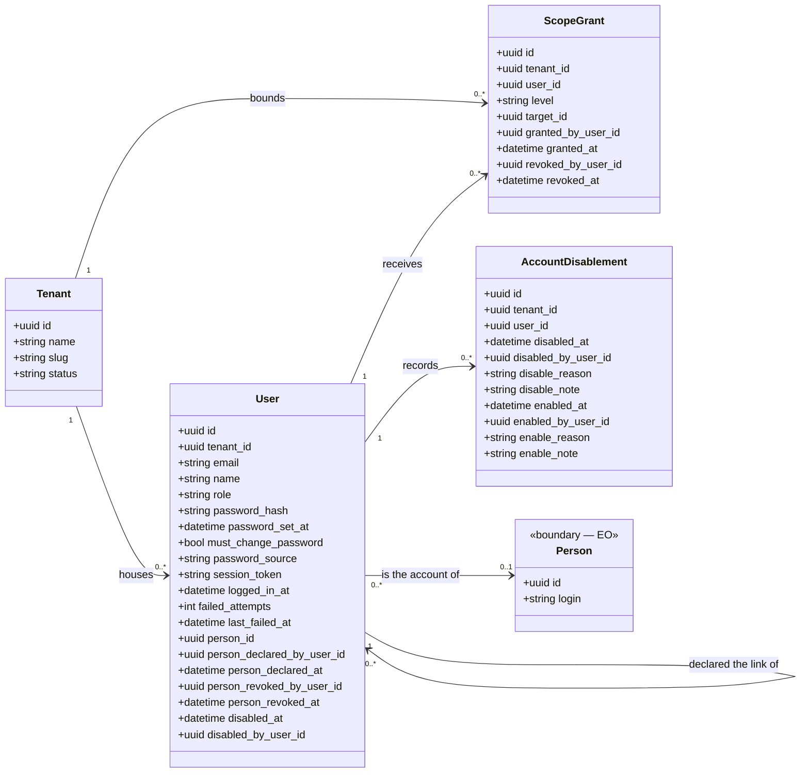

<!-- DERIVED from lib/the_band/tenants/tenant.ex:14-25, user.ex:31-91,
     access/scope_grant.ex:15-32 and :18, account_disablement.ex:40-55,
     access.ex:60-104 and :532-533, account_lifecycle.ex:1-30 and :52-63;
     lib/the_band_web/plugs/current_scope.ex:1-40; lib/the_band_web/router.ex:74-152;
     the CHECK constraints and partial indexes read from the development database
     (`users.elo_da_pessoa_tem_autor_e_data`, `users_pessoa_observada_vigente_index`,
     `access_scope_grants_vigente_index`, `account_disablements_aberto_index`);
     priv/knowledge_base/rules/tenants/the_band_solution.yaml — on 2026-09-12.
     Checked against the code on this date. Regenerate when the source changes. -->

# Classes — tenants and access

**Whose session it is, and what it reaches.** Four tables, and it is the subsystem that decides whether
any other query can happen.

The domain person (`eo_people`) appears as a boundary box: it belongs to the
[EO diagram](eo-estrutura-organizacional.md), and is here only for the link with the account.

## The diagram

## The null that means something

| Null field | Means |
|---|---|
| `users.person_id` | **the account was not linked to any observed person** — it exists, signs in, and has no `:person` scope. It is not an error; it is an undeclared link |
| `users.person_revoked_at` | the link **in force**. Filled, the link was undone and `person_id` stays there as history |
| `users.disabled_at` | **active** account. It is the current mark; `account_disablements` is the history of the cycles |
| `users.password_source` | password older than the column — and the code **refuses** to call it `creation`, because that would state what is not known (`user.ex:225`) |
| `users.last_failed_at` | there has been no failed attempt since the last cleanup |
| `access_scope_grants.revoked_at` | grant **in force**; it is the column of the partial index that prevents two equal open grants |
| `account_disablements.enabled_at` | deactivation **open** — the account is still out |

## Class → schema → table → concept

| Class | Schema | Table | Concept |
|---|---|---|---|
| `Tenant` | `TheBand.Tenants.Tenant` (`tenant.ex:19`) | `tenants` | — platform, not ontology |
| `User` | `TheBand.Tenants.User` (`user.ex:38`) | `users` | — platform |
| `ScopeGrant` | `TheBand.Tenants.Access.ScopeGrant` (`access/scope_grant.ex:22`) | `access_scope_grants` | — access declaration |
| `AccountDisablement` | `TheBand.Tenants.AccountDisablement` (`account_disablement.ex:42`) | `account_disablements` | — platform |
| `Person` | `TheBand.Ontology.SEON.EO.Schemas.Person` (`person.ex:28`) | `eo_people` | `eo.person` |

**None of these four is an ontology concept**, and that is expected: they are the platform layer that
exists so that the ontologies have an owner. EO does not talk about accounts.

## The four scope levels, and where each comes from

`tenants/access.ex:60-104`. A level is `%{level:, target_id:, target_name:, origin:, grant:}`.

| Level | Origin | Grantable? |
|---|---|---|
| `:person` | **floor** — every account linked to a person has its own (`floor_scope/0`, line 103) | no |
| `:team` | derived from the person's team memberships in force (`EO.person_active_teams/2`) | yes |
| `:project` | derived from the projects of the teams in scope | yes |
| `:organization` | **granted only** — there is no derivation | yes |

`ScopeGrant` accepts only `~w(team project organization)` (`scope_grant.ex:18`) — granting `:person`
does not exist, because the floor already gives it and granting another person's would be something
else.

## Invariants the diagram does not show

From the development database, checked on 2026-09-12.

| Invariant | Form |
|---|---|
| the link to a person has author and date, or does not exist | `CHECK users.elo_da_pessoa_tem_autor_e_data`: all three fields null, or all three filled |
| an observed person is the account of **at most one** account | `UNIQUE users(person_id) WHERE person_id IS NOT NULL AND person_revoked_at IS NULL` |
| one grant in force per account, level and target | `UNIQUE access_scope_grants(tenant_id, user_id, level, target_id) WHERE revoked_at IS NULL` |
| one open deactivation per account | `UNIQUE account_disablements(tenant_id, user_id) WHERE enabled_at IS NULL` |
| a deactivated account can be found by tenant | `INDEX users(tenant_id, disabled_at) WHERE disabled_at IS NOT NULL` |

No FK from `users` to `eo_people` cascades: `ON DELETE RESTRICT`. Deleting an observed person who is
someone's account **fails**, instead of leaving the account orphaned.

## The vocabulary that is not in the code

The deactivation reasons (five) and reactivation reasons (four), which require a written note, and the
states the screen names live in `priv/knowledge_base/rules/tenants/the_band_solution.yaml`,
under `access.account_lifecycle` — **no list is written in Elixir**
(`account_lifecycle.ex:1-22`).

And the declared consequence: **base absent, lists empty, and the act of deactivating refuses**. The
alternative — a fallback list in the code — would make the platform keep stating things with the base
down.

That is why the `disable_reason` column does not appear as an enumeration in this diagram: the set of
values **cannot be derived from the Ecto schema or from the migration**. Whoever wants the list reads
the YAML.

## What was left out of the diagram, and why

- `inserted_at` / `updated_at` in all four tables — noise in every diagram in this house.
- `users.password` (virtual, `redact: true`) and `users.password_hash` appears but **is never read by a
  screen**: `redact: true` in `user.ex:47-48`.
- `ai_provider_credentials` belongs to the tenant and is managed in `/ai`, but it belongs to the
  profiles and model subsystem — see [`perfis-e-modelo.md`](perfis-e-modelo.md).
- The **account** state machine (active → deactivated → reactivated, and the temporary credential that
  forces a password change) is not drawn. It is a declared gap: `docs/modelos/estados/`
  currently has only the team membership.

## Divergences found

None between schema, migration and database in this subsystem. The only tension is **of source**: the
lifecycle vocabulary lives in the YAML and not in the schema, and so a reader who only looks at
`account_disablement.ex` does not find out which values `disable_reason` accepts. It is by design
(the moduledoc says why), and it is recorded above so that it does not look like an omission.
