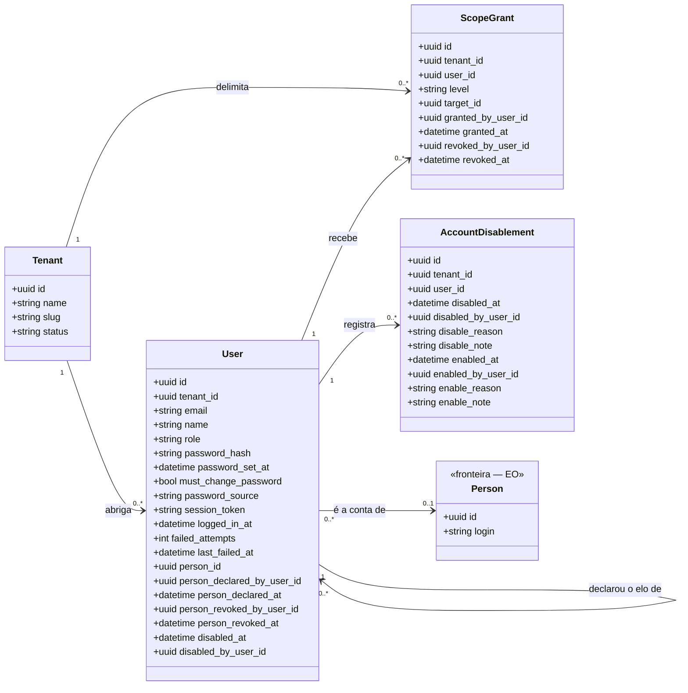

<!-- DERIVADO de lib/the_band/tenants/tenant.ex:14-25, user.ex:31-91,
     access/scope_grant.ex:15-32 e :18, account_disablement.ex:40-55,
     access.ex:60-104 e :532-533, account_lifecycle.ex:1-30 e :52-63;
     lib/the_band_web/plugs/current_scope.ex:1-40; lib/the_band_web/router.ex:74-152;
     as restrições CHECK e os índices parciais lidos do banco de desenvolvimento
     (`users.elo_da_pessoa_tem_autor_e_data`, `users_pessoa_observada_vigente_index`,
     `access_scope_grants_vigente_index`, `account_disablements_aberto_index`);
     priv/knowledge_base/rules/tenants/the_band_solution.yaml — em 2026-09-12.
     Conferido contra o código nesta data. Regenerar ao mudar a fonte. -->

# Classes — tenants e acesso

**De quem é a sessão, e o que ela alcança.** Quatro tabelas, e é o subsistema que decide se
qualquer outra consulta pode acontecer.

A pessoa do domínio (`eo_people`) aparece como caixa de fronteira: ela pertence ao
[diagrama da EO](eo-estrutura-organizacional.md), e está aqui só pelo elo com a conta.

## O diagrama

## O nulo que significa

| Campo nulo | Significa |
|---|---|
| `users.person_id` | **a conta não foi ligada a nenhuma pessoa observada** — ela existe, entra, e não tem escopo `:person`. Não é erro; é elo não declarado |
| `users.person_revoked_at` | o elo **vigente**. Preenchido, o elo foi desfeito e o `person_id` continua ali como histórico |
| `users.disabled_at` | conta **ativa**. É a marca corrente; `account_disablements` é o histórico dos ciclos |
| `users.password_source` | senha anterior à coluna — e o código **recusa** chamá-la de `creation`, porque seria afirmar o que não se sabe (`user.ex:225`) |
| `users.last_failed_at` | nunca houve tentativa falha desde a última limpeza |
| `access_scope_grants.revoked_at` | concessão **vigente**; é a coluna do índice parcial que impede duas concessões iguais abertas |
| `account_disablements.enabled_at` | desativação **em aberto** — a conta ainda está fora |

## Classe → schema → tabela → conceito

| Classe | Schema | Tabela | Conceito |
|---|---|---|---|
| `Tenant` | `TheBand.Tenants.Tenant` (`tenant.ex:19`) | `tenants` | — plataforma, não ontologia |
| `User` | `TheBand.Tenants.User` (`user.ex:38`) | `users` | — plataforma |
| `ScopeGrant` | `TheBand.Tenants.Access.ScopeGrant` (`access/scope_grant.ex:22`) | `access_scope_grants` | — declaração de acesso |
| `AccountDisablement` | `TheBand.Tenants.AccountDisablement` (`account_disablement.ex:42`) | `account_disablements` | — plataforma |
| `Person` | `TheBand.Ontology.SEON.EO.Schemas.Person` (`person.ex:28`) | `eo_people` | `eo.person` |

**Nenhuma destas quatro é conceito de ontologia**, e isso é o esperado: são a camada de
plataforma que existe para que as ontologias tenham dono. A EO não fala de contas.

## Os quatro níveis de escopo, e de onde cada um vem

`tenants/access.ex:60-104`. Um nível é `%{level:, target_id:, target_name:, origin:, grant:}`.

| Nível | Origem | Concedível? |
|---|---|---|
| `:person` | **piso** — toda conta com elo a pessoa tem o próprio (`floor_scope/0`, linha 103) | não |
| `:team` | derivado dos vínculos vigentes da pessoa (`EO.person_active_teams/2`) | sim |
| `:project` | derivado dos projetos das equipes em escopo | sim |
| `:organization` | **só concedido** — não há derivação | sim |

`ScopeGrant` aceita apenas `~w(team project organization)` (`scope_grant.ex:18`) — conceder
`:person` não existe, porque o piso já o dá e conceder o de outra pessoa seria outra coisa.

## Invariantes que o diagrama não mostra

Do banco de desenvolvimento, conferidas em 2026-09-12.

| Invariante | Forma |
|---|---|
| o elo a pessoa tem autor e data, ou não existe | `CHECK users.elo_da_pessoa_tem_autor_e_data`: os três campos nulos, ou os três preenchidos |
| uma pessoa observada é conta de **no máximo uma** conta | `UNIQUE users(person_id) WHERE person_id IS NOT NULL AND person_revoked_at IS NULL` |
| uma concessão vigente por conta, nível e alvo | `UNIQUE access_scope_grants(tenant_id, user_id, level, target_id) WHERE revoked_at IS NULL` |
| uma desativação em aberto por conta | `UNIQUE account_disablements(tenant_id, user_id) WHERE enabled_at IS NULL` |
| conta desativada é localizável por tenant | `INDEX users(tenant_id, disabled_at) WHERE disabled_at IS NOT NULL` |

Nenhuma FK de `users` para `eo_people` cascateia: `ON DELETE RESTRICT`. Apagar uma pessoa
observada que é conta de alguém **falha**, em vez de deixar a conta órfã.

## O vocabulário que não está no código

As razões de desativação (cinco) e de reativação (quatro), quais exigem nota escrita, e os
estados que a tela nomeia vivem em `priv/knowledge_base/rules/tenants/the_band_solution.yaml`,
sob `access.account_lifecycle` — **nenhuma lista está escrita em Elixir**
(`account_lifecycle.ex:1-22`).

E a consequência declarada: **base ausente, listas vazias, e o ato de desativar recusa**. A
alternativa — uma lista de reserva no código — faria a plataforma continuar afirmando com a
base fora do ar.

Por isso a coluna `disable_reason` não aparece como enumeração neste diagrama: o conjunto de
valores **não é derivável do schema Ecto nem da migração**. Quem quiser a lista lê o YAML.

## O que ficou de fora do diagrama, e por quê

- `inserted_at` / `updated_at` em todas as quatro tabelas — ruído em todo diagrama desta casa.
- `users.password` (virtual, `redact: true`) e `users.password_hash` aparece mas **nunca é
  lido por tela**: `redact: true` em `user.ex:47-48`.
- `ai_provider_credentials` é do tenant e é gerida em `/ai`, mas pertence ao subsistema de
  perfis e modelo — ver [`perfis-e-modelo.md`](perfis-e-modelo.md).
- A máquina de estados da **conta** (ativa → desativada → reativada, e a credencial temporária
  que obriga a trocar senha) não está desenhada. É lacuna declarada: `docs/modelos/estados/`
  tem hoje só o vínculo de equipe.

## Divergências encontradas

Nenhuma entre schema, migração e banco neste subsistema. A única tensão é **de fonte**: o
vocabulário do ciclo de vida vive no YAML e não no schema, e por isso um leitor que só olhe
`account_disablement.ex` não descobre quais valores `disable_reason` aceita. É por desenho
(o moduledoc diz o porquê), e está registrado acima para que não pareça omissão.
