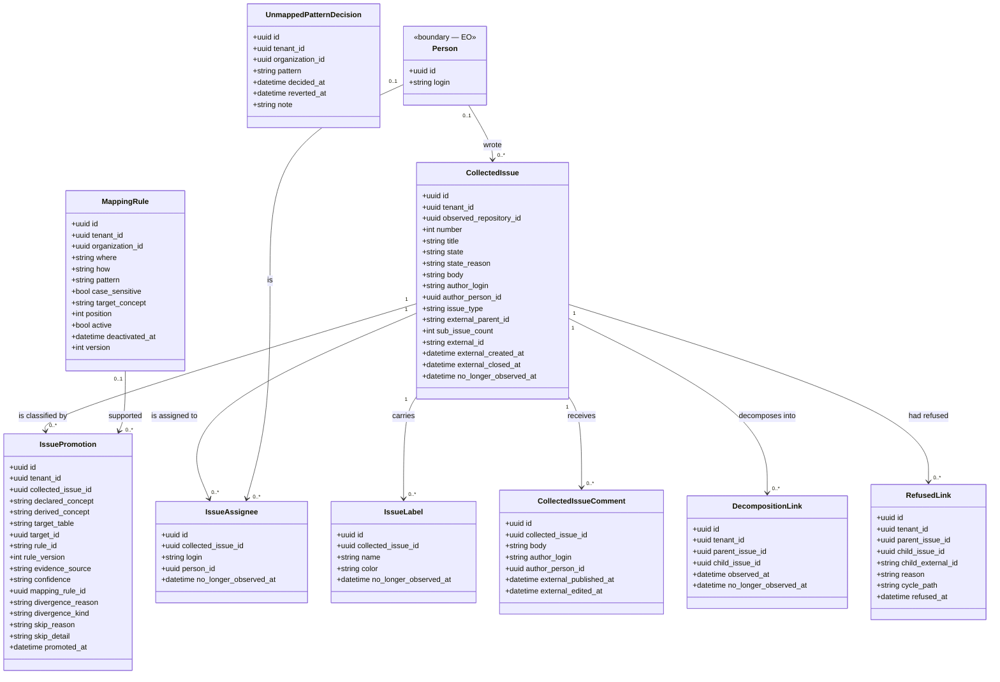
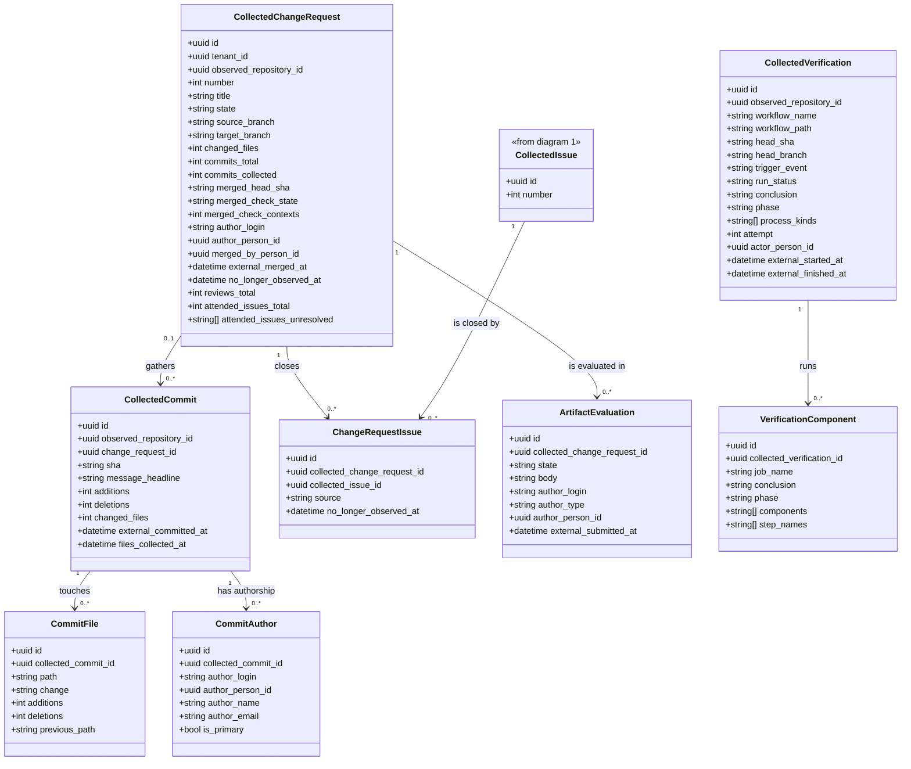

<!-- DERIVED from lib/the_band/work_items/schemas/collected_issue.ex:21-69,
     issue_promotion.ex:29-60, decomposition_link.ex:17-24, refused_link.ex:23-31,
     issue_assignee.ex:22-28, issue_label.ex:25-31;
     lib/the_band/changes/schemas/collected_change_request.ex:19-60,
     collected_commit.ex:22-46, commit_file.ex:22-34, commit_author.ex:24-36,
     change_request_issue.ex:22-30;
     lib/the_band/verification/schemas/collected_verification.ex:18-53,
     verification_component.ex:19-35;
     lib/the_band/quality/schemas/artifact_evaluation.ex:19-41;
     lib/the_band/communication/schemas/collected_issue_comment.ex:22-43;
     lib/the_band/mapping/schemas/mapping_rule.ex:25-42,
     unmapped_pattern_decision.ex:21-29;
     the FKs and CHECKs read from the development database
     (`issue_promotions_promoted_xor_skipped`, `decomposition_links_no_self_parent`,
     `refused_links_reason_check`, `issue_mapping_rules_where_known`,
     `issue_mapping_rules_how_known`, `collected_change_requests_merged_red_index`)
     — on 2026-09-12. Checked against the code on this date. Regenerate when the source changes. -->

# Classes — work and change

**What the source returned, what the platform decided it is, and what was done about it.** Seventeen
tables: the issue and its classification, the change request and its commits, continuous
verification, the artifact evaluation and the comment.

It is the most populated subsystem in the database — `spo_performed_project_activities` (30 560),
`commit_files` (30 120), `verification_components` (29 675), `collected_commits` (21 320),
measured in the development database on 2026-09-12.

It is split into **two diagrams**, because in a single one the seventeen boxes would not fit on a screen.

## 1. The issue, and what the platform decides about it

### `issue_promotions` is **append-only**, and that is the model

There is no `update_changeset` and no `updated_at` (`issue_promotion.ex:3-8`). An issue that changes
concept between collections gets a **new row**, and the one in force is the last — updating would
rewrite the past, and *"how this issue was classified in March"* would disappear.

`inserted_at` is in **microseconds**, because two promotions in the same second would tie and the one
"in force" would come to depend on the execution plan.

### `declared_concept` × `derived_concept` × `divergence_kind`

Three columns, three different statements, and it is the reason none of them is a boolean:

| Column | States |
|---|---|
| `declared_concept` | what the **source** declared (GitHub's *issue type*) |
| `derived_concept` | what the **platform** concluded, with `evidence_source` and `confidence` |
| `divergence_kind` | the two disagree, and **in what way** — five values in the `CHECK`: `epic_without_parts`, `composition_makes_epic`, `task_with_parts`, `user_story_without_parts`, `label_vs_structure` |
| `skip_reason` | it was not possible to conclude, and **why** |

And the invariant that ties them together: `CHECK issue_promotions_promoted_xor_skipped` — **either**
there is a `derived_concept` and `skip_reason` is null, **or** the opposite. Never both, never neither.
A promotion with no conclusion and no reason would be silent success in the shape of a row.

`CHECK issue_promotions_divergence_kind_needs_reason`: a divergence without a written reason does not
get in.

## 2. The change, the commit and the verification

> **Three fields of `CollectedChangeRequest` are in the diagram and not in the Ecto schema.**
> `reviews_total`, `attended_issues_total` and `attended_issues_unresolved` are real columns,
> written and read by **schemaless queries** — `from c in "collected_change_requests"`, 13
> occurrences in `lib/`. Whoever reads only `collected_change_request.ex` concludes they do not exist.
> Details and follow-up in [Divergences](#divergences-found).

## The null that means something

| Null field | Means |
|---|---|
| `*.author_person_id` (issue, comment, commit, PR, verification, evaluation) | **the login did not match any observed person**. `author_login` is still there: the platform knows who wrote it, and does not know who it is |
| `*.no_longer_observed_at` | the record **is still seen** at the source |
| `collected_issues.issue_type` | the source declared no type — and the field stays **raw**, because normalizing would destroy the data the gap needs to show (`collected_issue.ex:4-6`) |
| `collected_issues.external_closed_at` | **open** issue |
| `collected_commits.change_request_id` | commit **outside any collected request** — or the PR was deleted (`ON DELETE SET NULL`) |
| `collected_commits.files_collected_at` | the files of this commit **have not been collected yet** (`arquivos` stage, REST bucket) |
| `collected_change_requests.merged_check_state` | **it is not known** whether verification passed at the time of the merge — it is not "passed" |
| `collected_change_requests.external_merged_at` | it was not integrated (open, or closed without merge) |
| `issue_mapping_rules.deactivated_at` | the rule **holds** |
| `unmapped_pattern_decisions.reverted_at` | the decision **holds** |
| `issue_promotions.divergence_kind` | source and platform **agree** |

## Class → schema → table → concept

| Class | Schema | Table | Concept |
|---|---|---|---|
| `CollectedIssue` | `TheBand.WorkItems.Schemas.CollectedIssue` | `collected_issues` | — platform; the concept comes from the promotion |
| `IssuePromotion` | `TheBand.WorkItems.Schemas.IssuePromotion` | `issue_promotions` | — the decision, with the base's `rule_id` and `rule_version` |
| `DecompositionLink` | `TheBand.WorkItems.Schemas.DecompositionLink` | `decomposition_links` | — observed decomposition |
| `RefusedLink` | `TheBand.WorkItems.Schemas.RefusedLink` | `refused_links` | — the refusal, with the cycle path |
| `IssueAssignee` | `TheBand.WorkItems.Schemas.IssueAssignee` | `issue_assignees` | — platform |
| `IssueLabel` | `TheBand.WorkItems.Schemas.IssueLabel` | `issue_labels` | — platform |
| `CollectedIssueComment` | `TheBand.Communication.Schemas.CollectedIssueComment` | `collected_issue_comments` | `cmo.comment` |
| `CollectedChangeRequest` | `TheBand.Changes.Schemas.CollectedChangeRequest` | `collected_change_requests` | `cmpo.change_request` |
| `CollectedCommit` | `TheBand.Changes.Schemas.CollectedCommit` | `collected_commits` | `cmpo.commit_artifact_copy` |
| `CommitFile` | `TheBand.Changes.Schemas.CommitFile` | `commit_files` | `cmpo.artifact_copy` |
| `CommitAuthor` | `TheBand.Changes.Schemas.CommitAuthor` | `commit_authors` | `cmpo.stakeholder_performed_commit` |
| `ChangeRequestIssue` | `TheBand.Changes.Schemas.ChangeRequestIssue` | `change_request_issues` | — observed link |
| `ArtifactEvaluation` | `TheBand.Quality.Schemas.ArtifactEvaluation` | `collected_artifact_evaluations` | `qapo.artifact_evaluation` |
| `CollectedVerification` | `TheBand.Verification.Schemas.CollectedVerification` | `collected_verifications` | `ciro.continuous_integration_process` |
| `VerificationComponent` | `TheBand.Verification.Schemas.VerificationComponent` | `verification_components` | — component of the run |
| `MappingRule` | `TheBand.Mapping.Schemas.MappingRule` | `issue_mapping_rules` | — tenant declaration |
| `UnmappedPatternDecision` | `TheBand.Mapping.Schemas.UnmappedPatternDecision` | `unmapped_pattern_decisions` | — tenant declaration |

## Invariants the diagram does not show

| Invariant | Form |
|---|---|
| a promotion **either** concludes **or** explains why it skipped | `CHECK issue_promotions_promoted_xor_skipped` |
| a divergence without a written reason does not get in | `CHECK issue_promotions_divergence_kind_needs_reason` |
| `evidence_source ∈ {declared_type, title, structure}`, `confidence ∈ {high, medium, low}` | two `CHECK`s |
| an issue is not its own parent | `CHECK decomposition_links_no_self_parent` |
| a refusal has a closed reason: `cycle`, `out_of_scope`, `task_meets_epic` | `CHECK refused_links_reason_check` |
| a mapping rule only looks at `declared_type` or `title`, and only by `equals`/`starts_with`/`contains`/`regex` | two `CHECK`s |
| a PR merged with a red verification can be **found** | `INDEX ... WHERE merged_check_state IN ('FAILURE','ERROR')` — partial index, and the question it serves |

`refused_links.cycle_path` keeps **the path of the cycle**, not a boolean: the refusal needs to say
*where* the cycle goes through, or whoever fixes it does not know where to cut.

## What was left out of the diagram, and why

- `inserted_at` / `updated_at` in all seventeen tables — and `issue_promotions` **does not have**
  `updated_at`, on purpose (it is append-only).
- `raw_payload` (`map`) in `collected_change_requests`, `collected_commits`,
  `collected_verifications`, `collected_artifact_evaluations`, `collected_issue_comments`,
  `cmpo_branches`: the raw payload per row, in addition to `raw_payloads` per run.
- `source_system` / `source_instance` / `collected_at` / `last_observed_at`: **all** collected
  tables have them (Application Reference, FR-012); repeating them in seventeen boxes would hide the
  rest.
- `collected_issues.milestone_*`, `project_titles`, `comment_count`, `reaction_count`,
  `issue_type_external_id` — collected, and not used in the design of the relations.
- `spo_performed_project_activities` is the **performed activity** derived from these records, and
  belongs to the [projects and process](projetos-e-processo.md) diagram.

## Divergences found

Obtained by a field-by-field comparison between each `schema "..." do` in `lib/` and the columns of the
development database, on 2026-09-12 — not by visual reading.

**1. Three columns of `collected_change_requests` exist, are used, and the schema does not have them.**

| Reading | Source |
|---|---|
| the columns exist | `priv/repo/migrations/20260819030000_add_attended_issues_provenance.exs:37-38` (`attended_issues_total`, `attended_issues_unresolved`) and `20260819040000_create_artifact_evaluations.exs:82` (`reviews_total`) |
| the Ecto schema does not declare them | `collected_change_request.ex:19-63` — the remaining 28 columns are there; these three are not |
| and even so they are written and read | `quality/commands.ex:60-68` (`Repo.update_all(... set: [reviews_total: total])`), `changes.ex:85`, `changes.ex:352-368`, `quality.ex:410` — all through a **schemaless query**, `from c in "collected_change_requests"` |

A schemaless query does not go through `%CollectedChangeRequest{}` and so never complains about a
nonexistent field. The practical effect: `%CollectedChangeRequest{}` **does not have** `reviews_total`,
and whoever tries to use it through the struct finds out at run time. The two ways out — declaring the
three fields in the schema, or recording in the moduledoc that the table is read without a schema on
purpose — belong to whoever maintains `Changes` and `Quality`, not to this document.

**2. The moduledoc of `CollectedVerification` cites a field that does not exist.**

| Reading | Source |
|---|---|
| *"`subtype` and `phase` are the translation into CIRO"* | `collected_verification.ex:5` |
| there is no `subtype` in the schema, the migration or the database; there are `phase` and `process_kinds` | `collected_verification.ex:18-53`; table columns read on 2026-09-12 |

`subtype` is the only occurrence of the term in all of `lib/` and `priv/repo/migrations/`. The most
likely reading is a rename to `process_kinds` without updating the moduledoc — but *likely* is not
*derived*, and so it stays as a finding. Take it to whoever maintains continuous verification
(feature 037).

**3. Name tension, not resolved here.** `collected_verifications` carries the concept
`ciro.continuous_integration_process`, which in CIRO is the **process**; the table keeps a **run** of it
(`attempt`, `run_status`, `conclusion`, `external_started_at`). The moduledoc assumes the run reading on
purpose. The two readings: either the table's concept should be the run's, or CIRO treats the process as
the instantiated one. Take it to whoever maintains the knowledge base — it is not this document's choice.
