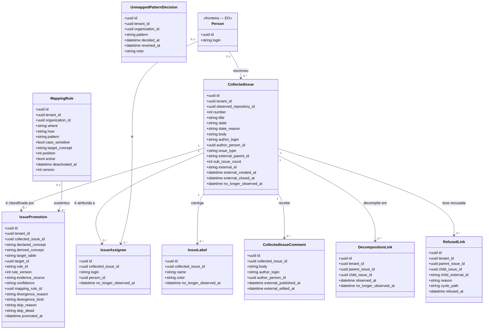
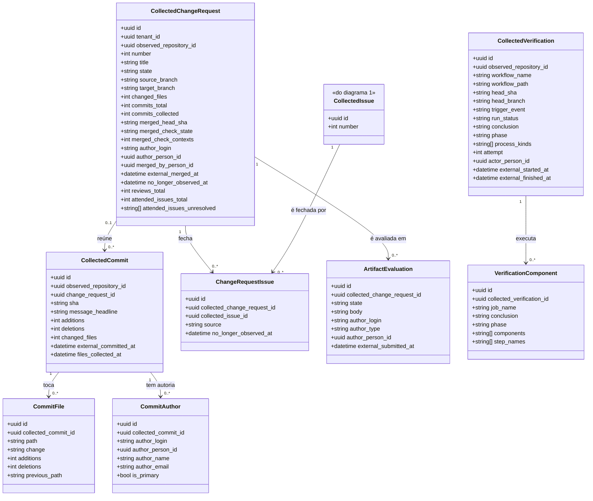

<!-- DERIVADO de lib/the_band/work_items/schemas/collected_issue.ex:21-69,
     issue_promotion.ex:29-60, decomposition_link.ex:17-24, refused_link.ex:23-31,
     issue_assignee.ex:22-28, issue_label.ex:25-31;
     lib/the_band/changes/schemas/collected_change_request.ex:19-60,
     collected_commit.ex:22-46, commit_file.ex:22-34, commit_author.ex:24-36,
     change_request_issue.ex:22-30;
     lib/the_band/verification/schemas/collected_verification.ex:18-53,
     verification_component.ex:19-35;
     lib/the_band/quality/schemas/artifact_evaluation.ex:19-41;
     lib/the_band/communication/schemas/collected_issue_comment.ex:22-43;
     lib/the_band/mapping/schemas/mapping_rule.ex:25-42,
     unmapped_pattern_decision.ex:21-29;
     as FKs e CHECK lidas do banco de desenvolvimento
     (`issue_promotions_promoted_xor_skipped`, `decomposition_links_no_self_parent`,
     `refused_links_reason_check`, `issue_mapping_rules_where_known`,
     `issue_mapping_rules_how_known`, `collected_change_requests_merged_red_index`)
     — em 2026-09-12. Conferido contra o código nesta data. Regenerar ao mudar a fonte. -->

# Classes — trabalho e mudança

**O que a origem devolveu, o que a plataforma decidiu que aquilo é, e o que foi feito sobre
isso.** Dezessete tabelas: a issue e sua classificação, a solicitação de mudança e seus commits,
a verificação contínua, a avaliação do artefato e o comentário.

É o subsistema mais populoso do banco — `spo_performed_project_activities` (30 560),
`commit_files` (30 120), `verification_components` (29 675), `collected_commits` (21 320),
medidos no banco de desenvolvimento em 2026-09-12.

Está quebrado em **dois diagramas**, porque num só as dezessete caixas não caberiam numa tela.

## 1. A issue, e o que a plataforma decide sobre ela

### `issue_promotions` é **append-only**, e isso é o modelo

Não há `update_changeset` nem `updated_at` (`issue_promotion.ex:3-8`). Uma issue que muda de
conceito entre coletas ganha **linha nova**, e a vigente é a última — atualizar reescreveria o
passado, e *"como esta issue estava classificada em março"* desapareceria.

`inserted_at` é em **microssegundo**, porque duas promoções do mesmo segundo empatariam e a
"vigente" passaria a depender do plano de execução.

### `declared_concept` × `derived_concept` × `divergence_kind`

Três colunas, três afirmações diferentes, e é a razão de nenhuma ser um booleano:

| Coluna | Afirma |
|---|---|
| `declared_concept` | o que a **origem** declarou (o *issue type* do GitHub) |
| `derived_concept` | o que a **plataforma** concluiu, com `evidence_source` e `confidence` |
| `divergence_kind` | as duas discordam, e **de que jeito** — cinco valores no `CHECK`: `epic_without_parts`, `composition_makes_epic`, `task_with_parts`, `user_story_without_parts`, `label_vs_structure` |
| `skip_reason` | não foi possível concluir, e **por quê** |

E o invariante que os amarra: `CHECK issue_promotions_promoted_xor_skipped` — **ou** há
`derived_concept` e `skip_reason` é nulo, **ou** o contrário. Nunca os dois, nunca nenhum.
Uma promoção sem conclusão e sem motivo seria o sucesso silencioso em forma de linha.

`CHECK issue_promotions_divergence_kind_needs_reason`: divergência sem razão escrita não entra.

## 2. A mudança, o commit e a verificação

> **Três campos de `CollectedChangeRequest` estão no diagrama e não no schema Ecto.**
> `reviews_total`, `attended_issues_total` e `attended_issues_unresolved` são colunas reais,
> escritas e lidas por **consultas sem schema** — `from c in "collected_change_requests"`, 13
> ocorrências em `lib/`. Quem ler só `collected_change_request.ex` conclui que não existem.
> Detalhe e encaminhamento em [Divergências](#divergências-encontradas).

## O nulo que significa

| Campo nulo | Significa |
|---|---|
| `*.author_person_id` (issue, comentário, commit, PR, verificação, avaliação) | **o login não casou com nenhuma pessoa observada**. O `author_login` continua ali: a plataforma sabe quem escreveu, e não sabe quem é |
| `*.no_longer_observed_at` | o registro **continua sendo visto** na origem |
| `collected_issues.issue_type` | a origem não declarou tipo — e o campo fica **cru**, porque normalizar destruiria o dado que a lacuna precisa mostrar (`collected_issue.ex:4-6`) |
| `collected_issues.external_closed_at` | issue **aberta** |
| `collected_commits.change_request_id` | commit **fora de qualquer solicitação** coletada — ou a PR foi apagada (`ON DELETE SET NULL`) |
| `collected_commits.files_collected_at` | os arquivos deste commit **ainda não foram coletados** (etapa `arquivos`, balde REST) |
| `collected_change_requests.merged_check_state` | **não se sabe** se a verificação passou no momento do merge — não é "passou" |
| `collected_change_requests.external_merged_at` | não foi integrada (aberta ou fechada sem merge) |
| `issue_mapping_rules.deactivated_at` | a regra **vale** |
| `unmapped_pattern_decisions.reverted_at` | a decisão **vale** |
| `issue_promotions.divergence_kind` | origem e plataforma **concordam** |

## Classe → schema → tabela → conceito

| Classe | Schema | Tabela | Conceito |
|---|---|---|---|
| `CollectedIssue` | `TheBand.WorkItems.Schemas.CollectedIssue` | `collected_issues` | — plataforma; o conceito sai da promoção |
| `IssuePromotion` | `TheBand.WorkItems.Schemas.IssuePromotion` | `issue_promotions` | — a decisão, com `rule_id` e `rule_version` da base |
| `DecompositionLink` | `TheBand.WorkItems.Schemas.DecompositionLink` | `decomposition_links` | — decomposição observada |
| `RefusedLink` | `TheBand.WorkItems.Schemas.RefusedLink` | `refused_links` | — a recusa, com o caminho do ciclo |
| `IssueAssignee` | `TheBand.WorkItems.Schemas.IssueAssignee` | `issue_assignees` | — plataforma |
| `IssueLabel` | `TheBand.WorkItems.Schemas.IssueLabel` | `issue_labels` | — plataforma |
| `CollectedIssueComment` | `TheBand.Communication.Schemas.CollectedIssueComment` | `collected_issue_comments` | `cmo.comment` |
| `CollectedChangeRequest` | `TheBand.Changes.Schemas.CollectedChangeRequest` | `collected_change_requests` | `cmpo.change_request` |
| `CollectedCommit` | `TheBand.Changes.Schemas.CollectedCommit` | `collected_commits` | `cmpo.commit_artifact_copy` |
| `CommitFile` | `TheBand.Changes.Schemas.CommitFile` | `commit_files` | `cmpo.artifact_copy` |
| `CommitAuthor` | `TheBand.Changes.Schemas.CommitAuthor` | `commit_authors` | `cmpo.stakeholder_performed_commit` |
| `ChangeRequestIssue` | `TheBand.Changes.Schemas.ChangeRequestIssue` | `change_request_issues` | — elo observado |
| `ArtifactEvaluation` | `TheBand.Quality.Schemas.ArtifactEvaluation` | `collected_artifact_evaluations` | `qapo.artifact_evaluation` |
| `CollectedVerification` | `TheBand.Verification.Schemas.CollectedVerification` | `collected_verifications` | `ciro.continuous_integration_process` |
| `VerificationComponent` | `TheBand.Verification.Schemas.VerificationComponent` | `verification_components` | — componente da execução |
| `MappingRule` | `TheBand.Mapping.Schemas.MappingRule` | `issue_mapping_rules` | — declaração do tenant |
| `UnmappedPatternDecision` | `TheBand.Mapping.Schemas.UnmappedPatternDecision` | `unmapped_pattern_decisions` | — declaração do tenant |

## Invariantes que o diagrama não mostra

| Invariante | Forma |
|---|---|
| promoção **ou** conclui **ou** explica por que pulou | `CHECK issue_promotions_promoted_xor_skipped` |
| divergência sem razão escrita não entra | `CHECK issue_promotions_divergence_kind_needs_reason` |
| `evidence_source ∈ {declared_type, title, structure}`, `confidence ∈ {high, medium, low}` | dois `CHECK` |
| issue não é pai de si mesma | `CHECK decomposition_links_no_self_parent` |
| recusa tem motivo fechado: `cycle`, `out_of_scope`, `task_meets_epic` | `CHECK refused_links_reason_check` |
| regra de mapeamento só olha `declared_type` ou `title`, e só por `equals`/`starts_with`/`contains`/`regex` | dois `CHECK` |
| PR integrada com verificação vermelha é **localizável** | `INDEX ... WHERE merged_check_state IN ('FAILURE','ERROR')` — índice parcial, e a pergunta que ele serve |

`refused_links.cycle_path` guarda **o caminho do ciclo**, não um booleano: a recusa precisa
dizer *por onde* o ciclo passa, ou quem for corrigir não sabe onde cortar.

## O que ficou de fora do diagrama, e por quê

- `inserted_at` / `updated_at` em todas as dezessete tabelas — e `issue_promotions` **não tem**
  `updated_at`, de propósito (é append-only).
- `raw_payload` (`map`) em `collected_change_requests`, `collected_commits`,
  `collected_verifications`, `collected_artifact_evaluations`, `collected_issue_comments`,
  `cmpo_branches`: o cru por linha, além do `raw_payloads` por execução.
- `source_system` / `source_instance` / `collected_at` / `last_observed_at`: **todas** as
  tabelas coletadas os têm (Application Reference, FR-012); repeti-los em dezessete caixas
  esconderia o resto.
- `collected_issues.milestone_*`, `project_titles`, `comment_count`, `reaction_count`,
  `issue_type_external_id` — coletados, e não usados no desenho das relações.
- `spo_performed_project_activities` é a **atividade realizada** derivada destes registros, e
  pertence ao diagrama de [projetos e processo](projetos-e-processo.md).

## Divergências encontradas

Obtidas por comparação campo a campo entre cada `schema "..." do` de `lib/` e as colunas do
banco de desenvolvimento, em 2026-09-12 — e não por leitura visual.

**1. Três colunas de `collected_change_requests` existem, são usadas, e o schema não as tem.**

| Leitura | Fonte |
|---|---|
| as colunas existem | `priv/repo/migrations/20260819030000_add_attended_issues_provenance.exs:37-38` (`attended_issues_total`, `attended_issues_unresolved`) e `20260819040000_create_artifact_evaluations.exs:82` (`reviews_total`) |
| o schema Ecto não as declara | `collected_change_request.ex:19-63` — as 28 colunas restantes estão lá; estas três, não |
| e mesmo assim são escritas e lidas | `quality/commands.ex:60-68` (`Repo.update_all(... set: [reviews_total: total])`), `changes.ex:85`, `changes.ex:352-368`, `quality.ex:410` — todas por **consulta sem schema**, `from c in "collected_change_requests"` |

Uma consulta sem schema não passa pelo `%CollectedChangeRequest{}` e por isso nunca reclama de
campo inexistente. O efeito prático: `%CollectedChangeRequest{}` **não tem** `reviews_total`, e
quem tentar usá-lo pela struct descobre em tempo de execução. As duas saídas — declarar os três
campos no schema, ou registrar no moduledoc que a tabela é lida sem schema de propósito — são
de quem mantém `Changes` e `Quality`, não deste documento.

**2. O moduledoc de `CollectedVerification` cita um campo que não existe.**

| Leitura | Fonte |
|---|---|
| *"`subtype` e `phase` são a tradução para a CIRO"* | `collected_verification.ex:5` |
| não há `subtype` no schema, na migração nem no banco; há `phase` e `process_kinds` | `collected_verification.ex:18-53`; colunas da tabela lidas em 2026-09-12 |

`subtype` é a única ocorrência do termo em todo o `lib/` e `priv/repo/migrations/`. A leitura
mais provável é renomeação para `process_kinds` sem atualizar o moduledoc — mas *provável* não
é *derivado*, e por isso fica como achado. Levar a quem mantém a verificação contínua
(feature 037).

**3. Tensão de nome, não resolvida aqui.** `collected_verifications` carrega o conceito
`ciro.continuous_integration_process`, que na CIRO é o **processo**; a tabela guarda uma
**execução** dele (`attempt`, `run_status`, `conclusion`, `external_started_at`). O moduledoc
assume a leitura de execução de propósito. As duas leituras: ou o conceito da tabela deveria
ser o da execução, ou a CIRO trata o processo como o instanciado. Levar a quem mantém a base
de conhecimento — não é escolha deste documento.
