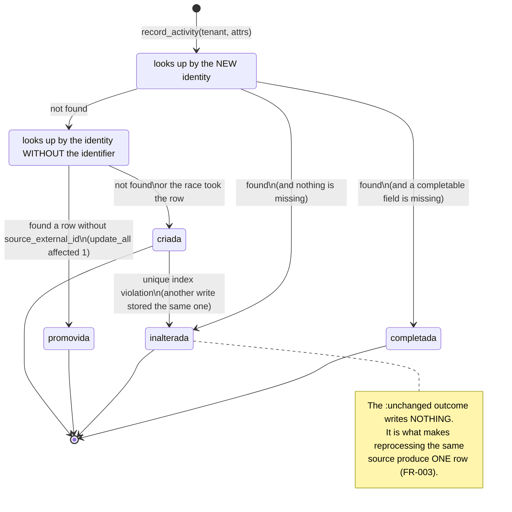

<!-- DERIVED from lib/the_band/ontology/seon/spo/commands.ex:14-60 (@doc of record_activity/2),
     :62-75 (the body), :77 (@completaveis), :86-105 (completar/2), :108-113
     (promover_ou_inserir/2), :117-121 (identidade_sem_identificador/1), :126-152 (promover/2),
     :157-167 (inserir/1), :173-186 (resolver_colisao/2);
     lib/the_band/ontology/seon/spo/schemas/performed_project_activity.ex:35-81 (the schema and the
     virtual field :outcome), :121-140 (@doc of internal_id/1);
     priv/repo/migrations/20260814160000_create_spo_performed_project_activities.exs,
     20260915220000_identidade_da_atividade_v2.exs:1-40 (the moduledoc with the measurement),
     20260916140000_o_quadro_e_a_coluna_na_atividade.exs:30-57;
     priv/knowledge_base/ontology/seon/spo/modules/processes_and_activities.yaml
     (identity_criterion);
     test/the_band/ontology/seon/spo/atividade_test.exs
     — on 2026-09-18. Checked against the code on this date. Regenerate when the source changes. -->

# States — the performed activity (`spo_performed_project_activities`)

**The largest table of the ontology, and the only one that is never updated.** This document exists
because "never updates" is a design decision, and a decision that is not written down becomes a bug
reported by newcomers.

> *Largest* by the last published measurement: **30 560 rows** in the development database on
> 2026-09-12 ([map of the tables](../banco/mapa-das-tabelas.md#projects-and-process--17-tables)),
> against 2 559 for the second largest among the `spo_`, `sro_`, `eo_` and `cmpo_` tables. **It was not
> re-measured on this date** — there was no access to the database — and the number only grows.

## What it keeps

An **occurrence**: a commit that happened, a label that was applied, a card that changed column. The
schema says it is the *kind* of all occurrences in the network:

> *"The ontology says that commits, test runs, ceremonies, deployments and inspections 'share the same
> principle of identity', and that is why this schema is modelled by the concept's criterion, not by
> GitHub's timeline — which is only the first source to arrive here."* —
> `performed_project_activity.ex:5-9`

## The state does not belong to the row — it belongs to what happened when writing it

Here the machine is different from all the others in this folder, and the difference is the point:

> **There is no state column, because there is no state.** An occurrence happened; it does not go
> through situations.

What exists is a **virtual field** — `outcome` — that is not stored anywhere and only describes **the
outcome of the attempt to write**:

```elixir
field :outcome, Ecto.Enum,
  values: [:created, :unchanged, :promoted, :completed],
  virtual: true
```
`performed_project_activity.ex:77-79`

**Twelve schemas of the platform have `outcome`.** Eleven of them use `[:created, :updated, :unchanged]`.
This is the only one with four values, and the only one **without `:updated`** — and the absence is the
decision:

> *"The platform's other schemas have three outcomes because they describe entities that change: a
> person changes name, a repository is archived. An occurrence does not change — it happened."* —
> `performed_project_activity.ex:12-15`

## The machine

The states are the four outcomes of `record_activity/2`. What decides between them is the **identity** —
`internal_id`, a hash of the components the ontology declares.



| Outcome | What happened to the row | Where |
|---|---|---|
| `:created` | new row | `commands.ex:160` |
| `:unchanged` | **nothing was written** | `commands.ex:97` and `:175` |
| `:promoted` | the existing row received the `source_external_id` the source always gave | `commands.ex:145` |
| `:completed` | **null** fields of the existing row were filled | `commands.ex:104` |

## The two apparent exceptions, and why they are not

`:promoted` and `:completed` write to an existing row. The `@doc` of `record_activity/2` faces this
head-on, and the defence is the same in both cases:

> *"The occurrence is the same — same type, same actor, same instant, same subject. What changes is what
> we know how to write about it."* — `commands.ex:43-44`

### Complementation (`:completed`)

Fills a **null** field with what the source always said and the query did not ask for. The list is
closed — three fields, all observation from the source, nothing derived by us:

```elixir
@completaveis [:board_id, :board_external_id, :status_name]
```
`commands.ex:78`

The guard that makes it safe is in the condition: only a field where `is_nil` holds on both sides gets
in — existing null, new value non-null. **Replacing an existing value remains forbidden.**

The data that required it, measured on **2026-09-16**: the recollection of 25 repositories *"went through
entirely without writing a single board, because every occurrence already existed and `:unchanged`
writes nothing"* (`commands.ex:86-87`). Without complementation, adding a field to the query **does not
reach history** — and that is the silent-success family: the collection finishes green and did not write
what it went to fetch.

### Promotion (`:promoted`) — and it is transitional

Until 2026-09-15 collection did not ask the source for the timeline event identifier, *"believing it did
not exist. It does"* (`commands.ex:34-35`). The identifier entered the identity criterion, and
**41 863 rows** already written were without it — reread from the source, they would compute a different
hash and come in again, as 41 863 duplicates.

Promotion prevents that: not finding by the new identity, it looks up by the identity the occurrence
would have **without** the identifier; if the row exists and lacks it, it receives the identifier and
starts to count under the new identity.

It also **separates occurrences that were stuck together**: two labels applied to the same issue, in the
same second, by the same actor shared a single row. The first to arrive promotes the row; the second no
longer finds it by the old identity, and is inserted. Two rows for two acts (`commands.ex:46-49`).

**How to know when to delete the branch** — it is written in the `@doc` itself, and it is the kind of
criterion that keeps transitional code from becoming permanent:

```sql
select count(*) from spo_performed_project_activities where source_external_id is null
```

> *"As long as that number is not the one of the sources that legitimately do not identify their events,
> promotion still has work to do."* — `commands.ex:56-57`

## The two races, and how each is resolved

They are not hypotheses: both are handled in the code, with the comment explaining why.

| Race | Where | How it is resolved |
|---|---|---|
| two writes compete for the **same old row** to promote | `commands.ex:126-152` | the `where ... is_nil(source_external_id)` in the `update_all`: only one promotes; the other gets zero affected rows and goes on to the insert |
| two collections of the same issue arrive **together** at the insert | `commands.ex:157-186` | the unique index answers, and **only the `:internal_id` violation is handled** — any other error goes up, because swallowing it would be a silent fallback (`commands.ex:165-168`) |

The second deserves emphasis, because it is the design opposite to what the house pursues as a defect: a
generic `rescue` would have turned any error into `:unchanged`, and the collection would report success
without having written. The code handles **one** named violation and lets the rest fail.

## The identity, and the amendment of 2026-09-15

`internal_id` is the hash of the components the ontology declares, *"in the order in which the ontology
wrote them, and changing it would change every identity already written"*
(`performed_project_activity.ex:126-127`).

**Version 1 did not include the subject**, and the consequence was measured: issue `#2539` of
`conectafapes-project` has **12 events at the source and 7 in the database**; the one at
`2026-08-12 15:12:16` did not get in because the identity was taken by `#2536`, which changed column at
the same instant, by the same actor (`20260915220000:17-22`).

The migration `20260915220000_identidade_da_atividade_v2.exs` recomputes the `internal_id` of **every**
row, with the subject included. Two things about it deserve to be in a model:

- **It is reversible, and lossless.** The new hash is *more specific* than the old one: what was already
  distinct stays distinct. A collision could only happen in the opposite direction
  (`20260915220000:31-35`).
- **It does not recover the lost events.** *"They were never written. What it gives back is the
  possibility of writing them"* (`20260915220000:38-40`) — and what brings them is the recollection.

Two dates that matter to whoever reads a number from this table:

| Instant | What changes |
|---|---|
| **2026-09-15** | `subject_type` and `subject_id` enter the identity; every `internal_id` is recomputed |
| **2026-09-16** | `board_id`, `board_external_id` and `status_name` come into existence; `status_name` is backfilled from `payload->>'status'` (`20260916140000:53-57`) |

`board_id` was **not** backfilled — *"The board was not there, and only comes back through the
recollection"* (`20260916140000:51-52`). It is exactly what complementation exists to do.

## A null that means something

A null `concept_id` **is not missing data**: it means the network does not name that type of activity. It
is the honest state of `labeled` and `cross-referenced` (`performed_project_activity.ex:17-19`).

Whoever declares otherwise is the organization, and it is one of the
[revocable declaration](declaracao-revogavel.md) tables: `spo_event_concept_declarations` prevails over the
house default **at read time**, without rewriting anything here.

## What this model does not show

- The provenance fields and the `payload` — they are in the
  [class diagram](../classes/projetos-e-processo.md).
- `board_id` × `board_external_id` and `performer_id` × `performer_login`: the pair exists because
  *"the source identifier always fits, and the resolution to the observed board may not exist yet"*
  (`performed_project_activity.ex:53-56`). It is a data model, not a state one.
- The four outcomes **are not transitions of a record**: they are outcomes of a call. That is why the
  table below is of outcomes, not of arrows.

## Each outcome, and the test that proves it

`test/the_band/ontology/seon/spo/atividade_test.exs` has **20 tests**, and the four outcomes appear in the
assertions:

| Outcome | Assertion | Line |
|---|---|---|
| `:created` | `assert primeira.outcome == :created` | `atividade_test.exs:75` |
| `:unchanged` | *"the second write does not duplicate, and says `:unchanged`"* | `atividade_test.exs:73, 78` |
| `:promoted` | `assert depois.outcome == :promoted` | `atividade_test.exs:226, 248` |
| `:completed` | `assert depois.outcome == :completed` | `atividade_test.exs:372` |

Two tests deserve to be known by whoever touches this, because they protect against the defect this
house pursues most:

- `atividade_test.exs:203-206` — *"The second tenant received `:unchanged` for an event it never saw"*:
  proves that the identity **isolates tenants**. Without it, one organization's collection would silently
  discard another's events.
- `atividade_test.exs:83` — the FR-003 assertion is the **row count**, not the `outcome`. The test's own
  comment explains: an `:unchanged` can be right for the wrong reason, and the count is what does not lie.
