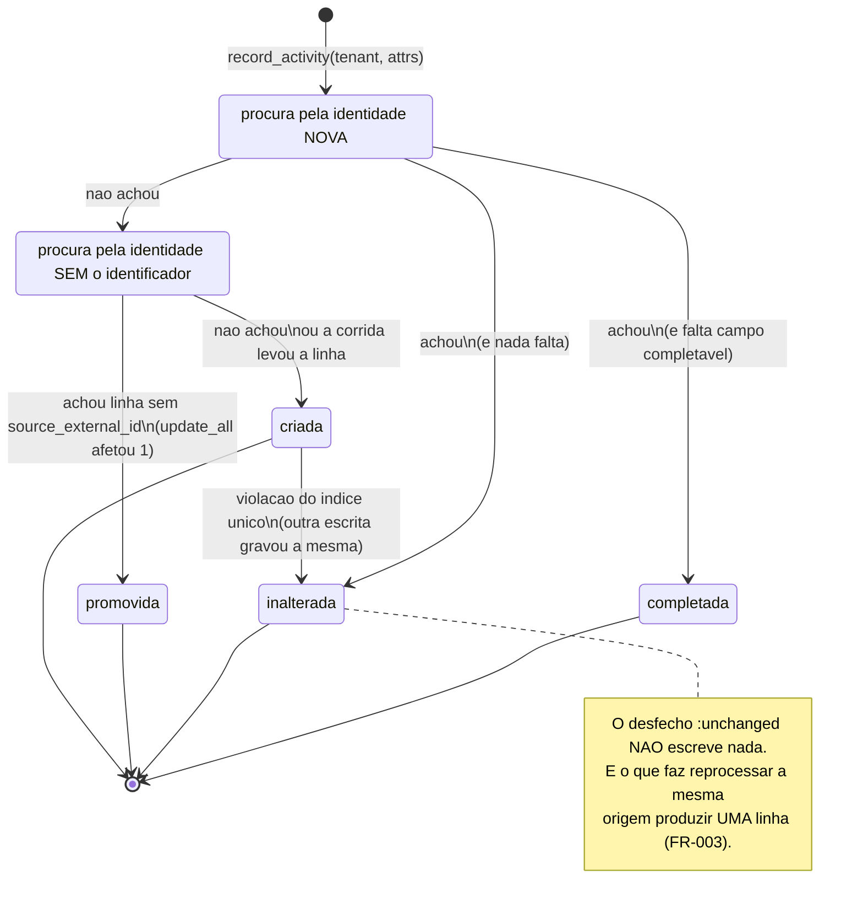

<!-- DERIVADO de lib/the_band/ontology/seon/spo/commands.ex:14-60 (@doc de record_activity/2),
     :62-75 (o corpo), :77 (@completaveis), :86-105 (completar/2), :108-113
     (promover_ou_inserir/2), :117-121 (identidade_sem_identificador/1), :126-152 (promover/2),
     :157-167 (inserir/1), :173-186 (resolver_colisao/2);
     lib/the_band/ontology/seon/spo/schemas/performed_project_activity.ex:35-81 (o schema e o
     campo virtual :outcome), :121-140 (@doc de internal_id/1);
     priv/repo/migrations/20260814160000_create_spo_performed_project_activities.exs,
     20260915220000_identidade_da_atividade_v2.exs:1-40 (o moduledoc com a medida),
     20260916140000_o_quadro_e_a_coluna_na_atividade.exs:30-57;
     priv/knowledge_base/ontology/seon/spo/modules/processes_and_activities.yaml
     (identity_criterion);
     test/the_band/ontology/seon/spo/atividade_test.exs
     — em 2026-09-18. Conferido contra o código nesta data. Regenerar ao mudar a fonte. -->

# Estados — a atividade executada (`spo_performed_project_activities`)

**A maior tabela da ontologia, e a única que nunca é atualizada.** Este documento existe porque
"nunca atualiza" é decisão de desenho, e uma decisão que não está escrita vira bug relatado por
quem chega.

> *Maior* pela última medida publicada: **30 560 linhas** no banco de desenvolvimento em
> 2026-09-12 ([mapa das tabelas](../banco/mapa-das-tabelas.md#projetos-e-processo--17-tabelas)),
> contra 2 559 da segunda maior entre as tabelas `spo_`, `sro_`, `eo_` e `cmpo_`. **Não foi
> remedida nesta data** — não havia acesso ao banco — e o número só cresce.

## O que ela guarda

Uma **ocorrência**: um commit que aconteceu, um rótulo que foi posto, um cartão que mudou de
coluna. O schema diz que ela é o *kind* de todas as ocorrências da rede:

> *"A ontologia diz que commits, execuções de teste, cerimônias, implantações e inspeções
> 'compartilham o mesmo princípio de identidade', e por isso este schema é modelado pelo
> critério do conceito, não pela timeline do GitHub — que é só a primeira origem a chegar
> aqui."* — `performed_project_activity.ex:5-9`

## O estado não é da linha — é do que aconteceu ao gravá-la

Aqui a máquina é diferente de todas as outras desta pasta, e a diferença é o ponto:

> **Não existe coluna de estado, porque não existe estado.** Uma ocorrência aconteceu; ela
> não passa por situações.

O que existe é um **campo virtual** — `outcome` — que não é gravado em lugar nenhum e só
descreve **o desfecho da tentativa de gravar**:

```elixir
field :outcome, Ecto.Enum,
  values: [:created, :unchanged, :promoted, :completed],
  virtual: true
```
`performed_project_activity.ex:77-79`

**Doze schemas da plataforma têm `outcome`.** Onze deles usam `[:created, :updated, :unchanged]`.
Este é o único com quatro valores, e o único **sem `:updated`** — e a ausência é a decisão:

> *"Os outros schemas da plataforma têm três resultados porque descrevem entidades que mudam:
> uma pessoa troca de nome, um repositório é arquivado. Uma ocorrência não muda — ela
> aconteceu."* — `performed_project_activity.ex:12-15`

## A máquina

Os estados são os quatro desfechos de `record_activity/2`. O que decide entre eles é a
**identidade** — `internal_id`, um hash dos componentes que a ontologia declara.



| Desfecho | O que aconteceu na linha | Onde |
|---|---|---|
| `:created` | linha nova | `commands.ex:160` |
| `:unchanged` | **nada foi escrito** | `commands.ex:97` e `:175` |
| `:promoted` | a linha existente recebeu o `source_external_id` que a origem sempre deu | `commands.ex:145` |
| `:completed` | campos **nulos** da linha existente foram preenchidos | `commands.ex:104` |

## As duas exceções aparentes, e por que não são

`:promoted` e `:completed` escrevem em linha existente. O `@doc` de `record_activity/2` trata
disso de frente, e a defesa é a mesma nos dois casos:

> *"A ocorrência é a mesma — mesmo tipo, mesmo ator, mesmo instante, mesmo sujeito. O que muda
> é o que sabemos escrever sobre ela."* — `commands.ex:43-44`

### Complementação (`:completed`)

Preenche campo **nulo** com o que a origem sempre disse e a consulta não pedia. A lista é
fechada — três campos, todos observação da origem, nada derivado por nós:

```elixir
@completaveis [:board_id, :board_external_id, :status_name]
```
`commands.ex:78`

A guarda que a torna segura está na condição: só entra campo em que `is_nil` dos dois lados —
existente nulo, valor novo não nulo. **Trocar valor existente segue proibido.**

O dado que a exigiu, medido em **2026-09-16**: a recoleta de 25 repositórios *"passou inteira
sem gravar um único quadro, porque toda ocorrência já existia e `:unchanged` não escreve nada"*
(`commands.ex:86-87`). Sem a complementação, acrescentar campo à consulta **não alcança o
histórico** — e isso é a família do sucesso silencioso: a coleta termina verde e não gravou o
que se foi buscar.

### Promoção (`:promoted`) — e ela é transitória

Até 2026-09-15 a coleta não pedia à origem o identificador do evento de timeline, *"por
acreditar que ele não existia. Ele existe"* (`commands.ex:34-35`). O identificador entrou no
critério de identidade, e **41 863 linhas** já gravadas estavam sem ele — relidas da origem,
calculariam hash diferente e entrariam de novo, como 41 863 duplicatas.

A promoção evita isso: não achando pela identidade nova, procura pela identidade que a
ocorrência teria **sem** o identificador; se a linha existe e está sem ele, recebe o
identificador e passa a valer pela identidade nova.

Ela também **separa ocorrências que estavam coladas**: dois rótulos postos na mesma issue, no
mesmo segundo, pelo mesmo ator dividiam uma linha só. O primeiro a chegar promove a linha; o
segundo não a acha mais pela identidade antiga, e é inserido. Duas linhas para dois atos
(`commands.ex:46-49`).

**Como saber quando apagar o ramo** — está escrito no próprio `@doc`, e é o tipo de critério
que evita código transitório virar permanente:

```sql
select count(*) from spo_performed_project_activities where source_external_id is null
```

> *"Enquanto esse número não for o das origens que legitimamente não identificam seus eventos,
> a promoção ainda tem trabalho."* — `commands.ex:56-57`

## As duas corridas, e como cada uma é resolvida

Não são hipóteses: as duas estão tratadas no código, com o comentário explicando por quê.

| Corrida | Onde | Como se resolve |
|---|---|---|
| duas gravações disputam a **mesma linha antiga** para promover | `commands.ex:126-152` | o `where ... is_nil(source_external_id)` no `update_all`: só uma promove; a outra recebe zero linhas afetadas e segue para o insert |
| duas coletas da mesma issue chegam **juntas** ao insert | `commands.ex:157-186` | o índice único responde, e **só a violação de `:internal_id` é tratada** — qualquer outro erro sobe, porque engolir seria fallback silencioso (`commands.ex:165-168`) |

A segunda merece destaque, porque é o desenho contrário ao que a casa persegue como defeito:
o `rescue` genérico teria transformado qualquer erro em `:unchanged`, e a coleta reportaria
sucesso sem ter gravado. O código trata **uma** violação nomeada e deixa o resto falhar.

## A identidade, e a emenda de 2026-09-15

`internal_id` é o hash dos componentes que a ontologia declara, *"na ordem em que a ontologia
os escreveu, e mudá-la mudaria toda identidade já gravada"*
(`performed_project_activity.ex:126-127`).

**A versão 1 não incluía o sujeito**, e a consequência foi medida: a issue `#2539` do
`conectafapes-project` tem **12 eventos na origem e 7 no banco**; o de `2026-08-12 15:12:16`
não entrou porque a identidade estava ocupada pela `#2536`, que mudou de coluna no mesmo
instante, pelo mesmo ator (`20260915220000:17-22`).

A migração `20260915220000_identidade_da_atividade_v2.exs` recalcula `internal_id` de **toda**
linha, com o sujeito incluído. Duas coisas dela merecem estar num modelo:

- **É reversível, e sem perda.** O hash novo é *mais específico* que o antigo: o que já era
  distinto continua distinto. A colisão só podia acontecer no sentido oposto
  (`20260915220000:31-35`).
- **Ela não recupera os eventos perdidos.** *"Eles nunca foram gravados. O que ela devolve é a
  possibilidade de gravá-los"* (`20260915220000:38-40`) — e quem os traz é a recoleta.

Duas datas que valem para quem lê um número desta tabela:

| Instante | O que muda |
|---|---|
| **2026-09-15** | `subject_type` e `subject_id` entram na identidade; todo `internal_id` é recalculado |
| **2026-09-16** | `board_id`, `board_external_id` e `status_name` passam a existir; `status_name` é preenchido retroativamente a partir de `payload->>'status'` (`20260916140000:53-57`) |

`board_id` **não** foi preenchido retroativamente — *"O quadro não estava, e só volta pela
recoleta"* (`20260916140000:51-52`). É exatamente o que a complementação existe para fazer.

## Um nulo que significa

`concept_id` nulo **não é dado faltando**: significa que a rede não nomeia aquele tipo de
atividade. É o estado honesto de `labeled` e `cross-referenced`
(`performed_project_activity.ex:17-19`).

Quem declara o contrário disso é a organização, e é uma das tabelas de
[declaração revogável](declaracao-revogavel.md): `spo_event_concept_declarations` prevalece
sobre o padrão da casa **na leitura**, sem regravar nada aqui.

## O que este modelo não mostra

- Os campos de proveniência e o `payload` — estão no
  [diagrama de classes](../classes/projetos-e-processo.md).
- `board_id` × `board_external_id` e `performer_id` × `performer_login`: o par existe porque
  *"o identificador da origem sempre cabe, e a resolução para o quadro observado pode não
  existir ainda"* (`performed_project_activity.ex:53-56`). É modelo de dado, não de estado.
- Os quatro desfechos **não são transições de um registro**: são desfechos de uma chamada. Por
  isso a tabela abaixo é de desfecho, e não de seta.

## Cada desfecho, e o teste que o prova

`test/the_band/ontology/seon/spo/atividade_test.exs` tem **20 testes**, e os quatro desfechos
aparecem nas asserções:

| Desfecho | Asserção | Linha |
|---|---|---|
| `:created` | `assert primeira.outcome == :created` | `atividade_test.exs:75` |
| `:unchanged` | *"a segunda gravação não duplica, e diz `:unchanged`"* | `atividade_test.exs:73, 78` |
| `:promoted` | `assert depois.outcome == :promoted` | `atividade_test.exs:226, 248` |
| `:completed` | `assert depois.outcome == :completed` | `atividade_test.exs:372` |

Dois testes merecem ser conhecidos por quem mexer aqui, porque protegem contra o defeito que
esta casa mais persegue:

- `atividade_test.exs:203-206` — *"O segundo tenant recebeu `:unchanged` de um evento que ele
  nunca viu"*: prova que a identidade **isola tenants**. Sem isso, a coleta de uma organização
  descartaria em silêncio os eventos de outra.
- `atividade_test.exs:83` — a asserção da FR-003 é a **contagem de linhas**, e não o `outcome`.
  O comentário do próprio teste explica: um `:unchanged` pode estar certo pelo motivo errado, e
  a contagem é o que não mente.
