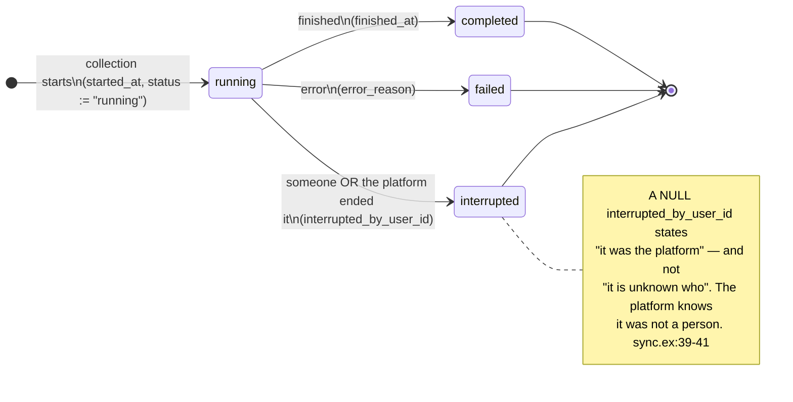
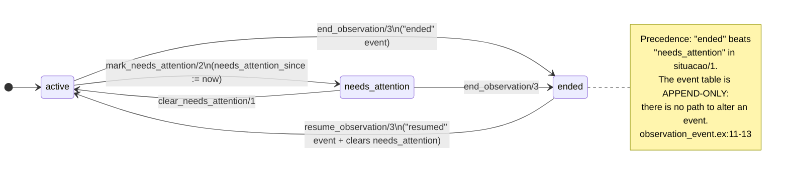
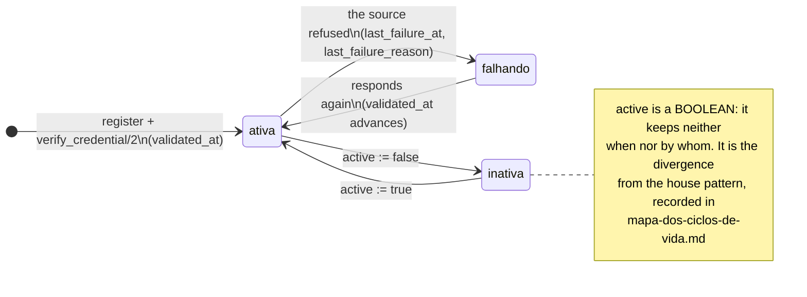
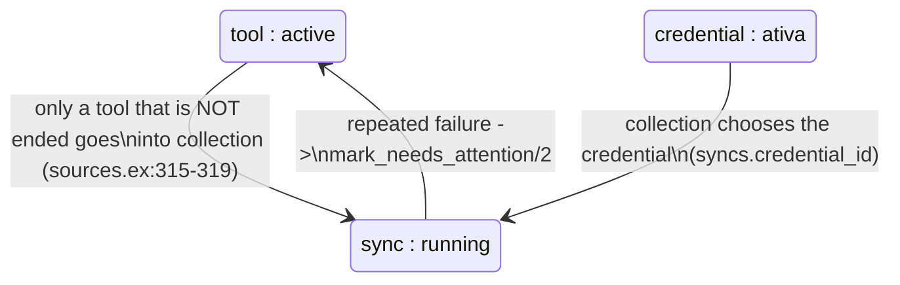

<!-- DERIVED from lib/the_band/ingestion/sync.ex:13-42, :68-77;
     lib/the_band/sources.ex:224-232 (observation_ended?/1), :243-265 (situacao/1),
     :315-319, :365 (end_observation/3), :422-443 (resume_observation/3),
     :675-690 (mark_needs_attention/2, clear_needs_attention/1);
     lib/the_band/sources/observation_event.ex:1-30, :32-44, :69-74;
     lib/the_band/sources/tool_credential.ex:26-45;
     priv/repo/migrations/20260809120500_create_ingestion.exs:25,
     20260810230000_create_tool_observation_events.exs:35-54,
     20260812180000_add_interrupted_by_user_id.exs:22,
     20260813200000_derivar_situacao_da_ferramenta.exs,
     20260809120400_create_sources_and_credentials.exs:52-54;
     tests — test/the_band/sources_observation_test.exs
     — on 2026-09-18. Checked against the code on this date. Regenerate when the source changes. -->

# States — the collection, the tool and the credential

**Three nested machines**, and confusing them is what makes someone look at an empty dashboard and not
know whose fault it is:

| Question | Where the answer is |
|---|---|
| *did this collection run finish well?* | `syncs.status` |
| *is this tool still observed?* | the **last event** in `tool_observation_events` |
| *does this token still work?* | `tool_credentials.active` + `validated_at` + `last_failure_at` |

## The collection run

**It is the only state machine in this folder with a real `status` column.** It is worth knowing why: a
run has a beginning and an end in real time, and it is not a statement about the world that needs to
preserve its beginning — the whole row *is* the record.

```elixir
@statuses ~w(running completed failed interrupted)
```
`lib/the_band/ingestion/sync.ex:13`



**All three are final.** No command returns a `sync` to `running`; a new collection is a new row.

### The subtlest null of the platform

`interrupted_by_user_id` is the example worth carrying into any modelling in this house:

> *"Who ended it. **Null states 'it was the platform'** — not 'it is unknown who': the platform knows it
> was not a person. No check constraint requiring an author, because there are two legitimate enders;
> requiring one would force inventing a system user."* — `sync.ex:39-41`

In almost every other table, a null `<something>_by_user_id` means *there was no human author because
there was no human act*. Here, the act happened and the author is the machine.

### The zero that is a fact, not an absence

Also in `syncs`, and by the same family of reasoning:

> *"How many repositories the run did not reach. Zero is a **fact**, not an absence: a collection that
> reached each of the repositories failed to reach zero of them. It is the declared exception to the
> project's rule, and the risk is the reverse — a zero by oversight states success."*
> — `sync.ex:29-31`

## The observed tool

**It has no state column, and it had one.** The column was removed on purpose, and the migration that
did it is called `20260813200000_derivar_situacao_da_ferramenta.exs`.

> *"The column was a third place keeping the same thing."* — `lib/the_band/sources.ex:246-247`

The situation comes from two independent sources, combined by `situacao/1`
(`lib/the_band/sources.ex:259-265`):

```elixir
cond do
  observation_ended?(tool) -> :ended
  not is_nil(tool.needs_attention_since) -> :needs_attention
  true -> :active
end
```

And `observation_ended?/1` reads the **last event** of `tool_observation_events`, whose vocabulary has
exactly two values (`observation_event.ex:30`):

```elixir
@events ~w(ended resumed)
```



### Why the event, and not the column

> *"An event records what occurred, the situation is derived."* — ADR 0004 D7, cited in
> `observation_event.ex:6-7`

And the consequence that matters most to maintainers:

> *"There is no path to alter an event. If an ending was recorded wrongly, the correction is a new event:
> updating would rewrite the past. The schema does not declare `updated_at`, and the table does not have
> it either."* — `observation_event.ex:11-13`

The event's `impact` keeps **what was counted at the instant**, not what a query today would return —
*"what matters in the record is what the person saw before confirming"* (`observation_event.ex:15-18`).

The tests are in `test/the_band/sources_observation_test.exs`.

## The credential

The loosest of the three machines, and it is declared why.

| Field | What it states |
|---|---|
| `active` | **boolean** — it works or it does not |
| `validated_at` | when the platform confirmed the token responds |
| `last_failure_at` + `last_failure_reason` | when it last failed, and why |
| `owner_login` | **whose quota it is** — null on credentials older than ADR 0007 |



**The divergence, stated:** the nine [revocable declaration](declaracao-revogavel.md) tables write
`revoked_at` + `revoked_by_user_id`. This one writes a boolean. The question *"who deactivated this
credential, and when"* **has no answer in the database**. It is recorded for whoever maintains `Sources`
to decide; it is not a defect finding, but a difference between this part and the others.

### `owner_login`, and why it is in a state model

Because it is the field that explains a behaviour that looks like a bug:

> *"The quota of 5 000 requests per hour is theirs, not the token's: two credentials with the same
> `owner_login` share the balance."* — `tool_credential.ex:36-37`

Registering a second credential from the same person **does not double the collection capacity**, and
the only place where this is written is here and in the schema.

## How the three fit together



The arrow back is the one that matters: **the collection that fails marks the tool**, and that is how a
credential problem becomes a signal on the screen instead of staying only in the log of a run.

## What this model does not show

- **`sync_checkpoints`**, which has its own `status` and describes progress *within* a run (per stage, per
  repository). It is a fourth machine, of finer granularity; the fields are in
  [`classes/ingestao-e-observacao.md`](../classes/ingestao-e-observacao.md).
- **`profile_runs`**, which has `started_at` / `finished_at` and is the profile generation run — same
  shape as `syncs`, another subject. Fields in
  [`classes/perfis-e-modelo.md`](../classes/perfis-e-modelo.md).
- **The transition → test mapping.** `test/the_band/sources_observation_test.exs` covers ending and
  resuming; the coverage of the `syncs` and `tool_credentials` transitions **was not verified** in this
  document, and it is declared as a gap for QA.
