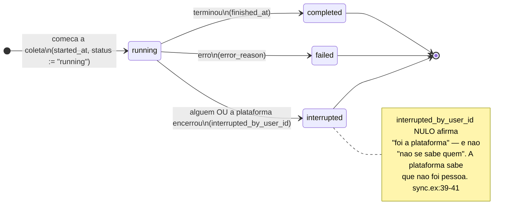
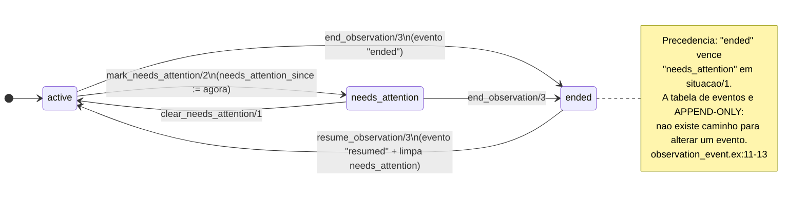
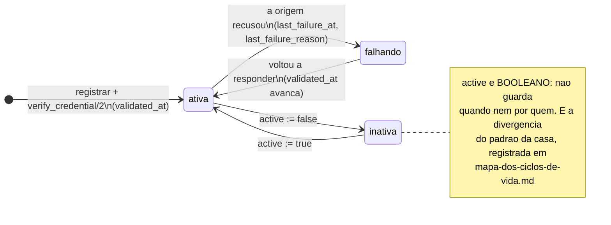
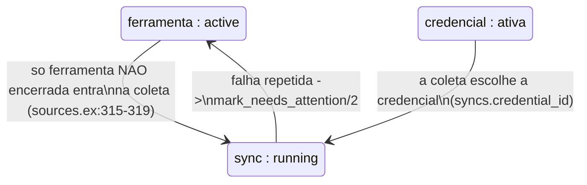

<!-- DERIVADO de lib/the_band/ingestion/sync.ex:13-42, :68-77;
     lib/the_band/sources.ex:224-232 (observation_ended?/1), :243-265 (situacao/1),
     :315-319, :365 (end_observation/3), :422-443 (resume_observation/3),
     :675-690 (mark_needs_attention/2, clear_needs_attention/1);
     lib/the_band/sources/observation_event.ex:1-30, :32-44, :69-74;
     lib/the_band/sources/tool_credential.ex:26-45;
     priv/repo/migrations/20260809120500_create_ingestion.exs:25,
     20260810230000_create_tool_observation_events.exs:35-54,
     20260812180000_add_interrupted_by_user_id.exs:22,
     20260813200000_derivar_situacao_da_ferramenta.exs,
     20260809120400_create_sources_and_credentials.exs:52-54;
     testes — test/the_band/sources_observation_test.exs
     — em 2026-09-18. Conferido contra o código nesta data. Regenerar ao mudar a fonte. -->

# Estados — a coleta, a ferramenta e a credencial

**Três máquinas encaixadas**, e a confusão entre elas é o que faz alguém olhar um painel vazio
e não saber de quem é a culpa:

| Pergunta | Onde está a resposta |
|---|---|
| *esta execução de coleta terminou bem?* | `syncs.status` |
| *esta ferramenta ainda é observada?* | o **último evento** em `tool_observation_events` |
| *este token ainda serve?* | `tool_credentials.active` + `validated_at` + `last_failure_at` |

## A execução de coleta

**É a única máquina de estado desta pasta com coluna `status` de verdade.** Vale saber por quê:
uma execução tem começo e fim no tempo real, e não é uma afirmação sobre o mundo que precise
preservar o começo — a linha inteira *é* o registro.

```elixir
@statuses ~w(running completed failed interrupted)
```
`lib/the_band/ingestion/sync.ex:13`



**Os três são finais.** Nenhum comando devolve um `sync` a `running`; uma coleta nova é uma
linha nova.

### O nulo mais sutil da plataforma

`interrupted_by_user_id` é o exemplo que vale carregar para qualquer modelagem desta casa:

> *"Quem encerrou. **Nulo afirma 'foi a plataforma'** — não 'não se sabe quem': a plataforma
> sabe que não foi pessoa. Sem check constraint exigindo autor, porque há dois encerradores
> legítimos; exigir forçaria inventar um usuário-sistema."* — `sync.ex:39-41`

Em quase toda outra tabela, `<algo>_by_user_id` nulo significa *não houve autor humano porque
não houve ato humano*. Aqui, o ato houve e o autor é a máquina.

### O zero que é fato, e não ausência

Também em `syncs`, e pela mesma família de raciocínio:

> *"Quantos repositórios a execução não alcançou. Zero é **fato**, e não ausência: uma coleta
> que alcançou cada um dos repositórios deixou de alcançar zero deles. É a exceção declarada à
> regra do projeto, e o risco é o inverso — zero por esquecimento afirma sucesso."*
> — `sync.ex:29-31`

## A ferramenta observada

**Não tem coluna de estado, e teve.** A coluna foi removida de propósito, e a migração que o fez
se chama `20260813200000_derivar_situacao_da_ferramenta.exs`.

> *"A coluna era um terceiro lugar guardando o mesmo."* — `lib/the_band/sources.ex:246-247`

A situação sai de duas fontes independentes, compostas por `situacao/1`
(`lib/the_band/sources.ex:259-265`):

```elixir
cond do
  observation_ended?(tool) -> :ended
  not is_nil(tool.needs_attention_since) -> :needs_attention
  true -> :active
end
```

E `observation_ended?/1` lê o **último evento** de `tool_observation_events`, cujo vocabulário
tem exatamente dois valores (`observation_event.ex:30`):

```elixir
@events ~w(ended resumed)
```



### Por que o evento, e não a coluna

> *"Evento registra o que ocorreu, situação é derivada."* — ADR 0004 D7, citada em
> `observation_event.ex:6-7`

E a consequência que mais importa para quem mantém:

> *"Não existe caminho para alterar um evento. Se um encerramento foi registrado errado, a
> correção é um evento novo: atualizar reescreveria o passado. O schema não declara
> `updated_at`, e a tabela também não o tem."* — `observation_event.ex:11-13`

O `impact` do evento guarda **o que foi contado no instante**, e não o que uma consulta de hoje
devolveria — *"o que interessa no registro é o que a pessoa viu antes de confirmar"*
(`observation_event.ex:15-18`).

Os testes estão em `test/the_band/sources_observation_test.exs`.

## A credencial

A máquina mais frouxa das três, e está declarado por quê.

| Campo | O que afirma |
|---|---|
| `active` | **booleano** — serve ou não serve |
| `validated_at` | quando a plataforma confirmou que o token responde |
| `last_failure_at` + `last_failure_reason` | quando falhou pela última vez, e por quê |
| `owner_login` | **de quem é a cota** — nulo nas credenciais anteriores à ADR 0007 |



**A divergência, dita:** as nove tabelas de [declaração revogável](declaracao-revogavel.md)
gravam `revoked_at` + `revoked_by_user_id`. Esta grava um booleano. A pergunta *"quem desativou
esta credencial, e quando"* **não tem resposta no banco**. Fica registrado para quem mantém
`Sources` decidir; não é achado de defeito, e sim diferença entre esta parte e as outras.

### `owner_login`, e por que ele está num modelo de estado

Porque é o campo que explica um comportamento que parece bug:

> *"A cota de 5 000 requisições por hora é dele, não do token: duas credenciais com o mesmo
> `owner_login` dividem o saldo."* — `tool_credential.ex:36-37`

Cadastrar uma segunda credencial da mesma pessoa **não dobra a capacidade de coleta**, e o
único lugar onde isso está escrito é aqui e no schema.

## Como as três se encaixam



A seta de volta é a que importa: **a coleta que falha marca a ferramenta**, e é assim que um
problema de credencial vira sinal na tela em vez de ficar só no log de uma execução.

## O que este modelo não mostra

- **`sync_checkpoints`**, que tem `status` próprio e descreve o progresso *dentro* de uma
  execução (por etapa, por repositório). É uma quarta máquina, de granularidade menor; os
  campos estão em [`classes/ingestao-e-observacao.md`](../classes/ingestao-e-observacao.md).
- **`profile_runs`**, que tem `started_at` / `finished_at` e é a execução de geração de perfil
  — mesma forma de `syncs`, outro assunto. Campos em
  [`classes/perfis-e-modelo.md`](../classes/perfis-e-modelo.md).
- **O mapeamento transição → teste.** `test/the_band/sources_observation_test.exs` cobre
  encerrar e retomar; a cobertura das transições de `syncs` e de `tool_credentials`
  **não foi verificada** neste documento, e fica declarada como lacuna para QA.
