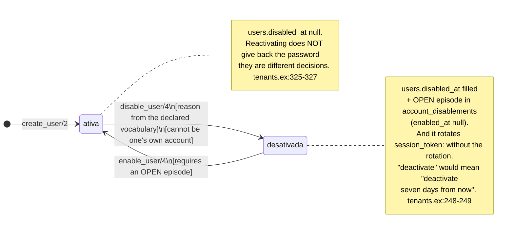
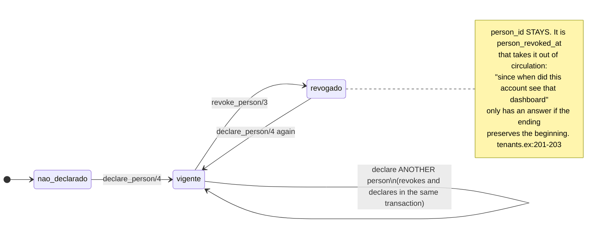

<!-- DERIVED from lib/the_band/tenants.ex:126-217 (declare_person/4, revoke_person/3),
     :218-303 (disable_user/4 and desativar_na_transacao/4), :305-362 (enable_user/4 and
     reativar_na_transacao/5), :363-380 (episodio_aberto/2);
     lib/the_band/tenants/account_disablement.ex:1-12, :42-58, :76, :95, :104-107;
     lib/the_band/tenants/account_lifecycle.ex:1-30, :33-67, :156-163;
     lib/the_band/tenants/user.ex:38-95;
     lib/the_band/tenants/access/scope_grant.ex:53-64;
     priv/repo/migrations/20260909180000_conta_desativada.exs:32-33,
     20260910050000_episodio_de_desativacao.exs:68-83,
     20260827050000_qual_pessoa_observada_e_a_conta.exs;
     priv/knowledge_base — the rule `access.account_lifecycle`;
     tests — test/the_band/tenants/conta_desativada_test.exs,
     test/the_band/tenants/elo_da_conta_test.exs, test/the_band/tenants/auth_test.exs
     — on 2026-09-18. Checked against the code on this date. Regenerate when the source changes. -->

# States — the account (`users` and `account_disablements`)

**Two machines on the same row, and joining them has already cost dearly.** One answers *can it sign
in?*; the other, *whose dashboard is this?*. They are independent, and the code says why:

> *"It is *'this account no longer signs in'*. It is **not** `revoke_person/3`, which means *'we no longer
> know which observed person this account is'* — and H3 measured that the latter **does not remove
> access**: with the link revoked, sign-in by e-mail keeps working and the tenant's screens keep
> opening."* — `lib/the_band/tenants.ex:223-227`

That is finding **H3, part B**, of 2026-09-09. Whoever designs a screen or a query assuming that one mark
implies the other reproduces the same defect.

## Machine 1 — can it sign in?

### Where the state is

In **two places**, on purpose, and written in the same transaction:

| Where | What it is | Why |
|---|---|---|
| `users.disabled_at` | the **quick answer** to *"can it sign in?"* | it is read on every sign-in; a join per sign-in would be expensive |
| `account_disablements` | the **episode**, with author, reason, note and closing | the column pair alone held **one** episode, and reactivation **erased** it |

> *"The two writes in the SAME transaction, and that is what prevents the invalid state: a null
> `disabled_at` with an open episode, or no episode with the account deactivated."*
> — `lib/the_band/tenants.ex:274-276`

The episode is open (`enabled_at` null) or closed — the same shape as `ScopeGrant.vigente?/1`, and the
code says so out loud (`account_disablement.ex:106`).

### The machine

### The four guards of `disable_user/4`

All in `lib/the_band/tenants.ex:265-271`, and each returns a named error — none passes silently:

| Guard | Error | Why |
|---|---|---|
| the account belongs to this tenant | `:not_found` | — |
| **it is not one's own account** | `:nao_pode_desativar_a_si` | *"deactivating oneself is being left out with no one to ask to be let back in, and in a tenant with a single administrator that locks the whole organization"* (`tenants.ex:253-256`) |
| it is still active | `:ja_desativada` | deactivating twice would open two episodes |
| **the vocabulary is loaded** | `:vocabulario_nao_declarado` | without the base, *"the act refuses with `{:error, :vocabulario_nao_declarado}` instead of writing no reason at all"* (`tenants.ex:243-244`) |

The last is the most characteristic of this house: the reason clauses live in `access.account_lifecycle`,
in the knowledge base, and **not** in a module constant. The reason is written in the reader:

> *"In a module constant, the list changes in a template diff and nobody notices that the platform started
> stating something else."* — `account_lifecycle.ex:11-13`
>
> *"Without the declared rule, the lists come back **empty** and the act of deactivating refuses. (…) The
> alternative — a fallback list in the code — is the silent duplicate FR-069 forbids, and would make the
> platform keep stating things with the base down."* — `account_lifecycle.ex:18-21`

### The guard of `enable_user/4`, and the state it exposes

Reactivating **requires an open episode** (`:sem_episodio_aberto`). It is not overcaution: it is the
detector of an invalid state.

> *"an account with `disabled_at` and without an open episode is the state that the (…)"*
> — `lib/the_band/tenants.ex:366-367`

### A transition the house refuses, and that is why it is not an arrow

`reativar_changeset/1` **used to do** `disabled_at: nil, disabled_by_user_id: nil` — and that was fixed:

> *"a `delete` written as an `update`: after it, nobody ever deactivated that account."*
> — `lib/the_band/tenants.ex:312-313`

Today reactivation **closes** the episode with name, instant and reason, *"and the opening stays exactly as
it was"*. The column pair in `users` goes back to null; the history stays in the episode.

### The mistake, and why it does not delete

`disabled_by_mistake` is a reactivation reason that marks the episode as a mistake: it *"**stops counting**
as an offboarding and remains visible, in the manner of `TeamMembership.invalidated_at`. A mistake is stated,
not removed."* (`tenants.ex:320-322`).

It is the same gesture as the [team membership](vinculo-de-equipe.md) — and recognizing it in two
different places is recognizing the principle.

## Machine 2 — the link between the account and the observed person

`users.person_id` + `person_declared_at` + `person_declared_by_user_id` +
`person_revoked_at` + `person_revoked_by_user_id`.

It is the **tenth** instance of the [revocable declaration](declaracao-revogavel.md), with the difference
that it is not its own table: it is five columns inside `users`.

### Why this is an access act, not a registration field

> *"**The link grants visibility.** Pointing one's own account at another observed person is starting to
> see their dashboard. It is not a registration field: it is an access act."*
> — `lib/the_band/tenants.ex:139-141`

And the replacement is transactional for the same reason as the 066 declarations:

> *"Without it, a failure between the two would leave the account with no link at all, and it would lose
> its own dashboard without anything having been asked."* — `lib/the_band/tenants.ex:144-146`

### The trap documented in the code

It is worth having in a model because it reappears in any code that does revoke-and-declare:

> *"Reloading between revoking and declaring is not overcaution: `revogar_elo/3` writes through
> `update_all`, and the in-memory struct goes stale. A field whose new value equals the stale struct's
> **does NOT enter the changeset's changes** — while the database has already changed it. That is how
> `person_declared_by_user_id` would end up null with `person_id` filled, violating the CHECK that exists
> precisely to prevent it."* — `lib/the_band/tenants.ex:180-185`

The `CHECK` that holds this is `users.elo_da_pessoa_tem_autor_e_data` — cited in
[`classes/tenants-e-acesso.md`](../classes/tenants-e-acesso.md).

## The two machines together, and what the combination means

Because they are independent, an account is in **one of four** situations — and the screen needs to be
able to tell them apart:

| `disabled_at` | link | What is true |
|---|---|---|
| null | in force | signs in, and sees its own dashboard |
| null | revoked or never declared | **signs in**, and sees no person's dashboard |
| filled | in force | does not sign in; the link stays declared, and the history stays |
| filled | revoked | does not sign in, and there is no one the dashboard belonged to |

The second row is the one finding H3 measured, and the one that misleads most: **a revoked link does not
close the door.** Whoever wants to close the door uses `disable_user/4`.

## Where each transition happens, and what proves it

| Transition | Function | Test |
|---|---|---|
| active → deactivated | `tenants.ex:265` | `test/the_band/tenants/conta_desativada_test.exs` |
| deactivated → active | `tenants.ex:333` | `test/the_band/tenants/conta_desativada_test.exs` |
| link: not declared → in force | `tenants.ex:150` | `test/the_band/tenants/elo_da_conta_test.exs` |
| link: in force → revoked | `tenants.ex:207` | `test/the_band/tenants/elo_da_conta_test.exs` |

**Coverage statement:** the test files exist and cover the four transitions; the **test-by-test** mapping
(which `test "..."` proves which guard) was not done in this document. The guards named above have their
own error in the `@spec`, which makes them verifiable.

## What this model does not show

- **The session.** `session_token`, `logged_in_at`, `failed_attempts`, `last_failed_at` and
  `password_source` form a third axis, about authentication, not about the account. The fields are in
  [`classes/tenants-e-acesso.md`](../classes/tenants-e-acesso.md).
- **The access scope.** `access_scope_grants` is the ninth of the
  [revocable declaration](declaracao-revogavel.md), and it is there.
- **The vocabulary of reasons.** The deactivation and reactivation clauses live in
  `priv/knowledge_base`, and change without touching code — that is why there is no list here, which
  would age silently. `AccountLifecycle.razoes_de_desativacao/0` is the reader.
