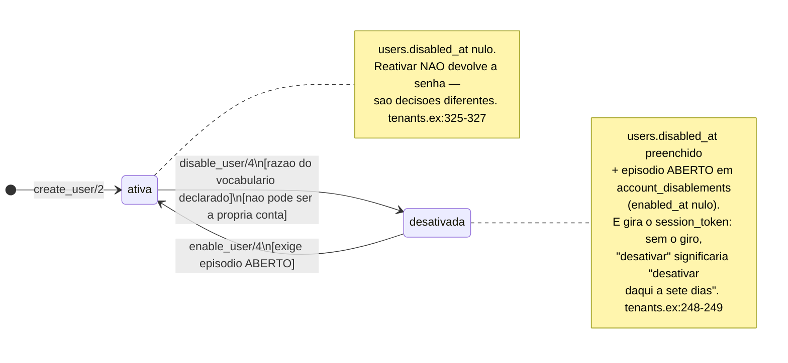
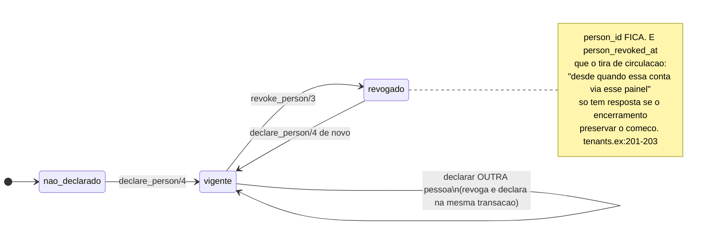

<!-- DERIVADO de lib/the_band/tenants.ex:126-217 (declare_person/4, revoke_person/3),
     :218-303 (disable_user/4 e desativar_na_transacao/4), :305-362 (enable_user/4 e
     reativar_na_transacao/5), :363-380 (episodio_aberto/2);
     lib/the_band/tenants/account_disablement.ex:1-12, :42-58, :76, :95, :104-107;
     lib/the_band/tenants/account_lifecycle.ex:1-30, :33-67, :156-163;
     lib/the_band/tenants/user.ex:38-95;
     lib/the_band/tenants/access/scope_grant.ex:53-64;
     priv/repo/migrations/20260909180000_conta_desativada.exs:32-33,
     20260910050000_episodio_de_desativacao.exs:68-83,
     20260827050000_qual_pessoa_observada_e_a_conta.exs;
     priv/knowledge_base — a regra `access.account_lifecycle`;
     testes — test/the_band/tenants/conta_desativada_test.exs,
     test/the_band/tenants/elo_da_conta_test.exs, test/the_band/tenants/auth_test.exs
     — em 2026-09-18. Conferido contra o código nesta data. Regenerar ao mudar a fonte. -->

# Estados — a conta (`users` e `account_disablements`)

**Duas máquinas na mesma linha, e juntá-las já custou caro.** Uma responde *pode entrar?*; a
outra, *de quem é este painel?*. São independentes, e o código diz por que:

> *"É *'esta conta não entra mais'*. **Não** é `revoke_person/3`, que significa *'não sabemos
> mais qual pessoa observada é esta conta'* — e o H3 mediu que aquele **não remove acesso**:
> com o elo revogado, o login por e-mail continua funcionando e as telas do tenant continuam
> abrindo."* — `lib/the_band/tenants.ex:223-227`

Esse é o achado **H3, parte B**, de 2026-09-09. Quem desenhar uma tela ou uma consulta
assumindo que uma marca implica a outra reproduz o mesmo defeito.

## Máquina 1 — pode entrar?

### Onde está o estado

Em **dois lugares**, de propósito, e escritos na mesma transação:

| Onde | O que é | Por quê |
|---|---|---|
| `users.disabled_at` | a **resposta rápida** a *"pode entrar?"* | é lida a cada entrada; uma junção por entrada seria caro |
| `account_disablements` | o **episódio**, com autor, razão, nota e fechamento | o par de colunas sozinho cabia **um** episódio, e a reativação o **apagava** |

> *"As duas escritas na MESMA transação, e é o que impede o estado inválido: `disabled_at`
> nulo com episódio aberto, ou episódio nenhum com a conta desativada."*
> — `lib/the_band/tenants.ex:274-276`

O episódio é aberto (`enabled_at` nulo) ou fechado — a mesma forma de `ScopeGrant.vigente?/1`,
e o código diz isso em voz alta (`account_disablement.ex:106`).

### A máquina

### As quatro guardas de `disable_user/4`

Todas em `lib/the_band/tenants.ex:265-271`, e cada uma devolve um erro nomeado — nenhuma passa
em silêncio:

| Guarda | Erro | Por quê |
|---|---|---|
| a conta é deste tenant | `:not_found` | — |
| **não é a própria conta** | `:nao_pode_desativar_a_si` | *"desativar-se a si é ficar de fora sem ter a quem pedir de volta, e num tenant com uma administração só isso tranca a organização inteira"* (`tenants.ex:253-256`) |
| ainda está ativa | `:ja_desativada` | desativar duas vezes abriria dois episódios |
| **o vocabulário está carregado** | `:vocabulario_nao_declarado` | sem a base, *"o ato recusa com `{:error, :vocabulario_nao_declarado}` em vez de gravar razão nenhuma"* (`tenants.ex:243-244`) |

A última é a mais característica desta casa: as cláusulas de razão vivem em
`access.account_lifecycle`, na base de conhecimento, e **não** em constante de módulo. A razão
está escrita no leitor:

> *"Em constante de módulo, a lista muda num diff de template e ninguém percebe que a
> plataforma passou a afirmar outra coisa."* — `account_lifecycle.ex:11-13`
>
> *"Sem a regra declarada, as listas voltam **vazias** e o ato de desativar recusa. (…) A
> alternativa — uma lista de reserva no código — é a duplicata silenciosa que a FR-069 proíbe,
> e faria a plataforma continuar afirmando com a base fora do ar."* — `account_lifecycle.ex:18-21`

### A guarda de `enable_user/4`, e o estado que ela denuncia

Reativar **exige episódio aberto** (`:sem_episodio_aberto`). Não é zelo: é o detector de um
estado inválido.

> *"uma conta com `disabled_at` e sem episódio aberto é o estado que a (…)"*
> — `lib/the_band/tenants.ex:366-367`

### Uma transição que a casa recusa, e por isso não é seta

`reativar_changeset/1` **já fez** `disabled_at: nil, disabled_by_user_id: nil` — e isso foi
corrigido:

> *"um `delete` escrito como `update`: depois dele, ninguém desativou aquela conta nunca."*
> — `lib/the_band/tenants.ex:312-313`

Hoje a reativação **fecha** o episódio com nome, instante e razão, *"e a abertura fica
exatamente como estava"*. O par de colunas em `users` volta a nulo; a história fica no episódio.

### O equívoco, e por que ele não apaga

`disabled_by_mistake` é uma razão de reativação que marca o episódio como equívoco: ele
*"**deixa de contar** como desligamento e continua visível, na forma de
`TeamMembership.invalidated_at`. Equívoco é dito, não removido."* (`tenants.ex:320-322`).

É o mesmo gesto do [vínculo de equipe](vinculo-de-equipe.md) — e reconhecê-lo em dois lugares
diferentes é reconhecer o princípio.

## Máquina 2 — o elo entre a conta e a pessoa observada

`users.person_id` + `person_declared_at` + `person_declared_by_user_id` +
`person_revoked_at` + `person_revoked_by_user_id`.

É a **décima** instância da [declaração revogável](declaracao-revogavel.md), com a diferença de
não ser tabela própria: são cinco colunas dentro de `users`.

### Por que isto é ato de acesso, e não campo de cadastro

> *"**O elo concede visibilidade.** Apontar a própria conta para outra pessoa observada é passar
> a ver o painel dela. Não é campo de cadastro: é ato de acesso."*
> — `lib/the_band/tenants.ex:139-141`

E a substituição é transacional pela mesma razão das declarações da 066:

> *"Sem isso, uma falha entre as duas deixaria a conta sem elo algum, e ela perderia o próprio
> painel sem nada ter sido pedido."* — `lib/the_band/tenants.ex:144-146`

### A armadilha documentada no código

Vale estar num modelo porque ela reaparece em qualquer código que faça revogar-e-declarar:

> *"Recarregar entre revogar e declarar não é zelo: `revogar_elo/3` escreve por `update_all`, e
> a struct em memória fica velha. Um campo cujo valor novo é igual ao da struct velha **NÃO
> entra nas mudanças do changeset** — enquanto o banco já o mudou. É assim que
> `person_declared_by_user_id` ficaria nulo com `person_id` preenchido, violando a CHECK que
> existe justamente para impedir isso."* — `lib/the_band/tenants.ex:180-185`

A `CHECK` que segura isso é `users.elo_da_pessoa_tem_autor_e_data` — citada em
[`classes/tenants-e-acesso.md`](../classes/tenants-e-acesso.md).

## As duas máquinas juntas, e o que a combinação significa

Porque são independentes, uma conta está em **uma das quatro** situações — e a tela precisa
saber distinguir:

| `disabled_at` | elo | O que é verdade |
|---|---|---|
| nulo | vigente | entra, e vê o próprio painel |
| nulo | revogado ou nunca declarado | **entra**, e não vê painel de pessoa nenhuma |
| preenchido | vigente | não entra; o elo continua declarado, e a história fica |
| preenchido | revogado | não entra, e não há a quem o painel pertencia |

A segunda linha é a que o achado H3 mediu, e a que mais engana: **elo revogado não fecha
porta.** Quem quer fechar a porta usa `disable_user/4`.

## Onde cada transição acontece, e o que a prova

| Transição | Função | Teste |
|---|---|---|
| ativa → desativada | `tenants.ex:265` | `test/the_band/tenants/conta_desativada_test.exs` |
| desativada → ativa | `tenants.ex:333` | `test/the_band/tenants/conta_desativada_test.exs` |
| elo: não declarado → vigente | `tenants.ex:150` | `test/the_band/tenants/elo_da_conta_test.exs` |
| elo: vigente → revogado | `tenants.ex:207` | `test/the_band/tenants/elo_da_conta_test.exs` |

**Declaração de cobertura:** os arquivos de teste existem e cobrem as quatro transições; o
mapeamento **teste a teste** (qual `test "..."` prova qual guarda) não foi feito neste
documento. As guardas nomeadas acima têm erro próprio no `@spec`, o que as torna verificáveis.

## O que este modelo não mostra

- **A sessão.** `session_token`, `logged_in_at`, `failed_attempts`, `last_failed_at` e
  `password_source` formam um terceiro eixo, sobre autenticação, e não sobre a conta. Os campos
  estão em [`classes/tenants-e-acesso.md`](../classes/tenants-e-acesso.md).
- **O escopo de acesso.** `access_scope_grants` é a nona da
  [declaração revogável](declaracao-revogavel.md), e está lá.
- **O vocabulário de razões.** As cláusulas de desativação e reativação vivem em
  `priv/knowledge_base`, e mudam sem tocar em código — por isso não há lista aqui, que
  envelheceria em silêncio. `AccountLifecycle.razoes_de_desativacao/0` é a leitura.
