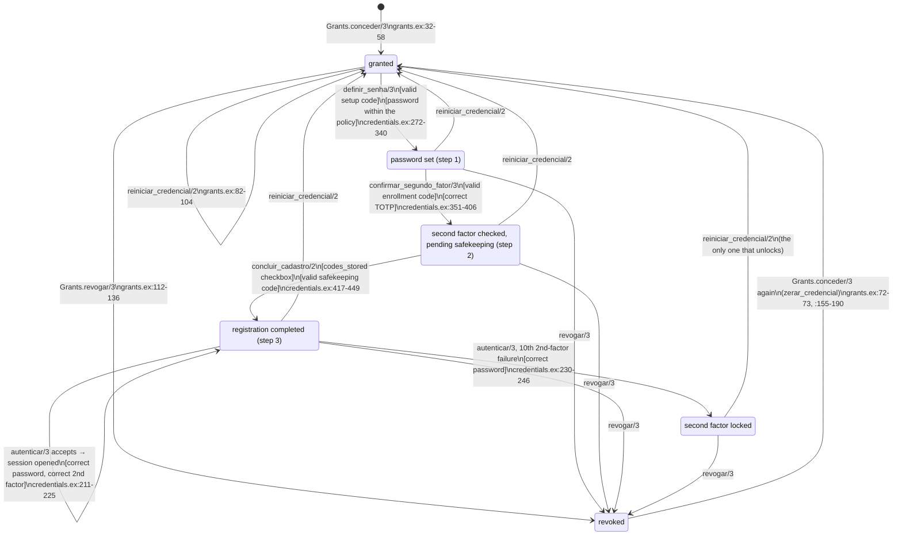
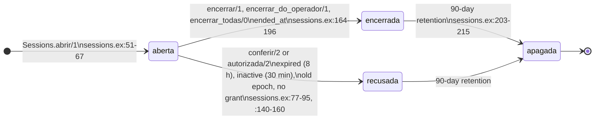

<!-- DERIVED from lib/the_band/platform/grants.ex:32-58 (conceder/3), :60-75, :82-104
     (reiniciar_credencial/2), :112-136 (revogar/3), :155-190 (zerar_credencial), :192-203;
     lib/the_band/platform/credentials.ex:44 (limit), :56-88 (autenticar/3), :120-153,
     :163-246 (second factor, accept, fail), :272-340 (step 1), :351-406 (step 2),
     :417-449 (step 3), :457-469 (emitir_codigo/1), :473-551 (skeleton of the steps);
     lib/the_band/platform/sessions.ex:51-67, :77-95, :140-160, :177-185, :203-215;
     lib/the_band_web/plataforma/entrada_controller.ex:26-32,
     lib/the_band_web/plataforma/cadastro_controller.ex:90-91;
     priv/repo/migrations/20261002130000_operador_da_plataforma.exs:22-81,
     20261002130100_segundo_fator_do_operador.exs:15-79;
     tests in test/the_band/platform/ (credentials_definir_test, credentials_autenticar_test,
     cadastro_interrompido_test, codigo_de_uso_unico_test, conceder_de_novo_test, grants_test,
     limite_do_segundo_fator_test, segundo_fator_na_entrada_test, sessions_test,
     tabelas_do_segundo_fator_test) and test/the_band/release_operador_test.exs.
     Checked against the code on 2026-10-02, at commit 8cf0fcf of branch feature/1057-070-us1
     (these files unchanged since the start of the check). Regenerate when the source changes. -->

# State — the platform operator's credential (spec 070)

**There is no state column.** The credential's situation is the combination of null columns of
`platform_operators` with the existence of a grant in force in `platform_operator_grants`
(`revoked_at IS NULL`). The `CHECK`s of `segundo_fator_do_operador.exs` say which combinations the
database accepts; the code writes the transitions.

## The states, and the rule of each one

| State | Grant in force | `password_hash` | `totp_secret` | `totp_confirmed_at` | pending code | Who writes |
|---|---|---|---|---|---|---|
| **granted** | yes | null | null | null | `setup_code_*` (30 min) | `grants.ex:32-58` + `credentials.ex:457-469` |
| **password set** (step 1) | yes | filled | filled | null | `enrollment_code_*` (10 min) | `credentials.ex:296-340` |
| **second factor checked, pending safekeeping** (step 2) | yes | filled | filled | null | `ack_code_*` (10 min); `totp_last_used_step` filled; 10 recovery codes in force | `credentials.ex:374-406` |
| **registration completed** (step 3) | yes | filled | filled | **filled** | none | `credentials.ex:417-449` |
| **second factor locked** | yes | filled | filled | filled | none; `second_factor_failures >= 10` | `credentials.ex:230-246` |
| **revoked** | **no** | whatever there was | whatever there was | whatever there was | none (voided) | `grants.ex:112-136`, `:192-203` |

The database ties down three of these rows: `platform_operators_codigo_de_guarda_entre_os_passos`
(`segundo_fator_do_operador.exs:50-54`) **is** the definition of "pending safekeeping"; the two
`confirmado_tem_*` (`:31-37`) prevent "completed" without a password or without a secret; the three
`*_em_par` (`operador_da_plataforma.exs:41-43`; `segundo_fator_do_operador.exs:26-28`, `:43-45`) prevent a
code without a validity.

## The diagram

Reset, revocation and grant **only through the release command** (`grants.ex:8-10`;
`lib/the_band/release.ex:226-262`); the `CHECK` `granted_via = 'release_command'`
(`operador_da_plataforma.exs:69-75`) says it in the database, and `release_operador_test.exs:47` proves
that no web module calls `Grants`.

## Each transition, what it writes, and the test that proves it

| Transition | Guard | What it writes | Source | Test |
|---|---|---|---|---|
| `[*] → granted` | e-mail without a grant in force (index `platform_operator_grants_vigente_index`) | `INSERT` of the operator and the grant; 30-min setup code, returned once | `grants.ex:32-71`; `credentials.ex:457-469`; validity `:259` | `release_operador_test.exs:19`; refusal `:ja_concedido` in `grants_test.exs:24` |
| `granted → password set` | outside the wait (`credentials.ex:493`); grant in force (`:499-507`); valid code (`:511-528`); password policy before writing (`:289-294`) | `password_hash`, new `totp_secret`, `password_epoch + 1` (`:301`), 10-min enrollment code (`:315-316`), voids the setup code; voids the recovery codes in force (`:327-332`); ends sessions (`:334`) | `credentials.ex:272-340` | `credentials_definir_test.exs:57`, `:96`, `:146`; concurrency in `codigo_de_uso_unico_test.exs:58` |
| `password set → pending safekeeping` | valid enrollment code; correct TOTP against the pending secret | 10 recovery codes (`:379-390`), `totp_last_used_step`, enrollment code voided, 10-min safekeeping code (`:392-403`) | `credentials.ex:351-406` | `credentials_definir_test.exs:64`; `codigo_de_uso_unico_test.exs:78` |
| `pending safekeeping → registration completed` | the `codes_stored` checkbox (`cadastro_controller.ex:90`, before the context); valid safekeeping code | `password_epoch + 1` (`:428-429`), `totp_confirmed_at` (`:434`), safekeeping code voided; ends sessions (`:444`). **The only function that enables sign-in** | `credentials.ex:417-449` | `credentials_definir_test.exs:78`; the enrollment code does not open step 3 in `:102` |
| `completed → completed` (sign-in) | outside the wait, grant, password, second factor enrolled and unlocked (`credentials.ex:80-88`); TOTP not reused or recovery code consumed atomically (`:163-209`) | resets `failed_attempts`, `second_factor_failures`; `logged_in_at`; the controller opens the session (`entrada_controller.ex:26-32` → `sessions.ex:51-67`) | `credentials.ex:211-225` | `credentials_autenticar_test.exs:61`; `segundo_fator_na_entrada_test.exs:35`, `:60` |
| `completed → locked` | **correct** password, wrong second factor for the 10th time | `second_factor_failures + 1`; locked event only on the transition (`:242-243`) | `credentials.ex:44`, `:149-151`, `:230-246` | `limite_do_segundo_fator_test.exs:26`; `credentials_autenticar_test.exs:149`; a wrong password does not count in `limite_do_segundo_fator_test.exs:71` and `credentials_autenticar_test.exs:170` |
| `any → granted` (reset) | grant in force | locks the sessions `FOR UPDATE` (`:88-94`); `zerar_credencial` — an `update_all` that clears password, second factor, counters and codes, `password_epoch + 1`; voids the recovery codes in force; ends sessions; issues a new setup code | `grants.ex:82-104`, `:155-190` | `limite_do_segundo_fator_test.exs:26` (unlocks); `cadastro_interrompido_test.exs:41` (C7), `:83` (C18), `:53` (C16, redoes the registration) |
| `any → revoked` | grant in force | `revoked_at`, `revoked_via`, `revoked_by_declared` together; ends sessions (`:128`); voids the three pending codes (`:192-203`) | `grants.ex:112-136` | `grants_test.exs:10`; `cadastro_interrompido_test.exs:20` (C6), `:83` (C18); only revoking passes in `concessao_nao_se_apaga_test.exs:54` |
| `revoked → granted` | no grant in force | `zerar_credencial` before opening the new grant: **nothing from before survives** (A6) | `grants.ex:72-73`, `:155-190` | `conceder_de_novo_test.exs:20`; `cadastro_interrompido_test.exs:20` |

## The session that sign-in opens

"Sign-in" is not a state of the credential: it is a row of `platform_operator_sessions`. It has its own
cycle, which the credential brings down by three paths — epoch, grant and ending.

`recusada` (refused) **is not written**: it is what `conferir/2` deduces on each read
(`sessions.ex:84-88`), without an `UPDATE`. Tests: `sessions_test.exs:43` (ended), `:48` (expired),
`:53` (inactive), `:58` (old epoch), `:63` (no grant), `:88` (ending in bulk).

## Transitions the house refuses (a note, not an arrow)

- **Signing in before step 3**, even with the correct TOTP or a recovery code: refused without counting a
  second-factor failure (`credentials.ex:140-147`). Tests:
  `credentials_definir_test.exs:57`, `:64`; `credentials_autenticar_test.exs:133`.
- **Repeating a step**: each step voids its own code when advancing; the same code a second time is
  refused (`credentials_definir_test.exs:96`; `codigo_de_uso_unico_test.exs:58`, `:78`).
- **Safekeeping code outside steps 2–3**: refused by the database
  (`segundo_fator_do_operador.exs:50-54`; `tabelas_do_segundo_fator_test.exs:33`).
- **Undone revocation**: there is none. Revoking again is refused by the trigger
  (`operador_da_plataforma.exs:141`; `concessao_nao_se_apaga_test.exs:54`); one comes back only through a
  new grant, which resets the credential.
- **Recovery code used and voided at the same time**: refused
  (`segundo_fator_do_operador.exs:77-79`).

## What did not fit, and gaps

1. **A refusal without a state change did not become an arrow.** A wrong, expired or missing code, a wrong
   TOTP in step 2, a wrong password and the wait raise `failed_attempts` (`credentials.ex:539-551`,
   `:230-246`) without changing the state of the table above. The wait (`:91-117`) is a time overlay, not
   a state.
2. **An expired code traps the operator in the step.** No path reissues the enrollment code or the
   safekeeping code: with them expired, `password set` and `pending safekeeping` only leave through reset
   or revocation. The same holds for `granted` with the setup code expired. It is consistent with the
   contract (reset is the way), and it is said here because it is not obvious.
3. **Revoked keeps the old credential.** `revogar/3` does not clear the password, the secret or the
   recovery codes in force (`grants.ex:112-136`); what neutralizes them is the absence of a grant
   (`credentials.ex:120-127`) and, on a new grant, `zerar_credencial`.
4. **Test gaps**:
   - **expired setup code** (step 1) and **expired enrollment code** (step 2): the branch exists
     (`credentials.ex:519-520`) and only the expired safekeeping code is proven
     (`cadastro_interrompido_test.exs:53`);
   - **a wrong TOTP in step 2 does not consume the enrollment code** (`credentials.ex:366-372`): no named
     test found;
   - **`Platform.Sessions.apagar_as_que_deixaram_de_valer/1`** (`sessions.ex:203-215`) **has no caller and
     no test at commit 8cf0fcf**: the job `TheBand.Jobs.ApagaSessoesAntigas` calls only the `Tenants` one
     (`lib/the_band/jobs/apaga_sessoes_antigas.ex:18`), and the `→ apagada` (deleted) transition of the
     session diagram does not happen. **In progress, not committed on this date (T058)**: the job starts
     calling it and a new function, `Credentials.apagar_codigos_que_deixaram_de_valer/1`, which deletes
     recovery codes used or voided more than 90 days ago, with two tests in the job's test. When it lands,
     the gap closes and the recovery code gains the `→ apagado` end, which this document does not draw
     yet. Recheck.
5. The tests **were not run** in this check (a `mix gates` was in progress): the statement is that they
   exist and cover the transition by name and by the body read, not that they pass.
