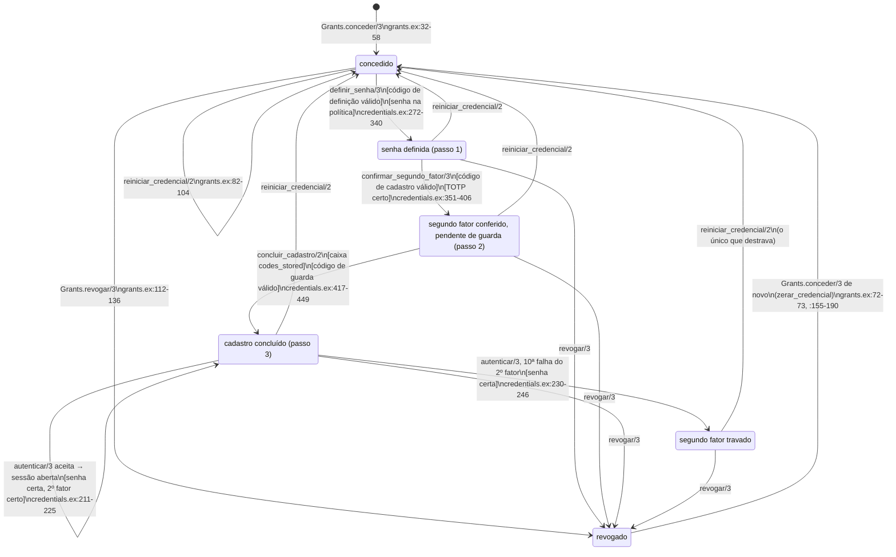
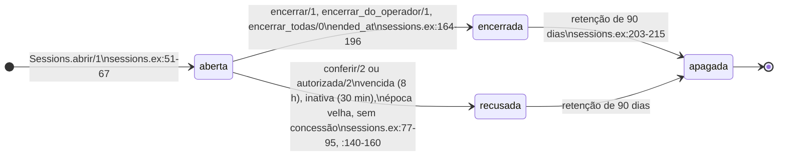

<!-- DERIVADO de lib/the_band/platform/grants.ex:32-58 (conceder/3), :60-75, :82-104
     (reiniciar_credencial/2), :112-136 (revogar/3), :155-190 (zerar_credencial), :192-203;
     lib/the_band/platform/credentials.ex:44 (limite), :56-88 (autenticar/3), :120-153,
     :163-246 (segundo fator, aceitar, falhar), :272-340 (passo 1), :351-406 (passo 2),
     :417-449 (passo 3), :457-469 (emitir_codigo/1), :473-551 (esqueleto dos passos);
     lib/the_band/platform/sessions.ex:51-67, :77-95, :140-160, :177-185, :203-215;
     lib/the_band_web/plataforma/entrada_controller.ex:26-32,
     lib/the_band_web/plataforma/cadastro_controller.ex:90-91;
     priv/repo/migrations/20261002130000_operador_da_plataforma.exs:22-81,
     20261002130100_segundo_fator_do_operador.exs:15-79;
     testes em test/the_band/platform/ (credentials_definir_test, credentials_autenticar_test,
     cadastro_interrompido_test, codigo_de_uso_unico_test, conceder_de_novo_test, grants_test,
     limite_do_segundo_fator_test, segundo_fator_na_entrada_test, sessions_test,
     tabelas_do_segundo_fator_test) e test/the_band/release_operador_test.exs.
     Conferido contra o código em 2026-10-02, no commit 8cf0fcf da branch feature/1057-070-us1
     (estes arquivos sem mudança desde o início da conferência). Regenerar ao mudar a fonte. -->

# Estado — a credencial do operador da plataforma (spec 070)

**Não há coluna de estado.** A situação da credencial é a combinação de colunas nulas de
`platform_operators` com a existência de uma concessão vigente em `platform_operator_grants`
(`revoked_at IS NULL`). Os `CHECK`s de `segundo_fator_do_operador.exs` dizem quais combinações
o banco aceita; o código escreve as transições.

## Os estados, e a regra de cada um

| Estado | Concessão vigente | `password_hash` | `totp_secret` | `totp_confirmed_at` | código pendente | Quem escreve |
|---|---|---|---|---|---|---|
| **concedido** | sim | nulo | nulo | nulo | `setup_code_*` (30 min) | `grants.ex:32-58` + `credentials.ex:457-469` |
| **senha definida** (passo 1) | sim | preenchido | preenchido | nulo | `enrollment_code_*` (10 min) | `credentials.ex:296-340` |
| **segundo fator conferido, pendente de guarda** (passo 2) | sim | preenchido | preenchido | nulo | `ack_code_*` (10 min); `totp_last_used_step` preenchido; 10 códigos de recuperação vigentes | `credentials.ex:374-406` |
| **cadastro concluído** (passo 3) | sim | preenchido | preenchido | **preenchido** | nenhum | `credentials.ex:417-449` |
| **segundo fator travado** | sim | preenchido | preenchido | preenchido | nenhum; `second_factor_failures >= 10` | `credentials.ex:230-246` |
| **revogado** | **não** | o que havia | o que havia | o que havia | nenhum (anulados) | `grants.ex:112-136`, `:192-203` |

O banco amarra três destas linhas: `platform_operators_codigo_de_guarda_entre_os_passos`
(`segundo_fator_do_operador.exs:50-54`) **é** a definição de "pendente de guarda"; os dois
`confirmado_tem_*` (`:31-37`) impedem "concluído" sem senha ou sem segredo; os três `*_em_par`
(`operador_da_plataforma.exs:41-43`; `segundo_fator_do_operador.exs:26-28`, `:43-45`) impedem
código sem validade.

## O diagrama

Reinício, revogação e concessão **só pelo comando de release** (`grants.ex:8-10`;
`lib/the_band/release.ex:226-262`); o `CHECK` `granted_via = 'release_command'`
(`operador_da_plataforma.exs:69-75`) o diz no banco, e `release_operador_test.exs:47` prova que
nenhum módulo web chama `Grants`.

## Cada transição, o que ela escreve, e o teste que a prova

| Transição | Guarda | O que escreve | Fonte | Teste |
|---|---|---|---|---|
| `[*] → concedido` | e-mail sem concessão vigente (índice `platform_operator_grants_vigente_index`) | `INSERT` do operador e da concessão; código de definição de 30 min, devolvido uma vez | `grants.ex:32-71`; `credentials.ex:457-469`; validade `:259` | `release_operador_test.exs:19`; recusa `:ja_concedido` em `grants_test.exs:24` |
| `concedido → senha definida` | fora da espera (`credentials.ex:493`); concessão vigente (`:499-507`); código válido (`:511-528`); política de senha antes de gravar (`:289-294`) | `password_hash`, `totp_secret` novo, `password_epoch + 1` (`:301`), código de cadastro de 10 min (`:315-316`), anula o código de definição; anula códigos de recuperação vigentes (`:327-332`); encerra sessões (`:334`) | `credentials.ex:272-340` | `credentials_definir_test.exs:57`, `:96`, `:146`; concorrência em `codigo_de_uso_unico_test.exs:58` |
| `senha definida → pendente de guarda` | código de cadastro válido; TOTP certo contra o segredo pendente | 10 códigos de recuperação (`:379-390`), `totp_last_used_step`, código de cadastro anulado, código de guarda de 10 min (`:392-403`) | `credentials.ex:351-406` | `credentials_definir_test.exs:64`; `codigo_de_uso_unico_test.exs:78` |
| `pendente de guarda → cadastro concluído` | a caixa `codes_stored` (`cadastro_controller.ex:90`, antes do contexto); código de guarda válido | `password_epoch + 1` (`:428-429`), `totp_confirmed_at` (`:434`), código de guarda anulado; encerra sessões (`:444`). **A única função que habilita a entrada** | `credentials.ex:417-449` | `credentials_definir_test.exs:78`; o código de cadastro não abre o passo 3 em `:102` |
| `concluído → concluído` (entrada) | fora da espera, concessão, senha, segundo fator cadastrado e destravado (`credentials.ex:80-88`); TOTP não reusado ou código de recuperação consumido atomicamente (`:163-209`) | zera `failed_attempts`, `second_factor_failures`; `logged_in_at`; o controller abre a sessão (`entrada_controller.ex:26-32` → `sessions.ex:51-67`) | `credentials.ex:211-225` | `credentials_autenticar_test.exs:61`; `segundo_fator_na_entrada_test.exs:35`, `:60` |
| `concluído → travado` | senha **certa**, segundo fator errado pela 10ª vez | `second_factor_failures + 1`; evento de travado só na transição (`:242-243`) | `credentials.ex:44`, `:149-151`, `:230-246` | `limite_do_segundo_fator_test.exs:26`; `credentials_autenticar_test.exs:149`; senha errada não conta em `limite_do_segundo_fator_test.exs:71` e `credentials_autenticar_test.exs:170` |
| `qualquer → concedido` (reinício) | concessão vigente | trava as sessões `FOR UPDATE` (`:88-94`); `zerar_credencial` — um `update_all` que limpa senha, segundo fator, contadores e códigos, `password_epoch + 1`; anula os códigos de recuperação vigentes; encerra sessões; emite código de definição novo | `grants.ex:82-104`, `:155-190` | `limite_do_segundo_fator_test.exs:26` (destrava); `cadastro_interrompido_test.exs:41` (C7), `:83` (C18), `:53` (C16, refaz o cadastro) |
| `qualquer → revogado` | concessão vigente | `revoked_at`, `revoked_via`, `revoked_by_declared` juntos; encerra sessões (`:128`); anula os três códigos pendentes (`:192-203`) | `grants.ex:112-136` | `grants_test.exs:10`; `cadastro_interrompido_test.exs:20` (C6), `:83` (C18); só revogar passa em `concessao_nao_se_apaga_test.exs:54` |
| `revogado → concedido` | sem concessão vigente | `zerar_credencial` antes de abrir a nova concessão: **nada de antes sobrevive** (A6) | `grants.ex:72-73`, `:155-190` | `conceder_de_novo_test.exs:20`; `cadastro_interrompido_test.exs:20` |

## A sessão que a entrada abre

A "entrada" não é estado da credencial: é uma linha de `platform_operator_sessions`. Ela tem o
seu ciclo, que a credencial derruba por três caminhos — época, concessão e encerramento.

`recusada` **não é escrita**: é o que `conferir/2` deduz a cada leitura (`sessions.ex:84-88`),
sem `UPDATE`. Testes: `sessions_test.exs:43` (encerrada), `:48` (vencida), `:53` (inativa),
`:58` (época velha), `:63` (sem concessão), `:88` (encerrar em lote).

## Transições que a casa recusa (nota, não seta)

- **Entrar antes do passo 3**, mesmo com o TOTP certo ou um código de recuperação: recusado sem
  contar falha do segundo fator (`credentials.ex:140-147`). Testes:
  `credentials_definir_test.exs:57`, `:64`; `credentials_autenticar_test.exs:133`.
- **Repetir um passo**: cada passo anula o próprio código ao avançar; o mesmo código uma segunda
  vez é recusado (`credentials_definir_test.exs:96`; `codigo_de_uso_unico_test.exs:58`, `:78`).
- **Código de guarda fora dos passos 2–3**: recusado pelo banco
  (`segundo_fator_do_operador.exs:50-54`; `tabelas_do_segundo_fator_test.exs:33`).
- **Revogação desfeita**: não há. Revogar de novo é recusado pelo trigger
  (`operador_da_plataforma.exs:141`; `concessao_nao_se_apaga_test.exs:54`); volta-se só por
  concessão nova, que zera a credencial.
- **Código de recuperação usado e anulado ao mesmo tempo**: recusado
  (`segundo_fator_do_operador.exs:77-79`).

## O que não coube, e lacunas

1. **Recusa sem mudança de estado não virou seta.** Código errado, vencido ou ausente, TOTP
   errado no passo 2, senha errada e espera sobem `failed_attempts` (`credentials.ex:539-551`,
   `:230-246`) sem mudar o estado da tabela acima. A espera (`:91-117`) é sobreposição de tempo,
   não estado.
2. **Código vencido prende o operador no passo.** Nenhum caminho reemite o código de cadastro
   nem o de guarda: com eles vencidos, `senha definida` e `pendente de guarda` só saem por
   reinício ou revogação. O mesmo vale para `concedido` com o código de definição vencido. É
   coerente com o contrato (o reinício é o caminho), e fica dito aqui porque não é óbvio.
3. **Revogado guarda a credencial antiga.** `revogar/3` não limpa senha, segredo nem os códigos
   de recuperação vigentes (`grants.ex:112-136`); quem os neutraliza é a ausência de concessão
   (`credentials.ex:120-127`) e, numa concessão nova, `zerar_credencial`.
4. **Lacunas de teste**:
   - **código de definição vencido** (passo 1) e **código de cadastro vencido** (passo 2): o
     ramo existe (`credentials.ex:519-520`) e só o de guarda vencido é provado
     (`cadastro_interrompido_test.exs:53`);
   - **TOTP errado no passo 2 não consome o código de cadastro** (`credentials.ex:366-372`): sem
     teste nomeado encontrado;
   - **`Platform.Sessions.apagar_as_que_deixaram_de_valer/1`** (`sessions.ex:203-215`) **não tem
     chamador nem teste no commit 8cf0fcf**: o job `TheBand.Jobs.ApagaSessoesAntigas` chama só a de
     `Tenants` (`lib/the_band/jobs/apaga_sessoes_antigas.ex:18`), e a transição `→ apagada` do
     diagrama da sessão não acontece. **Em curso, não commitado nesta data (T058)**: o job passa a
     chamá-la e a uma função nova, `Credentials.apagar_codigos_que_deixaram_de_valer/1`, que apaga
     código de recuperação usado ou anulado há mais de 90 dias, com dois testes no teste do job.
     Quando entrar, a lacuna fecha e o código de recuperação ganha o fim `→ apagado`, que este
     documento ainda não desenha. Reconferir.
5. Os testes **não foram rodados** nesta conferência (havia `mix gates` em curso): a afirmação é
   de que existem e cobrem a transição pelo nome e pelo corpo lido, não de que passam.
