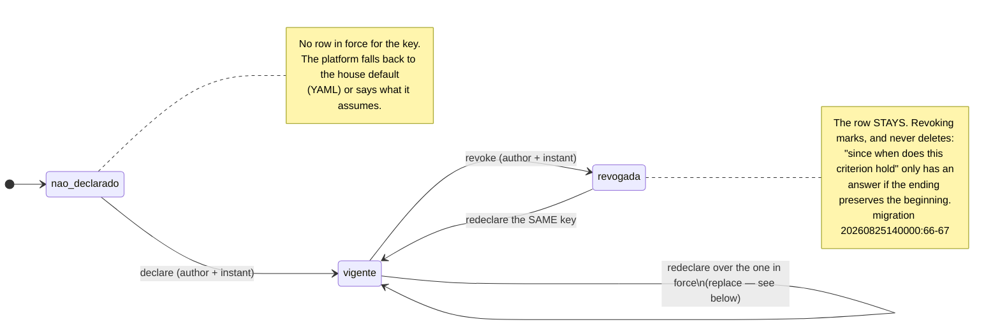
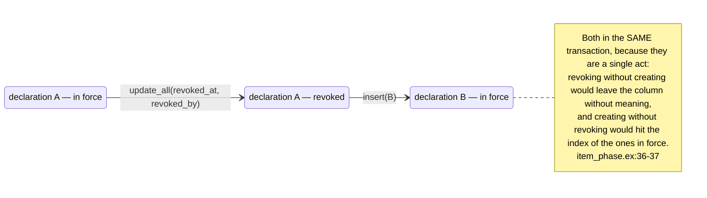

<!-- DERIVED from:
     schemas — lib/the_band/ontology/seon/spo/schemas/item_phase_declaration.ex:42-53,
       event_concept_declaration.ex:30-40, activity_end_criterion.ex:37-50,
       activity_start_criterion.ex:43-57, activity_deadline_criterion.ex:31-45,
       lib/the_band/ontology/continuum/smpo/schemas/iteration_field_role.ex:20-31,
       lib/the_band/ontology/seon/eo/schemas/role_visibility_grant.ex:32-43,
       role_structure_management_grant.ex:44-54,
       lib/the_band/tenants/access/scope_grant.ex:22-33 and :53-64;
     commands — lib/the_band/ontology/seon/spo/item_phase.ex:29-95,
       event_concept.ex:36-85, end_criterion.ex:26-52, start_criterion.ex:67-112,
       deadline_criterion.ex:58-95, lib/the_band/ontology/continuum/smpo/field_roles.ex:25,50,
       lib/the_band/ontology/seon/eo/visibility.ex:130,145,
       lib/the_band/ontology/seon/eo/structure_grants.ex:93,120,
       lib/the_band/tenants/access.ex:523-583;
     migrations — 20260825140000_create_activity_start_criteria.exs:55-90,
       20260827020000_papel_do_campo_de_iteracao.exs:62-72,
       20260827040000_criterio_de_prazo.exs:72-102,
       20260827060000_concessao_de_visibilidade.exs:64-73,
       20260828160856_access_scope_grants.exs:22-41,
       20260907190000_concessao_de_gestao_da_estrutura.exs:66-76,
       20260915120000_declaracao_de_fase_por_coluna.exs:64-80,
       20260915180000_declaracao_de_conceito_por_evento.exs:45-53,
       20260915200000_criterio_de_fim.exs:57-75;
     tests — test/the_band/ontology/seon/spo/criterio_de_inicio_test.exs:63,104;
       criterio_de_prazo_test.exs:267,293,312,447;
       test/the_band/ontology/continuum/smpo/papel_do_campo_test.exs:149,171,176;
       test/the_band/ontology/seon/eo/visibilidade_test.exs:287,372;
       concessao_de_gestao_test.exs:85; test/the_band/tenants/access_test.exs:357,371;
       test/the_band_web/live/declarar_fase_test.exs:111,135,164,191,252,269,298
     — on 2026-09-18. Checked against the code on this date. Regenerate when the source changes. -->

# States — the revocable declaration

**Nine tables, a single machine.** It is the most repeated pattern on this platform, and whoever
understands it once understands nine parts of the system at once.

## What these nine tables are

A whole family answers the same question: **what does this organization state about its own process?** It
is not observed data — it is a people's decision, with name and time.

The reason the decision becomes a row, and not a constant in the code, is written in the migration of the
phase declaration:

> *"The same column means different things in different organizations, and none of them is wrong. The
> platform records the choice, with who made it and when."*
> — `priv/repo/migrations/20260915120000_declaracao_de_fase_por_coluna.exs:18-19`

And the data that forced it: on board 43 of `leds-conectafapes`, on 2026-09-14, **459 cards in `Done`, of
which 294 with the issue still OPEN at the source**. The platform defined "done" as "issue closed", and for
that organization every delivery measure undercounted. The fix was not to choose for it — it was to record
its choice.

## The nine tables

`validity key` is the set of columns of the **partial unique index** — it is what carries the invariant
*"one declaration in force per ..."*, and it is the reason the index is partial.

| # | Table | What the organization declares | Validity key |
|---|---|---|---|
| 1 | `spo_item_phase_declarations` | what **each board column** means | `tenant, board, field, option` |
| 2 | `spo_event_concept_declarations` | what **each timeline event** materializes | `tenant, event_type` |
| 3 | `spo_activity_end_criteria` | which event marks the **end** of the work | `tenant, board` **or** `tenant, project` |
| 4 | `spo_activity_start_criteria` | which event marks the **start** of the work | `tenant, board` **or** `tenant, project` |
| 5 | `spo_activity_deadline_criteria` | which field the **deadline** comes from | `tenant, board/project, source, field` |
| 6 | `smpo_iteration_field_roles` | which **role** an iteration field plays | `tenant, board, field` |
| 7 | `eo_role_visibility_grants` | which organizational role **sees** what | `tenant, role, scope` |
| 8 | `eo_role_structure_management_grants` | which organizational role **manages the structure** | `tenant, role, scope` |
| 9 | `access_scope_grants` | which **account** reaches which scope | `tenant, account, level, target` |

The first three are from feature **066** and came in on 2026-09-15. The other six came before, and 066
copied their design on purpose — the migration says so out loud:

> *"the same design as `spo_activity_start_criteria` (042) and `spo_activity_deadline_criteria`
> (#368)"* — `20260915120000:19-20`

## The state is not a column

There is no `status` in any of the nine. The situation comes from **a date that can be null**:

| State | The rule, exactly |
|---|---|
| **in force** | `revoked_at` **is null** |
| **revoked** | `revoked_at` filled — always together with `revoked_by_user_id` |

And there is a third state that does not belong to the row, but to the **key**:

| State | The rule, exactly |
|---|---|
| **not declared** | no row in force for that key |

It matters because it is the initial state of everything, and because **the platform has to say what it
does without a declaration**. That is what the 066 screen does: *"without it, the platform says what it
assumes"* (`test/the_band_web/live/declarar_fase_test.exs:269`).

## The machine



**There is no final state.** A revoked key can be declared again, and that is why the unique indexes are
**partial**: a total index on the key would prevent redeclaring after revoking, and the start criterion
migration explains exactly that (`20260825140000:78-79`). The test that proves it is
`criterio_de_inicio_test.exs:104` — *"redeclaring after revoking is accepted"*.

## The transition that looks like two, and is one

`vigente --> vigente` is the gesture the screen calls **Replace**: declaring over a key that already has a
declaration in force. It is not "editing the row": it is **two writes in one transaction**, revoking the
previous one and creating the new one.



Whoever reads the table afterwards sees **two rows**: one revoked and one in force. That is the design,
not a duplicate — and the screen shows the revoked one **under** the one in force, *"because 'revoking
marks' needs a shape on the screen and not only in the database"* (`item_phase.ex:114-115`).

## Where each transition happens, and what proves it

| # | Table | `declarar` | `revogar` | Revocation test |
|---|---|---|---|---|
| 1 | phase per column | `spo/item_phase.ex:41` | `spo/item_phase.ex:80` | `live/declarar_fase_test.exs:135` |
| 2 | concept per event | `spo/event_concept.ex:36` | `spo/event_concept.ex:67` | `live/declarar_fase_test.exs:252` |
| 3 | end criterion | `spo/end_criterion.ex:26` | `spo/end_criterion.ex:37` | `live/declarar_fase_test.exs:269` |
| 4 | start criterion | `spo/start_criterion.ex:67` | `spo/start_criterion.ex:100` | `criterio_de_inicio_test.exs:63, 104` |
| 5 | deadline criterion | `spo/deadline_criterion.ex:58` | `spo/deadline_criterion.ex:75` | `criterio_de_prazo_test.exs:267, 293, 312` |
| 6 | field role | `smpo/field_roles.ex:25` | `smpo/field_roles.ex:50` | `papel_do_campo_test.exs:149, 171, 176` |
| 7 | role visibility | `eo/visibility.ex:130` | `eo/visibility.ex:145` | `visibilidade_test.exs:287, 372` |
| 8 | structure management | `eo/structure_grants.ex:93` | `eo/structure_grants.ex:120` | `concessao_de_gestao_test.exs:85` |
| 9 | access scope | `tenants/access.ex:532` | `tenants/access.ex:568` | `access_test.exs:371` |

### The test gap, declared

The three declarations of feature **066** — phase per column, concept per event and end criterion — **have
no command test**. Every transition of theirs is proven only by the screen test,
`test/the_band_web/live/declarar_fase_test.exs`, and the search for the tables in `test/` comes back empty:

```text
$ grep -rl "spo_item_phase_declarations" test/     → no file
$ grep -rl "spo_event_concept_declarations" test/  → no file
$ grep -rl "spo_activity_end_criteria" test/       → no file
```

The six earlier declarations have a test at the command level, in `test/the_band/ontology/...`. The three
new ones do not. **This is work material for QA**, and it is written here instead of omitted because a
transition without a test at the level where the rule lives is a gap, even when the screen passes green.

## The two guards the database enforces

Neither of them is application code — they are a `CHECK` and an index, and that is why they hold even for
whoever writes straight to the database.

| Guard | Where | What it prevents |
|---|---|---|
| `num_nonnulls(project_id, observed_project_id) = 1` | `spo_activity_start_criteria` (`20260825140000:75`) | a criterion **without a target** would hold for everything without anyone having said so |
| `(project_id IS NULL) <> (observed_project_id IS NULL)` | `spo_activity_end_criteria` (`20260915200000:63`) | the same thing, written with the inequality operator |
| **partial** unique index `WHERE revoked_at IS NULL` | all nine | two declarations in force for the same key |

**The board → project precedence.** In the start, end and deadline criteria, a board can disagree with the
project it belongs to: that is why there are **two** partial indexes per table, one for each target, and
the reading resolves the board first. The list of those that disagree has its own query,
`start_criterion.ex:130` (`boards_overriding/2`).

## Two things the machine does NOT do

They come in as a note, not as an arrow, because the code does not write them.

- **Revoked does not become "deleted".** There is no `delete` on any path of the nine. The revoked row
  remains queryable, and the 066 screen shows it.
- **Revoking what nobody declared is not success.** It returns `{:error, :nao_encontrada}` —
  `item_phase.ex:89`. There is a dedicated test for this in two of the nine
  (`criterio_de_prazo_test.exs:312` and `papel_do_campo_test.exs:171`), and the test's name says the
  reason: *"revoking what nobody declared is not silent success"*. It is the defect this house pursues
  most, and the whole family is designed not to fall into it.

## The naming divergence, recorded

Eight of the nine use the pair `declared_by_user_id` / `declared_at`. The ninth, `access_scope_grants`,
uses `granted_by_user_id` / `granted_at` (`lib/the_band/tenants/access/scope_grant.ex:28-29`).

The two readings:

- **it is the same thing under another name** — granting scope is declaring something, and the revocation
  column is already identical (`revoked_at` / `revoked_by_user_id`) in all nine;
- **it is something else on purpose** — granting access to an account is not declaring a meaning about the
  process, and the different vocabulary marks the difference.

**Decided on 2026-09-18: it stays as it is.** The second reading wins — granting access to an account is
not declaring a meaning about the process, and the different vocabulary marks a real difference. Renaming
would erase that mark to gain a search.

The annoyance is one of search, and it is solved here: **whoever looks for `declared_at` does not find
`access_scope_grants`**, which uses `granted_at`. The revocation columns are identical in all nine.

## What this model does not show

- `inserted_at`, `updated_at` and `id` — they do not decide behaviour.
- The **fields specific to each table** (`event_type`, `target_concept`, `scope`, `level`…). They are in
  the [class diagram](../classes/declaracoes-da-organizacao.md) and in the
  [ERD](../banco/declaracoes-da-organizacao.md); here only the situation.
- The **tenth case**, which has the same shape and is not a table: the link between the account and the
  observed person lives in `users.person_declared_at` / `users.person_revoked_at`, a column pair inside
  `users`. The machine is this same one, and it is in
  [conta.md](conta.md#machine-2--the-link-between-the-account-and-the-observed-person).
