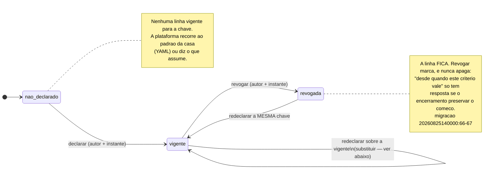
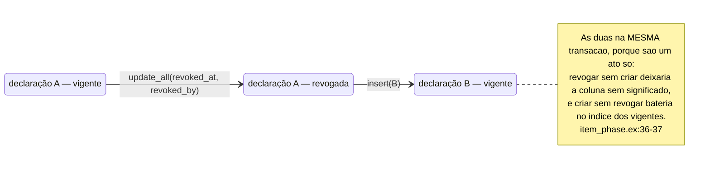

<!-- DERIVADO de:
     schemas — lib/the_band/ontology/seon/spo/schemas/item_phase_declaration.ex:42-53,
       event_concept_declaration.ex:30-40, activity_end_criterion.ex:37-50,
       activity_start_criterion.ex:43-57, activity_deadline_criterion.ex:31-45,
       lib/the_band/ontology/continuum/smpo/schemas/iteration_field_role.ex:20-31,
       lib/the_band/ontology/seon/eo/schemas/role_visibility_grant.ex:32-43,
       role_structure_management_grant.ex:44-54,
       lib/the_band/tenants/access/scope_grant.ex:22-33 e :53-64;
     comandos — lib/the_band/ontology/seon/spo/item_phase.ex:29-95,
       event_concept.ex:36-85, end_criterion.ex:26-52, start_criterion.ex:67-112,
       deadline_criterion.ex:58-95, lib/the_band/ontology/continuum/smpo/field_roles.ex:25,50,
       lib/the_band/ontology/seon/eo/visibility.ex:130,145,
       lib/the_band/ontology/seon/eo/structure_grants.ex:93,120,
       lib/the_band/tenants/access.ex:523-583;
     migrações — 20260825140000_create_activity_start_criteria.exs:55-90,
       20260827020000_papel_do_campo_de_iteracao.exs:62-72,
       20260827040000_criterio_de_prazo.exs:72-102,
       20260827060000_concessao_de_visibilidade.exs:64-73,
       20260828160856_access_scope_grants.exs:22-41,
       20260907190000_concessao_de_gestao_da_estrutura.exs:66-76,
       20260915120000_declaracao_de_fase_por_coluna.exs:64-80,
       20260915180000_declaracao_de_conceito_por_evento.exs:45-53,
       20260915200000_criterio_de_fim.exs:57-75;
     testes — test/the_band/ontology/seon/spo/criterio_de_inicio_test.exs:63,104;
       criterio_de_prazo_test.exs:267,293,312,447;
       test/the_band/ontology/continuum/smpo/papel_do_campo_test.exs:149,171,176;
       test/the_band/ontology/seon/eo/visibilidade_test.exs:287,372;
       concessao_de_gestao_test.exs:85; test/the_band/tenants/access_test.exs:357,371;
       test/the_band_web/live/declarar_fase_test.exs:111,135,164,191,252,269,298
     — em 2026-09-18. Conferido contra o código nesta data. Regenerar ao mudar a fonte. -->

# Estados — a declaração revogável

**Nove tabelas, uma máquina só.** É o padrão mais repetido desta plataforma, e quem o entende
uma vez entende nove partes do sistema de uma vez.

## O que essas nove tabelas são

Toda uma família responde à mesma pergunta: **o que esta organização afirma sobre o próprio
processo?** Não é dado observado — é decisão de gente, com nome e hora.

A razão de a decisão virar linha, e não constante no código, está escrita na migração da
declaração de fase:

> *"A mesma coluna significa coisas diferentes em organizações diferentes, e nenhuma está
> errada. A plataforma registra a escolha, com quem a fez e quando."*
> — `priv/repo/migrations/20260915120000_declaracao_de_fase_por_coluna.exs:18-19`

E o dado que forçou isso: no quadro 43 da `leds-conectafapes`, em 2026-09-14, **459 cartões em
`Done`, dos quais 294 com a issue ainda ABERTA na origem**. A plataforma definia "concluído"
como "issue fechada", e para aquela organização toda medida de entrega subcontava. A correção
não foi escolher por ela — foi registrar a escolha dela.

## As nove tabelas

`chave da vigência` é o conjunto de colunas do **índice único parcial** — é ele que carrega a
invariante *"uma declaração vigente por ..."*, e é a razão de o índice ser parcial.

| # | Tabela | O que a organização declara | Chave da vigência |
|---|---|---|---|
| 1 | `spo_item_phase_declarations` | o que **cada coluna do quadro** significa | `tenant, quadro, campo, opção` |
| 2 | `spo_event_concept_declarations` | o que **cada evento da timeline** materializa | `tenant, event_type` |
| 3 | `spo_activity_end_criteria` | qual evento marca o **fim** do trabalho | `tenant, quadro` **ou** `tenant, projeto` |
| 4 | `spo_activity_start_criteria` | qual evento marca o **começo** do trabalho | `tenant, quadro` **ou** `tenant, projeto` |
| 5 | `spo_activity_deadline_criteria` | de que campo sai o **prazo** | `tenant, quadro/projeto, origem, campo` |
| 6 | `smpo_iteration_field_roles` | que **papel** um campo de iteração cumpre | `tenant, quadro, campo` |
| 7 | `eo_role_visibility_grants` | que papel organizacional **enxerga** o quê | `tenant, papel, escopo` |
| 8 | `eo_role_structure_management_grants` | que papel organizacional **gere a estrutura** | `tenant, papel, escopo` |
| 9 | `access_scope_grants` | que **conta** alcança que escopo | `tenant, conta, nível, alvo` |

As três primeiras são da feature **066** e entraram em 2026-09-15. As outras seis vieram antes,
e a 066 copiou o desenho delas de propósito — a migração diz isso em voz alta:

> *"o mesmo desenho de `spo_activity_start_criteria` (042) e `spo_activity_deadline_criteria`
> (#368)"* — `20260915120000:19-20`

## O estado não é uma coluna

Não existe `status` em nenhuma das nove. A situação sai de **uma data que pode ser nula**:

| Estado | A regra, exatamente |
|---|---|
| **vigente** | `revoked_at` **é nulo** |
| **revogada** | `revoked_at` preenchido — sempre com `revoked_by_user_id` junto |

E há um terceiro estado que não é da linha, e sim da **chave**:

| Estado | A regra, exatamente |
|---|---|
| **não declarado** | nenhuma linha vigente para aquela chave |

Ele importa porque é o estado inicial de tudo, e porque **a plataforma tem de dizer o que faz
sem declaração**. É o que a tela da 066 faz: *"sem ele, a plataforma diz o que assume"*
(`test/the_band_web/live/declarar_fase_test.exs:269`).

## A máquina



**Não há estado final.** Uma chave revogada pode ser declarada de novo, e é por isso que os
índices únicos são **parciais**: um índice total sobre a chave impediria redeclarar depois de
revogar, e a migração do critério de início explica exatamente isso
(`20260825140000:78-79`). O teste que o prova é
`criterio_de_inicio_test.exs:104` — *"redeclarar depois de revogar é aceito"*.

## A transição que parece duas, e é uma

`vigente --> vigente` é o gesto que a tela chama de **Replace**: declarar sobre uma chave que
já tem declaração vigente. Não é "editar a linha": são **duas escritas numa transação**,
revogando a anterior e criando a nova.



Quem lê a tabela depois vê **duas linhas**: uma revogada e uma vigente. Isso é o desenho, não
duplicata — e a tela mostra a revogada **sob** a vigente, *"porque 'revogar marca' precisa de
forma na tela e não só no banco"* (`item_phase.ex:114-115`).

## Onde cada transição acontece, e o que a prova

| # | Tabela | `declarar` | `revogar` | Teste da revogação |
|---|---|---|---|---|
| 1 | fase por coluna | `spo/item_phase.ex:41` | `spo/item_phase.ex:80` | `live/declarar_fase_test.exs:135` |
| 2 | conceito por evento | `spo/event_concept.ex:36` | `spo/event_concept.ex:67` | `live/declarar_fase_test.exs:252` |
| 3 | critério de fim | `spo/end_criterion.ex:26` | `spo/end_criterion.ex:37` | `live/declarar_fase_test.exs:269` |
| 4 | critério de início | `spo/start_criterion.ex:67` | `spo/start_criterion.ex:100` | `criterio_de_inicio_test.exs:63, 104` |
| 5 | critério de prazo | `spo/deadline_criterion.ex:58` | `spo/deadline_criterion.ex:75` | `criterio_de_prazo_test.exs:267, 293, 312` |
| 6 | papel do campo | `smpo/field_roles.ex:25` | `smpo/field_roles.ex:50` | `papel_do_campo_test.exs:149, 171, 176` |
| 7 | visibilidade do papel | `eo/visibility.ex:130` | `eo/visibility.ex:145` | `visibilidade_test.exs:287, 372` |
| 8 | gestão da estrutura | `eo/structure_grants.ex:93` | `eo/structure_grants.ex:120` | `concessao_de_gestao_test.exs:85` |
| 9 | escopo de acesso | `tenants/access.ex:532` | `tenants/access.ex:568` | `access_test.exs:371` |

### A lacuna de teste, declarada

As três declarações da feature **066** — fase por coluna, conceito por evento e critério de
fim — **não têm teste de comando**. Toda transição delas é provada só pelo teste de tela,
`test/the_band_web/live/declarar_fase_test.exs`, e a busca pelas tabelas em `test/` volta vazia:

```text
$ grep -rl "spo_item_phase_declarations" test/     → nenhum arquivo
$ grep -rl "spo_event_concept_declarations" test/  → nenhum arquivo
$ grep -rl "spo_activity_end_criteria" test/       → nenhum arquivo
```

As seis declarações anteriores têm teste no nível do comando, em
`test/the_band/ontology/...`. As três novas, não. **Isto é material de trabalho para QA**, e
está escrito aqui em vez de omitido porque transição sem teste no nível onde a regra vive é
lacuna, mesmo quando a tela passa verde.

## As duas guardas que o banco impõe

Nenhuma delas é código de aplicação — são `CHECK` e índice, e por isso valem mesmo para quem
escrever direto no banco.

| Guarda | Onde | O que impede |
|---|---|---|
| `num_nonnulls(project_id, observed_project_id) = 1` | `spo_activity_start_criteria` (`20260825140000:75`) | um critério **sem alvo** valeria para tudo sem ninguém ter dito isso |
| `(project_id IS NULL) <> (observed_project_id IS NULL)` | `spo_activity_end_criteria` (`20260915200000:63`) | a mesma coisa, escrita com o operador de diferença |
| índice único **parcial** `WHERE revoked_at IS NULL` | as nove | duas declarações vigentes para a mesma chave |

**A precedência quadro → projeto.** Nos critérios de início, fim e prazo, um quadro pode
discordar do projeto a que pertence: por isso há **dois** índices parciais por tabela, um para
cada alvo, e a leitura resolve quadro primeiro. A lista de quem discorda tem consulta própria,
`start_criterion.ex:130` (`boards_overriding/2`).

## Duas coisas que a máquina NÃO faz

Entram como nota, e não como seta, porque o código não as escreve.

- **Revogada não vira "apagada".** Não existe `delete` em caminho nenhum das nove. A linha
  revogada continua consultável, e a tela da 066 a mostra.
- **Revogar o que ninguém declarou não é sucesso.** Devolve `{:error, :nao_encontrada}` —
  `item_phase.ex:89`. Há teste dedicado a isso em duas das nove
  (`criterio_de_prazo_test.exs:312` e `papel_do_campo_test.exs:171`), e o nome do teste diz a
  razão: *"revogar o que ninguém declarou não é sucesso silencioso"*. É o defeito que esta casa
  mais persegue, e a família inteira está desenhada para não cair nele.

## A divergência de nomes, registrada

Oito das nove usam o par `declared_by_user_id` / `declared_at`. A nona, `access_scope_grants`,
usa `granted_by_user_id` / `granted_at` (`lib/the_band/tenants/access/scope_grant.ex:28-29`).

As duas leituras:

- **é a mesma coisa com outro nome** — conceder escopo é declarar algo, e a coluna de revogação
  já é idêntica (`revoked_at` / `revoked_by_user_id`) nas nove;
- **é outra coisa de propósito** — conceder acesso a uma conta não é declarar um significado
  sobre o processo, e o vocabulário diferente marca a diferença.

**Decidido em 2026-09-18: fica como está.** A segunda leitura vence — conceder acesso a uma
conta não é declarar um significado sobre o processo, e o vocabulário diferente marca uma
diferença real. Renomear apagaria essa marca para ganhar uma busca.

O incômodo é de busca, e se resolve aqui: **quem procurar `declared_at` não acha
`access_scope_grants`**, que usa `granted_at`. As colunas de revogação são idênticas nas nove.

## O que este modelo não mostra

- `inserted_at`, `updated_at` e `id` — não decidem comportamento.
- Os **campos próprios de cada tabela** (`event_type`, `target_concept`, `scope`, `level`…).
  Eles estão no [diagrama de classes](../classes/declaracoes-da-organizacao.md) e no
  [ERD](../banco/declaracoes-da-organizacao.md); aqui só a situação.
- O **décimo caso**, que tem a mesma forma e não é tabela: o elo entre a conta e a pessoa
  observada vive em `users.person_declared_at` / `users.person_revoked_at`, um par de colunas
  dentro de `users`. A máquina é esta mesma, e está em [conta.md](conta.md#máquina-2--o-elo-entre-a-conta-e-a-pessoa-observada).
