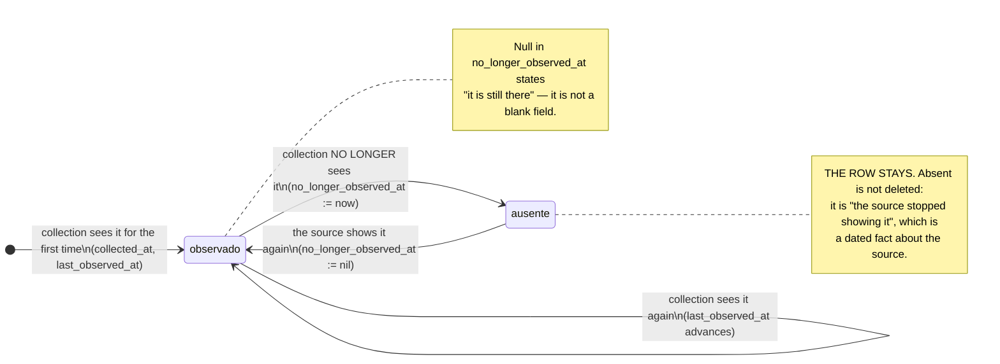
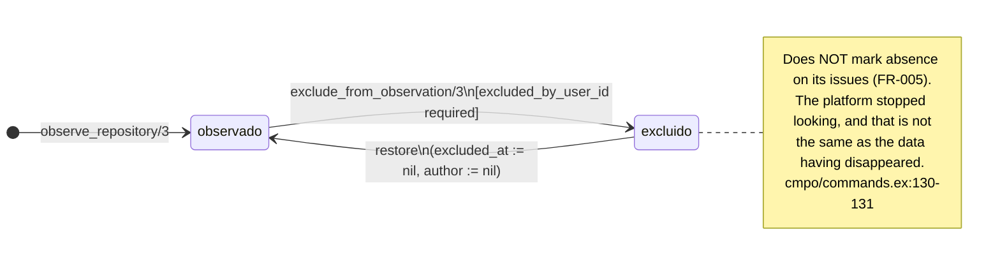

<!-- DERIVED from the reconstruction of the 93 migrations (table → columns), which returns 23 tables with
     `no_longer_observed_at` and 1 with `excluded_at`, compared with the 23
     `field :no_longer_observed_at` declarations in lib/**/*.ex;
     marking the absence — lib/the_band/work_items/commands.ex:104, :147, :303, :385;
       lib/the_band/changes/commands.ex:114, :128, :189, :200, :394, :409;
       lib/the_band/ontology/seon/eo/commands.ex:698, :702, :972, :1041, :1060, :1089;
       lib/the_band/communication/commands.ex:65; lib/the_band/configuration/commands.ex:52;
       lib/the_band/quality/commands.ex:53;
     clearing the mark — lib/the_band/work_items/commands.ex:229;
       lib/the_band/changes/commands.ex:380; lib/the_band/ontology/seon/eo/commands.ex:649, :764;
       lib/the_band/ontology/seon/cmpo/commands.ex:83;
       lib/the_band/ontology/continuum/sro/commands.ex:68;
       lib/the_band/ingestion/github_work_items.ex:564; lib/the_band/jobs/sync_github_eo.ex:685;
     exclusion — lib/the_band/ontology/seon/cmpo/commands.ex:126-155;
       priv/repo/migrations/20260811150200_create_observed_repositories.exs:20-21, :40-41, :54;
     the rule — priv/repo/migrations/20260812140000_mark_assignees_and_labels_instead_of_deleting.exs:1-31
     — on 2026-09-18. Checked against the code on this date. Regenerate when the source changes. -->

# States — observation (`no_longer_observed_at` and `excluded_at`)

**The most repeated machine on the platform: 23 tables.** It answers a single question, and it is the
question that most confuses newcomers:

> **What happens when the source stops showing a record?**

This house's answer: **nothing is deleted; the absence is marked with the date it was noticed.**

## The rule, and the story of why it is like this

It is written in a migration that corrects an earlier decision, and it is worth reading in full because it
explains the whole model:

> *"In feature 006 I decided that `replace_assignees/3` and `replace_labels/3` would **delete** what the
> source no longer brought. (…) The maintainer stated the platform's rule: **data is never deleted.**"*
>
> *"Reconstructing 'who was assigned in March' from the raw payload (…) is an archaeological answer: it
> requires reading collection JSON, knowing which run to look at, and trusting that the payload of that
> moment was preserved. Marking costs a column and answers by query."*
>
> — `priv/repo/migrations/20260812140000_mark_assignees_and_labels_instead_of_deleting.exs:7-21`

> Original of the maintainer's rule, as recorded in the migration: *"nunca se apaga dados."*

And the reason the name is always the same:

> *"A different name here would make it look like another concept."* — the same migration, `:26-27`

## The three fields that go together

None of the 23 tables has `status`. The situation comes from a trio:

| Field | What it states |
|---|---|
| `collected_at` | when the platform **first saw it** |
| `last_observed_at` | when the platform saw it **for the last time** |
| `no_longer_observed_at` | when the platform **noticed it was gone** — **null = it is still there** |

**The null that means something:** a null `no_longer_observed_at` is not a "blank field". It is the
statement *"in the last collection, the source still showed this record"*.

## The machine



**There is no final state**, and the return is the point: a record that reappears at the source has its
mark **cleared**, not a new row. Eight places do this, and all of them literally write
`no_longer_observed_at: nil`:

| Where | What comes back |
|---|---|
| `work_items/commands.ex:229` | the issue |
| `changes/commands.ex:380` | the *pull request* |
| `ontology/seon/eo/commands.ex:649` | the person |
| `ontology/seon/eo/commands.ex:764` | the observed team membership |
| `ontology/seon/cmpo/commands.ex:83` | the software system copy |
| `ontology/continuum/sro/commands.ex:68` | the issue in the sprint |
| `ingestion/github_work_items.ex:564` | the item during collection |
| `jobs/sync_github_eo.ex:685` | the EO entity during collection |

## The 23 tables

Count made by reconstructing the 93 migrations, and confirmed by the 23 `field :no_longer_observed_at`
declarations in `lib/`. The two numbers match.

| Context | Tables |
|---|---|
| **work** (5) | `collected_issues`, `issue_assignees`, `issue_labels`, `decomposition_links`, `collected_issue_comments` |
| **change** (5) | `collected_change_requests`, `change_request_issues`, `collected_commits`, `commit_authors`, `commit_files` |
| **verification and quality** (3) | `collected_verifications`, `verification_components`, `collected_artifact_evaluations` |
| **EO** (3) | `eo_people`, `eo_teams`, `eo_team_membership_evidence` |
| **boards and process** (5) | `observed_projects`, `project_items`, `project_field_definitions`, `spo_intended_project_processes`, `sro_sprint_issues` |
| **code** (2) | `cmpo_branches`, `sys_swo_loaded_software_system_copies` |

### Who does NOT have the mark, and that is a decision

Three absences are worth naming, because whoever looks for the column and does not find it needs to know
it is not an oversight:

| Table | Why |
|---|---|
| `eo_organizations` | the organization is what was chosen to be observed; it does not "disappear from the source" |
| `cmpo_source_repositories` | uses `archived_at`, which is what **GitHub** says — not what we notice |
| `observed_repositories` | uses `excluded_at`, which is **our** decision — see below |

## The other absence: the one that is our decision

`observed_repositories.excluded_at` looks like the same thing and **is not**. The distinction is the most
important one in this document:

| | `no_longer_observed_at` | `excluded_at` |
|---|---|---|
| Who decided | **the source** (stopped showing it) | **the tenant** (told it to stop looking) |
| Has an author? | no — nobody decided | **yes**, `excluded_by_user_id`, required by a `CHECK` |
| Where it is written | in the collection commands | `cmpo/commands.ex:139-140` |
| How it is undone | the source shows it again | `cmpo/commands.ex:152` — someone decides again |



The guard is in the database, not only in the code:

```sql
CHECK (excluded_at IS NULL OR excluded_by_user_id IS NOT NULL)
```
`20260811150200_create_observed_repositories.exs:54` — *"a decision has an author"* (`:20-21`).

And the rule the diagram's note records is the one that most protects the data:

> *"**Does not mark absence on its issues** (FR-005). The platform stopped looking, and that is not the same
> as the data having disappeared. Marking here would be L19 in a new form."*
> — `lib/the_band/ontology/seon/cmpo/commands.ex:130-131`

Confusing the two would produce the most expensive false statement in the system: *"these 5 000 issues
disappeared from GitHub"*, when what happened was someone taking a repository off the list.

**Re-observing does not undo the exclusion.** `observe_repository/3` is idempotent on purpose, *"which
preserves the `excluded_at` of an exclusion decided earlier"* (`cmpo/commands.ex:96-97`) — without it, the
next collection would silently undo the decision of whoever administers.

## The unreachable repository

`observed_repositories` has a **third** axis, independent of the two above:
`inaccessible_since` + `inaccessible_reason`. It answers *"the credential does not reach this
repository"*, which is neither "it disappeared" nor "we told it to stop".

They are three orthogonal situations in the same table, and the diagram that joined them would have eight
boxes to say what this sentence says: **a repository can be excluded, unreachable, both, or neither** —
and each mark has a different origin and author.

## What this model does not show

- **`project_iterations.no_longer_in_configuration_at`** is this same machine under another name, for the
  iteration that left the configuration of the board field. It did not get its own diagram because it
  would be this one, repeated.
- **The count of absent rows** in each table. There was no access to the database on 2026-09-18, and a
  number without a measurement does not get in.
- **The tests of each transition.** The writes are located above with `file:line`; the transition → test
  mapping across the 23 tables **was not done** in this document, and it is declared as a gap. What exists
  and is worth knowing is `test/the_band/sources_observation_test.exs`, about ending and resuming the
  observation of a **tool** — which is another machine, in [coleta.md](coleta.md#the-observed-tool).
