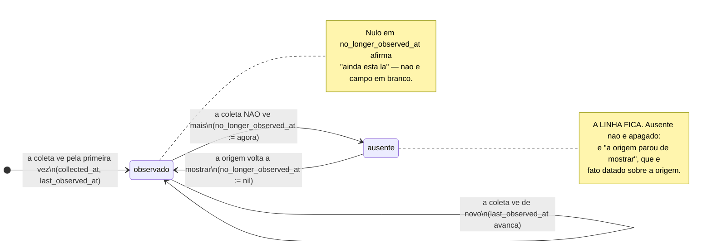
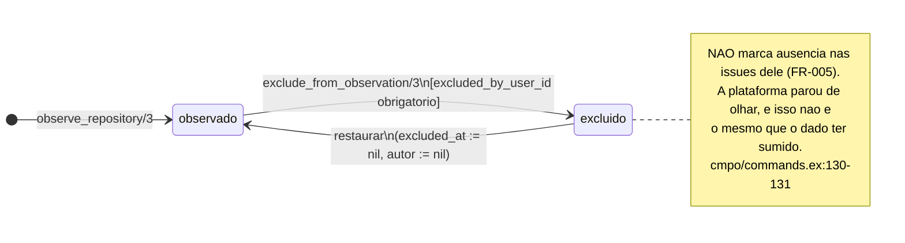

<!-- DERIVADO da reconstrução das 93 migrações (tabela → colunas), que devolve 23 tabelas com
     `no_longer_observed_at` e 1 com `excluded_at`, confrontada com as 23 declarações
     `field :no_longer_observed_at` de lib/**/*.ex;
     marcação da ausência — lib/the_band/work_items/commands.ex:104, :147, :303, :385;
       lib/the_band/changes/commands.ex:114, :128, :189, :200, :394, :409;
       lib/the_band/ontology/seon/eo/commands.ex:698, :702, :972, :1041, :1060, :1089;
       lib/the_band/communication/commands.ex:65; lib/the_band/configuration/commands.ex:52;
       lib/the_band/quality/commands.ex:53;
     limpeza da marca — lib/the_band/work_items/commands.ex:229;
       lib/the_band/changes/commands.ex:380; lib/the_band/ontology/seon/eo/commands.ex:649, :764;
       lib/the_band/ontology/seon/cmpo/commands.ex:83;
       lib/the_band/ontology/continuum/sro/commands.ex:68;
       lib/the_band/ingestion/github_work_items.ex:564; lib/the_band/jobs/sync_github_eo.ex:685;
     exclusão — lib/the_band/ontology/seon/cmpo/commands.ex:126-155;
       priv/repo/migrations/20260811150200_create_observed_repositories.exs:20-21, :40-41, :54;
     a regra — priv/repo/migrations/20260812140000_mark_assignees_and_labels_instead_of_deleting.exs:1-31
     — em 2026-09-18. Conferido contra o código nesta data. Regenerar ao mudar a fonte. -->

# Estados — a observação (`no_longer_observed_at` e `excluded_at`)

**A máquina mais repetida da plataforma: 23 tabelas.** Ela responde a uma pergunta só, e é a
pergunta que mais confunde quem chega:

> **O que acontece quando a origem para de mostrar um registro?**

A resposta desta casa: **nada é apagado; a ausência é marcada com a data em que se notou.**

## A regra, e a história de por que ela é assim

Está escrita numa migração que corrige uma decisão anterior, e vale ler inteira porque explica
o modelo todo:

> *"Na feature 006 eu decidi que `replace_assignees/3` e `replace_labels/3` **apagariam** o que
> a origem não trouxesse mais. (…) A pessoa mantenedora enunciou a regra da plataforma: **nunca
> se apaga dados.**"*
>
> *"Reconstruir 'quem estava designado em março' a partir de payload bruto (…) é uma resposta
> de arqueologia: exige ler JSON de coleta, saber qual execução olhar, e confiar que o payload
> daquele momento foi preservado. Marcar custa uma coluna e responde por consulta."*
>
> — `priv/repo/migrations/20260812140000_mark_assignees_and_labels_instead_of_deleting.exs:7-21`

E a razão de o nome ser sempre o mesmo:

> *"Um nome diferente aqui faria parecer outro conceito."* — a mesma migração, `:26-27`

## Os três campos que andam juntos

Nenhuma das 23 tabelas tem `status`. A situação sai de um trio:

| Campo | O que afirma |
|---|---|
| `collected_at` | quando a plataforma **viu pela primeira vez** |
| `last_observed_at` | quando a plataforma viu **pela última vez** |
| `no_longer_observed_at` | quando a plataforma **notou que sumiu** — **nulo = ainda está lá** |

**O nulo que significa:** `no_longer_observed_at` nulo não é "campo em branco". É a afirmação
*"na última coleta, a origem ainda mostrava este registro"*.

## A máquina



**Não há estado final**, e a volta é o ponto: um registro que reaparece na origem tem a marca
**limpa**, não uma linha nova. Oito lugares fazem isso, e todos escrevem literalmente
`no_longer_observed_at: nil`:

| Onde | O que volta |
|---|---|
| `work_items/commands.ex:229` | a issue |
| `changes/commands.ex:380` | o *pull request* |
| `ontology/seon/eo/commands.ex:649` | a pessoa |
| `ontology/seon/eo/commands.ex:764` | o vínculo observado |
| `ontology/seon/cmpo/commands.ex:83` | a cópia do sistema de software |
| `ontology/continuum/sro/commands.ex:68` | a issue no sprint |
| `ingestion/github_work_items.ex:564` | o item durante a coleta |
| `jobs/sync_github_eo.ex:685` | a entidade da EO durante a coleta |

## As 23 tabelas

Contagem feita reconstruindo as 93 migrações, e confirmada pelas 23 declarações
`field :no_longer_observed_at` em `lib/`. Os dois números batem.

| Contexto | Tabelas |
|---|---|
| **trabalho** (5) | `collected_issues`, `issue_assignees`, `issue_labels`, `decomposition_links`, `collected_issue_comments` |
| **mudança** (5) | `collected_change_requests`, `change_request_issues`, `collected_commits`, `commit_authors`, `commit_files` |
| **verificação e qualidade** (3) | `collected_verifications`, `verification_components`, `collected_artifact_evaluations` |
| **EO** (3) | `eo_people`, `eo_teams`, `eo_team_membership_evidence` |
| **quadros e processo** (5) | `observed_projects`, `project_items`, `project_field_definitions`, `spo_intended_project_processes`, `sro_sprint_issues` |
| **código** (2) | `cmpo_branches`, `sys_swo_loaded_software_system_copies` |

### Quem NÃO tem a marca, e isso é decisão

Três ausências valem ser nomeadas, porque quem procura a coluna e não a encontra precisa saber
que não é esquecimento:

| Tabela | Por quê |
|---|---|
| `eo_organizations` | a organização é o que se escolheu observar; ela não "some da origem" |
| `cmpo_source_repositories` | usa `archived_at`, que é o que **o GitHub** diz — não o que nós notamos |
| `observed_repositories` | usa `excluded_at`, que é decisão **nossa** — ver abaixo |

## A outra ausência: a que é decisão nossa

`observed_repositories.excluded_at` parece a mesma coisa e **não é**. A distinção é a mais
importante deste documento:

| | `no_longer_observed_at` | `excluded_at` |
|---|---|---|
| Quem decidiu | **a origem** (parou de mostrar) | **o tenant** (mandou parar de olhar) |
| Tem autor? | não — ninguém decidiu | **sim**, `excluded_by_user_id`, obrigatório por `CHECK` |
| Onde se escreve | nos comandos de coleta | `cmpo/commands.ex:139-140` |
| Como se desfaz | a origem volta a mostrar | `cmpo/commands.ex:152` — alguém decide de novo |



A guarda está no banco, e não só no código:

```sql
CHECK (excluded_at IS NULL OR excluded_by_user_id IS NOT NULL)
```
`20260811150200_create_observed_repositories.exs:54` — *"decisão tem autor"* (`:20-21`).

E a regra que a nota do diagrama registra é a que mais protege o dado:

> *"**Não marca ausência nas issues dele** (FR-005). A plataforma parou de olhar, e isso não é
> o mesmo que o dado ter sumido. Marcar aqui seria a L19 numa forma nova."*
> — `lib/the_band/ontology/seon/cmpo/commands.ex:130-131`

Confundir as duas produziria a afirmação falsa mais cara do sistema: *"estas 5 000 issues
sumiram do GitHub"*, quando o que houve foi alguém tirando um repositório da lista.

**Reobservar não desfaz a exclusão.** `observe_repository/3` é idempotente de propósito, *"o
que preserva `excluded_at` de uma exclusão decidida antes"* (`cmpo/commands.ex:96-97`) — sem
isso, a coleta seguinte desfaria em silêncio a decisão de quem administra.

## O repositório inalcançável

`observed_repositories` tem um **terceiro** eixo, independente dos dois acima:
`inaccessible_since` + `inaccessible_reason`. Ele responde *"a credencial não alcança este
repositório"*, que não é nem "sumiu" nem "mandamos parar".

São três situações ortogonais na mesma tabela, e o diagrama que as juntasse teria oito caixas
para dizer o que esta frase diz: **um repositório pode estar excluído, inalcançável, as duas
coisas, ou nenhuma** — e cada marca tem origem e autor diferentes.

## O que este modelo não mostra

- **`project_iterations.no_longer_in_configuration_at`** é esta mesma máquina com outro nome,
  para a iteração que saiu da configuração do campo do quadro. Não ganhou diagrama próprio
  porque seria este, repetido.
- **A contagem de linhas ausentes** em cada tabela. Não houve acesso ao banco em 2026-09-18, e
  número sem medida não entra.
- **Os testes de cada transição.** As escritas estão localizadas acima com `arquivo:linha`; o
  mapeamento transição → teste nas 23 tabelas **não foi feito** neste documento, e fica
  declarado como lacuna. O que existe e vale conhecer é
  `test/the_band/sources_observation_test.exs`, sobre encerrar e retomar a observação de uma
  **ferramenta** — que é outra máquina, em [coleta.md](coleta.md#a-ferramenta-observada).
