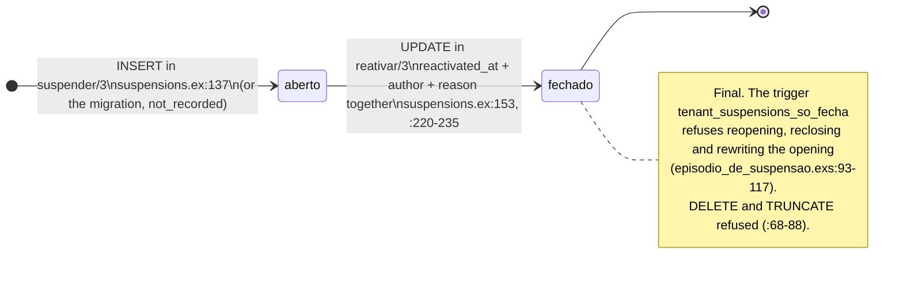

<!-- DERIVED from commit 8cf0fcf of branch feature/1057-070-us1 — after 232afba, which replaced
     Ecto.Multi with Repo.transaction/1 and renamed trocar_estado_no_multi/5 to trocar_estado/3.
     lib/the_band/platform/suspensions.ex:106-114 (suspender/3), :122-129 (reativar/3),
     :133-144 (suspensao/3), :148-159 (reativacao/3), :164-165 (passo/2), :167-235 (the steps),
     :245-283 (after the commit and translation of the reasons);
     lib/the_band/tenants.ex:153-172 (trocar_estado/3), :178-180 (create_tenant/1);
     lib/the_band/tenants/tenant.ex:22, :31-43;
     lib/the_band/tenants/api_tokens.ex:165-179 (revogar_por_suspensao/2);
     lib/the_band/platform/suspension_reasons.ex:24-45, :74;
     priv/knowledge_base/rules/platform_tenant_suspension.yaml:47-119;
     priv/repo/migrations/20260809120000_create_tenants_and_users.exs:18,
     20261002120000_estado_da_organizacao_valido.exs:15-17,
     20261002140000_episodio_de_suspensao.exs:46-49, :54-66, :93-117, :127-140,
     20261002140100_estado_tem_episodio.exs:32-71;
     tests in test/the_band/platform/ — suspender_test.exs, reativar_test.exs,
     estado_tem_episodio_test.exs, episodio_nao_se_reescreve_test.exs, migracao_do_episodio_test.exs;
     test/the_band/tenants/trocar_estado_test.exs.
     Checked against the code on 2026-10-02, at commit 8cf0fcf (the file changed three times during
     this check; the numbers are those of that commit).
     Regenerate when the source changes. -->

# State — the suspended organization and the suspension episode (spec 070)

The organization's state lives in **two tables that need to agree**: `tenants.status`
(`active` | `suspended`, `CHECK` in `estado_da_organizacao_valido.exs:15-17`) is the quick answer, and
`tenant_suspensions` is the record — who, when, why (`episodio_de_suspensao.exs:5-7`). The rule that ties
them is the deferred trigger `tenant_estado_tem_episodio` (`estado_tem_episodio.exs:32-71`):

> **`suspended` ⇔ there is an episode with a null `reactivated_at`.** Checked at `COMMIT`, in both
> directions (`estado_tem_episodio.exs:51-56`).

That is why the diagram has **combined states**, not the column values:

| State in the diagram | `tenants.status` | Open episode (`reactivated_at IS NULL`) | Who guarantees it |
|---|---|---|---|
| `active` | `active` | none | deferred trigger, `active` branch with an open one = refusal |
| `suspended` | `suspended` | exactly one | deferred trigger + index `tenant_suspensions_aberto_index` (`episodio_de_suspensao.exs:46-49`) |
| *suspended without an episode* | `suspended` | none | **refused** at `COMMIT`; only exists with the trigger disabled |

## The organization

```mermaid
stateDiagram-v2
    direction LR

    [*] --> active : create_tenant/1\n(status by default)\ntenants.ex:178-180
    [*] --> suspended : migration — not_recorded episode\nepisodio_de_suspensao.exs:127-140

    active --> suspended : suspender/3\n[authorized session, FOR SHARE lock]\n[declared vocabulary]\n[offered reason; note if suspected_compromise or other]\nsuspensions.ex:106-114, :133-144
    suspended --> active : reativar/3\n[authorized session]\n[open episode, FOR UPDATE]\n[reactivation reason fitting the suspension reason]\nsuspensions.ex:122-129, :148-159

    active --> active : reativar/3\n→ :nao_suspensa (WHERE status = 'suspended' matched 0)\ntenants.ex:165-170, suspensions.ex:270
    suspended --> suspended : suspender/3, including the concurrent one that lost\n→ :ja_suspensa\nsuspensions.ex:269, :280-281

    note right of active
        Refused at COMMIT by the deferred trigger
        (estado_tem_episodio.exs:53-56):
        INSERT of an organization already suspended;
        UPDATE of status without the episode;
        open episode on an active organization.
    end note
```

### Each transition, what it writes, and the test that proves it

**`active → suspended`** — `suspender/3` (`suspensions.ex:106-114`) opens a `Repo.transaction/1` over `suspensao/3` (`:133-144`): a `with`, each step named by `passo/2` (`:164-165`), and `Repo.rollback/1` on the first refusal (`:142`). In this order:

| Step | What it does | Source |
|---|---|---|
| `:autorizacao` | rereads the operator's session with `FOR SHARE` (session open, within its time, in the epoch, grant in force) | `suspensions.ex:134`, `:181-186`; `sessions.ex:140-160` |
| `:razao` | episode changeset: reason in `suspend_reasons.offered`, note required for `suspected_compromise` and `other` | `suspensions.ex:135`, `:188-206`; `platform_tenant_suspension.yaml:48-66`, `:114-116` |
| `:estado` | `UPDATE tenants SET status='suspended' WHERE id=… AND status='active'` — the condition in the `WHERE`, to serialize concurrent ones | `suspensions.ex:136`; `tenants.ex:153-172` (raises outside a transaction, `:155-156`) |
| `:episodio` | `INSERT` of the open episode; the partial index refuses the second | `suspensions.ex:137`; `episodio_de_suspensao.exs:46-49` |
| `:sessoes` | ends every session of the organization's accounts | `suspensions.ex:138` |
| `:tokens` | revokes every token in force of the organization, with `revoked_by_suspension_id` = the episode and `revocation_clause = 'organizacao_suspensa'` | `suspensions.ex:139`; `api_tokens.ex:165-179` |
| after the `COMMIT` | notifies the open screens and records the act | `suspensions.ex:245-263` |

Test: `suspender_test.exs:57` (the whole success); refusals in `:78` (`:nao_autorizado`), `:92`
(`:not_found`), `:96` (`:ja_suspensa` by the `:estado` step), `:101` (`:ja_suspensa` by the index),
`:114` (reason or note), `:126` (`:vocabulario_nao_declarado`); the state-before-episode order going
through the trigger in `estado_tem_episodio_test.exs:81`; the isolated state change in
`trocar_estado_test.exs:16`, `:22`, `:31`, `:36` (undone with the transaction) and `:49` (raises outside it).

**`suspended → active`** — `reativar/3` (`suspensions.ex:122-129`) over `reativacao/3` (`:148-159`), same shape:

| Step | What it does | Source |
|---|---|---|
| `:autorizacao` | as above | `suspensions.ex:149` |
| `:estado` | `UPDATE … SET status='active' WHERE status='suspended'` — **before** looking for the episode, so that an active organization gives `:nao_suspensa`, and not `:sem_episodio_aberto` | `suspensions.ex:146-150` |
| `:aberto` | reads the open episode with `FOR UPDATE` | `suspensions.ex:151`, `:208-218` |
| `:razao` / `:episodio` | closes the episode: `reactivated_at`, author, reason (`investigation_closed_no_compromise` only against `suspected_compromise`; note required for `other`) | `suspensions.ex:152-153`, `:220-235`; `suspension_reasons.ex:32-37`; `platform_tenant_suspension.yaml:84-103`, `:117-118` |
| `:sessoes` | ends **again** every session of the organization | `suspensions.ex:154` |
| `:tokens` | `tokens: 0` in the result — **no token comes back** | `suspensions.ex:155` |

Test: `reativar_test.exs:35` (success, no token comes back), `:51` (sessions ended again),
`:63` (`:nao_suspensa`), `:67` (`:sem_episodio_aberto`, with the trigger disabled), `:75` and `:86`
(reason and note guards).

**`[*] → active`** — `create_tenant/1` (`tenants.ex:178-180`). `:status` **is not in the `cast`**
(`tenant.ex:31-38`): the organization is born through the `default` `"active"` (`create_tenants_and_users.exs:18`;
`tenant.ex:22`). Test: `estado_tem_episodio_test.exs:91`.

**`[*] → suspended`** — only through the migration, for whoever was already `suspended` before the
feature: a `not_recorded` episode, without an author (`episodio_de_suspensao.exs:127-140`; the `CHECK` in
`:54-56` allows a null author only in this case). Test: `migracao_do_episodio_test.exs:30`. An organization
created already `suspended` by code is **refused** at `COMMIT`: `estado_tem_episodio_test.exs:101`.

## The episode



| Rule | Source | Test |
|---|---|---|
| one open per organization | `episodio_de_suspensao.exs:46-49` | `episodio_nao_se_reescreve_test.exs:43` |
| deleting, truncating and rewriting the opening are refused | `episodio_de_suspensao.exs:68-117` | `episodio_nao_se_reescreve_test.exs:51` |
| a closed one neither reopens nor recloses | `episodio_de_suspensao.exs:97-98` | `episodio_nao_se_reescreve_test.exs:72` |
| a half closing is refused | `episodio_de_suspensao.exs:58-62` | `episodio_nao_se_reescreve_test.exs:109` |

## Transitions the house refuses (a note, not an arrow)

- **`UPDATE` of `status` without an episode**, in either direction: refused at `COMMIT`
  (`estado_tem_episodio.exs:53-56`). Tests: `estado_tem_episodio_test.exs:64` and `:72`.
- **Open episode on an `active` organization**: likewise. Test: `estado_tem_episodio_test.exs:68`.
- **A token revoked by the suspension does not come back active** with the reactivation
  (`suspensions.ex:155`); the two `CHECK`s of `revogacao_por_suspensao.exs:22-31` tie the clause to the
  episode.
- **Changing the state by another path**: `trocar_estado/3` accepts only the two pairs, by function head
  (`tenants.ex:153-154`), raises outside a transaction (`:155-156`), and has a single caller,
  `Platform.Suspensions` (tests: `suspender_test.exs:141`, `trocar_estado_test.exs:59`, `:68`).

## What did not fit, and gaps

1. **The `suspended without an episode` state** did not get in as a node: the database refuses it at
   `COMMIT`. It is only reachable with the trigger disabled by whoever owns the tables
   (`estado_tem_episodio.exs:7-9`; #1131), and it is what `reativar_test.exs:67` simulates.
2. **The concurrent suspension that lost** goes into the `suspended` loop: when it reaches `COMMIT`, the
   winner has already suspended. The `WHERE status = 'active'` matches zero rows
   (`tenants.ex:165-170`) or the partial index refuses the second `INSERT`
   (`suspensions.ex:280-281`); the losing transaction is undone entirely and returns `:ja_suspensa`.
3. **No test gap** among the transitions above: all have a test pointed to. The tests **were not run** in
   this check (a `mix gates` was in progress); the statement is that they exist, not that they pass.
