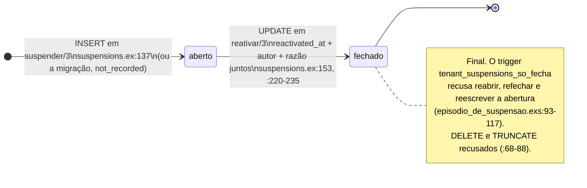

<!-- DERIVADO do commit 8cf0fcf da branch feature/1057-070-us1 — depois do 232afba, que trocou o
     Ecto.Multi por Repo.transaction/1 e renomeou trocar_estado_no_multi/5 para trocar_estado/3.
     lib/the_band/platform/suspensions.ex:106-114 (suspender/3), :122-129 (reativar/3),
     :133-144 (suspensao/3), :148-159 (reativacao/3), :164-165 (passo/2), :167-235 (os passos),
     :245-283 (depois do commit e tradução dos motivos);
     lib/the_band/tenants.ex:153-172 (trocar_estado/3), :178-180 (create_tenant/1);
     lib/the_band/tenants/tenant.ex:22, :31-43;
     lib/the_band/tenants/api_tokens.ex:165-179 (revogar_por_suspensao/2);
     lib/the_band/platform/suspension_reasons.ex:24-45, :74;
     priv/knowledge_base/rules/platform_tenant_suspension.yaml:47-119;
     priv/repo/migrations/20260809120000_create_tenants_and_users.exs:18,
     20261002120000_estado_da_organizacao_valido.exs:15-17,
     20261002140000_episodio_de_suspensao.exs:46-49, :54-66, :93-117, :127-140,
     20261002140100_estado_tem_episodio.exs:32-71;
     testes em test/the_band/platform/ — suspender_test.exs, reativar_test.exs,
     estado_tem_episodio_test.exs, episodio_nao_se_reescreve_test.exs, migracao_do_episodio_test.exs;
     test/the_band/tenants/trocar_estado_test.exs.
     Conferido contra o código em 2026-10-02, no commit 8cf0fcf (o arquivo mudou três vezes durante
     esta conferência; os números são os desse commit).
     Regenerar ao mudar a fonte. -->

# Estado — a organização suspensa e o episódio de suspensão (spec 070)

O estado da organização mora em **duas tabelas que precisam concordar**: `tenants.status`
(`active` | `suspended`, `CHECK` em `estado_da_organizacao_valido.exs:15-17`) é a resposta
rápida, e `tenant_suspensions` é o registro — quem, quando, por quê
(`episodio_de_suspensao.exs:5-7`). A regra que as amarra é o trigger adiado
`tenant_estado_tem_episodio` (`estado_tem_episodio.exs:32-71`):

> **`suspended` ⇔ existe episódio com `reactivated_at` nulo.** Conferido no `COMMIT`, nos dois
> sentidos (`estado_tem_episodio.exs:51-56`).

Por isso o diagrama tem **estados combinados**, e não os valores da coluna:

| Estado no diagrama | `tenants.status` | Episódio aberto (`reactivated_at IS NULL`) | Quem garante |
|---|---|---|---|
| `active` | `active` | nenhum | trigger adiado, ramo `active` com aberto = recusa |
| `suspended` | `suspended` | exatamente um | trigger adiado + índice `tenant_suspensions_aberto_index` (`episodio_de_suspensao.exs:46-49`) |
| *suspended sem episódio* | `suspended` | nenhum | **recusado** no `COMMIT`; só existe com o trigger desligado |

## A organização

```mermaid
stateDiagram-v2
    direction LR

    [*] --> active : create_tenant/1\n(status pelo default)\ntenants.ex:178-180
    [*] --> suspended : migração — episódio not_recorded\nepisodio_de_suspensao.exs:127-140

    active --> suspended : suspender/3\n[sessão autorizada, lock FOR SHARE]\n[vocabulário declarado]\n[razão oferecida; nota se suspected_compromise ou other]\nsuspensions.ex:106-114, :133-144
    suspended --> active : reativar/3\n[sessão autorizada]\n[episódio aberto, FOR UPDATE]\n[razão de reativação cabível contra a razão da suspensão]\nsuspensions.ex:122-129, :148-159

    active --> active : reativar/3\n→ :nao_suspensa (WHERE status = 'suspended' casou 0)\ntenants.ex:165-170, suspensions.ex:270
    suspended --> suspended : suspender/3, inclusive a concorrente que perdeu\n→ :ja_suspensa\nsuspensions.ex:269, :280-281

    note right of active
        Recusado no COMMIT pelo trigger adiado
        (estado_tem_episodio.exs:53-56):
        INSERT de organização já suspended;
        UPDATE de status sem o episódio;
        episódio aberto numa organização active.
    end note
```

### Cada transição, o que ela escreve, e o teste que a prova

**`active → suspended`** — `suspender/3` (`suspensions.ex:106-114`) abre uma `Repo.transaction/1` sobre `suspensao/3` (`:133-144`): um `with`, cada passo nomeado por `passo/2` (`:164-165`), e `Repo.rollback/1` na primeira recusa (`:142`). Nesta ordem:

| Passo | O que faz | Fonte |
|---|---|---|
| `:autorizacao` | relê a sessão do operador com `FOR SHARE` (sessão aberta, no prazo, na época, concessão vigente) | `suspensions.ex:134`, `:181-186`; `sessions.ex:140-160` |
| `:razao` | changeset do episódio: razão em `suspend_reasons.offered`, nota obrigatória para `suspected_compromise` e `other` | `suspensions.ex:135`, `:188-206`; `platform_tenant_suspension.yaml:48-66`, `:114-116` |
| `:estado` | `UPDATE tenants SET status='suspended' WHERE id=… AND status='active'` — a condição no `WHERE`, para serializar concorrentes | `suspensions.ex:136`; `tenants.ex:153-172` (levanta fora de transação, `:155-156`) |
| `:episodio` | `INSERT` do episódio aberto; o índice parcial recusa o segundo | `suspensions.ex:137`; `episodio_de_suspensao.exs:46-49` |
| `:sessoes` | encerra toda sessão das contas da organização | `suspensions.ex:138` |
| `:tokens` | revoga todo token vigente da organização, com `revoked_by_suspension_id` = o episódio e `revocation_clause = 'organizacao_suspensa'` | `suspensions.ex:139`; `api_tokens.ex:165-179` |
| depois do `COMMIT` | avisa as telas abertas e registra o ato | `suspensions.ex:245-263` |

Teste: `suspender_test.exs:57` (o sucesso inteiro); recusas em `:78` (`:nao_autorizado`), `:92`
(`:not_found`), `:96` (`:ja_suspensa` pelo passo `:estado`), `:101` (`:ja_suspensa` pelo índice),
`:114` (razão ou nota), `:126` (`:vocabulario_nao_declarado`); a ordem estado-antes-do-episódio
passando pelo trigger em `estado_tem_episodio_test.exs:81`; a troca de estado isolada em
`trocar_estado_test.exs:16`, `:22`, `:31`, `:36` (desfeita com a transação) e `:49` (levanta fora dela).

**`suspended → active`** — `reativar/3` (`suspensions.ex:122-129`) sobre `reativacao/3` (`:148-159`), mesma forma:

| Passo | O que faz | Fonte |
|---|---|---|
| `:autorizacao` | como acima | `suspensions.ex:149` |
| `:estado` | `UPDATE … SET status='active' WHERE status='suspended'` — **antes** de procurar o episódio, para que organização ativa dê `:nao_suspensa`, e não `:sem_episodio_aberto` | `suspensions.ex:146-150` |
| `:aberto` | lê o episódio aberto com `FOR UPDATE` | `suspensions.ex:151`, `:208-218` |
| `:razao` / `:episodio` | fecha o episódio: `reactivated_at`, autor, razão (`investigation_closed_no_compromise` só contra `suspected_compromise`; nota obrigatória para `other`) | `suspensions.ex:152-153`, `:220-235`; `suspension_reasons.ex:32-37`; `platform_tenant_suspension.yaml:84-103`, `:117-118` |
| `:sessoes` | encerra **de novo** toda sessão da organização | `suspensions.ex:154` |
| `:tokens` | `tokens: 0` no resultado — **nenhum token volta** | `suspensions.ex:155` |

Teste: `reativar_test.exs:35` (sucesso, nenhum token volta), `:51` (sessões encerradas de novo),
`:63` (`:nao_suspensa`), `:67` (`:sem_episodio_aberto`, com o trigger desligado), `:75` e `:86`
(guardas da razão e da nota).

**`[*] → active`** — `create_tenant/1` (`tenants.ex:178-180`). `:status` **não está no `cast`**
(`tenant.ex:31-38`): a organização nasce pelo `default` `"active"` (`create_tenants_and_users.exs:18`;
`tenant.ex:22`). Teste: `estado_tem_episodio_test.exs:91`.

**`[*] → suspended`** — só pela migração, para quem já estava `suspended` antes da feature: um
episódio `not_recorded`, sem autor (`episodio_de_suspensao.exs:127-140`; o `CHECK` em `:54-56`
permite autor nulo só nesse caso). Teste: `migracao_do_episodio_test.exs:30`. Organização
criada já `suspended` por código é **recusada** no `COMMIT`: `estado_tem_episodio_test.exs:101`.

## O episódio

| Regra | Fonte | Teste |
|---|---|---|
| um aberto por organização | `episodio_de_suspensao.exs:46-49` | `episodio_nao_se_reescreve_test.exs:43` |
| apagar, truncar e reescrever a abertura são recusados | `episodio_de_suspensao.exs:68-117` | `episodio_nao_se_reescreve_test.exs:51` |
| fechado não reabre nem refecha | `episodio_de_suspensao.exs:97-98` | `episodio_nao_se_reescreve_test.exs:72` |
| fechamento pela metade recusado | `episodio_de_suspensao.exs:58-62` | `episodio_nao_se_reescreve_test.exs:109` |

## Transições que a casa recusa (nota, não seta)

- **`UPDATE` de `status` sem episódio**, em qualquer sentido: recusado no `COMMIT`
  (`estado_tem_episodio.exs:53-56`). Testes: `estado_tem_episodio_test.exs:64` e `:72`.
- **Episódio aberto numa organização `active`**: idem. Teste: `estado_tem_episodio_test.exs:68`.
- **Token revogado pela suspensão não volta ativo** com a reativação (`suspensions.ex:155`); os
  dois `CHECK`s de `revogacao_por_suspensao.exs:22-31` amarram a cláusula ao episódio.
- **Trocar estado por outro caminho**: `trocar_estado/3` aceita só os dois pares, por cabeça de
  função (`tenants.ex:153-154`), levanta fora de transação (`:155-156`), e tem um chamador só,
  `Platform.Suspensions` (testes: `suspender_test.exs:141`, `trocar_estado_test.exs:59`, `:68`).

## O que não coube, e lacunas

1. **Estado `suspended sem episódio`** não entrou como nó: o banco o recusa no `COMMIT`. Ele só é
   alcançável com o trigger desligado por quem é dono das tabelas (`estado_tem_episodio.exs:7-9`;
   a #1131), e é o que `reativar_test.exs:67` simula.
2. **A suspensão concorrente que perdeu** entra no laço de `suspended`: quando ela chega ao
   `COMMIT`, a vencedora já suspendeu. O `WHERE status = 'active'` casa zero linhas
   (`tenants.ex:165-170`) ou o índice parcial recusa o segundo `INSERT`
   (`suspensions.ex:280-281`); a transação perdedora é desfeita inteira e devolve `:ja_suspensa`.
3. **Nenhuma lacuna de teste** entre as transições acima: todas têm teste apontado. Os testes
   **não foram rodados** nesta conferência (havia `mix gates` em curso); a afirmação é de que
   existem, não de que passam.
