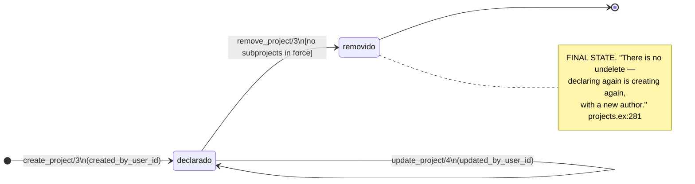
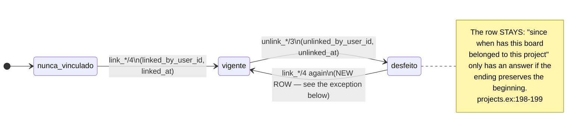

<!-- DERIVED from lib/the_band/ontology/seon/spo/projects.ex:38-51 (create_project/3),
     :127-145 (unlink_repository/3), :147-193 (link_board/4), :195-216 (unlink_board/3),
     :251-274 (update_project/4), :276-311 (remove_project/3), :313-345 (link_organization/4),
     :347-363 (unlink_organization/3), :379-411 (link_team/4), :413-429 (unlink_team/3);
     lib/the_band/ontology/seon/spo/schemas/project.ex, project_board.ex,
     project_organization.ex, project_team.ex, project_repository.ex;
     priv/repo/migrations/20260815160000_create_spo_projects.exs:45-46, :63, :70-74,
     20260816210000_project_lifecycle_and_links.exs:1-13, :20-22, :43, :49-51, :67, :72-74,
     20260824120000_create_spo_project_boards.exs:66, :73-77,
     20260826030000_nome_de_projeto_removido_libera.exs;
     tests — test/the_band/ontology/seon/spo/gestao_do_projeto_test.exs,
     projetos_test.exs, periodo_de_participacao_test.exs
     — on 2026-09-18. Checked against the code on this date. Regenerate when the source changes. -->

# States — the declared project and its links

**`spo_projects` is the table nobody collects.** Every row of it was written by a person on the screen,
and so every transition has an author. It is the exact counterpoint of [`observacao.md`](observacao.md),
where nobody decided anything.

> **Careful with the name.** GitHub calls the **board** a *project*, which in this codebase is
> `observed_projects`. `spo_projects` is the project **declared** by the organization. The collision is
> recorded in the code: *"GitHub calls the board 'project', and that is where the name collision comes
> from"* (`projects.ex:155-156`).

## Two machines: the project, and its links

### 1. The project (`spo_projects.removed_at`)

**This is the only final state in this folder that does not come back.** In all the other machines the
mark is cleared or redeclared; not here:

> *"There is no undelete — declaring again is creating again, with a new author."*
> — `lib/the_band/ontology/seon/spo/projects.ex:281`

And even so it **marks, and does not delete** — the row stays with `removed_at` and `removed_by_user_id`
(`20260816210000:6-7`).

#### The guard that prevents the cascade

`remove_project/3` returns `{:error, :has_parts}` when there are subprojects in force:

> *"the parts are moved or removed first, because removing in cascade would delete declarations nobody
> asked to delete."* — `projects.ex:279-281`

It is an explicit refusal, not a silent `delete_all`. It is worth knowing because it is the opposite
decision to the one the FK would make on its own.

#### The name, and the release that removal triggers

`spo_projects` has a unique index on `(tenant_id, name)`
(`20260815160000_create_spo_projects.exs:45`). The migration
`20260826030000_nome_de_projeto_removido_libera.exs` exists precisely so that removing a project
**releases the name** — without it, a removed name would be taken forever, and whoever tried to redeclare
would get an error without explanation.

### 2. The four links (`linked_at` / `unlinked_at`)

`spo_project_organizations`, `spo_project_teams`, `spo_project_repositories` and
`spo_project_boards` have **exactly the same design**, and the migration says it was on purpose:

> *"the two new links have the design of the repository link — `linked_by/at`, `unlinked_by/at`,
> relinking creates a new row — because the history of the links is the data."*
> — `20260816210000_project_lifecycle_and_links.exs:7-9`

| State | The rule, exactly |
|---|---|
| **in force** | `unlinked_at` **is null** |
| **undone** | `unlinked_at` filled, with `unlinked_by_user_id` |
| **never linked** | no row for the pair |

#### The exception worth knowing: the board revives the link

Three of the four create a **new row** when relinking. `link_board/4` does **not**:

> *"Reassociating a board that left **revives the ended link** instead of creating another: the unique
> index is partial over the ones in force, and two rows in force for the same pair cannot exist."*
> — `projects.ex:171-173`

Reading the code: `link_board/4` looks for a link **in force** and, finding it, returns the existing one
(`projects.ex:188-190`) — it is idempotent. An **undone** link is not revived by this branch; the insert
creates a new row, and the partial index allows it, because the old one is not in force.

> ✅ **RESOLVED on 2026-09-18 — the comment was fixed, the code was not.** The first reading won: the body
> delivers idempotency over the one in force, which is the right behaviour. Reviving the ended row would
> erase the record that the board left and came back, and absence marks, never deletes. What was wrong was
> the sentence.

**The divergence between the comment and the code is recorded here**, and not resolved: the comment says
"revives the ended one", the body looks for `is_nil(unlinked_at)`. The two readings:

- **the comment is ahead** — it describes the intent, and the body delivers idempotency over the one in
  force, which is what matters in practice;
- **the comment is right and code is missing** — reassociating should clear `unlinked_at` on the old row
  instead of creating another.

Take it to whoever maintains `SPO.Projects`. The observable effect is the **number of rows** in the link
history, and no validity query changes.

#### The four partial indexes

Each one carries the invariant *"one link in force per pair"*, and **all** are partial over
`unlinked_at IS NULL` — without it, undoing and redoing would be impossible:

| Table | Key | Index |
|---|---|---|
| `spo_project_organizations` | `tenant, project, organization` | `spo_project_organizations_vigente_index` (`20260816210000:49-51`) |
| `spo_project_teams` | `tenant, project, team` | `spo_project_teams_vigente_index` (`20260816210000:72-74`) |
| `spo_project_repositories` | `tenant, project, observed repository` | `spo_project_repositories_vigente_index` (`20260815160000:70-74`) |
| `spo_project_boards` | `tenant, project, observed board` | `spo_project_boards_vigente_index` (`20260824120000:73-77`) |

## Why the link history is the data

It is not audit overcaution: it is what allows answering *"what did this team deliver while it was on
this project"*. `team_project_links_with_period/2` (`projects.ex:514`) exists exactly for that, and
`test/the_band/ontology/seon/spo/periodo_de_participacao_test.exs` is the test of the period.

Deleting the undone link would make the question **uncomputable**, and the measure would start
attributing to the team the work of a period in which it was no longer there — or none.

## A project has more than one board

The maintainer's decision, 2026-08-24, with the measurement attached:

> *"There is no 'the project's board': there are its boards. Conecta Fapes has four, and reading it by a
> single one made ten months of delivery disappear."* — `projects.ex:152-153`

It is the kind of fact a cardinality diagram shows as `1 --> 0..*` and does not explain. Here it is
explained.

## Where each transition happens

| Transition | Function |
|---|---|
| → declared | `projects.ex:43` |
| declared → declared | `projects.ex:259` |
| declared → removed | `projects.ex:285` |
| link with organization: link / unlink | `projects.ex:321` / `:350` |
| link with team: link / unlink | `projects.ex:387` / `:416` |
| link with repository: link / unlink | `projects.ex:92` / `:132` |
| link with board: link / unlink | `projects.ex:162` / `:203` |

**Coverage statement:** the tests exist in
`test/the_band/ontology/seon/spo/{gestao_do_projeto,projetos,periodo_de_participacao}_test.exs`;
the **transition-by-transition** mapping was not done in this document, and it is declared as a gap for
QA. The `:has_parts` guard is the most important to check, because it is the only one that refuses.

## What this model does not show

- **`parent_id`** and the subproject hierarchy (`set_parent/3`, `clear_parent/2`). It is a relation, not
  a state; it is in [`classes/projetos-e-processo.md`](../classes/projetos-e-processo.md).
- **The project's fields** (name, description). Same documents.
- **The observed board** (`observed_projects`), which has its own cycle: `closed` (boolean, a copy of the
  source) and `no_longer_observed_at` — the latter in [`observacao.md`](observacao.md).
