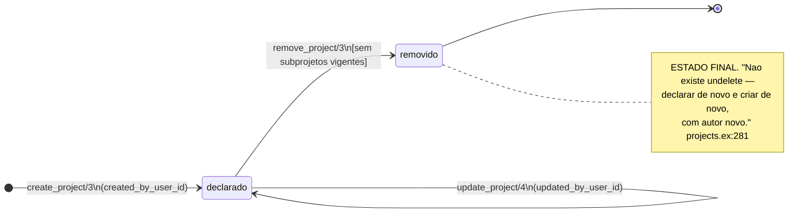
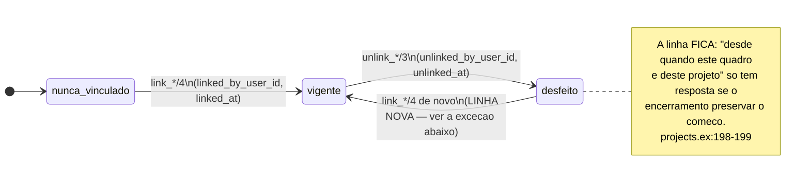

<!-- DERIVADO de lib/the_band/ontology/seon/spo/projects.ex:38-51 (create_project/3),
     :127-145 (unlink_repository/3), :147-193 (link_board/4), :195-216 (unlink_board/3),
     :251-274 (update_project/4), :276-311 (remove_project/3), :313-345 (link_organization/4),
     :347-363 (unlink_organization/3), :379-411 (link_team/4), :413-429 (unlink_team/3);
     lib/the_band/ontology/seon/spo/schemas/project.ex, project_board.ex,
     project_organization.ex, project_team.ex, project_repository.ex;
     priv/repo/migrations/20260815160000_create_spo_projects.exs:45-46, :63, :70-74,
     20260816210000_project_lifecycle_and_links.exs:1-13, :20-22, :43, :49-51, :67, :72-74,
     20260824120000_create_spo_project_boards.exs:66, :73-77,
     20260826030000_nome_de_projeto_removido_libera.exs;
     testes — test/the_band/ontology/seon/spo/gestao_do_projeto_test.exs,
     projetos_test.exs, periodo_de_participacao_test.exs
     — em 2026-09-18. Conferido contra o código nesta data. Regenerar ao mudar a fonte. -->

# Estados — o projeto declarado e seus vínculos

**`spo_projects` é a tabela que ninguém coleta.** Toda linha dela foi escrita por uma pessoa na
tela, e por isso toda transição tem autor. É o contraponto exato de
[`observacao.md`](observacao.md), onde ninguém decidiu nada.

> **Cuidado com o nome.** O GitHub chama de *project* o **quadro**, que nesta base é
> `observed_projects`. `spo_projects` é o projeto **declarado** pela organização. A colisão
> está registrada no código: *"O GitHub chama o quadro de 'project', e é daí que vem a colisão
> de nomes"* (`projects.ex:155-156`).

## Duas máquinas: o projeto, e os vínculos dele

### 1. O projeto (`spo_projects.removed_at`)

**Este é o único estado final desta pasta que não volta.** Em todas as outras máquinas a marca
se limpa ou se redeclara; aqui não:

> *"Não existe undelete — declarar de novo é criar de novo, com autor novo."*
> — `lib/the_band/ontology/seon/spo/projects.ex:281`

E ainda assim **marca, e não apaga** — a linha fica com `removed_at` e `removed_by_user_id`
(`20260816210000:6-7`).

#### A guarda que impede a cascata

`remove_project/3` devolve `{:error, :has_parts}` quando existem subprojetos vigentes:

> *"as partes são movidas ou removidas primeiro, porque remover em cascata apagaria
> declarações que ninguém pediu para apagar."* — `projects.ex:279-281`

É uma recusa explícita, e não um `delete_all` silencioso. Vale conhecer porque é a decisão
oposta à que a FK faria sozinha.

#### O nome, e a liberação que a remoção provoca

`spo_projects` tem índice único em `(tenant_id, name)`
(`20260815160000_create_spo_projects.exs:45`). A migração
`20260826030000_nome_de_projeto_removido_libera.exs` existe justamente para que remover um
projeto **libere o nome** — sem ela, um nome removido ficaria ocupado para sempre, e quem
tentasse redeclarar receberia um erro sem explicação.

### 2. Os quatro vínculos (`linked_at` / `unlinked_at`)

`spo_project_organizations`, `spo_project_teams`, `spo_project_repositories` e
`spo_project_boards` têm **exatamente o mesmo desenho**, e a migração diz que foi de propósito:

> *"os dois vínculos novos têm o desenho do vínculo com repositório — `linked_by/at`,
> `unlinked_by/at`, religar cria linha nova — porque a história dos vínculos é o dado."*
> — `20260816210000_project_lifecycle_and_links.exs:7-9`

| Estado | A regra, exatamente |
|---|---|
| **vigente** | `unlinked_at` **é nulo** |
| **desfeito** | `unlinked_at` preenchido, com `unlinked_by_user_id` |
| **nunca vinculado** | nenhuma linha para o par |

#### A exceção que vale conhecer: o quadro revive o vínculo

Três dos quatro criam **linha nova** ao religar. `link_board/4` **não**:

> *"Reassociar um quadro que saiu **revive o vínculo encerrado** em vez de criar outro: o
> índice único é parcial sobre os vigentes, e duas linhas vigentes para o mesmo par não podem
> existir."* — `projects.ex:171-173`

Lendo o código: `link_board/4` procura um vínculo **vigente** e, achando, devolve o existente
(`projects.ex:188-190`) — é idempotente. Um vínculo **desfeito** não é revivido por este ramo;
o insert cria linha nova, e o índice parcial permite, porque a antiga não é vigente.

**A divergência entre o comentário e o código está registrada aqui**, e não resolvida: o
comentário diz "revive o encerrado", o corpo procura `is_nil(unlinked_at)`. As duas leituras:

- **o comentário está adiantado** — descreve a intenção, e o corpo entrega idempotência sobre o
  vigente, que é o que importa na prática;
- **o comentário está certo e falta código** — reassociar deveria limpar `unlinked_at` da linha
  antiga em vez de criar outra.

Levar a quem mantém `SPO.Projects`. O efeito observável é a **quantidade de linhas** no
histórico de vínculos, e nenhuma consulta de vigência muda.

#### Os quatro índices parciais

Cada um carrega a invariante *"um vínculo vigente por par"*, e **todos** são parciais sobre
`unlinked_at IS NULL` — sem isso, desfazer e refazer seria impossível:

| Tabela | Chave | Índice |
|---|---|---|
| `spo_project_organizations` | `tenant, projeto, organização` | `spo_project_organizations_vigente_index` (`20260816210000:49-51`) |
| `spo_project_teams` | `tenant, projeto, equipe` | `spo_project_teams_vigente_index` (`20260816210000:72-74`) |
| `spo_project_repositories` | `tenant, projeto, repositório observado` | `spo_project_repositories_vigente_index` (`20260815160000:70-74`) |
| `spo_project_boards` | `tenant, projeto, quadro observado` | `spo_project_boards_vigente_index` (`20260824120000:73-77`) |

## Por que a história do vínculo é o dado

Não é zelo de auditoria: é o que permite responder *"o que esta equipe entregou enquanto
esteve neste projeto"*. `team_project_links_with_period/2` (`projects.ex:514`) existe
exatamente para isso, e `test/the_band/ontology/seon/spo/periodo_de_participacao_test.exs` é o
teste do período.

Apagar o vínculo desfeito tornaria a pergunta **incomputável**, e a medida passaria a atribuir
à equipe o trabalho de um período em que ela já não estava — ou nenhum.

## Um projeto tem mais de um quadro

Decisão da pessoa mantenedora, 2026-08-24, com a medida junto:

> *"Não há 'o quadro do projeto': há os quadros dele. O Conecta Fapes tem quatro, e lê-lo por
> um só fazia dez meses de entrega sumirem."* — `projects.ex:152-153`

É o tipo de fato que um diagrama de cardinalidade mostra como `1 --> 0..*` e não explica. Aqui
fica explicado.

## Onde cada transição acontece

| Transição | Função |
|---|---|
| → declarado | `projects.ex:43` |
| declarado → declarado | `projects.ex:259` |
| declarado → removido | `projects.ex:285` |
| vínculo com organização: ligar / desligar | `projects.ex:321` / `:350` |
| vínculo com equipe: ligar / desligar | `projects.ex:387` / `:416` |
| vínculo com repositório: ligar / desligar | `projects.ex:92` / `:132` |
| vínculo com quadro: ligar / desligar | `projects.ex:162` / `:203` |

**Declaração de cobertura:** os testes existem em
`test/the_band/ontology/seon/spo/{gestao_do_projeto,projetos,periodo_de_participacao}_test.exs`;
o mapeamento **transição a transição** não foi feito neste documento, e fica declarado como
lacuna para QA. A guarda `:has_parts` é a mais importante a conferir, porque é a única que
recusa.

## O que este modelo não mostra

- **`parent_id`** e a hierarquia de subprojetos (`set_parent/3`, `clear_parent/2`). É relação,
  não estado; está em [`classes/projetos-e-processo.md`](../classes/projetos-e-processo.md).
- **Os campos do projeto** (nome, descrição). Mesmos documentos.
- **O quadro observado** (`observed_projects`), que tem ciclo próprio: `closed` (booleano,
  cópia da origem) e `no_longer_observed_at` — este último em
  [`observacao.md`](observacao.md).
