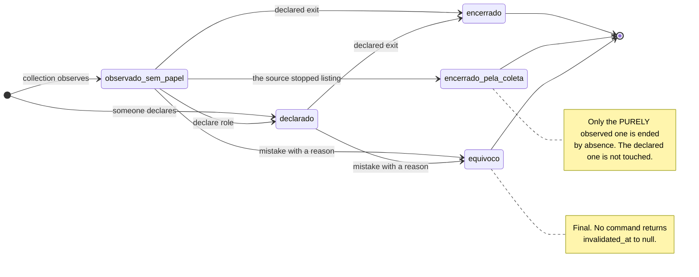
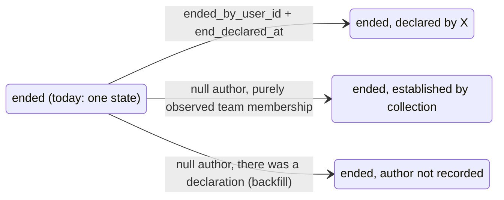

# States — the person-to-team membership (`eo.team_membership`)

<!-- DERIVED from lib/the_band/ontology/seon/eo/schemas/team_membership.ex:52-135;
     lib/the_band/ontology/seon/eo/commands.ex:69-193, 588-769, 793-826, 1281-1345,
     1386-1441, 1453-1467;
     lib/the_band/ontology/seon/eo/queries.ex:183-242, 391-453;
     priv/repo/migrations/20260814140000_papel_declarado_tem_autor.exs:33-42,
     20260901230000_composicao_de_equipes_e_o_equivoco.exs:76-112,
     20260906230000_vinculo_observado.exs:37-46;
     docs/adr/0008-vinculo-observado.md:58-99;
     priv/knowledge_base/rules/github_team_membership_evidence.yaml:3, 77-113;
     tests: test/the_band/ontology/seon/eo/{vinculo_observado,team_membership,alocacao,
     coleta_nao_apaga_declaracao}_test.exs;
     measurement of the development database of 2026-09-07 (migration 20260906230000 applied)
     on 2026-09-07. Checked against the code on this date. Regenerate when the source changes. -->

## The state is not a column

There is no `status` in `eo_team_memberships`. The situation of a team membership comes from the
combination of **four** fields, and each combination is a different statement about the organization.

| State | The rule, exactly | Source |
|---|---|---|
| **observed without a role** | `organizational_role_id` null **and** `declared_by_user_id` null **and** `ended_at` null **and** `invalidated_at` null | `commands.ex:716-731`; migration `20260906230000:15-20` |
| **declared** | `organizational_role_id` **and** `declared_by_user_id` filled, `ended_at` null, `invalidated_at` null | `commands.ex:1314-1331`; `team_membership.ex:115-122` |
| **role without an author** *(reachable, with no name on the screen)* | `organizational_role_id` filled, `declared_by_user_id` null, in force | `team_membership.ex:115-122` refuses the inverse, not this; see *Findings* |
| **ended** | `ended_at` filled, `invalidated_at` null | `queries.ex:445-453` |
| **mistake** | `invalidated_at` filled — with author and reason, by the `CHECK` | migration `20260901230000:104-112` |

**In force** is `ended_at` null **and** `invalidated_at` null — both conditions, in every query
(`commands.ex:176-187`). On a date, the definition gains its edges: `vigente_em/2` is
`invalidated_at IS NULL AND (started_at IS NULL OR started_at <= t) AND (ended_at IS NULL OR ended_at > t)`
(`queries.ex:445-453`) — a period **closed at the start and open at the end**, and a null `started_at`
counts as "always was", because writing only `started_at <= t` would make the person stop being a member
**on any date at all**, with no error and no warning (`queries.ex:441-444`).

**Ended and mistake do not add up.** No command invalidates an already-ended team membership —
`record_team_membership_mistake/5` operates on the one in force (`commands.ex:157-159`). If the combination
appears in the database, `vigente_em/2` reads it as a **mistake**: the invalidated one never held, on any
date, and the end date stops mattering.

**The scale of the *observed without a role* state.** Measured in the development database on
**2026-09-07**, with migration `20260906230000` applied: the 59 evidence records became observed team
memberships; the antipattern `ap02` ("team without any team membership in force") dropped from **8 teams
to 1**, and the requests from authors without a team membership dropped from **838 to 99 out of 1 058**.
It is the most populated state of this machine, and it is what declaring a role empties.

## The machine

Two things that **are not arrows**, and why:

- **The return** — whoever left and came back — is born as a **new row** in the *observed without a role*
  state; the old one stays ended with its period preserved (`commands.ex:641-644`; ADR 0008 item 5;
  `vinculo_observado_test.exs:160`).
- **Changing the role** does not exist as a transition today: **there is no command**. Changing is ending
  one team membership and declaring another, and the history *is* the ended row
  (`specs/060-tela-da-equipe/spec.md`, *Modules* table: "alteração de papel — não há comando" (role
  change — there is no command)).

## The transitions, with trigger, guard and the test that proves it

| # | From → To | Trigger | Guard | Test |
|---|---|---|---|---|
| T1 | *(nothing)* → observed without a role | collection: `record_team_membership_evidence/2` → `observar_vinculo/2` (`commands.ex:588,645`) | `[no team membership in force for the pair]` (`vinculo_vigente/3`, `:706`) **and** `[no declaration for the pair]` (`existe_declaracao?/3`, `:683-691`) | `vinculo_observado_test.exs:62` · `:84` (re-observing does not duplicate) · `:92` |
| T2 | *(nothing)* → declared | `declare_team_membership/5` (`commands.ex:69`) | `[no team membership in force for the pair]` (`:72`), otherwise refuses saying since when (`:87-89`) | `team_membership_test.exs:169` |
| T3 | *(nothing)* → declared | `allocate/2` → `inserir_declaracao/2` (`commands.ex:1281,1314`) | partial index `eo_team_memberships_vigente_index` → `{:error, :already_allocated}`; `[end ≥ start]` → `:period_inverted` | `alocacao_test.exs:47` · `:56` (two roles accepted) · `:69` (same role refused) · `:76` (distinct periods) · `:89` (null start stays null) · `:98` (inverted period) |
| T4 | observed without a role → declared | `allocate/2` → `declarar_sobre_o_observado/3` (`commands.ex:1287-1312`); `promote_evidence/5` (`:1386`) | `[the role belongs to the team's organization]` (`resolver_papel/3`, `:1434-1441`) · `[evidence not ended]` (`promovivel/2`, `:1411`) · `[role not yet declared]` → `:already_promoted` (`:1422`) | `vinculo_observado_test.exs:213` (**same `id`**) · `:237` (declaring again is refused) · `:257` (a declaration without a role is refused) |
| T5 | observed without a role → ended by collection | `mark_evidence_no_longer_observed/3` (`commands.ex:793`) → `encerrar_vinculos_observados/3` (`:751`) | `[null role AND null author]` (`:762`) — the declared one is **not** touched; scope per organization (`:799-802`) | `vinculo_observado_test.exs:114` (ends, does not delete; the past does not change) · `:138` (the declared one survives) · `coleta_nao_apaga_declaracao_test.exs:74` · `:107` |
| T6 | in force → ended (declared) | `record_team_departure/5` (`commands.ex:110`) | `[date is not in the future]` (`nao_esta_no_futuro/1`, `:125-131`) · `[there is a team membership in force]` (`vigente/3`, `:179`) | `team_membership_test.exs:40` (SC-003: the past does not change) · `:64` · `:81` (the row remains, with the period closed) |
| T7 | in force → ended (per team membership) | `end_allocation/3` (`commands.ex:1453`) | `[not yet ended]` → `{:error, :already_ended}`, **without rewriting** the original date (`:1455-1456`) · `[belongs to this tenant]` | `alocacao_test.exs:127` · `:144` (does not rewrite) · `:159` (another tenant) · `coleta_nao_apaga_declaracao_test.exs:136` (ending does not delete the evidence) |
| T8 | in force → mistake | `record_team_membership_mistake/5` (`commands.ex:155`) | `[written reason]` — function guard (`:156`) and `CHECK eo_equivoco_do_vinculo_completo` · `[there is a team membership in force]` (`:157-159`) | `team_membership_test.exs:102` (does not count in any period) · `:122` (author and reason remain) · `vinculo_observado_test.exs:177` (on an **observed** team membership, and collection does not recreate it) |
| T9 | ended → *(new row)* observed without a role | re-observation of the evidence: `observar_vinculo/2` (`commands.ex:645`) | `[none in force]` **and** `[no declaration for the pair]` — if the ended one had a role, an author or an invalidation, `existe_declaracao?/3` blocks | `vinculo_observado_test.exs:160` (left and came back) · `team_membership_test.exs:193` (linking again creates a new period) |
| T10 | mistake → *(new row)* declared | `declare_team_membership/5` after the mistake | the validity index **knows about the invalidation** (`20260901230000:82-100`), so the slot is free — without it, correcting a mistake would be refused by the database | `team_membership_test.exs:141` |

## What the house refuses — notes, not arrows

- **A mistake does not go back to in force.** No command writes `invalidated_at: nil` (sweep of `lib/` on
  2026-09-07). It is the row's final state; the way back is **another row** (T10).
- **Ending again does not rewrite the date.** `{:error, :already_ended}` — the second attempt is a mistake
  by whoever operates, and overwriting would lose when it actually ended (`commands.ex:1448-1449`).
- **Collection does not create a team membership over a declaration.** Where the organization has already
  said something — role, author or mistake —, the evidence stays without a team membership and the screen
  shows **both statements** (`commands.ex:648-654`; 055 FR-012; ADR 0008 item 4,
  `docs/adr/0008-vinculo-observado.md:72-75`).
- **Absence at the source ends only the observed one.** The team membership with any declaration survives
  (`commands.ex:745-748,762`).
- **"Keep listing" and "list again" are different facts.** While the evidence has no
  `no_longer_observed_at`, observation is **continuous**; a new observation after the established absence
  is a **return** (`commands.ex:617-628`; rule `github_team_membership_evidence.yaml:105-111`).
- **Nothing is removed.** No transition of this machine deletes a row — SC-012 of 060, SC-005 of 055.

## Declared gaps — transitions without a test

Work material for QA. Each row is behaviour the code has and no test proves.

| Behaviour | Where | Why it matters |
|---|---|---|
| **an exit with a future date is refused** | `commands.ex:125-131` | it is the T6 guard and scenario 3 of US3 of 060; `grep -rn "futuro" test/` finds no team membership test |
| **an exit on an already-ended team membership is refused** | `commands.ex:120` returns *"esta pessoa não tem vínculo vigente nesta equipe"* (this person has no team membership in force on this team) | US3 scenario 5 requires a refusal **without rewriting the original date**; `end_allocation/3` has the test (`alocacao_test.exs:144`), `record_team_departure/5` does not |
| **a mistake without a reason is refused** | `commands.ex:173-174` (fallback clause) | US4 scenario 3; no test calls the function with an empty reason |
| **a mistake on someone without a team membership in force** | `commands.ex:158-159` | named refusal, without a test |
| **`vigente/3` with two simultaneous roles** | `commands.ex:179-187` uses `Repo.one` | two roles in force are **allowed** (`alocacao_test.exs:56`), and in that state T6 and T8 would raise `Ecto.MultipleResultsError`. It is a risk declared in `plan.md` D4 of 060, and no test exposes it |

## What PR 1 of feature 060 adds

> **Proposed — not yet in the code.** Source: `specs/060-tela-da-equipe/data-model.md` §1 and §3.2,
> `plan.md` (Summary and D4), `tasks.md` T003, T008, T014, T016, T018. Nothing below was checked against
> code, because it does not exist yet.

### The states that open up

A filled `ended_at` is **one** state today. With `ended_by_user_id` and `end_declared_at`
(`data-model.md` §1), it becomes three, and the screen needs to say which one (FR-022):

| Proposed state | The rule | What the screen says |
|---|---|---|
| **ended, declared by someone** | `ended_at` + `ended_by_user_id` + `end_declared_at` | *left on D — recorded by X on D'* |
| **ended, established by collection** | `ended_at` filled, null author, and the team membership is purely observed | *the platform stopped seeing it on D* — and declares that the date is limited by the collection cadence (055 FR-015a) |
| **ended, author not recorded** | `ended_at` filled, null author, but there was a declaration | *author not recorded* — exits older than the migration have no author, and it is true that they do not (`data-model.md` §1, Backfill) |

Two new `CHECK`s support the split: `eo_saida_declarada_completa` makes author and instant go together,
and only over an exit that exists; `eo_declaracao_tem_autor` does the same with `declared_by_user_id` and
`declared_at` (`data-model.md` §1). **`ended_at` remains the date of the exit, and `end_declared_at` the
instant of the record** — collapsing them would turn "left in March, declared in September" into "left in
September", which is what SC-001 forbids.

### The transitions that change

| # | Transition | What changes | Source |
|---|---|---|---|
| P1 | T6 (in force → ended) | `record_team_departure/5` starts **using** the `actor_id` it ignores today (`commands.ex:110`, `_actor_id`), writes `ended_by_user_id` and `end_declared_at`, and operates on **all** team memberships in force for the pair through `update_all` — not through `Repo.one` | `plan.md` D4; `tasks.md` T014 |
| P2 | T8 (in force → mistake) | same treatment: `update_all` over all the ones in force for the pair; zero in force becomes a named error | `plan.md` D4; `tasks.md` T016 |
| P3 | **ended → *(nothing)*** | the recreation guard starts recognizing the **declared exit**: `existe_declaracao?/3` gains `ended_by_user_id`. Today an observed team membership with a declared exit has null role and author and a null invalidation → `existe_declaracao?` returns `false` → **collection recreates it** | `plan.md` (Summary); `data-model.md` §3.2 (rule v3); `tasks.md` T003, T014 |
| P4 | T9 (return) | becomes explicit: `observar_vinculo` receives `retorno?`, and a new team membership is only born after the absence has been **established** (`no_longer_observed_at`) | `tasks.md` T014; spec 060 FR-026, FR-027 |
| P5 | **declared → declared (another role)** | gets a command: `change_role/5` = `end_allocation/4` + `declare_role/6` in one transaction, returning `{:ok, %{encerrado, novo}}` | spec 060 Impact; `plan.md` (premise *Alterar papel*); `tasks.md` T018 |
| P6 | every write transition | starts requiring `pode_gerir_estrutura/3` **on the event**, not only at render time: hiding the button is not authorization | spec 060 FR-006; `tasks.md` T012 |

## Findings

1. **The recreation guard does not see the declared exit.** `existe_declaracao?/3`
   (`commands.ex:683-691`) recognizes a declaration by `declared_by_user_id`, `organizational_role_id`
   **or** `invalidated_at`. An **observed** team membership whose exit was declared has all three null —
   and the next collection recreates the team membership, silently undoing what someone declared. The
   code comment (`:678-682`) describes the mistake correctly; the exit is not there. It is the defect
   FR-026 of 060 closes. **Whom to take it to**: it is already in PR 1 (T003, T014).

2. **ADR 0008 and rule v2 say less than the decision of 2026-09-07 requires.** ADR 0008 item 4
   (`docs/adr/0008-vinculo-observado.md:72-75`) speaks of a "**declared** team membership — in force,
   ended or invalidated"; the **observed** team membership with a declared exit does not fit in that
   sentence. The rule `github_team_membership_evidence.yaml` is at `version: 2` (`:3`) and the promotion
   note (`:89-93`) does not mention blocking by exit. **Whom to take it to**: the ADR gets a note in T025;
   the rule becomes v3 in T003.

3. **`Repo.one` in `vigente/3` is incompatible with FR-018.** Two simultaneous roles are accepted by
   design (`commands.ex:1263-1266`; `alocacao_test.exs:56`) and refused by accident on exit and on
   mistake, which would raise an exception. No test covers the case. **Whom to take it to**: QA (a test
   that exposes it) and PR 1 (D4 fixes it).

4. **`[NEEDS CLARIFICATION]` — the *role without an author* state.** `EO.allocate/2` writes
   `organizational_role_id` without `declared_by_user_id` when the caller does not pass the author; the
   changeset refuses the inverse, not this (`team_membership.ex:115-122`). It happens today in
   `test/the_band_web/live/equipe_composta_test.exs:70-78`. The roster's origin reading is
   `declared_by_user_id` null or filled (`data-model.md` §4.1), so this team membership would appear as
   **observed with a declared role**. Question: is it a legitimate state, and the screen gains a fourth
   label, or is it an incomplete call to be closed in the changeset? **To whom**: Software Architect and
   Product Owner.

5. **`[NEEDS CLARIFICATION]` — ended *and* invalidated.** The database accepts the combination; no command
   produces it; `vigente_em/2` reads it as a mistake. Should the screen present *mistake* (the query's
   reading) or *left, and was later marked as an error* (the columns' reading)? FR-011 of 060 gives text
   for each separately and not for the two together. **To whom**: Product Owner, with Design.
